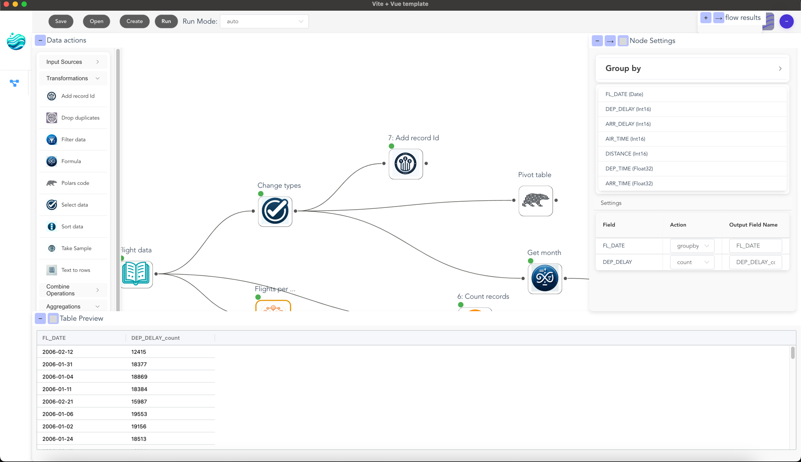

<h1 align="center">
  
  <br>
  Flowfile
</h1>

<p align="center">
  <b>Documentation</b>:
  <a href="https://edwardvaneechoud.github.io/Flowfile/">Website</a> -
  <a href="flowfile_core/README.md">Core</a> -
  <a href="flowfile_worker/README.md">Worker</a> -
  <a href="flowfile_frontend/README.md">Frontend</a> -
  <a href="https://demo.flowfile.org"> Try Online </a> -
  <a href="https://dev.to/edwardvaneechoud/building-flowfile-architecting-a-visual-etl-tool-with-polars-576c">Technical Architecture</a>
</p>

<p>
Flowfile is an open-source data platform that combines a visual pipeline builder, a data catalog with Delta Lake storage, scheduling, Kafka ingestion, sandboxed Python execution, and a Polars-compatible Python API — all installable with <code>pip install Flowfile</code>.
</p>

<div align="center">
  
</div>

---

## What Flowfile Does

Most ETL tools make you choose: visual and simple, or powerful and complex. Flowfile doesn't.

- **Visual pipeline builder** — Drag-and-drop canvas with 30+ nodes for joins, filters, aggregations, fuzzy matching, pivots, and more
- **Data catalog with Delta Lake** — Every table is stored as Delta Lake with full version history, time travel, and merge/upsert support
- **Scheduling** — Interval-based or triggered by catalog table updates, built into the catalog UI
- **Kafka ingestion** — Read from Kafka/Redpanda topics as a canvas node, with automatic schema inference
- **Sandboxed Python execution** — Run arbitrary Python code in isolated Docker containers via the Python Script node
- **Flow parameters** — `${variable}` substitution across any node setting, configurable via UI or CLI
- **Code generation** — Export visual flows as standalone Python/Polars scripts
- **Cloud storage** — Read/write to S3, Azure Data Lake Storage, and Google Cloud Storage
- **Database connectivity** — PostgreSQL, MySQL, SQL Server, Oracle, DuckDB, and more
- **Python API** — Build pipelines programmatically with a Polars-like syntax, then visualize them on the canvas

Every feature serves the canvas. Kafka isn't a separate streaming module — it's a node. Scheduling isn't a separate orchestration UI — it's part of the catalog. Delta Lake isn't a YAML-configured storage backend — it's how the catalog works.

---

## Quick Start

```bash
pip install Flowfile
flowfile run ui
```

That's it. This starts the backend services and opens the web UI in your browser.

### Python API

```python
import flowfile as ff
from flowfile import col

df = ff.from_dict({
    "id": [1, 2, 3, 4, 5],
    "category": ["A", "B", "A", "C", "B"],
    "value": [100, 200, 150, 300, 250]
})

result = df.filter(col("value") > 150).with_columns([
    (col("value") * 2).alias("double_value")
])

# Open the pipeline on the visual canvas
ff.open_graph_in_editor(result.flow_graph)
```

---

## Platform Capabilities

### Data Catalog & Delta Lake

The catalog is Flowfile's central hub. Register flows, track runs, browse tables, and manage schedules — all in one place.

- Tables are stored as **Delta Lake** with overwrite, append, upsert, update, and delete modes
- Full **version history** and time travel for every catalog table
- **Lineage tracking** — see which flows produce and consume each table
- **Namespace hierarchy** — organize tables into catalogs and schemas

### Scheduling

Schedule registered flows to run on intervals or in response to data changes:

- **Interval** — run every N minutes/hours/days
- **Table trigger** — run when a specific catalog table is updated
- **Table set trigger** — run when all tables in a set have been updated

### Kafka / Redpanda

Drop a Kafka Source node on the canvas, pick a connection and topic, and you have streaming data in your pipeline. Schema is inferred automatically from message samples.

### Sandboxed Python Execution

The Python Script node runs your code in an isolated Docker container with its own package environment. Write matplotlib visualizations, use scikit-learn models, or run any Python code — the output flows back into the pipeline.

### Code Generation

Click "Generate Code" to export any visual flow as a standalone Python script using Polars. Deploy it anywhere, version control it, or hand it to a teammate who prefers code over canvas.

<div align="center">
  
</div>

### Flow Parameters

Parameterize any flow with `${variable}` syntax. Set defaults in the UI, override from the CLI:

```bash
flowfile run flow pipeline.json --param input_dir=/data/2025/q1 --param output_table=summary
```

### Cloud Storage & Databases

Read and write CSV, Parquet, JSON, and Delta Lake files from **S3**, **Azure Data Lake Storage**, and **Google Cloud Storage**. Connect to **PostgreSQL**, **MySQL**, **SQL Server**, **Oracle**, **DuckDB**, and more.

---

## Installation Options

### Python Package (Recommended)

```bash
pip install Flowfile
flowfile run ui
```

### Docker

```bash
git clone https://github.com/edwardvaneechoud/Flowfile.git
cd Flowfile
docker compose up -d
```

Access the app at http://localhost:8080.

### Desktop Application

Download from [GitHub Releases](https://github.com/edwardvaneechoud/Flowfile/releases) for Windows, macOS, or Linux.

> **Note:** You may see security warnings since the app isn't signed yet.
> - **Windows:** Click "More info" > "Run anyway"
> - **macOS:** Run `find /Applications/Flowfile.app -exec xattr -c {} \;` then open normally

### Browser (Lite)

Try the WASM version at [demo.flowfile.org](https://demo.flowfile.org) — runs entirely in your browser, no server needed. Includes 14 core transformation nodes.

### Development Setup

```bash
git clone https://github.com/edwardvaneechoud/Flowfile.git
cd Flowfile
poetry install

# Start backend services
poetry run flowfile_worker  # :63579
poetry run flowfile_core    # :63578

# Start frontend (new terminal)
cd flowfile_frontend
npm install && npm run dev:web  # :8080
```

---

## Architecture

```
Frontend (Electron/Web/WASM) --> flowfile_core (:63578) --> flowfile_worker (:63579)
                                       |                          |
                                   Catalog DB              Heavy computation
                                   Scheduler               Data processing
                                   Auth (JWT)
                                       |
                                 kernel_runtime (Docker, :9999)
                                   Sandboxed Python execution
```

- **flowfile_core** — Central FastAPI app: flow engine (DAG execution), catalog, scheduler, auth, connections, secrets
- **flowfile_worker** — Separate FastAPI service for CPU-intensive data operations
- **kernel_runtime** — Docker containers for isolated Python code execution
- **flowfile_frame** — Standalone Python library with lazy evaluation and Polars-compatible API

Flows are directed acyclic graphs (DAGs). Each node is a data operation. Edges carry data between nodes. The engine supports parallel execution, schema prediction, and two execution modes (Development for step-by-step debugging, Performance for optimized batch runs).

For a deeper dive, see [Technical Architecture](https://dev.to/edwardvaneechoud/building-flowfile-architecting-a-visual-etl-tool-with-polars-576c).

---

## License

[MIT License](LICENSE)

## Acknowledgments

Built with [Polars](https://pola.rs/), [Vue.js](https://vuejs.org/), [FastAPI](https://fastapi.tiangolo.com/), [VueFlow](https://vueflow.dev/), [Delta Lake](https://delta.io/), and [Electron](https://www.electronjs.org/).
