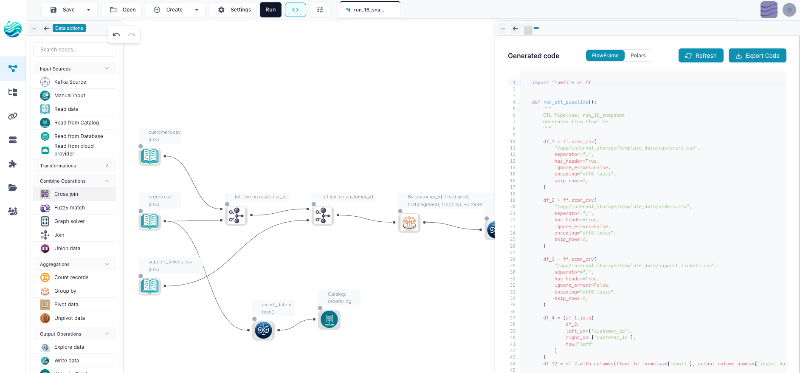
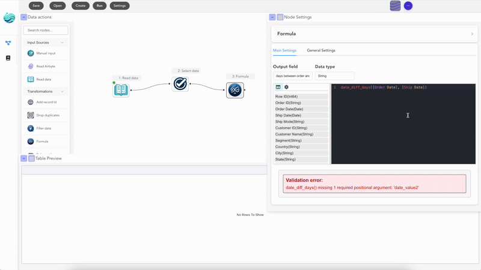
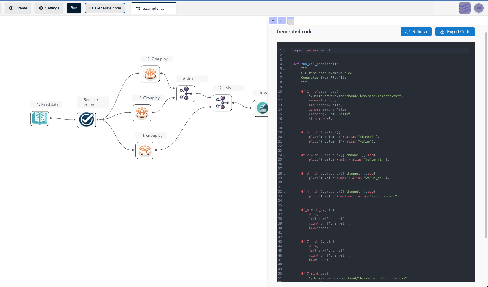
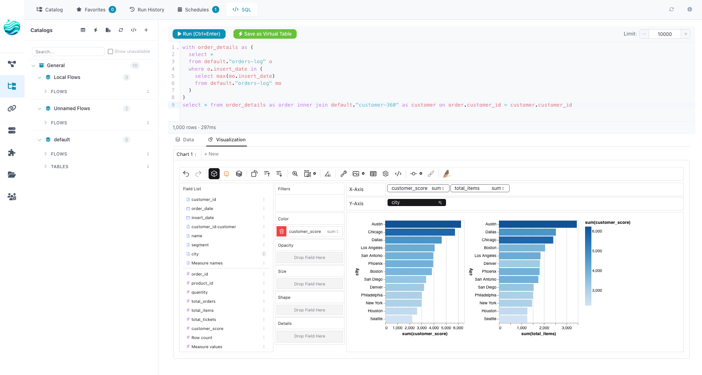

<h1 align="center">
  
  <br>
  Flowfile
</h1>

<p align="center">
  <b>Open-source visual ETL on Polars. Runs locally. Generates Python code.</b>
</p>

<p align="center">
  <a href="https://edwardvaneechoud.github.io/Flowfile/">Docs</a> ·
  <a href="https://demo.flowfile.org">Try it in your browser</a> ·
  <a href="https://github.com/Edwardvaneechoud/Flowfile/releases">Releases</a> ·
  <a href="https://dev.to/edwardvaneechoud/building-flowfile-architecting-a-visual-etl-tool-with-polars-576c">Architecture</a>
</p>

---

Flowfile is a visual ETL tool with data platform capabilities built in. Drag nodes on a canvas, or write Python with a Polars-like API — it's the same graph underneath. Pipelines run on Polars, can be exported as Python code, and everything runs on your machine.

Beyond the canvas, it includes a Delta-backed catalog, a SQL editor with embedded viz, virtual flow tables, flow parameters, and a built-in scheduler.

<div align="center">
  
</div>

---

## What's in Flowfile

**A visual canvas** with 30+ node types — joins, fuzzy matching, filters, pivots, aggregations, text-to-rows, and more. Read from local files, databases (PostgreSQL, MySQL, SQL Server, Oracle), cloud storage (S3, ADLS, GCS), or Kafka. Write the result wherever you want.

<div align="center">
  
</div>

**A Python API** with Polars-like syntax. Code and visual are two ways to build the same object graph — write a pipeline, call `open_graph_in_editor()`, and see it visually without re-building anything.

**Code generation.** Export any visual flow as Python code. For pipelines built from standard transformations (joins, filters, aggregations, formulas, etc.), you get pure Polars code with no Flowfile dependency. For flows using Flowfile-specific nodes — the catalog, Kafka sources, virtual table reads — the export uses Flowfile's Python API instead, since there's no direct Polars equivalent. Flows also save as human-readable YAML, so version control works.

<div align="center">
  
</div>

**A data catalog.** Unity-style hierarchy (catalog > schema > table), Delta Lake-backed with version history and time travel. Flows register into namespaces and write output through a Catalog Writer node.

**Virtual flow tables.** Flow outputs can live in the catalog without being materialized. If the producer graph is lazy-safe, Flowfile serializes the Polars LazyFrame and filter/projection pushdown crosses the flow boundary. Upstream Delta versions are tracked per read, so stale data doesn't ship.

**A SQL editor** on top of the catalog (Polars SQLContext). Query any registered table, visualize the result in an embedded Graphic Walker, save any ad-hoc query as a reusable flow in one click.

<div align="center">
  
</div>

**A scheduler.** Run flows on an interval, trigger when a catalog table updates, or fire when a set of tables has all refreshed. Run history, logs, and cancellation live in the UI. Runs embedded, standalone, or in Docker.

**Flow parameters.** Parameterize any node setting using `${variable}` syntax — file paths, SQL queries, formulas. Manage defaults from a Designer panel, override at runtime via CLI with `--param`.

**Python Kernels.** Run user code in isolated Docker containers with their own package environments, keeping the host process safe. Jupyter-style notebook editor with cell execution, autocompletions, and rich display output (matplotlib, plotly, PIL, HTML).

**Templates and clipboard import.** Get started with built-in flow templates, or paste tabular data from Excel / Google Sheets directly onto the canvas to create a pre-filled input node.

---

## Quick Start

**Try it in your browser** (no install, 14 essential nodes, runs entirely on Pyodide): [demo.flowfile.org](https://demo.flowfile.org)

**Python package** — the fastest way to run the full thing locally:

```bash
pip install Flowfile
flowfile run ui
```

**Use the Python API:**

```python
import flowfile as ff
from flowfile import col, open_graph_in_editor

df = ff.from_dict({
    "id": [1, 2, 3, 4, 5],
    "category": ["A", "B", "A", "C", "B"],
    "value": [100, 200, 150, 300, 250]
})

result = (
    df.filter(col("value") > 150)
      .with_columns((col("value") * 2).alias("double_value"))
      .group_by("category")
      .agg(col("value").sum().alias("total"))
)

open_graph_in_editor(result.flow_graph)
```

---

## Other Ways to Run It

**Desktop app** — Windows, macOS, or Linux. Download from [Releases](https://github.com/Edwardvaneechoud/Flowfile/releases).

<details>
<summary><b>Docker</b> — full stack via Docker Compose</summary>

```bash
git clone https://github.com/edwardvaneechoud/Flowfile.git
cd Flowfile
docker compose up -d
```

Access at http://localhost:8080.

</details>

<details>
<summary><b>From source</b> — for contributors (Python 3.10+, Node.js 20+)</summary>

```bash
git clone https://github.com/edwardvaneechoud/Flowfile.git
cd Flowfile
poetry install

# Backend (two separate terminals)
poetry run flowfile_worker  # :63579
poetry run flowfile_core    # :63578

# Frontend
cd flowfile_frontend
npm install && npm run dev:web  # :8080
```

</details>

> **Note:** Desktop installers aren't code-signed yet. On Windows click "More info" → "Run anyway". On macOS, if the app shows as damaged: `find /Applications/Flowfile.app -exec xattr -c {} \;`

---

## Architecture

Three interconnected services:

- **Designer** (Electron + Vue) — visual interface
- **Core** (FastAPI) — ETL engine running Polars (`:63578`)
- **Worker** (FastAPI) — computation and caching (`:63579`)

Plus an embedded **scheduler** and a sandboxed **kernel runtime** for Python Script nodes.

Each flow is a directed acyclic graph where nodes are data operations and edges are data flow. Every visual flow exports to standalone Python/Polars code for production use.

Deeper dive: [Architecting a Visual ETL Tool with Polars](https://dev.to/edwardvaneechoud/building-flowfile-architecting-a-visual-etl-tool-with-polars-576c).

---

## TODO

- [x] Cloud storage support (S3, ADLS, GCS)
- [x] Code generation from visual flows and reverse engineering from Polars scripts
- [x] Data catalog with Delta Lake storage
- [x] Virtual flow tables with lazy optimization
- [x] SQL editor and SQL query node
- [x] Flow scheduling (interval and table-trigger based)
- [x] Kafka / Redpanda ingestion
- [x] Sandboxed Python execution (Docker-based kernels)
- [x] Flow parameters with `${variable}` substitution
- [x] Built-in templates
- [x] Database migrations (Alembic)
- [x] Comprehensive docs site
- [ ] Comprehensive test coverage
- [ ] Multi-user collaboration
- [ ] Role-based access control

---

## License

[MIT](LICENSE) — the code is yours.

---

## Acknowledgments

Built on [Polars](https://pola.rs/), [Vue.js](https://vuejs.org/), [FastAPI](https://fastapi.tiangolo.com/), [VueFlow](https://vueflow.dev/), [Delta Lake](https://delta.io/), [Graphic Walker](https://github.com/Kanaries/graphic-walker), and [Electron](https://www.electronjs.org/).