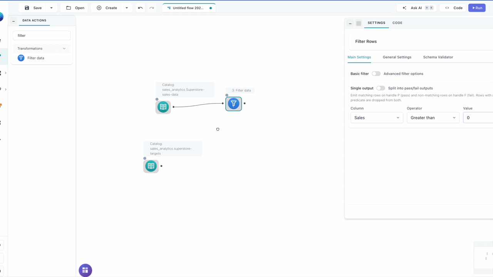
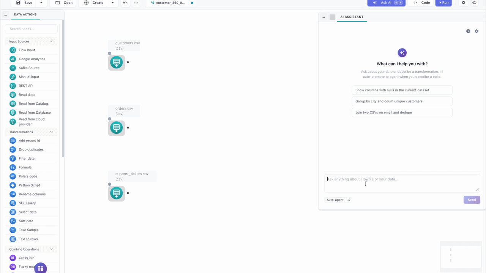
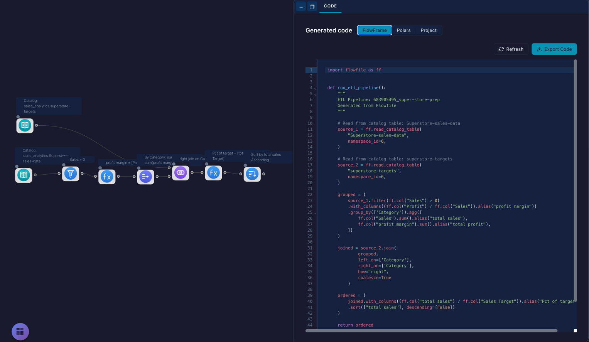
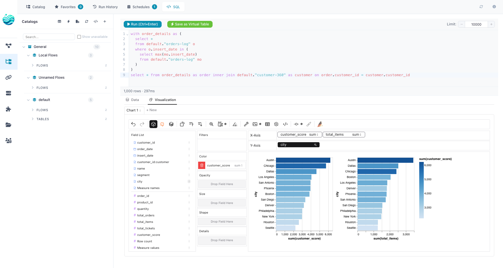

<h1 align="center">
  
  <br>
  Flowfile
</h1>

<p align="center">
  <b>Visual ETL that compiles to Polars.</b>
  <br>
  <sub>Build pipelines on a canvas or in Python — two views of the same graph.<br>Runs on your laptop, in Docker for a team, or entirely in your browser.</sub>
</p>

<p align="center">
  <a href="https://github.com/edwardvaneechoud/Flowfile/actions/workflows/test.yaml"></a>
  <a href="https://codecov.io/gh/edwardvaneechoud/Flowfile"></a>
  <a href="https://pypi.org/project/Flowfile/"></a>
  <a href="https://pypi.org/project/Flowfile/"></a>
  <a href="https://pypi.org/project/Flowfile/"></a>
  <a href="LICENSE"></a>
  <a href="https://github.com/edwardvaneechoud/Flowfile/stargazers"></a>
</p>

<p align="center">
  <a href="https://demo.flowfile.org"><b>▶&nbsp;&nbsp;Try it in your browser&nbsp;&nbsp;→</b></a>
  <br>
  <sub>No install. No signup. Polars in the browser via Pyodide.</sub>
</p>

<p align="center">
  <a href="https://edwardvaneechoud.github.io/Flowfile/">Docs</a> ·
  <a href="https://github.com/edwardvaneechoud/Flowfile/releases">Releases</a> ·
  <a href="https://github.com/edwardvaneechoud/Flowfile/discussions">Discussions</a> ·
  <a href="https://dev.to/edwardvaneechoud/building-flowfile-architecting-a-visual-etl-tool-with-polars-576c">Architecture deep-dive</a>
</p>

---

Build pipelines on a visual canvas with a live preview at every node, or write them in Python with a Polars-like API — code and visual are two views of the same graph. Around it: a Delta-backed catalog, a SQL editor, a scheduler, sandboxed Python kernels, and sharing for teams.

- Just want to see it? [demo.flowfile.org](https://demo.flowfile.org).
- Transforming files on your laptop? `pip install Flowfile` (Python 3.10–3.13).
- Running it for a team? Docker Compose, which adds accounts, groups and a shared catalog. See the [Quick Start](#quick-start).

<div align="center">
  
  <br>
  <sub>Building a Superstore pipeline on the canvas — filters, a join, a pivot, and aggregations, with a live data preview updating at every step.</sub>
</div>

&nbsp;

---

## What's in Flowfile

### Canvas and code

**A visual canvas** with 45 node types — joins, fuzzy matching, filters, pivots, aggregations, text-to-rows, window functions. Beyond the nodes, the formula editor brings 95 transformation functions, and a Polars code node gives you full Polars for anything the palette doesn't cover — all running in-process, no external engine.

It connects to local files (CSV, Parquet, Excel, JSON and friends), five databases (PostgreSQL, MySQL, SQL Server, SQLite, DuckDB), cloud storage (S3, ADLS, GCS — Delta included, Iceberg read-only), Kafka (consumer only), Google Analytics, and REST APIs. That's the whole list — no Snowflake, BigQuery or Oracle driver yet, and no CDC; if your data lives there, land it somewhere Flowfile can reach first.

**A Python API** with Polars-like syntax — write a pipeline, call `open_graph_in_editor()`, and it opens as an editable flow. Porting an existing Polars script over is mostly mechanical.

<div align="center">
  
  <br>
  <sub>A pipeline written with the Python API, opened as an editable flow in the visual editor.</sub>
</div>

&nbsp;

**An AI assistant.** Tell it what you want and it builds the flow with you, on the canvas. Bring your own key — Anthropic, OpenAI, Google, Groq, OpenRouter — or point it at Ollama or a local model.

<div align="center">
  
  <br>
  <sub>Describe what you want, get a runnable flow.</sub>
</div>

&nbsp;

**Code generation.** Prototype visually, ship a plain script: flows export as Python, and save as human-readable YAML so version control works. A flow of standard transforms on local files exports as pure Polars, usually with `import polars as pl` as its only import.

<details>
<summary>What the export needs, exactly</summary>

Fuzzy matching, graph solving, and formulas that don't translate to a native Polars expression pull in the helper packages Flowfile itself is built on (`pl-fuzzy-frame-match`, `polars-grouper`, `polars-expr-transformer`). They're normal pip installs and don't drag Flowfile along.

Database and REST nodes export as `flowfile` calls, so their stored connections and secrets resolve at run time. The platform nodes (catalog, cloud storage, Kafka, ML) export against the FlowFrame API rather than raw Polars. And a few nodes (Google Analytics, SQL query, API response) have no code generation yet.

</details>

<div align="center">
  
  <br>
  <sub>The same flow as code: toggle between pure Polars and FlowFrame output.</sub>
</div>

&nbsp;

### Around the canvas

Everything a flow produces can land in the data catalog — a catalog > schema > table hierarchy on Delta Lake, so tables get version history and time travel. Flow outputs can also register as virtual tables: Flowfile stores the Polars query plan instead of the data, and a consumer's filters push down straight through the flow boundary.

There's a SQL editor on top (Polars SQLContext): query any registered table, chart the result in the embedded Graphic Walker, and save a useful ad-hoc query as a flow in one click.

<div align="center">
  
  <br>
  <sub>SQL queries run against catalog tables, with results feeding into Graphic Walker for visual exploration.</sub>
</div>

&nbsp;

Flows can run on a schedule — on an interval, or when catalog tables update — with run history and logs in the UI. Any node setting takes `${variable}` parameters, overridable at run time with `--param`.

The Docker deployment makes it multi-user: accounts, groups, and sharing of connections, flows and catalog namespaces at "use" or "manage" level. The desktop app is single-user.

**Python kernels.** User code runs in isolated Docker containers with their own package environments (so Docker needs to be running locally), with a Jupyter-style notebook editor — cell execution, autocompletion, rich output.

**Custom nodes.** Build your own in the visual Node Designer and share them through the [community registry](https://github.com/edwardvaneechoud/flowfile-community-nodes) — publishing opens a pull request straight from the app; installing is one click, with sha256-pinned downloads and a consent dialog.

**An embeddable editor.** The browser editor also ships as a standalone Vue component, [`flowfile-editor`](https://www.npmjs.com/package/flowfile-editor): a Polars-powered canvas in any web app, zero backend.

**Templates and clipboard import.** Start from built-in templates, or paste data from Excel / Google Sheets straight onto the canvas.

---

## Quick Start

**In the browser** — [demo.flowfile.org](https://demo.flowfile.org) runs a 23-node subset on Pyodide; good for a first look and small files.

**On your laptop** (Python 3.10–3.13):

```bash
pip install Flowfile
flowfile run ui
```

Or start from code:

```python
import flowfile as ff
from flowfile import col, open_graph_in_editor

df = ff.from_dict({
    "id": [1, 2, 3, 4, 5],
    "category": ["A", "B", "A", "C", "B"],
    "value": [100, 200, 150, 300, 250]
})

result = (
    df.filter(col("value") > 150)
      .with_columns((col("value") * 2).alias("double_value"))
      .group_by("category")
      .agg(col("value").sum().alias("total"))
)

open_graph_in_editor(result.flow_graph)
```

**For a team** — the Docker stack runs core, worker, and the web UI with user accounts and a shared catalog:

```bash
git clone https://github.com/edwardvaneechoud/Flowfile.git
cd Flowfile
docker compose up -d   # UI at http://localhost:8080
```

The compose file in this repo builds from source. To run the published Docker Hub images on a server, behind HTTPS, use [flowfile-hosting](https://github.com/edwardvaneechoud/flowfile-hosting).

**Desktop app** — installers for Windows, macOS, and Linux on the [Releases](https://github.com/edwardvaneechoud/Flowfile/releases) page.

<details>
<summary><b>From source</b> — for contributors (Python 3.10–3.13, Node.js 20+)</summary>

```bash
git clone https://github.com/edwardvaneechoud/Flowfile.git
cd Flowfile
poetry install

# Backend (two separate terminals)
poetry run flowfile_worker  # :63579
poetry run flowfile_core    # :63578

# Frontend
cd flowfile_frontend
npm install && npm run dev:web  # :8080
```

</details>

> **Note:** Windows installers aren't code-signed yet — SmartScreen will warn; click "More info" → "Run anyway". On macOS, if the app shows as damaged after download: `find /Applications/Flowfile.app -exec xattr -c {} \;`

---

## Where Flowfile fits

Flowfile is deliberately a one-machine tool: Polars in-process, no cluster. That's a limit and a feature at once — it's why the whole thing installs with `pip` and runs in a browser tab, and a surprising amount of data fits on one good machine.

| Instead of | The difference |
|---|---|
| **Alteryx / KNIME** | The same canvas idea, but MIT-licensed, Polars underneath, and every pipeline exports to Python you can take with you. |
| **dbt** | dbt transforms data that's already in a warehouse. Flowfile works on files, databases and streams directly, no warehouse needed, and adds a visual layer. |
| **Airflow / Dagster** | Orchestrators run pipelines; Flowfile is where the pipeline gets built. It has a small scheduler of its own, and exported scripts run fine under any orchestrator. |
| **Plain Polars** | You keep Polars. Flowfile adds a canvas, a preview at every node, a catalog and a scheduler, and gets out of the way again when you export. |

---

## Architecture

Three services, plus an embedded **scheduler** and a sandboxed **kernel runtime** for the Python Script nodes:

- **Designer** (Tauri + Vue) — visual interface
- **Core** (FastAPI) — ETL engine running Polars (`:63578`)
- **Worker** (FastAPI) — computation and caching (`:63579`)

Each flow is a directed acyclic graph: nodes are data operations, edges are data flow.

Deeper dive: [Architecting a Visual ETL Tool with Polars](https://dev.to/edwardvaneechoud/building-flowfile-architecting-a-visual-etl-tool-with-polars-576c).

---

## Project status

Actively developed, pre-1.0. Releases ship from this repo to PyPI, the desktop installers, Docker Hub and npm, gated by 7,000+ Python tests and 150+ frontend test files across seven CI workflows, with backend coverage on [Codecov](https://codecov.io/gh/edwardvaneechoud/Flowfile). What's next is tracked in [Issues](https://github.com/edwardvaneechoud/Flowfile/issues) and discussed in [Discussions](https://github.com/edwardvaneechoud/Flowfile/discussions).

## License

[MIT](LICENSE)

---

## Acknowledgments

Built on [Polars](https://pola.rs/), [Vue.js](https://vuejs.org/), [FastAPI](https://fastapi.tiangolo.com/), [VueFlow](https://vueflow.dev/), [Delta Lake](https://delta.io/), [Graphic Walker](https://github.com/Kanaries/graphic-walker), and [Tauri](https://tauri.app/).
