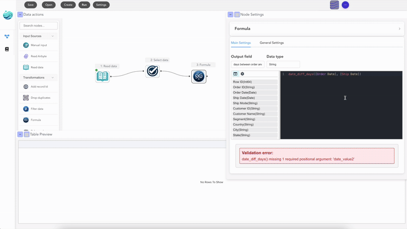

<h1 align="center">
  
  <br>
  Flowfile
</h1>

<p align="center">
  <b>Documentation</b>:
  <a href="https://edwardvaneechoud.github.io/Flowfile/">Website</a> -
  <a href="flowfile_core/README.md">Core</a> -
  <a href="flowfile_worker/README.md">Worker</a> -
  <a href="flowfile_frontend/README.md">Frontend</a> -
  <a href="https://demo.flowfile.org"> Live Lite version"
  <a href="https://dev.to/edwardvaneechoud/building-flowfile-architecting-a-visual-etl-tool-with-polars-576c">Technical Architecture</a>
</p>

<p>
Flowfile is a visual ETL tool and Python library suite that combines drag-and-drop workflow building with the speed of Polars dataframes. Build data pipelines visually, transform data using powerful nodes, or define data flows programmatically with Python and analyze results—all with high-performance data processing. Export your visual flows as standalone Python/Polars code for production deployment.
</p>

<div align="center">
  
</div>

---

## 🔥 Example Use Cases

### Data Cleaning & Transformation

Perform complex joins (fuzzy matching), text-to-rows transformations, and advanced filtering/grouping using a visual interface.

<div align="center">
  
</div>

### Code Generation

Export your visual flows as standalone Python/Polars scripts. Deploy workflows without Flowfile dependencies or share ETL logic as readable code.

<div align="center">
  
</div>

### Data Integration

Standardize data formats and handle messy Excel files efficiently.

<div align="center">
  
</div>

### Performance at Scale

Built to scale out-of-core using Polars for lightning-fast data processing.

<div align="center">
  
</div>

### YAML/JSON Export

Save flows as human-readable YAML or JSON files, making them portable and version-control friendly.

---

## 🚀 Getting Started

Flowfile is designed to be flexible. Choose the installation method that fits your workflow.

### Prerequisites

- Python 3.10+
- Node.js 16+ (for frontend development)
- Poetry (Python package manager)
- Docker & Docker Compose (optional, for Docker setup)
- Make (optional, for build automation)

### 1. Python Package (Recommended for Developers)

Install Flowfile directly from PyPI. This gives you both the visual UI and the programmatic `flowfile_frame` API.

```bash
pip install Flowfile
```

**Launch the Visual UI:** Start the web-based UI with a single command:

```bash
flowfile run ui
```

**Use the FlowFrame API:** Create pipelines programmatically using a Polars-like syntax:

```python
import flowfile as ff
from flowfile import col, open_graph_in_editor

# Create a data pipeline
df = ff.from_dict({
    "id": [1, 2, 3, 4, 5],
    "category": ["A", "B", "A", "C", "B"],
    "value": [100, 200, 150, 300, 250]
})

# Process the data
result = df.filter(col("value") > 150).with_columns([
    (col("value") * 2).alias("double_value")
])

# Open the graph in the web UI
open_graph_in_editor(result.flow_graph)
```

For more details, see the [flowfile_frame documentation](flowfile_frame/README.md).

### 2. Docker (Self-Hosted)

Run the full suite (Frontend, Core, Worker) using Docker Compose. Ideal for server deployments or local isolation.

```bash
git clone https://github.com/edwardvaneechoud/Flowfile.git
cd Flowfile
docker compose up -d
```

Access the app at http://localhost:8080.

### 3. Desktop Application

The desktop version offers the best experience for non-technical users with a native interface and integrated backend services.

**Option A: Download Pre-built Application**

Download the latest release from [GitHub Releases](https://github.com/edwardvaneechoud/Flowfile/releases) and run the installer for your platform (Windows, macOS, or Linux).

> **Note:** You may see security warnings since the app isn't signed with a developer certificate yet.
> - **Windows:** Click "More info" → "Run anyway"
> - **macOS:** If you see an "app is damaged" error, run this in Terminal:
>   ```bash
>   find /Applications/Flowfile.app -exec xattr -c {} \;
>   ```
>   Then open the app normally. This clears the quarantine flag that macOS sets on downloaded apps.

**Option B: Build from Source**

```bash
git clone https://github.com/edwardvaneechoud/Flowfile.git
cd Flowfile

# Build packaged executable
make    # Creates platform-specific executable

# Or manually:
poetry install
poetry run build_backends
cd flowfile_frontend
npm install
npm run build
```

### 4. Browser Version (Lite)

For a zero-setup experience, try the WASM version. It runs entirely in your browser using Pyodide (no server required).

**Live Demo:** [demo.flowfile.org](https://demo.flowfile.org)

This lite version includes 14 essential nodes for data transformation:

- **Input:** Read CSV, Manual Input
- **Transformation:**
  - *Basic:* Filter, Select, Sort, Unique, Take Sample
  - *Reshape:* Group By, Pivot, Unpivot, Join
- **Advanced:** Polars Code (write custom Python/Polars logic)
- **Output:** Preview (view in browser), Download (CSV or Parquet)

### 5. Manual Setup (Development)

For contributors who need hot-reloading and direct access to services.

```bash
git clone https://github.com/edwardvaneechoud/Flowfile.git
cd Flowfile
poetry install

# Start backend services
poetry run flowfile_worker  # Starts worker on :63579
poetry run flowfile_core    # Starts core on :63578

# Start frontend (in a new terminal)
cd flowfile_frontend
npm install && npm run dev:web  # Starts web interface on :8080
```

---

## 🔄 Visualizing and Sharing Pipelines

One of the most powerful features is the ability to visualize your data transformation pipelines:

- **Inspect Data Flow:** See exactly how your data is transformed step by step
- **Debugging:** Identify issues in your data pipeline visually
- **Documentation:** Share your data transformation logic with teammates
- **Iteration:** Modify your pipeline in the Designer UI and export it back to code

---

## ⚡ Technical Design

Flowfile operates as three interconnected services:

- **Designer (Electron + Vue):** Visual interface for building data flows
- **Core (FastAPI):** ETL engine using Polars for data transformations (`:63578`)
- **Worker (FastAPI):** Handles computation and caching of data operations (`:63579`)

Each flow is represented as a directed acyclic graph (DAG), where nodes represent data operations and edges represent data flow between operations. You can export any visual flow as standalone Python/Polars code for production use.

For a deeper dive, check out [this article on our architecture](https://dev.to/edwardvaneechoud/building-flowfile-architecting-a-visual-etl-tool-with-polars-576c).

---

## 📋 TODO

### Core Features

- [ ] Add cloud storage support
  - S3 integration
  - Azure Data Lake Storage (ADLS)
- [x] Multi-flow execution support
- [x] Polars code reverse engineering
  - Generate Polars code from visual flows (via the "Generate code" button)
  - Import existing Polars scripts and convert to visual flows

### Documentation

- [ ] Add comprehensive docstrings
- [x] Create detailed node documentation
- [x] Add architectural documentation
- [ ] Improve inline code comments
- [x] Create user guides and tutorials

### Infrastructure

- [ ] Implement proper testing
- [x] Add CI/CD pipeline
- [x] Improve error handling
- [x] Add monitoring and logging

---

## 📝 License

[MIT License](LICENSE)

---

## Acknowledgments

Built with [Polars](https://pola.rs/), [Vue.js](https://vuejs.org/), [FastAPI](https://fastapi.tiangolo.com/), [VueFlow](https://vueflow.dev/), and [Electron](https://www.electronjs.org/).