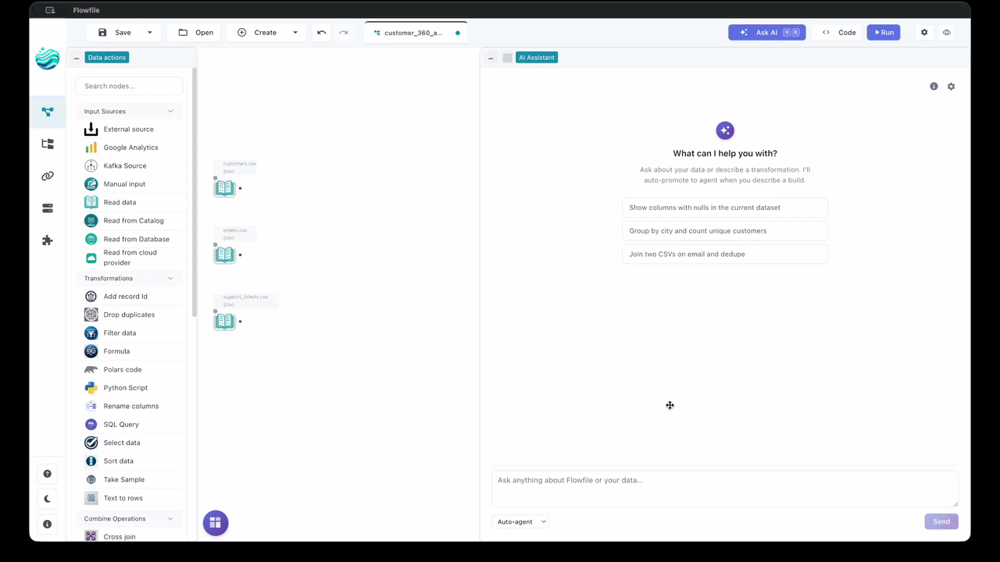
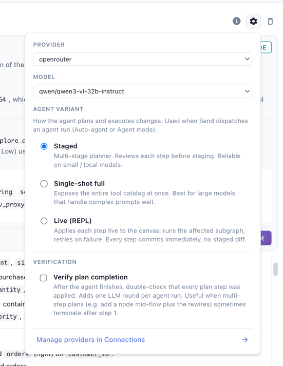
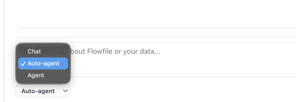
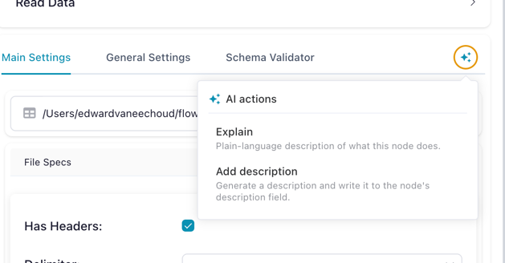
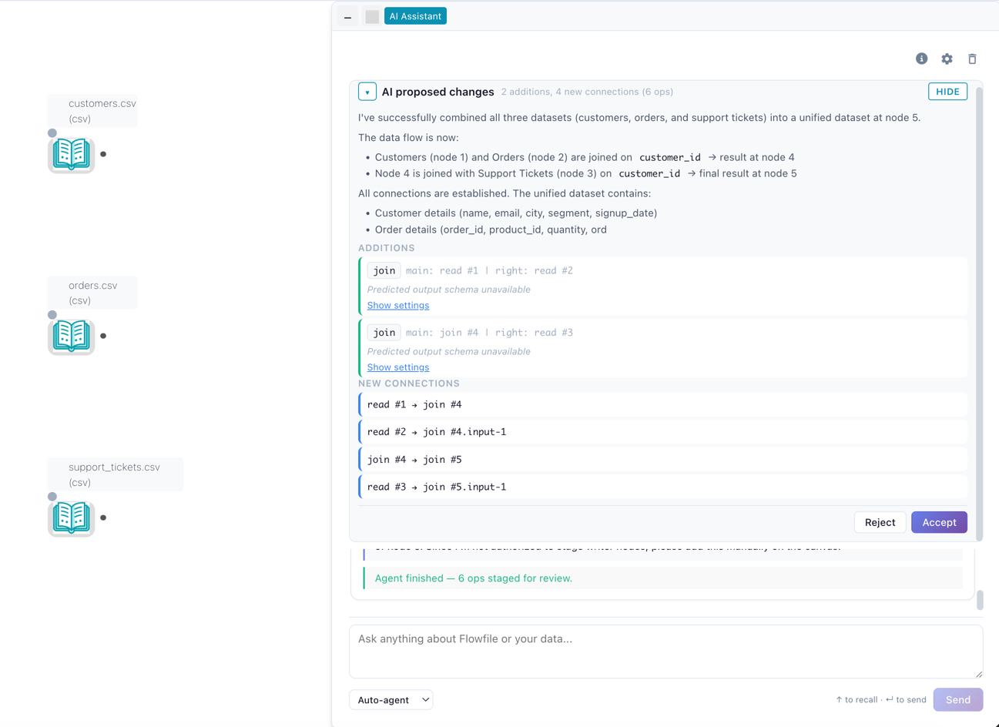

# AI Assistant

Flowfile integrates with LLMs to help you **build, document, and debug** pipelines in plain language. Describe a transformation and the agent builds it; ask the assistant to write the docs for a flow you just shipped; turn a red run into a one-paragraph diagnosis. Every suggestion is grounded in the live node graph, so the model references the columns and node types you actually have — not what it imagines.

How a change lands depends on the surface:

- **Stage-and-review** (`Staged` and `Single-shot full` agent variants, Cmd+K) bundles edits into a `GraphDiff`. Nothing touches your flow until you click *Accept*; one accepted diff = one undo point.
- **Live (REPL)** (default agent variant) applies each step immediately, runs the affected subgraph, and feeds the runtime observation back to the model. Failed steps are auto-undone; there is no staged diff.
- **Inline ✨ actions** skip the diff layer: *Explain* is read-only, *Add description* writes straight to the node's `description` once streaming finishes, and *Regenerate code* shows the new snippet for manual copy-paste.
- **Read-only surfaces** (Chat, Lineage Q&A, Fix With AI, Generate Documentation) never propose graph mutations.

No hosted Flowfile model — bring your own key (Anthropic, OpenAI, Google, Groq, OpenRouter, or a local Ollama). See [Provider Setup](providers.md).

---

## Feature catalog

### Chat (read-only Q&A)

Make sense of a flow without touching it. Ask in plain English — *"What does node 5 do?"*, *"Why is the join producing duplicates?"*, *"Walk me through this pipeline."* The model sees the node graph, settings, and predicted schemas of the focused flow, and grounds answers in those. Chat never edits the graph.

Pin attention by selecting one or more nodes before sending, or by adding `@flow` to pin the whole graph (the default when nothing else is selected). Each chat call streams tokens over SSE with periodic keepalives so long thinking doesn't look like a hang.

### Agent (multi-step builder)

Describe an end-to-end pipeline in one sentence and the Agent builds it — reading the file, joining the lookup, aggregating, all in order. Switch the drawer toggle to *Agent*, type something like *"Read sales.csv, filter to Q4, join with customers on customer_id, aggregate revenue by month"*, and the agent walks the plan one tool call at a time.

The **Agent variant** picker in settings selects execution mode:

- **Live (REPL)** *(default)* — each step applies immediately, the affected subgraph runs (Performance) or samples (Development), and the runtime observation feeds back to the model. Failed steps auto-undo and retry. No diff to accept — the canvas is the running record. Higher latency per step because each one does real work.
- **Staged** — small/local-model-friendly. A tightly-scoped state machine makes one decision per LLM round and bundles proposals into a `GraphDiff` for **Accept** (atomic, one undo point) or **Reject** with an optional note that becomes context for the next attempt.
- **Single-shot full** — big-model mode (Sonnet, Opus, GPT-4.1, Gemini Pro). Exposes the full tool catalog in one call. Same staged-diff review flow.

The **Verify plan completion** checkbox adds one extra LLM round after the agent decides it's done, to walk its plan as a checklist — catches multi-step plans that terminate after step 1.

Every variant shows fine-grained progress (*"Step 1/4: classifying intent"*, etc.) and supports follow-up messages after completion. Internals: [AI Integration Architecture](../for-developers/ai-architecture.md#the-planner-state-machine).

### Auto routing (chat ↔ agent)

With the drawer mode toggle set to *Auto* (default), each message hits a lightweight intent classifier first. Clear *editing* intent (*"add a filter for Q4 orders"*) auto-promotes to the Agent with a banner explaining the switch; pure questions stay in chat. The classifier runs on a small fast model (Haiku / Flash / 4.1-mini) so the round-trip is nearly invisible. Pin to *Chat* or *Agent* explicitly to bypass routing.

### Cmd+K command palette

Quick edits without a conversation. Hit **⌘K** / **Ctrl+K**, type a single instruction (*"add a sort node by date desc"*), and the AI stages a `GraphDiff` for review. Same staging/diff/accept machinery as the Agent.

### Inline ✨ actions on a node

Single-node fixes from the node's ✨ popover:

- **Explain** — streams a plain-language description of what the node does in context. Read-only.
- **Add description** — generates a one-sentence imperative description and **writes it directly to the node's `description` field**. Undo to revert.
- **Regenerate code** *(code-bearing nodes only: `polars_code`, `python_script`, `sql_query`)* — rewrites the snippet and streams it to the drawer for manual **copy-paste**. Existing code is never overwritten automatically.

All three are read-only at the LLM layer (no tool-calling), so the model cannot propose graph mutations through this surface.

### Formula and join-key autocomplete

Background completion while editing *Formula* or *Join* settings — formula suggestions reference the actual upstream schema; join-key suggestions pair columns by name and type. Short timeout keeps the panel responsive; on timeout, parse error, or hallucinated columns it falls back to static completions and marks the result as `degraded`.

### Ghost-node suggestions

Hover over an empty edge stub off a node to see instant next-step suggestions (*"filter, join, aggregate"*). Tuned for sub-second responses; Anthropic's Haiku is the canonical default.

### Lineage Q&A

Debug intermittent failures or perf regressions across runs without scrolling the run report. In the lineage panel ask *"Why did node 5 fail in the last 3 runs?"* or *"Which nodes have been getting slower?"*. The model gets the last N runs' metadata (start/end times, success/failure, per-node runtimes and errors) plus the live flow schema. Scope to a node or the whole flow; answers stream.

### "Fix With AI" on a failed run

When a node fails, the run report's **Fix With AI** button streams a diagnosis — what went wrong, the input schema, what the error implies, and a suggested fix. Offered as text so you stay in control; for automated application, hand the same report to the Agent.

### Generate Documentation

Streams a markdown spec for every node (what it does, input/output schemas, key settings). Drop into a wiki, README, or runbook.

---

## Diff preview & accept/reject

Cmd+K and the *Staged* / *Single-shot full* agent variants route edits through a `GraphDiff` review:

- The diff panel renders bundled changes — added nodes, modified settings, deleted edges — next to the live canvas.
- **Accept** applies atomically as one undo point. Hit Undo and the whole diff reverts.
- **Reject** discards the diff. For agent sessions, the reject reason (free-text) becomes context for the next round, so you correct course without retyping the prompt.
- **Drift detection**: if you edit the canvas manually while a diff is pending, the agent pauses and asks you to *Resume* or *Discard* rather than silently applying over your changes.

The **Live (REPL)** variant and Inline ✨ actions skip this layer. Drift detection still protects staged variants if you switch between them mid-session.

---

## What flow data is shared with the LLM

Each surface sends a context-aware slice of the live `FlowGraph` plus drawer-controlled defaults.

### Default — sent on every call

- **Subgraph structure**: BFS upstream walk from the focused/pinned node(s). Per node: `node_id`, `node_type`, **settings** (column names, file paths, formulas, code blocks), and the **predicted output schema** when one can be computed without running the node.
- **The whole flow** when nothing is focused — chat auto-pins `@flow` by default.
- **Recent run metadata** (Lineage Q&A only): start/end times, success/failure, per-node runtimes and errors for the last N runs (capped at 50). Not sent on other surfaces.

### Never sent — by construction

- **Raw data**. Settings and predicted column types only — never row values.
- **Database / cloud-storage contents**. Predicted schemas only; never bytes behind a CSV, S3 object, or DB table.
- **Your provider API key**. Fernet-encrypted in the Flowfile DB; decrypted only inside the request to the provider, never echoed into the prompt.
- **Other users' flows or sessions**. Each session is scoped to one user + one `flow_id`.

### What you control in the drawer

- **Focus / pinning** — select nodes on the canvas before sending to scope the prompt to that subgraph (BFS upstream); add `@flow` in the message to pin the whole graph (default when nothing else is selected).
- **Send mode** — *Chat*, *Agent*, or *Auto* (see [Auto routing](#auto-routing-chat-agent)).
- **Agent variant** — *Live (REPL)*, *Staged*, or *Single-shot full* (see [Agent](#agent-multi-step-builder)).
- **Verify plan completion** — extra LLM round at the end of an agent run for self-check.
- **Provider and model** — per-flow preference, persisted across sessions.

---

## Where to next

- [Provider Setup (BYOK)](providers.md) — pick a provider, plug in a key, set per-surface model preferences.
- [AI Integration Architecture](../for-developers/ai-architecture.md) — for developers extending the AI subsystem or debugging model behavior.
