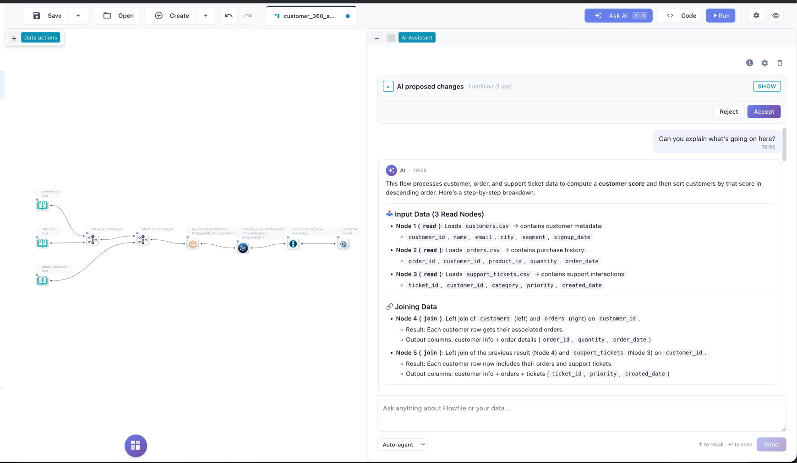

# AI Assistant

Flowfile's AI Assistant helps you build and reason about pipelines in plain language. Describe a multi-step transformation and the agent builds it. Drop into a flow you didn't write and ask what each node does. Get formula suggestions that already know your columns. Turn a failed run into a one-paragraph diagnosis.

Every suggestion is grounded in the live node graph — so the model references the columns and node types you actually have, not what it imagines.

<!-- TODO screenshot: AI drawer open on a flow with a few nodes, showing the Send dropdown (Chat / Auto / Agent) and an in-progress assistant message. Aim for a wide shot that includes the canvas + drawer side-by-side. -->

How a change is applied depends on the surface you pick:

- **Stage-and-review surfaces** (the `Staged` and `Single-shot full` agent variants, the Cmd+K command palette) bundle proposed edits into a `GraphDiff`. Nothing touches your flow until you click *Accept*; one accepted diff = one undo point.
- **Live (REPL)** is the default agent variant in the drawer. Every step is **applied immediately** to the canvas, the affected subgraph runs, and runtime observations are fed back to the model. On runtime failure the just-added node is auto-undone. There is no staged diff — every step commits.
- **Inline ✨ actions** never go through a diff: *Explain* is read-only, *Add description* streams the description and writes it directly to the node's `description` field once the stream finishes, and *Regenerate code* shows the new snippet in the drawer for you to copy-paste manually.
- **Read-only surfaces** (Chat, Lineage Q&A, Fix With AI on a failed run, Generate Documentation) never propose graph mutations.

There is no hosted Flowfile model — you bring your own provider key (Anthropic, OpenAI, Google, Groq, OpenRouter, or a local Ollama). See [Provider Setup](providers.md) for the full BYOK story.

---

## Feature catalog

### Chat (read-only Q&A)

Use Chat to make sense of a flow without touching it. Useful when you've inherited a pipeline, are onboarding a teammate, or want a sanity check before changing something. Ask in plain English: *"What does node 5 do?"*, *"Why is the join producing duplicates?"*, *"Walk me through this pipeline."* The model sees the node graph, settings, and predicted schemas of the flow you're focused on, and answers grounded in those — not in generic guesses. Chat never edits the graph.

You can pin attention by:

- Selecting one or more nodes on the canvas before sending a message — they become the focus.
- Adding `@flow` to the message to pin the whole graph (this is the default when nothing else is pinned).

Each chat call streams tokens to the drawer over Server-Sent Events, with periodic keepalive frames so long thinking doesn't look like a hang.

### Agent (multi-step builder)

Describe an end-to-end pipeline in one sentence and the Agent builds it for you — reading the file, joining the lookup table, aggregating, all in the right order. Switch the drawer toggle from *Chat* to *Agent*, type something like *"Read sales.csv, filter to Q4, join with customers on customer_id, aggregate revenue by month"*, and the agent walks the plan, proposing one tool call at a time.

The drawer's **Agent variant** picker (in settings) selects the execution mode:

- **Live (REPL)** — the **default**. Every step is **applied immediately** to the canvas, the affected subgraph runs (Performance) or a sample is evaluated (Development), and the runtime observation is fed back to the model. On runtime failure the just-added node is auto-undone and the LLM retries. There's no staged diff to accept — the canvas itself is the running record. Best when you want the agent to verify its own work as it goes; expect higher latency because each step does real work.
- **Staged** — small/local-model-friendly. The agent runs a tightly-scoped state machine (one decision per LLM round), accumulates proposals, and bundles them into a `GraphDiff` for **review**. You see a visual preview of what nodes would be added or modified, then click **Accept** to apply atomically (one undo point) or **Reject** with an optional note that becomes context for the next attempt.
- **Single-shot full** — big-model mode. Exposes the full tool catalog in one call. Best for Sonnet, Opus, GPT-4.1, Gemini Pro etc. Same staged-diff review flow as *Staged*.

There's also an opt-in **Verify plan completion** checkbox: after the agent decides it's done, it runs one extra LLM round to walk its plan as a checklist. Helps catch the case where a multi-step plan terminates after step 1.

In every variant, the agent panel shows fine-grained progress — *"Step 1/4: classifying intent"*, *"Step 3/4: picking upstream"*, etc. After completion you can send a follow-up message to keep iterating. Internal mechanics are documented for developers in the [AI Integration Architecture](../for-developers/ai-architecture.md#the-planner-state-machine) guide.

### Auto routing (chat ↔ agent)

If the chat-drawer mode toggle is set to *Auto* (the default), each message is first sent to a lightweight intent classifier. When the classifier sees a clear *editing* intent (*"add a filter for Q4 orders"*) it auto-promotes the message to the agent surface and shows a banner explaining the switch. Pure questions stay in chat. The classifier runs on a small fast model (typically Haiku / Flash / 4.1-mini) so the round-trip is nearly invisible.

You can always pin to *Chat* or *Agent* explicitly if you want to bypass routing.

### Cmd+K command palette

For quick edits that don't need a conversation. Hit **⌘K** (or **Ctrl+K**) anywhere in the editor, type a single natural-language instruction (*"add a sort node by date desc"*), and the AI stages a `GraphDiff` for review. Faster than dragging through the node library when you already know what you want. Powered by the same staging/diff/accept machinery as the agent.

### Inline ✨ actions on a node

For single-node fixes that don't need a full chat. Open the ✨ popover from a node's header and pick:

- **Explain** — streams a plain-language description of what this node does in the context of the flow. Helpful when you're inheriting someone else's pipeline. Read-only.
- **Add description** — generates a one-sentence imperative description and **writes it directly to the node's `description` field** once the stream finishes. Useful for documenting a flow as you go without breaking your build flow. Hit Undo to revert if you don't like the result.
- **Regenerate code** — only available on code-bearing nodes (`polars_code`, `python_script`, `sql_query`). Rewrites the snippet for clarity and streams it to the drawer for you to **copy-paste** in. Your existing code is never overwritten automatically.

All three are read-only at the LLM layer (no tool-calling), so the model can never propose unrelated graph mutations through this surface.

### Formula and join-key autocomplete

Skip the trip to the Polars docs. While you edit a *Formula* or *Join* node's settings, an AI completion runs in the background — formula suggestions reference the actual upstream schema, and join-key suggestions pair up columns by name and type. Bounded by a short timeout so the panel stays responsive; if the LLM is slow or returns something that looks off (timeout, parse error, hallucinated columns), the panel falls back to static completions and marks the result as `degraded` so you know it isn't the AI's pick.

### Ghost-node suggestions

Stuck on what comes next? Hover over an empty edge stub off a node and you get instant suggestions for the next likely operation (*"filter, join, aggregate"*). Tuned for sub-second responses — Anthropic's Haiku is the canonical default.

### Lineage Q&A

For debugging intermittent failures or performance regressions across runs without scrolling through the run report by hand. In the lineage panel, ask: *"Why did node 5 fail in the last 3 runs?"*, *"Which nodes have been getting slower?"*. The model is given the last N runs' metadata (start/end times, success/failure, per-node runtimes and errors) plus the live flow schema. Scope the question to a specific node or ask about the whole flow. Answers stream in.

### "Fix With AI" on a failed run

The fastest path from a red run to a working pipeline. When a node fails, the run report shows a **Fix With AI** button. Clicking it streams a diagnosis — what went wrong, what the input schema looked like, what the error message implies, and a suggested fix. The fix is offered as text so you stay in control; for automated fixes, switch to the Agent and tell it what the report said.

### Generate Documentation

Hand off a flow to a teammate — or future-you — without writing a runbook from scratch. **Generate Documentation** streams a markdown spec for every node: what it does, its input/output schemas, and key settings. Drop the result into a wiki, a README, or a runbook.

---

## Diff preview & accept/reject

The Cmd+K palette and the *Staged* / *Single-shot full* agent variants route their proposed edits through a `GraphDiff` review step:

- A diff panel renders the bundled changes — added nodes, modified settings, deleted edges — next to the live canvas.
- **Accept** atomically applies the diff and creates one undo point. If something looks wrong, hit Undo and the whole diff reverts.
- **Reject** discards the diff. For agent sessions, the reject reason (free-text) becomes context for the agent's next round, so you can correct course without retyping the original prompt.
- If the canvas drifts (a manual edit while the diff is pending) the agent pauses and asks you to *Resume* or *Discard*, rather than silently applying over your changes. This is **drift detection**.

The **Live (REPL)** agent variant skips this layer — every step is applied immediately. Inline ✨ actions also skip it (see above). Drift detection still protects the staged variants if you switch between them mid-session.

<!-- TODO screenshot: Diff preview panel open beside the canvas. Show 2-3 staged operations (e.g. "+ Filter node", "+ Join node", "edge filter→join") with the Accept and Reject buttons clearly visible at the bottom. -->

---

## What flow data is shared with the LLM

Each AI surface sends a context-aware slice of your flow to the model. The slice is built from a per-call walk of the live `FlowGraph` plus a few defaults you can adjust from the drawer.

### Default — sent on every call

- **Subgraph structure**: a BFS upstream walk from the focused / pinned node(s). For each visited node: `node_id`, `node_type`, the **node settings** (column names, file paths, formulas, code blocks, etc.), and the **predicted output schema** (column names + types) when one can be computed without running the node.
- **The whole flow** if no specific node is focused — chat in particular auto-pins `@flow` so the model can answer *"what does this pipeline do?"* out of the box.
- **Recent run metadata** for the Lineage Q&A surface only — start/end times, success/failure, per-node runtimes and errors for the last N runs (capped at 50). Run history is *not* sent on any other surface.

### Never sent — by construction

- **Raw data**. The model sees node settings and predicted column types — never the row values behind them.
- **Database / cloud-storage contents**. The model sees only the schemas Flowfile has predicted; it never sees the bytes behind a CSV reader, an S3 object, or a database table.
- **Your provider API key**. Stored Fernet-encrypted in the Flowfile DB; the key is decrypted only inside the request to the provider, never echoed back to the prompt.
- **Other users' flows or sessions**. Each AI session is scoped to the requesting user and a single `flow_id`.

### What you control in the drawer

- **Focus / pinning**. Select one or more nodes on the canvas before sending a chat message and they become the focus — only that subgraph (BFS upstream) is rendered into the prompt instead of the whole flow.
- **Mention in the message body**. Add `@flow` anywhere in the message to pin the whole graph; this is also the default when nothing else is pinned.
- **Send mode** (drawer dropdown): *Chat* (read-only Q&A), *Agent* (multi-step builder), or *Auto* (a fast classifier picks per message — see [Auto routing](#auto-routing-chat-agent)).
- **Agent variant** (drawer settings): *Live (REPL)*, *Staged*, or *Single-shot full*. See [Agent](#agent-multi-step-builder).
- **Verify plan completion** (drawer settings checkbox): adds one extra LLM round at the end of an agent run for self-check.
- **Provider and model** (drawer settings): pick which provider to call and optionally a specific model. Per-flow preference, persisted across sessions.

---

## Where to next

- [Provider Setup (BYOK)](providers.md) — pick a provider, plug in a key, set per-surface model preferences.
- [AI Integration Architecture](../for-developers/ai-architecture.md) — for developers extending the AI subsystem or debugging model behavior.
