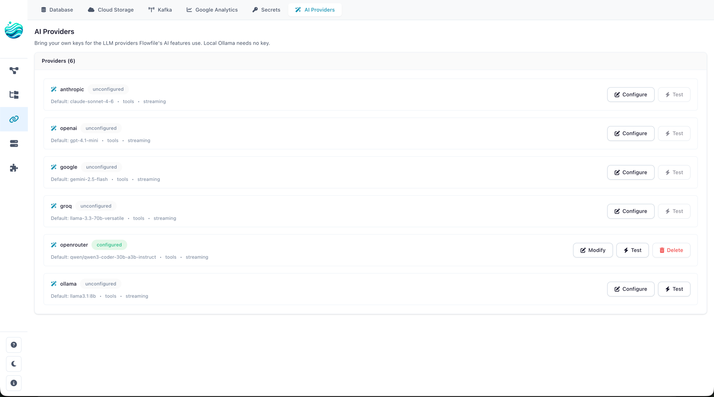

# Provider Setup (BYOK)

Flowfile does not ship a hosted LLM. To use the [AI Assistant](index.md), you bring your own provider key — one of Anthropic, OpenAI, Google, Groq, OpenRouter, or a local Ollama server. Keys are encrypted at rest with the Flowfile master key (`FLOWFILE_MASTER_KEY` / `master_key.txt`) using Fernet, the same scheme that protects your other Flowfile secrets.

---

## Supported providers

| Provider | Default model | Tools | Streaming | Key env var | Notes |
|----------|---------------|:-----:|:---------:|-------------|-------|
| **Anthropic** | `claude-sonnet-4-6` | ✓ | ✓ | `ANTHROPIC_API_KEY` | Best balance of quality and tool-use reliability. Haiku 4.5 is the default for fast surfaces (Cmd+K, ghost-node, autocomplete); Opus 4.7 for `agent_complex`. |
| **OpenAI** | `gpt-4.1-mini` | ✓ | ✓ | `OPENAI_API_KEY` | Mini tier for the cheap surfaces; full `gpt-4.1` for `explain` / `agent_complex` / `docgen`. Strict structured outputs supported via litellm. |
| **Google (Gemini)** | `gemini-2.5-flash` | ✓ | ✓ | `GEMINI_API_KEY` or `GOOGLE_API_KEY` | Generous free tier (~250–1000 req/day, no card). Pro for `agent_complex`. |
| **Groq** | `llama-3.3-70b-versatile` | ✓ | ✓ | `GROQ_API_KEY` | Very fast inference (~30 RPM free tier); good fit for low-TTFB surfaces (Cmd+K, ghost-node). |
| **OpenRouter** | `anthropic/claude-sonnet-4.5` | ✓ | ✓ | `OPENROUTER_API_KEY` | Unified façade for 50+ models with a single key. The `agent_staged` default is `meta-llama/llama-3.3-70b-instruct` (free tier). |
| **Ollama** | `llama3.1:8b` | ✓ (model-dependent) | ✓ | *(none — local)* | Self-hosted; talks to your local Ollama server (default `http://localhost:11434`). Tool-use works on Llama 3.1+ and most newer instruct models. |

The "Tools" column means the provider can return structured tool-call arguments — required for the Agent surface, optional for chat-only surfaces. The Agent will refuse to start a session against a model that doesn't support tools.

---

## Configuring keys in the UI

The recommended path is the in-app settings panel:

1. Open **Settings → AI Providers**.
2. Pick a provider from the list. The panel shows class-level metadata (default model, supports tools, supports streaming) plus your current credential status: **Configured** (key saved), **Env fallback** (no key saved but a recognised env var is set on the server), or **Unconfigured**.
3. Paste the API key into the *API key* field and click **Save**. For Ollama or self-hosted endpoints, set *API base* to the server URL.
4. Click **Test**. Flowfile issues a 1-token ping and records the result on the credential (`last_tested_at`, `last_test_status`). A green checkmark means you're good to go.

<!-- TODO screenshot: AI Providers list view (Settings → AI Providers) showing all six providers with their status chips (Configured / Env fallback / Unconfigured). -->


To remove a key, click **Delete**. The credential row and the underlying encrypted secret are removed atomically.

Under the hood, these actions hit the BYOK routes:

| Action | HTTP |
|--------|------|
| List providers + credentials | `GET /ai/providers` |
| Save / update credential | `POST /ai/providers/{name}` |
| Delete credential | `DELETE /ai/providers/{name}` |
| Test credential | `POST /ai/providers/{name}/test` |

All BYOK endpoints require an authenticated user; credentials are scoped per user.

---

## Configuring keys via env vars (fallback)

If no credential row exists for a user, Flowfile falls back to the standard provider env vars on the host process. This is convenient for solo / local installs:

```bash
export ANTHROPIC_API_KEY="sk-ant-..."
export OPENAI_API_KEY="sk-..."
export GEMINI_API_KEY="..."        # or GOOGLE_API_KEY
export GROQ_API_KEY="gsk_..."
export OPENROUTER_API_KEY="sk-or-..."
poetry run flowfile_core
```

When an env var is detected, the BYOK panel shows the provider as **Env fallback**. Saving a key in the UI takes precedence per user; deleting that key falls back to the env var again.

Ollama needs no key but typically needs an `api_base` — save a credential row with `api_base="http://localhost:11434"` (or wherever your server is).

---

## Choosing models per surface

Each AI feature is a *surface* (`chat`, `explain`, `agent_staged`, `agent_complex`, `cmd_k`, `ghost_node`, `settings_autocomplete`, `lineage`, `docgen`, `intent_classifier`). Each provider class ships sensible per-surface defaults — Haiku for fast paths, Sonnet for thinking paths, etc. — so you usually don't need to override anything.

When you do want to override:

1. **Per-credential default**. In the BYOK panel, set *Default model* on the provider row. This wins over the class-level default for every surface.
2. **Curated model list**. Some providers (notably OpenRouter) let you pin a *list* of models you've opted into. Flowfile will use the surface's preferred model **if it's in your curated list**; otherwise it falls back to the first model in the list. Useful when you want to limit yourself to free-tier models without losing per-surface intelligence.
3. **Per-request override**. Power users can pass an explicit `model=...` on a per-call basis through the API. This always wins.

The full resolution order, in priority:

1. Explicit `model=` argument on the request.
2. Credential row's `default_model`.
3. Provider class' `surface_models[surface]`, **if** it appears in your curated `models` list.
4. First entry of your curated `models` list.
5. Provider class' `surface_models[surface]`.
6. Provider class' `default_model`.

A note on the Agent surface: it requires a tool-capable model. If you pin a curated list that contains only models without tool support, agent calls will return `422` with a clear message; switch back to a tool-capable model.

---

## Rate limits

You can cap per-provider request volume at the host process to avoid burning through a free-tier allowance during a session loop:

```bash
export FLOWFILE_AI_ANTHROPIC_RPM=30      # requests per minute
export FLOWFILE_AI_ANTHROPIC_RPD=1000    # requests per day
export FLOWFILE_AI_OPENAI_RPM=60
# ... and so on for each provider name (uppercased)
```

The pattern is `FLOWFILE_AI_<PROVIDER>_RPM` and `FLOWFILE_AI_<PROVIDER>_RPD`. Unset means *no enforcement*. When a bucket fills, the scheduler delays the call (and surfaces a *"rate-limited, retrying in Ns"* hint to the UI rather than 5xx-ing). The same path also honours server `Retry-After` headers on 429 responses, regardless of your local caps.

Limits are in-memory and per-provider, not per-`(provider, model)`; persistence across restarts is intentionally not implemented.

---

## Self-hosted (Ollama) setup

Ollama is the offline path. Quick start on macOS / Linux:

1. Install and start Ollama (see [ollama.com](https://ollama.com) — link kept off this page so it doesn't rot).
2. Pull a tool-capable instruct model:

    ```bash
    ollama pull llama3.1:8b
    # or for the agent_complex surface:
    ollama pull llama3.1:70b
    ```

3. In Flowfile, **Settings → AI Providers → Ollama**:
    - Leave *API key* empty.
    - Set *API base* to `http://localhost:11434` (the default; only override if your Ollama server is elsewhere).
    - Optionally set *Default model* to the tag you pulled.
    - Click **Save**, then **Test**.

Tool-call quality varies by model. Llama 3.1+ instruct models do tool calls correctly; older or non-instruct models sometimes return tool calls as text in the assistant content. The Agent surface compensates with Pydantic-repair on the tool-call shape, but for best results stick to the recommended models.

---

## Troubleshooting

**`503 Service Unavailable` from any `/ai/*` endpoint.**
The feature flag is off. AI is on by default — this only happens if someone has explicitly set `FEATURE_FLAG_AI=false` in the env, or toggled it off at runtime via `POST /system/feature_flags/ai`. Re-enable by unsetting the env var (or setting it to `true`) and restarting, or toggle it back on via the admin endpoint.

**`422 Unprocessable Entity` when starting an Agent session.**
The picked model doesn't support tools. Check the *Tools* column in the [provider table](#supported-providers). Either switch models on the request or update your credential's `default_model`.

**`404` from `POST /ai/providers/{name}`.**
Provider name typo. The supported names are exactly: `anthropic`, `openai`, `google`, `groq`, `openrouter`, `ollama` (lowercase, no dashes).

**Credential `Test` returns `ok=false` with an authentication error.**
Key is wrong, expired, or missing required scopes. The error message from the upstream provider is surfaced in the `error` field of the test result.

**Credential `Test` succeeds but a real call fails with `ProviderNotConfiguredError`.**
The user account on the *call* doesn't match the user on the *credential row*. Credentials are per-user; another user on the same Flowfile install would need to save their own key (or fall back to the env var).

**Agent runs but model emits text-shaped JSON instead of tool calls.**
You're on a smaller model that struggles with the full tool catalog. Switch the agent surface to `agent_staged` (the default) — that mode exposes one tool per LLM round and is designed for exactly this.

**The chat drawer auto-promoted my message to Agent and I didn't want it to.**
The drawer's mode toggle has three values: *Chat*, *Auto*, *Agent*. Set it to *Chat* to disable auto-promotion. Auto-promotion uses a fast classifier model on the same provider; you can see what surface fired in the drawer header.

**Where are my keys actually stored?**
Encrypted with Fernet (master key `FLOWFILE_MASTER_KEY` / `master_key.txt`) in the same secrets table as the rest of your Flowfile secrets. The credential row carries an `api_key_secret_id` pointer; deleting the credential drops both the row and the secret atomically. **Don't commit `master_key.txt`.**

---

## See also

- [AI Assistant overview](index.md) — what each feature does.
- [AI Integration Architecture](../for-developers/ai-architecture.md) — internals, including BYOK resolution and the provider class layout.
