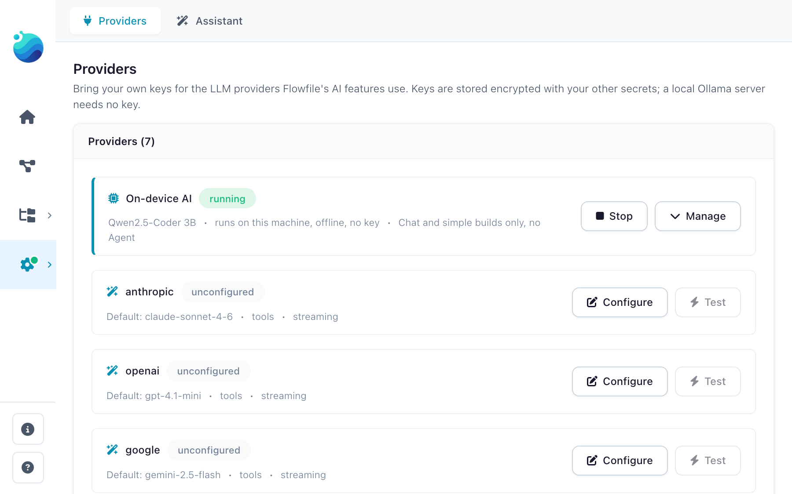
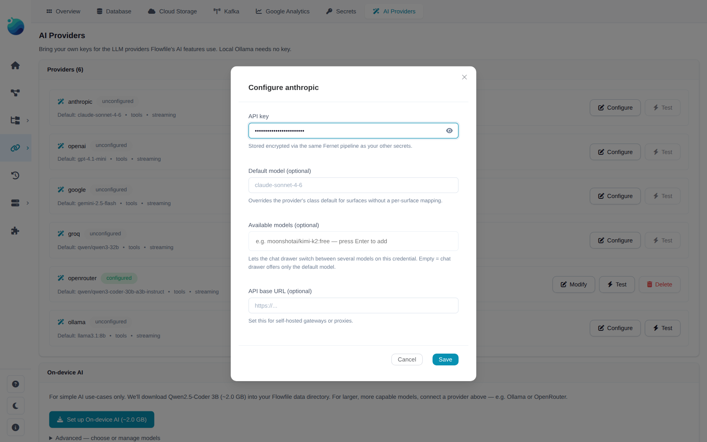
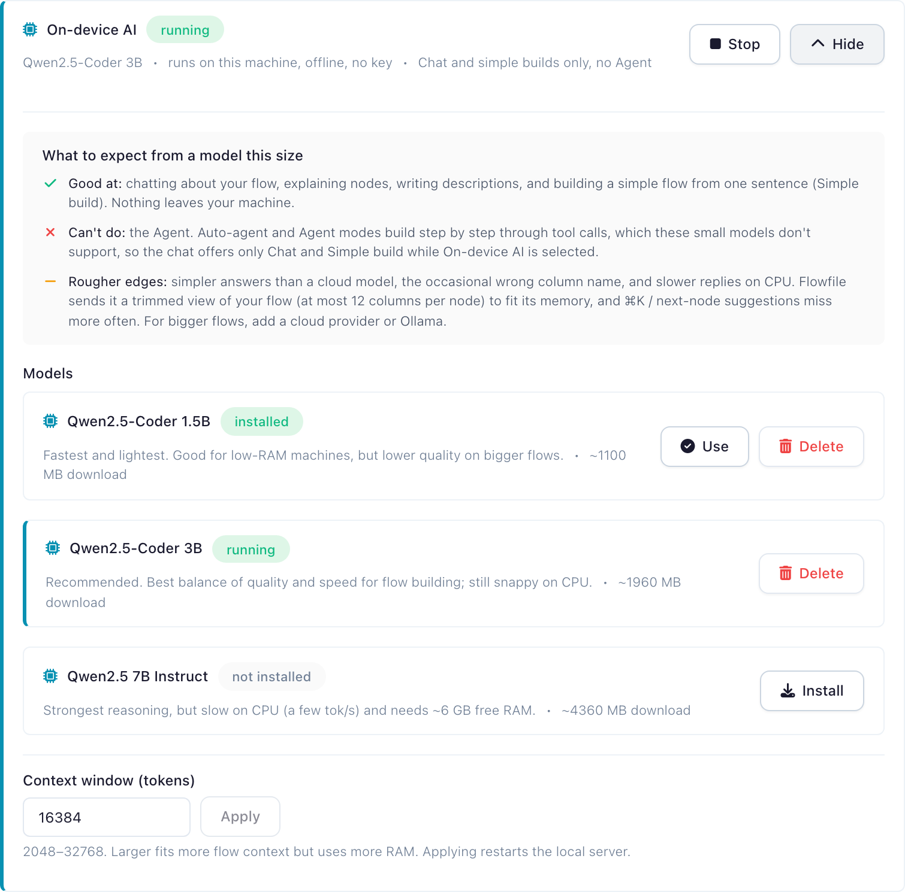

# Provider Setup (BYOK)

The [AI Assistant](index.md) runs against a built-in [on-device model](#on-device-model-no-key-required) or one of six LLM providers — pick what fits your budget, latency needs, or compliance posture: Anthropic, OpenAI, Google, Groq, OpenRouter, and a local Ollama server. For the hosted providers you bring your own API key; Flowfile encrypts it at rest with Fernet (using `FLOWFILE_MASTER_KEY` / `master_key.txt`), the same scheme that protects your other secrets. For air-gapped work there are two offline paths: the on-device model, which needs no key and no account, and Ollama, which points Flowfile at a server you run.

!!! info "Not in Flowfile Lite"
    The AI Assistant (and BYOK provider setup) requires the full desktop/server build, not the browser-only [Flowfile Lite](../users/deployment/lite.md) edition.

---

## Supported providers

Default models below reflect the provider classes as of 2026-07.

| Provider | Default model | Tools | Streaming | Key env var | Notes |
|----------|---------------|:-----:|:---------:|-------------|-------|
| **Anthropic** | `claude-sonnet-4-6` | ✓ | ✓ | `ANTHROPIC_API_KEY` | Best balance of quality and tool-use reliability. Haiku 4.5 is the default for fast surfaces (Cmd+K, ghost-node, autocomplete); Opus 4.7 for `agent_complex`. |
| **OpenAI** | `gpt-4.1-mini` | ✓ | ✓ | `OPENAI_API_KEY` | Mini tier for the cheap surfaces; full `gpt-4.1` for `explain` / `agent_complex` / `docgen`. Strict structured outputs supported via litellm. |
| **Google (Gemini)** | `gemini-2.5-flash` | ✓ | ✓ | `GEMINI_API_KEY` or `GOOGLE_API_KEY` | Generous free tier (~250–1000 req/day, no card). Pro for `agent_complex`. |
| **Groq** | `qwen/qwen3-32b` | ✓ | ✓ | `GROQ_API_KEY` | Very fast inference (~30 RPM free tier); good fit for low-TTFB surfaces (Cmd+K, ghost-node). |
| **OpenRouter** | `qwen/qwen3-coder-30b-a3b-instruct` | ✓ | ✓ | `OPENROUTER_API_KEY` | One key routing to many hosted models. The `agent_staged` default is `meta-llama/llama-3.3-70b-instruct` (free tier). |
| **Ollama** | `llama3.1:8b` | ✓ (model-dependent) | ✓ | *(none — local)* | Self-hosted; talks to your local Ollama server (default `http://localhost:11434`). Tool-use works on Llama 3.1+ and most newer instruct models. |

The "Tools" column means the provider can return structured tool-call arguments — required for the Agent surface. The Agent refuses to start against a model that lacks tool support.

!!! note "Model IDs drift with releases"
    The default and per-surface model IDs are hardcoded in the provider classes at `flowfile_core/flowfile_core/ai/providers/*.py` (one file per provider) and are bumped as new models ship. The table above is a snapshot; check those files for the current values before relying on a specific model name.

---

## Configuring keys in the UI

The recommended path is the in-app settings panel:

1. Open **Settings → AI Providers**.
2. Pick a provider from the list. The panel shows class-level metadata (default model, supports tools, supports streaming) plus your current credential status: **Configured** (key saved), **Env fallback** (no key saved but a recognised env var is set on the server), or **Unconfigured**.
3. Paste the API key into the *API key* field and click **Save**. For Ollama or self-hosted endpoints, set *API base* to the server URL.
4. Click **Test**. Flowfile issues a 1-token ping and records the result on the credential (`last_tested_at`, `last_test_status`).





To remove a key, click **Delete**. The credential row and the underlying encrypted secret are removed atomically.

Under the hood, these actions hit the BYOK routes:

| Action | HTTP |
|--------|------|
| List providers + credentials | `GET /ai/providers` |
| Save / update credential | `POST /ai/providers/{name}` |
| Delete credential | `DELETE /ai/providers/{name}` |
| Test credential | `POST /ai/providers/{name}/test` |

All BYOK endpoints require an authenticated user; credentials are scoped per user.

### Env-var fallback

If no credential row exists for a user, Flowfile falls back to the standard provider env vars (`ANTHROPIC_API_KEY`, `OPENAI_API_KEY`, `GEMINI_API_KEY` / `GOOGLE_API_KEY`, `GROQ_API_KEY`, `OPENROUTER_API_KEY`) on the host process. The BYOK panel shows the provider as **Env fallback** in that case; saving a key in the UI takes precedence per user, and deleting it falls back to the env var again. Ollama needs no key — just an `api_base` (default `http://localhost:11434`).

---

## Choosing models per surface

Each AI feature is a *surface* (`explain`, `agent_staged`, `agent_live`, `agent_complex`, `cmd_k`, `ghost_node`, `settings_autocomplete`, `lineage`, `docgen`, `intent_classifier`, `cron`; the chat drawer has no surface of its own and falls back to `explain`). Each provider class ships per-surface defaults — Haiku for fast paths, Sonnet for thinking paths, etc. — so you usually don't need to override anything.

When you do want to override:

1. **Per-credential default**. In the BYOK panel, set *Default model* on the provider row. This wins over the class-level default on every surface except the Agent, which prefers the provider class' own tool-capable model where one is defined (see below).
2. **Curated model list**. Some providers (notably OpenRouter) let you pin a *list* of models you've opted into. Flowfile will use the surface's preferred model **if it's in your curated list**; otherwise it falls back to the first model in the list. Useful when you want to limit yourself to free-tier models without losing per-surface intelligence.
3. **Per-request override**. The API accepts an explicit `model=...` per call. This always wins.

The full resolution order, in priority:

1. Explicit `model=` argument on the request.
2. Credential row's `default_model`.
3. Provider class' `surface_models[surface]`, **if** it appears in your curated `models` list.
4. First entry of your curated `models` list.
5. Provider class' `surface_models[surface]`.
6. Provider class' `default_model`.

A note on the Agent surface: it requires a tool-capable model. Unless you pass an explicit `model=`, it routes to the provider class' `surface_models` entry for the agent surface where the class defines one, ahead of your credential default and curated list. A provider that cannot tool-call at all — the [on-device model](#on-device-model-no-key-required) — is refused with a `422`.

---

## Rate limits

Cap per-provider request volume via env vars on the host: `FLOWFILE_AI_<PROVIDER>_RPM` (per minute) and `FLOWFILE_AI_<PROVIDER>_RPD` (per day). Unset means *no enforcement*. When a bucket fills, the scheduler delays the call and surfaces a *"rate-limited, retrying in Ns"* hint rather than 5xx-ing. Server `Retry-After` headers on 429 responses are always honoured. Limits are in-memory and per-provider (not per-`(provider, model)`); not persisted across restarts.

---

## On-device model (no key required)

Flowfile can run a small model on the machine itself — no account, no key, no network once it's installed. It downloads a llama.cpp `llama-server` build plus a quantized model into your Flowfile data directory and drives it over its OpenAI-compatible API. The provider id is `local`; it is deliberately kept out of the BYOK provider set above, so it never appears in the credential list and has no `/ai/providers/*` routes. The server boots lazily on the first AI call.

Set it up in **Settings → AI Providers → On-device AI**:

1. With nothing installed, the card offers a single **Set up On-device AI** button (labelled with the download size) that fetches the recommended model. Nothing downloads until you click it.
2. Once installed, the card shows the active model with **Start** / **Stop**.
3. **Advanced — choose or manage models** opens the full catalog: install another size, switch the active one with **Use**, or delete one.



The catalog is three q4_k_m GGUF builds, pulled from Hugging Face on demand:

| Model | Notes |
|-------|-------|
| **Qwen2.5-Coder 1.5B** | Fastest and lightest. Good on low-RAM machines, weaker on bigger flows. |
| **Qwen2.5-Coder 3B** | The default. Best balance of quality and speed. |
| **Qwen2.5 7B Instruct** | Strongest reasoning, but slow on CPU and needs roughly 6 GB free RAM. |

Prebuilt runtimes exist for macOS, Linux, and Windows on x64 and arm64; elsewhere the card shows "Not available on this platform".

The on-device model streams but does not do tool calls, so it backs the read-only and text surfaces — Chat, Fix With AI, Generate Documentation, Lineage Q&A, the inline ✨ actions — plus one-shot flow generation. The Agent rejects it with a `422`; it is meant for simple AI use-cases, and larger workloads belong on a provider such as Ollama or OpenRouter.

!!! note "Running Flowfile in Docker"
    The bundled `llama-server` needs `libgomp1` in the image. If it exits on startup, see [Troubleshooting](#troubleshooting).

---

## Self-hosted (Ollama) setup

Ollama is the other offline path — a server you install and manage yourself. Quick start on macOS / Linux:

1. Install and start Ollama (see [ollama.com](https://ollama.com) — link kept off this page so it doesn't rot).
2. Pull a tool-capable instruct model:

    ```bash
    ollama pull llama3.1:8b
    # or for the agent_complex surface:
    ollama pull llama3.1:70b
    ```

3. In Flowfile, **Settings → AI Providers → Ollama**:
    - Leave *API key* empty.
    - Set *API base* to `http://localhost:11434` (the default; only override if your Ollama server is elsewhere).
    - Optionally set *Default model* to the tag you pulled.
    - Click **Save**, then **Test**.

Tool-call quality varies by model. Llama 3.1+ instruct models do tool calls correctly; older or non-instruct models sometimes return tool calls as text in the assistant content. The Agent surface compensates with Pydantic-repair on the tool-call shape.

---

## Troubleshooting

**`503 Service Unavailable` from any `/ai/*` endpoint.**
The feature flag is off. AI is on by default — this only happens if someone has explicitly set `FEATURE_FLAG_AI=false` in the env, or toggled it off at runtime via `POST /system/feature_flags/ai`. Re-enable by unsetting the env var (or setting it to `true`) and restarting, or toggle it back on via the admin endpoint.

**`422 Unprocessable Entity` when starting an Agent session.**
The picked provider can't do tool calls — the [on-device model](#on-device-model-no-key-required) never can. Check the *Tools* column in the [provider table](#supported-providers) and switch to a tool-capable provider, or pass an explicit tool-capable `model=` on the request.

**`404` from `POST /ai/providers/{name}`.**
Provider name typo. The supported names are exactly: `anthropic`, `openai`, `google`, `groq`, `openrouter`, `ollama` (lowercase, no dashes).

**On-device (local) model exits on startup in Docker / "no CPU backend found".**
The bundled `llama-server` loads CPU compute backends (`libggml-cpu-*.so`) that need the OpenMP runtime, `libgomp1`. The official `flowfile-core` image bundles it; a custom or older image may not — add it (Debian/Ubuntu: `apt-get install -y libgomp1`) and restart. The startup error now names the cause: `no CPU backend found` / `exit code 127` → missing `libgomp1`; `killed by SIGKILL` → out of memory (give the container more RAM, or pick the 1.5B model / a smaller context in **Settings → AI**); `killed by SIGILL` → the image's architecture doesn't match the host CPU.

**Credential `Test` returns `ok=false` with an authentication error.**
Key is wrong, expired, or missing required scopes. The error message from the upstream provider is surfaced in the `error` field of the test result.

---

## See also

- [AI Assistant overview](index.md) — what each feature does.
- [AI Integration Architecture](../for-developers/ai-architecture.md) — internals, including BYOK resolution and the provider class layout.
