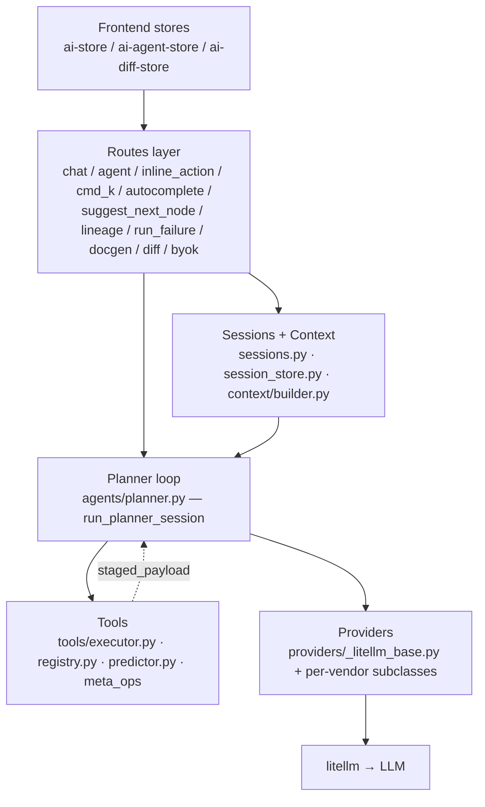

# AI Integration Architecture

This page is the developer's tour of the AI subsystem under `flowfile_core/flowfile_core/ai/` and `flowfile_frontend/src/renderer/app/features/ai/`. Read [AI Assistant](../ai/index.md) and [Provider Setup](../ai/providers.md) first if you need user-facing context.

The AI integration is organised in five layers: **routes** translate HTTP into Pydantic shapes, **sessions/context** hold per-run state and assemble prompts, the **planner** runs the agent loop, **tools** validate and stage graph edits, and **providers** abstract the LLM. A handful of cross-cutting modules — feature flag, prompt log, scheduler, audit, safety — wrap the whole thing.

---

## Module map

```
flowfile_core/flowfile_core/ai/
├── routes.py                     # Aggregates all sub-routers; flag gate
├── feature_flag.py               # FEATURE_FLAG_AI dependency
├── admin_routes.py               # POST /system/feature_flags/ai
│
├── chat_routes.py                # /ai/chat/stream + /ai/chat/preview
├── agent_routes.py               # /ai/agent/* (start/resume/followup/abort/state)
├── inline_action_routes.py       # /ai/inline_action
├── command_palette_routes.py     # /ai/command_palette
├── autocomplete_routes.py        # /ai/autocomplete/{formula,join_keys}
├── suggest_next_node_routes.py   # /ai/suggest_next_node
├── lineage_routes.py             # /ai/lineage_question
├── run_failure_routes.py         # /ai/explain_run_failure
├── docgen_routes.py              # /ai/generate_documentation
├── intent_router_routes.py       # /ai/route (chat ↔ agent classifier)
├── diff_routes.py                # /ai/diff/{stage,{id}/accept,{id}/reject}
├── byok_routes.py                # /ai/providers (CRUD + test)
│
├── sessions.py                   # AgentSession, snapshot, drift detection
├── session_store.py              # In-memory + disk-backed repos
├── byok.py                       # get_configured_provider, env fallback
├── credentials.py                # ProviderCredential CRUD, Fernet
├── intent_router.py              # Lightweight chat-vs-edit classifier
├── command_palette.py            # Cmd+K orchestration
├── autocomplete.py               # Formula / join-key suggestions
├── suggest_next_node.py          # Ghost-node suggestions
│
├── agents/
│   ├── planner.py                # run_planner_session — the agent loop
│   ├── copilot.py                # Chat surface helpers
│   ├── assist.py                 # Inline / cmd_k assist helpers
│   └── live_observation.py       # agent_live runtime feedback
│
├── context/
│   ├── builder.py                # render_prompt_context
│   ├── budget.py                 # Token-budget truncation
│   └── mentions.py               # @flow / @node:id parsing
│
├── tools/
│   ├── executor.py               # execute_tool_call dispatcher
│   ├── registry.py               # build_tool_catalog (per-surface narrowing)
│   ├── graph_ops.py              # add_*, connect, delete_*
│   ├── schema_ops.py              # update_column_*
│   ├── codegen_ops.py            # regenerate / refactor for code nodes
│   ├── meta_ops.py               # classify_intent, pick_*, fill_*, verify
│   ├── classification.py         # node-type classifier
│   ├── predictor.py              # Schema prediction (mirror + dry-run)
│   ├── dry_run.py                # Polars / Python dry-run cache
│   └── node_docs.py              # NODE_AGENT_PAYLOAD_EXAMPLES
│
├── providers/
│   ├── base.py                   # Provider Protocol, Message, ToolCall, ToolSpec
│   ├── _litellm_base.py          # LiteLLMProvider base
│   ├── registry.py               # PROVIDERS dict, provider_factory
│   ├── anthropic.py              # AnthropicProvider
│   ├── openai.py                 # OpenAIProvider
│   ├── google.py                 # GoogleProvider
│   ├── groq.py                   # GroqProvider
│   ├── openrouter.py             # OpenRouterProvider
│   └── ollama.py                 # OllamaProvider
│
├── prompts/                      # Markdown system prompts
│   ├── base.md, copilot.md, planner.md, assist.md
│   └── stage_{plan,classify,pick_type,pick_upstream,fill_settings,verify_completion}.md
│
├── diff.py                       # GraphDiff, bundle_staged_results, apply_diff
├── diff_store.py                 # Diff persistence
├── audit.py                      # AuditEvent + record_event
├── safety.py                     # PII regex scrub, samples prep
├── streaming.py                  # SSE wrapping for async generators
├── scheduler.py                  # Per-provider RPM/RPD scheduler
├── prompt_log.py                 # Daily JSONL prompt log
└── replay_buffer.py              # Per-session replay buffer
```

Frontend mirror:

```
flowfile_frontend/src/renderer/app/
├── api/ai.api.ts                              # Axios client for /ai/*
├── stores/
│   ├── ai-store.ts                            # Chat drawer + mode toggle
│   ├── ai-agent-store.ts                      # Agent session state + events
│   ├── ai-autocomplete-store.ts               # Formula/join suggestions
│   ├── ai-command-palette-store.ts            # Cmd+K state
│   ├── ai-diff-store.ts                       # Pending diffs
│   └── ai-ghost-node-store.ts                 # Ghost-node suggestions
├── features/ai/
│   ├── AiAssistant.vue                        # Drawer (chat + agent panel)
│   ├── AiAgentRun.vue / AiAgentEvent.vue
│   ├── AiCommandPalette.vue
│   ├── AiInlineActions.vue
│   ├── AiDiffPanel.vue / AiDiffPreview.vue
│   ├── AiGhostNode.vue
│   ├── AiMentionAutocomplete.vue / mentionVocabulary.ts
│   └── markdown.ts (+ test)
└── views/AiProvidersView/AiSettingsTab.vue    # BYOK panel
```

---

## Layer overview



The agent loop calls into both **tools** (to stage graph edits) and **providers** (to ask the LLM what to do next). Sessions and context are read by both routes (for setup) and the planner (during the loop).

---

## Feature flag

`flowfile_core/flowfile_core/ai/feature_flag.py` exposes:

- `is_ai_enabled() -> bool` — live read of `settings.FEATURE_FLAG_AI`, a `MutableBool` initialised from the `FEATURE_FLAG_AI` env var at process start (default `"1"` — **on**; set `FEATURE_FLAG_AI=false` to opt out).
- `require_ai_enabled()` — FastAPI dependency raising `HTTPException(503)` when the flag is off.

The dependency is wired once on the aggregate router:

```python
# flowfile_core/flowfile_core/ai/routes.py
router = APIRouter(dependencies=[Depends(require_ai_enabled)])
router.include_router(byok_router)
router.include_router(chat_router)
# ... all other AI sub-routers
```

So every AI endpoint inherits the gate without per-route boilerplate. The MutableBool can also be flipped at runtime via `POST /system/feature_flags/ai` (see `admin_routes.py`) without restarting the process — useful for incident response.

---

## Routes catalog

| Route | Method | Request | Response | Source |
|-------|--------|---------|----------|--------|
| `/ai/health` | GET | — | `{"status": "skeleton"}` | `routes.py` |
| `/ai/chat/stream` | POST | `ChatStreamRequest` | SSE text stream | `chat_routes.py` |
| `/ai/chat/preview` | POST | `ChatStreamRequest` | `ChatPreviewResponse` (no LLM call) | `chat_routes.py` |
| `/ai/agent/start` | POST | `AgentStartRequest` | SSE planner events | `agent_routes.py` |
| `/ai/agent/{session_id}/resume` | POST | `AgentResumeRequest` | SSE planner events | `agent_routes.py` |
| `/ai/agent/{session_id}/followup` | POST | `AgentFollowupRequest` | SSE planner events | `agent_routes.py` |
| `/ai/agent/{session_id}/abort` | POST | — | `AgentAbortResponse` | `agent_routes.py` |
| `/ai/agent/{session_id}` | GET | — | `AgentStateResponse` | `agent_routes.py` |
| `/ai/inline_action` | POST | `InlineActionRequest` | SSE text stream | `inline_action_routes.py` |
| `/ai/command_palette` | POST | `CommandPaletteRequest` | `CommandPaletteResponse` | `command_palette_routes.py` |
| `/ai/route` | POST | `RouteRequest` | `RouteResponse` | `intent_router_routes.py` |
| `/ai/autocomplete/formula` | POST | `FormulaAutocompleteRequest` | JSON | `autocomplete_routes.py` |
| `/ai/autocomplete/join_keys` | POST | `JoinKeyAutocompleteRequest` | JSON | `autocomplete_routes.py` |
| `/ai/suggest_next_node` | POST | `SuggestNextNodeRequest` | `NextNodeSuggestionsResponse` | `suggest_next_node_routes.py` |
| `/ai/lineage_question` | POST | `LineageQuestionRequest` | SSE text stream | `lineage_routes.py` |
| `/ai/explain_run_failure` | POST | `ExplainRunFailureRequest` | SSE text stream | `run_failure_routes.py` |
| `/ai/generate_documentation` | POST | `GenerateDocumentationRequest` | SSE markdown stream | `docgen_routes.py` |
| `/ai/diff/stage` | POST | `StageDiffRequest` | `StageDiffResponse` | `diff_routes.py` |
| `/ai/diff/{id}/accept` | POST | `AcceptDiffRequest` | `AcceptDiffResponse` | `diff_routes.py` |
| `/ai/diff/{id}/reject` | POST | — | `RejectDiffResponse` | `diff_routes.py` |
| `/ai/providers` | GET | — | `list[ProviderListItem]` | `byok_routes.py` |
| `/ai/providers/{name}` | POST | `ProviderCredentialInput` | `ProviderCredentialPublic` | `byok_routes.py` |
| `/ai/providers/{name}` | DELETE | — | `204` | `byok_routes.py` |
| `/ai/providers/{name}/test` | POST | — | `ProviderTestResult` | `byok_routes.py` |
| `/system/feature_flags/ai` | POST/GET | `FeatureFlagState` | `FeatureFlagState` | `admin_routes.py` |

Streaming endpoints emit Server-Sent Events with a 15-second keepalive frame so the connection survives long thinking. See `streaming.py`.

---

## Provider abstraction

The `Provider` Protocol lives in `providers/base.py`:

```python
class Provider(Protocol):
    name: ClassVar[str]
    default_model: ClassVar[str]
    supports_tools: ClassVar[bool]
    supports_streaming: ClassVar[bool]
    surface_models: ClassVar[dict[str, str]]

    async def chat(
        self,
        *,
        messages: list[Message],
        tools: list[ToolSpec] | None = None,
        max_tokens: int | None = None,
        ...
    ) -> ChatResponse: ...

    async def stream(
        self,
        *,
        messages: list[Message],
        tools: list[ToolSpec] | None = None,
        ...
    ) -> AsyncIterator[StreamChunk]: ...
```

`LiteLLMProvider` (in `_litellm_base.py`) is the concrete base. It builds a litellm-compatible kwargs dict, calls `litellm.acompletion` (lazily imported — the module deliberately keeps `litellm` out of the import graph until first use), and translates the response back into `ChatResponse` / `StreamChunk`. The base class is also where the [prompt log](#prompt-logging-debug) hooks in.

Per-vendor subclasses override class-level fields:

| Class | `name` | `model_prefix` | `default_model` | Notable surface defaults |
|-------|--------|----------------|-----------------|--------------------------|
| `AnthropicProvider` | `anthropic` | `anthropic/` | `claude-sonnet-4-6` | Haiku 4.5 for Cmd+K / ghost / autocomplete / agent_staged; Opus 4.7 for `agent_complex` |
| `OpenAIProvider` | `openai` | `""` | `gpt-4.1-mini` | `gpt-4.1` for `explain` / `agent_complex` / `docgen` / `lineage` |
| `GoogleProvider` | `google` | `gemini/` | `gemini-2.5-flash` | `gemini-2.5-pro` for `agent_complex` |
| `GroqProvider` | `groq` | `groq/` | `llama-3.3-70b-versatile` | One model across surfaces |
| `OpenRouterProvider` | `openrouter` | `openrouter/` | `anthropic/claude-sonnet-4.5` | `meta-llama/llama-3.3-70b-instruct` for `agent_staged` (free tier) |
| `OllamaProvider` | `ollama` | `ollama_chat/` | `llama3.1:8b` | `llama3.1:70b` for `agent_complex`. `default_api_base="http://localhost:11434"` |

`provider_factory(name, *, model, surface, api_key, api_base)` in `providers/registry.py` is the construction entry point. The `PROVIDERS` dict registers all six classes; `list_supported_providers()` returns the names in registration order.

---

## BYOK and model resolution

`flowfile_core/flowfile_core/ai/byok.py::get_configured_provider(db, user_id, provider, *, surface=None, model=None)` is the runtime entry point that downstream code calls when it needs a configured `Provider`. The resolution rules:

**Credential lookup.** `get_provider_credential(db, user_id, provider)` returns the (encrypted) credential row. If a row exists, the API key is decrypted via Fernet, `api_base` is read from the row, and `cred.default_model` is consulted.

**Model resolution order**:

1. Explicit `model=` argument (caller wins — e.g., per-request override from the chat drawer).
2. `cred.default_model` (user preference).
3. `cls.surface_models[surface]` **if it appears in the user's curated `cred.models` list**.
4. First entry of `cred.models` (curated list default).
5. `cls.surface_models[surface]` (class-level per-surface default).
6. `cls.default_model` (terminal fallback).

Steps 3 and 4 (added in workstream W29) make multi-model curation work for OpenRouter and similar providers — users can pin a list of free-tier models and still get sensible per-surface routing when one of those models matches the surface preference.

**Env-var fallback.** If no credential row exists, `provider_factory(name)` is called with no `api_key` / `api_base`; litellm picks up the standard env var (e.g., `ANTHROPIC_API_KEY`). `detect_env_fallback(provider)` exists separately so `GET /ai/providers` can show users the distinction between "configured via key" and "configured via env" in the UI.

**Failure mode.** `ProviderNotConfiguredError` is raised only when the provider is *completely* unset — no row, no env var, and not Ollama (which has a sensible `default_api_base`).

Credentials live in `flowfile_core.ai.credentials`. The DB row is keyed `(user_id, provider)`. The encrypted key is stored in the secrets table; the credential row carries `api_key_secret_id`. Deletion drops both atomically.

---

## Sessions and context

### `AgentSession`

Defined in `flowfile_core/flowfile_core/ai/sessions.py`. The shape (abridged):

```python
class AgentSession(BaseModel):
    session_id: str
    flow_id: int
    user_id: int
    surface: PlannerSurface  # "agent_complex" | "agent_staged" | "agent_live"
    status: SessionStatus    # "running" | "paused_drift" | "paused_user_action" |
                             # "awaiting_user_input" | "completed" | "aborted" | "failed"
    samples_mode: SamplesMode  # "off" | "regex"
    stage: PlannerStage       # "plan" | "classify" | "pick_type" | "pick_upstream" |
                              # "fill_settings" | "single_stage_op" | "verify_completion"
    picked_op_kind: PlannerOpKind | None  # "add" | "modify" | "delete" | "connect" |
                                          # "disconnect" | "other"
    picked_node_type: str | None
    messages: list[Message]            # full LLM conversation
    snapshot: GraphSnapshot            # graph state at start, for drift detection
    staged_results: list[ToolExecutionResult]
    diff_id: str | None
    step_count: int
    max_steps: int
    rationale: str | None
    pause_reason: str | None
    drift_detail: DriftDetail | None
```

Sessions are persisted via `session_store.py`. The default repo is in-memory; a disk-backed `DiskSessionRepository` writes JSON files under `base_directory/ai_sessions/` so a session survives a backend restart and the user can re-attach via `POST /ai/agent/{session_id}/resume`.

### Drift detection

`GraphSnapshot` captures the set of node ids and node types at session start. Before each tool dispatch, the planner re-snapshots the live graph and compares — if the id set changed (or a node type flipped) the session flips to `paused_drift`, emits a `drift_detected` event, and waits for the user to pick *Resume* or *Discard*. This is intentionally id-set-only — settings drift was deliberately removed because it produced too many false-positive pauses.

### Context assembly

`context/builder.py::render_prompt_context(flow, pinned_node_ids, surface, samples_mode)` produces:

- A **system prompt** assembled from `prompts/base.md` plus the surface-specific overlay (`prompts/copilot.md`, `prompts/planner.md`, `prompts/stage_*.md`).
- A **user message** containing a deterministic JSON-markdown rendering of the flow: every node's id, type, settings, predicted output schema, plus optional sample rows. The walk is BFS upstream from pinned nodes (or the whole flow when nothing is pinned), bounded by `context/budget.py`'s token budget.

`context/mentions.py` parses `@flow` and `@node:42` references in user messages; mentions become pin signals for the BFS.

---

## The planner state machine

`agents/planner.py::run_planner_session(session, flow, provider, max_tokens, max_retries) -> AsyncIterator[PlannerEvent]` is the agent loop. It's an async generator that yields one `PlannerEvent` per significant step.

### Event types

```python
PlannerEventName = Literal[
    "thinking",
    "tool_call_proposed",
    "tool_call_staged",
    "tool_call_warned",
    "tool_call_rejected",
    "tool_call_applied",
    "drift_detected",
    "paused",
    "retry",
    "abort",
    "complete",
    "awaiting_user_input",
    "stage_advanced",
    "error",
    "info",
]
```

`awaiting_user_input` is emitted *instead of* `complete` when the planner ends with no tool calls AND no staged results AND the last assistant message looks like a clarifying question. The frontend renders *"Agent waiting for your reply…"* instead of *"Finished — nothing to stage."*

### Three surfaces

The `surface` field on the start request picks the loop shape. Note: the **backend default** on `POST /ai/agent/start` is `"agent_staged"`, but the **frontend drawer default** (per-flow preference, persisted) is `"agent_live"` — that's the one most user sessions land on unless explicitly switched. A request with `surface="agent_complex"` against a `supports_tools=False` model returns `422` at validation.

**`agent_staged`.** The big idea: smaller models can't reliably function-call against a wide tool catalog. Solution: expose **one tool per LLM round** so each round is a tightly-scoped enum / shape decision. Mode is `"stage"` — proposals accumulate and are bundled into a `GraphDiff` for accept/reject. State machine:

```
plan ──▶ classify ─[op_kind=add]──▶ pick_type ──▶ pick_upstream ──▶ fill_settings ──▶ classify
                  ├─[modify/delete/connect/disconnect]──▶ single_stage_op ──▶ classify
                  └─[other]──▶ (terminate or → verify_completion if opted in)
```

- `plan` exposes `flowfile.meta.emit_plan` — the LLM outlines the full multi-step plan as a structured narrative. Skipped (`skip_plan=True`) when the session was promoted from chat (the chat-mode response already produced a plan-shaped narrative).
- `classify` exposes `flowfile.meta.classify_intent` and asks the LLM to pick a `PlannerOpKind` for the next step.
- `pick_type` exposes `flowfile.meta.pick_node_type` (add path only).
- `pick_upstream` exposes `flowfile.meta.pick_upstream` with the upstream id enum populated from `live_ids ∪ session.staged_node_ids`.
- `fill_settings` exposes the picked node type's `flowfile.graph.add_<type>` tool with planner-injected fields stripped from its parameter schema.
- `single_stage_op` (non-add path) exposes exactly one ops tool — `update_node_settings`, `delete_node`, `connect`, or `delete_connection`.
- `verify_completion` (opt-in via `verify_plan_completion=True`) runs one extra round at the end so the LLM can confirm `is_complete=true` against the chat-mode plan or send control back to `classify`.

**`agent_complex`.** Single-shot, full tool catalog in one call. Best for big models (Sonnet, Opus, GPT-4.1, Gemini Pro). The state machine field is unused; the planner runs each round as a free-form tool-using turn. Same `mode="stage"` and accept/reject GraphDiff flow as `agent_staged`. Higher rate-limit pressure, fewer round-trips.

**`agent_live`.** Same state machine as `agent_staged`, but `mode="apply"` — each tool call **mutates the live graph immediately**, the affected subgraph is run (Performance) or a sample is evaluated (Development), and the runtime observation is fed back as the next tool reply. On runtime failure the just-added node is auto-deleted and the LLM retries up to `max_retries_per_step`. **There is no bundled `staged_results` GraphDiff and no accept/reject step** — `applied_results` on the session is the record of truth, and the canvas itself is the running record. This is the variant the frontend drawer defaults to.

### Session lifecycle

Cold start: a `running` session with no live SSE stream is detected by `_looks_cold_started` and flipped to `paused_user_action`. The user re-attaches via `POST /ai/agent/{session_id}/resume?action=continue`. This avoids two SSE streams racing against the same session.

Followups: after `complete` or `awaiting_user_input`, the user can send another message via `POST /ai/agent/{session_id}/followup` with `action="user_message"`. Rejecting a staged diff fires the same endpoint with `action="rejected_diff"` and an optional rejection note that becomes context for the next round.

---

## Tool execution

`flowfile_core/flowfile_core/ai/tools/executor.py::execute_tool_call(tool_name, tool_args, mode, ...)` is the single entry point for every tool the LLM emits. It dispatches by the tool-name domain prefix:

| Domain | Operations | Handler |
|--------|------------|---------|
| `flowfile.graph.*` | `add_<node_type>`, `connect`, `delete_node`, `delete_connection`, `update_node_settings` | `graph_ops.py` |
| `flowfile.schema.*` | `update_column_name`, `update_column_type` | `schema_ops.py` |
| `flowfile.codegen.*` | `regenerate_polars_code`, `refactor_python_script` | `codegen_ops.py` |
| `flowfile.meta.*` | `classify_intent`, `emit_plan`, `pick_node_type`, `pick_upstream`, `fill_<node>_settings`, `verify_completion` | `meta_ops.py` |

`mode` is one of:

- **`stage`** (default for the agent). Validate the args via the Pydantic settings model, run schema prediction, build a `StagedToolEntry`, and **return** it without touching the live graph. The planner accumulates these into `session.staged_results` and bundles them into a `GraphDiff` at the end of the run.
- **`apply`**. Validate, then mutate the live graph immediately. Used by `agent_live` and by the Cmd+K palette / inline actions when the user accepts a staged diff.

The result shape is `ToolExecutionResult`:

```python
class ToolExecutionResult(BaseModel):
    status: Literal["staged", "applied", "rejected"]
    staged_node_payload: dict[str, Any] | None
    refusal_detail: str | None
    audit_id: str | None
    ...
```

### Schema prediction

`tools/predictor.py` predicts the output schema of an `add_<node>` *before* the node is added, so the planner can keep building on a node without committing first. Two strategies:

- **Mirror** for static / source / passthrough nodes — read settings, return the deterministic schema.
- **Kernel dry-run** for dynamic nodes (`polars_code`, `python_script`, `sql_query`) — execute the code in a sandboxed kernel, capture the output schema, cache the result by `(code_hash, input_schema_hash)` in `tools/dry_run.py`'s `DryRunCache`.

### Refusal paths

The executor rejects rather than passes through certain shapes:

- `polars_code` bodies containing `import` statements (security boundary — the kernel runtime is sandboxed but Flowfile-level bans are clearer).
- Node settings that fail Pydantic validation (with a fully-formed error message including the JSON path and an example payload pulled from `tools/node_docs.py::NODE_AGENT_PAYLOAD_EXAMPLES`).
- Sink nodes used as upstreams (`_detect_sink_upstreams` / `_format_sink_upstream_refusal`).

Refusals come back as `ToolExecutionResult(status="rejected", refusal_detail=...)`, which the planner echoes to the LLM as the next tool reply. The model can correct course and retry within `max_retries_per_step`.

### Tool catalog narrowing

`tools/registry.py::build_tool_catalog(*, surface=None)` returns the `list[ToolSpec]` to expose for the current surface. `agent_complex` gets the full catalog; `agent_staged` gets one or two tools depending on the current `PlannerStage`; `cmd_k` and inline surfaces get the single tool they need.

---

## GraphDiff and accept/reject

`diff.py::GraphDiff` is the unit of stageable change:

```python
class GraphDiff(BaseModel):
    diff_id: str
    flow_id: int
    operations: list[StagedToolEntry]   # tool_name + audit_id + staged_node_payload
    applied_results: list[AppliedNodeRecord] = []
    drifted_at: datetime | None = None
    ...
```

`bundle_staged_results(staged_results)` packs the planner's `session.staged_results` into a `GraphDiff` at session end. `apply_diff(flow, diff)` is the atomic apply — drift check first, then mutate, then create one undo point. Reject just discards the diff.

`diff_store.py` keeps a UUID-keyed dict of pending diffs, with optional disk persistence so restarts don't lose work.

`diff_routes.py` exposes:

- `POST /ai/diff/stage` — used by Cmd+K / inline surfaces to stage a non-agent diff.
- `POST /ai/diff/{diff_id}/accept` — drift-checks then applies.
- `POST /ai/diff/{diff_id}/reject` — discards. Body optionally includes a rejection note that the agent reads on its next round.

---

## Audit, safety, scheduler

**Audit** (`audit.py`). Every tool call records an `AuditEvent` (`session_id`, `user_id`, `tool_name`, `result_status`, `provider`, `model`, redacted args). Used for compliance, replay, and the per-session activity log in the UI.

**Safety** (`safety.py`). `scrub_value_regex(value)` runs a configurable set of regexes for common PII patterns (emails, credit cards, SSNs, etc.) and replaces matches with markers. Also exposes `prepare_samples(...)` which the agent uses when `samples_mode="regex"` to scrub sample rows before they're shown to the LLM.

**Scheduler** (`scheduler.py`). `RateLimitScheduler` enforces per-provider RPM/RPD via in-memory deques. Read from env: `FLOWFILE_AI_<PROVIDER>_RPM` / `FLOWFILE_AI_<PROVIDER>_RPD` (e.g., `FLOWFILE_AI_ANTHROPIC_RPM=30`). On 429 the scheduler honors `Retry-After` independently of the local caps. `with_provider_retry(provider, ...)` and `stream_with_provider_retry(provider, ...)` are the opt-in wrappers; `byok.get_configured_provider` is **not** auto-wrapped — callers compose explicitly. A `RateLimitHint` callback piped into the SSE stream surfaces *"rate-limited, retrying in Ns"* toasts to the UI.

---

## Prompt logging (debug)

`prompt_log.py` is the dev-mode "what did the model actually see?" hatch. Off by default in production.

**Enable** (env vars on the core process):

```bash
export FLOWFILE_AI_LOG_PROMPTS=true        # daily JSONL writes
export FLOWFILE_AI_LOG_PROMPTS_SCRUB=true  # optional: scrub PII in user/tool messages
```

Both flags are also `MutableBool`s and can be flipped at runtime via the settings module without restart.

**Log location**. `{base_directory}/ai_prompts/YYYY-MM-DD.jsonl` — one file per day, one line per LLM round-trip. `{base_directory}` is the same dir that owns `master_key.txt` / `temp/` / `system_logs/` (see `shared.storage_config.storage.base_directory`); on a local install this resolves to `~/.flowfile/`.

**One line per LLM call.** For streaming calls the wrapper accumulates content + tool-call deltas as the iterator yields and emits the entry at stream-end. If the stream errors mid-flight, the entry still lands with whatever was accumulated and `error` set.

**Truncation.** Entries past 256 KiB get older user/assistant message bodies replaced with `[...truncated, len=N chars]` markers, preserving the system prompt and the most recent 5 turns. Each line stays parseable by `jq`.

**Scrubbing.** When `FLOWFILE_AI_LOG_PROMPTS_SCRUB=true`, user/tool message bodies are run through `safety.scrub_value_regex` before write. System and assistant content are *not* scrubbed — those are exactly what you need to read to debug model behaviour.

**Failure isolation.** A logging error never crashes the LLM call; the wrapper swallows + warns on file-IO / serialisation failures.

**CLI**:

```bash
# tail the last 20 entries
python -m flowfile_core.ai.prompt_log tail 20

# grep for a substring across recent entries (optional surface filter)
python -m flowfile_core.ai.prompt_log grep "filter for Q4"
python -m flowfile_core.ai.prompt_log grep "agent_staged" agent_staged
```

The CLI emits one JSON object per line; pipe through `jq` for ergonomic filtering.

---

## Streaming

`streaming.py` exposes:

- `make_streaming_response(generator)` / `sse_stream(generator)` — wrap an async generator of strings or events as an SSE response.
- `planner_events_sse(events)` — same shape but specialised for `PlannerEvent`, including the `event:` SSE header per event type so frontend handlers can dispatch on `EventSource.addEventListener('tool_call_staged', ...)`.

A 15-second keepalive frame is emitted on every stream so connections survive long thinking.

---

## Intent router

`intent_router.py::classify_intent(message, *, provider, surface="intent_classifier", ...)` runs a small fast model (Haiku, Flash, 4.1-mini) and returns a discriminated decision:

```python
class RouteResponse(BaseModel):
    target: Literal["chat", "agent"]
    confidence: Literal["low", "medium", "high"]
    reason: str
```

The chat drawer's *Auto* mode hits `POST /ai/route` first, then dispatches to `/ai/chat/stream` or `/ai/agent/start` based on the result. Failure (timeout, parse error) defaults to `"chat"` — auto-promotion is a convenience, not a correctness requirement.

---

## Frontend integration

The frontend is Vue 3 + Pinia. The store / component split:

- **`stores/ai-store.ts`** — chat drawer state, mode toggle (Chat / Auto / Agent), in-flight stream handle, message history.
- **`stores/ai-agent-store.ts`** — agent session id, current `stage` / `picked_op_kind` / `picked_node_type`, event timeline, staged diff id. Also handles SSE subscription, including reconnect on cold-start.
- **`stores/ai-diff-store.ts`** — pending diffs by id, accept/reject actions.
- **`stores/ai-autocomplete-store.ts`** — formula / join-key suggestion cache with timeouts and degraded-flag handling.
- **`stores/ai-command-palette-store.ts`** — Cmd+K palette state.
- **`stores/ai-ghost-node-store.ts`** — edge-stub suggestion cache.

Components in `features/ai/`:

- `AiAssistant.vue` — the drawer (chat + agent).
- `AiAgentRun.vue` / `AiAgentEvent.vue` — agent panel and per-event renderers.
- `AiDiffPanel.vue` / `AiDiffPreview.vue` — diff review UI.
- `AiInlineActions.vue` — the ✨ menu on a node.
- `AiCommandPalette.vue` — Cmd+K.
- `AiGhostNode.vue` — edge-stub suggestions.
- `AiMentionAutocomplete.vue` (+ `mentionVocabulary.ts`) — `@flow` / `@node:id` completion.

The BYOK panel lives in `views/AiProvidersView/AiSettingsTab.vue` and talks to the BYOK routes through `api/ai.api.ts`.

---

## Adding a new surface

A typical recipe for a new AI feature:

1. Decide whether it's read-only (chat-shape) or mutating (agent-shape).
2. Pick a surface name (e.g. `my_new_feature`) and add a per-surface entry to each provider's `surface_models` dict in `providers/{anthropic,openai,...}.py`.
3. Add a system prompt under `flowfile_core/flowfile_core/ai/prompts/`. Reuse `base.md` as a foundation.
4. Add a route file `flowfile_core/flowfile_core/ai/my_feature_routes.py` with a Pydantic request model and a handler that:
    - Calls `byok.get_configured_provider(db, current_user.id, payload.provider, surface="my_new_feature", model=payload.model)`.
    - Calls `context.builder.render_prompt_context(...)` for the user message.
    - Either `await provider.chat(...)` for non-streaming, or `streaming.sse_stream(provider.stream(...))` for streaming.
    - For mutating features: build a tool catalog via `tools.registry.build_tool_catalog(surface="my_new_feature")`, dispatch tool calls through `tools.executor.execute_tool_call(..., mode="stage")`, accumulate into `staged_results`, bundle into a `GraphDiff` via `diff.bundle_staged_results(...)`, register with `diff_store`, and return the `diff_id` so the frontend can render an accept/reject UI.
5. Mount the new sub-router on `routes.py::router.include_router(my_feature_router)` — the `require_ai_enabled` dependency is inherited automatically.
6. Add the corresponding Pinia store and Vue components on the frontend.
7. Don't forget to update [AI Assistant overview](../ai/index.md) and [Provider Setup](../ai/providers.md) once the user-visible behaviour is finalised.

Existing surfaces are good templates — `chat_routes.py` for streaming chat, `command_palette_routes.py` for stage-and-return-diff, `agent_routes.py` for the full agent loop.
