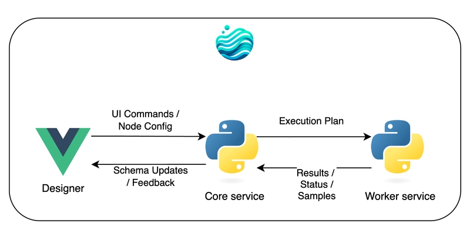
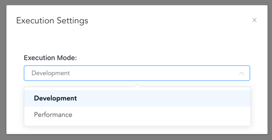

# Technical Architecture

Flowfile's architecture integrates visual design with high-performance data processing through three interconnected services and utilizes Polars' lazy evaluation. This design provides real-time feedback, processes large datasets efficiently, and maintains UI responsiveness during intensive computations. On this page, the three-service architecture, key technical features such as real-time schema prediction and efficient data exchange, and the role of Polars' lazy evaluation are explained.



## Core Components

### Three-Service Architecture

**Designer (Electron + Vue)** The visual interface where data pipelines are build through drag-and-drop operations. It communicates with the Core service to provide real-time feedback and displays data previews.

**Core Service (FastAPI)** The orchestration engine that manages workflows, predicts schemas, and coordinates execution. It maintains the Directed Acyclic Graph (DAG) structure and handles all UI interactions and overall flow logic.

**Worker Service (FastAPI)** Handles heavy data computations in isolated processes. It executes Polars transformations, materializes data, and manages data caching using Apache Arrow IPC format, preventing large datasets from overwhelming the Core service.

## Key Technical Features

### Real-time Schema Prediction

When you add or configure a node, Flowfile immediately shows how your data structure will change — **without executing any transformations**. This continuous feedback significantly reduces user errors and increases predictability. This happens through:

-   **Schema Callbacks**: Custom functions, defined per node type, that calculate output schemas based on node settings and input schemas.
-   **Lazy Evaluation**: Leveraging Polars' ability to determine the schema of a planned transformation (`LazyFrame`) without processing the full dataset.

<details markdown="1">
<summary>View Schema Prediction Python Example</summary>

```python
# Example: Schema prediction for a Group By operation
def schema_callback():
    output_columns = [(c.old_name, c.new_name, c.output_type) for c in group_by_settings.groupby_input.agg_cols]
    depends_on = node.node_inputs.main_inputs[0]
    input_schema_dict: Dict[str, str] = {s.name: s.data_type for s in depends_on.schema}
    output_schema = []
    for old_name, new_name, data_type in output_columns:
        data_type = input_schema_dict[old_name] if data_type is None else data_type
        output_schema.append(FlowfileColumn.from_input(data_type=data_type, column_name=new_name))
    return output_schema
```

</details>

### The Directed Acyclic Graph (DAG): The Foundation of Workflows

As you add and connect nodes, Flowfile builds a Directed Acyclic Graph (DAG) where:

* **Nodes** represent data operations (read file, filter, join, write to database, etc.).
* **Edges** represent the flow of data between operations.

The DAG is managed by the `EtlGraph` class in the Core service, which orchestrates the entire workflow:

<details markdown="1">
<summary>View EtlGraph Python Implementation</summary>

```python
class EtlGraph:
    """
    Manages the ETL workflow as a DAG. Stores nodes, dependencies,
    and settings, and handles the execution order.
    """
    uuid: str
    _node_db: Dict[Union[str, int], NodeStep]  # Internal storage for all node steps
    _flow_starts: List[NodeStep]               # Nodes that initiate data flow (e.g., readers)
    _node_ids: List[Union[str, int]]           # Tracking node identifiers
    flow_settings: schemas.FlowSettings        # Global configuration for the flow

    def add_node_step(self, node_id: Union[int, str], function: Callable,
                      node_type: str, **kwargs) -> None:
        """Adds a new processing node (NodeStep) to the graph."""
        node_step = NodeStep(node_id=node_id, function=function, node_type=node_type, **kwargs)
        self._node_db[node_id] = node_step
        # Additional logic to manage dependencies and flow starts...

    def run_graph(self) -> RunInformation:
        """Executes the entire flow in the correct topological order."""
        execution_order = self.topological_sort() # Determine correct sequence
        run_info = RunInformation()
        for node in execution_order:
            # Execute node based on mode (Development/Performance)
            node_results = node.execute_node() # Simplified representation
            run_info.add_result(node.node_id, node_results)
        return run_info

    def topological_sort(self) -> List[NodeStep]:
        """Determines the correct order to execute nodes based on dependencies."""
        # Standard DAG topological sort algorithm...
        pass
```
</details>

Each `NodeStep` in the graph encapsulates information about its dependencies, transformation logic, and output schema. This structure allows Flowfile to determine execution order, track data lineage, optimize performance, and provide schema predictions throughout the pipeline.

### Execution Modes

By clicking on settings &rarr; execution modes you can set how the flow will be executed the next time you run the flow.



Flowfile offers two execution modes tailored for different needs:

| Feature           | Development Mode                     | Performance Mode                                 |
| :---------------- | :----------------------------------- | :----------------------------------------------- |
| **Purpose** | Interactive debugging, step inspection | Optimized execution for production/speed         |
| **Execution** | Executes node-by-node                | Builds full plan, executes minimally             |
| **Data Caching** | Caches intermediate results per step | Minimal caching (only if specified/needed)       |
| **Preview Data** | Available for all nodes              | Only for final/cached nodes                      |
| **Memory Usage** | Potentially higher                   | Generally lower                                  |
| **Speed** | Moderate                             | Faster for complex flows                         |

**Development Mode**
In Development mode, each node's transformation is triggered sequentially within the Worker service. Its intermediate result is typically serialized using **Apache Arrow IPC format** and cached to disk. This allows you to inspect the data at each step in the Designer via small samples fetched from the cache.

**Performance Mode**
In Performance mode, Flowfile fully embraces Polars' lazy evaluation. The Core service constructs the *entire* Polars execution plan based on the DAG. This plan (`LazyFrame`) is passed to the Worker service. The Worker only *materializes* (executes `.collect()` or `.sink_*()`) the plan when an output node (like writing to a file) requires the final result, or if a node is explicitly configured to cache its results (`node.cache_results`). This minimizes computation and memory usage by avoiding unnecessary intermediate materializations.

<details markdown="1">
<summary>View Performance Mode Python Example</summary>

```python
# Execution logic in Performance Mode (simplified)
def execute_performance_mode(self, node: NodeStep, is_output_node: bool):
    """Handles execution in performance mode, leveraging lazy evaluation."""
    if is_output_node or node.cache_results:
        # If result is needed (output or caching), trigger execution in Worker
        external_df_fetcher = ExternalDfFetcher(
            lf=node.get_resulting_data().data_frame, # Pass the LazyFrame plan
            file_ref=node.hash, # Unique reference for caching
            wait_on_completion=False # Usually async
        )
        # Worker executes .collect() or .sink_*() and caches if needed
        result = external_df_fetcher.get_result() # May return LazyFrame or trigger compute
        return result # Or potentially just confirmation if sinking
    else:
        # If not output/cached, just pass the LazyFrame plan along
        # No computation happens here for intermediate nodes
        return node.get_resulting_data().data_frame
```

</details>

Crucially, **all actual data processing and materialization of Polars DataFrames/LazyFrames happens in the Worker service**. This separation prevents large datasets from overwhelming the Core service, ensuring the UI remains responsive.

### Efficient Data Exchange

Flowfile uses Apache Arrow IPC format for efficient inter-process communication between the Core and Worker services:

1.  **Worker Processing & Serialization**: When the Worker needs to materialize data (either for intermediate caching in Development mode or final results), it computes the Polars DataFrame. The resulting DataFrame is serialized into the efficient Arrow IPC binary format.
2.  **Disk Caching**: This serialized data is saved to a temporary file on disk. This file acts as a cache, identified by a unique hash (`file_ref`). The Worker informs the Core that the result is ready at this `file_ref`.
3.  **Core Fetching**: If the Core (or subsequently, another Worker task) needs this data, it uses the `file_ref` to access the cached Arrow file directly. This avoids sending large datasets over network sockets between processes.
4.  **UI Sampling**: For UI previews, the Core requests a small sample (e.g., the first 100 rows) from the Worker. The Worker reads just the sample from the Arrow IPC file and sends only that lightweight data back to the Core, which forwards it to the Designer.

This ensures responsiveness, memory isolation, and efficiency.

Here’s how the Core might offload computation to the Worker, and how the Worker manages the separate process execution:

<details markdown="1">
<summary>View Core-Side Python Example</summary>

```python
# Core side - Initiating remote execution in the Worker (simplified)
def execute_remote(self, performance_mode: bool = False) -> None:
    """Offloads the execution of a node's LazyFrame to the Worker service."""
    # Create a fetcher instance to manage communication with the Worker
    external_df_fetcher = ExternalDfFetcher(
        lf=self.get_resulting_data().data_frame, # The Polars LazyFrame plan
        file_ref=self.hash,                      # Unique identifier for the result/cache
        wait_on_completion=False,                # Operate asynchronously
    )

    # Store the fetcher to potentially retrieve results later
    self._fetch_cached_df = external_df_fetcher

    # Request the Worker to start processing (this returns quickly)
    # The actual computation happens asynchronously in the Worker
    external_df_fetcher.start_processing_in_worker() # Hypothetical method name

    # For UI updates, request a sample separately
    self.store_example_data_generator(external_df_fetcher) # Fetches sample async
```
</details>

<details markdown="1">
<summary>View Worker-Side Python Example</summary>

```python
# Worker side - Managing computation in a separate process (simplified)
def start_process(
    polars_serializable_object: bytes, # Serialized LazyFrame plan
    task_id: str,
    file_ref: str, # Path for cached output (Arrow IPC file)
    # ... other args like operation type
) -> None:
    """Launches a separate OS process to handle the heavy computation."""
    # Use multiprocessing context for safety
    mp_context = multiprocessing.get_context('spawn') # or 'fork' depending on OS/needs

    # Shared memory/queue for progress tracking and results/errors
    progress = mp_context.Value('i', 0) # Shared integer for progress %
    error_message = mp_context.Array('c', 1024) # Shared buffer for error messages
    queue = mp_context.Queue(maxsize=1) # For potentially passing back results (or file ref)

    # Define the target function and arguments for the new process
    process = mp_context.Process(
        target=process_task, # The function that runs Polars .collect()/.sink()
        kwargs={
            'polars_serializable_object': polars_serializable_object,
            'progress': progress,
            'error_message': error_message,
            'queue': queue,
            'file_path': file_ref, # Where to save the Arrow IPC output
            # ... other necessary kwargs
        }
    )
    process.start() # Launch the independent process

    # Monitor the task (e.g., update status in a database, check progress)
    handle_task(task_id, process, progress, error_message, queue)
```
</details>

## The Power of Lazy Evaluation

By building on Polars' lazy evaluation, Flowfile achieves:

-   **Memory Efficiency**: Data is loaded and processed only when necessary, often streaming through operations without loading entire datasets into memory at once. This allows processing datasets larger than RAM.
-   **Query Optimization**: Polars analyzes the entire execution plan and can reorder, combine, or eliminate operations for maximum efficiency.
-   **Parallel Execution**: Polars automatically parallelizes operations across all available CPU cores during execution.
-   **Predicate Pushdown**: Filters and selections are applied as early as possible in the plan, often directly at the data source level (like during file reading), minimizing the amount of data that needs to be processed downstream.

## Summary

This design enables Flowfile to:

-   Provide instant feedback without processing data.
-   Handle datasets of any size efficiently.
-   Keep the UI responsive during heavy computations.
-   Scale from simple transformations to complex ETL pipelines.

---

*For a deep dive into the implementation details, see the [full technical article](https://dev.to/edwardvaneechoud/building-flowfile-architecting-a-visual-etl-tool-with-polars-576c).*