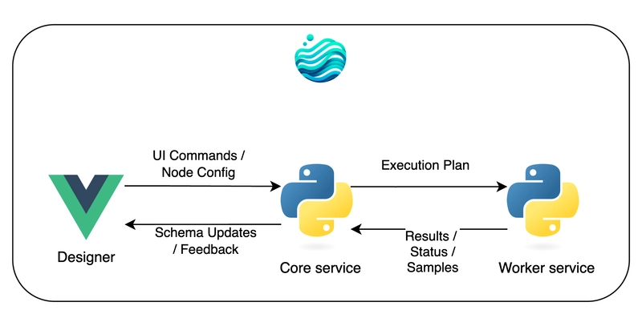
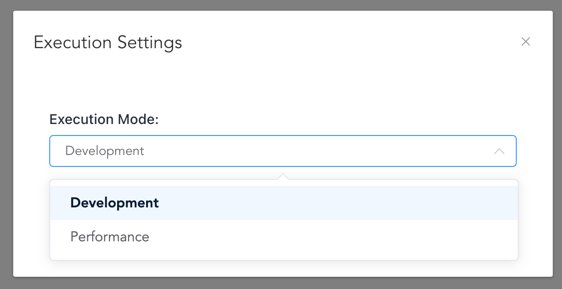

# Technical Architecture

Flowfile's architecture pairs visual design with data processing across three services, built on Polars' lazy evaluation. This page explains the three-service architecture, key technical features such as real-time schema prediction and efficient data exchange, and the role of Polars' lazy evaluation.

## Process & execution map

Flowfile runs as several cooperating processes. The Frontend talks only to Core; Core orchestrates everything else and never materializes full datasets itself — heavy compute is offloaded. The diagram shows every process and how the five kinds of execution flow through them.

![Process and execution map: the Frontend talks only to the Core process (FastAPI :63578), which houses the Core API, SqlService, Kernel Manager, and the embedded Scheduler loop. Five execution paths fan out — ① run a flow (Core serializes LazyFrames and POSTs to the Worker, which returns Arrow-IPC file paths), ② execute SQL on the Worker, ③ run notebook cells (Python in a kernel container, SQL on the Worker), ④ scheduled runs (the Scheduler polls the SQLite catalog DB for due triggers and spawns a detached headless subprocess), and ⑤ serving a published flow as an API endpoint (a GET /api/data/{slug} with an API key runs it and returns JSON). Datasets persist to Delta tables (local or S3); metadata to the SQLite catalog DB.](../assets/images/architecture/process-map.svg)

The five execution paths:

1. **Run flow / execute graph** — Core builds the LazyFrames, serializes them, and POSTs to the **Worker**, which holds dataset memory in spawned subprocesses and returns Arrow-IPC paths. Core ships paths, never collected frames.
2. **Execute SQL** (SQL editor and catalog SQL) — Core's `SqlService` registers the catalog tables and runs the query on the **Worker**.
3. **Execute a notebook** — Python cells run in the bound **kernel container** (which writes results to Delta and POSTs metadata back to Core); SQL cells take path ②; Markdown renders client-side.
4. **Scheduled run** — the embedded **scheduler** loop (only when `FLOWFILE_SCHEDULER_ENABLED`) polls the catalog DB for due triggers and launches a detached **headless subprocess** that runs the flow locally.
5. **Serve a flow as an API** — a registered flow is *published* under `/flow-api` (JWT-managed); the public, API-key-authenticated `GET /api/data/{slug}` then runs it synchronously and returns the output of its single `api_response` node as JSON. One key can call several published flows (`routes/flow_api.py`, `routes/api_consumers.py`).

The **scheduler is not a separate service** — it's a loop inside the Core process. The separate OS processes are the Frontend, Core, Worker (plus its compute children), the kernel containers, and each spawned headless run.

## Core Components

### Three-Service Architecture



**Designer (Tauri + Vue)** The visual interface where data pipelines are built through drag-and-drop operations. It is a Tauri 2 desktop shell (Rust) wrapping a Vue 3 renderer, and the same renderer serves the web build. It communicates with the Core service for real-time feedback and data previews.

**Core Service (FastAPI)** The orchestration engine that manages workflows, predicts schemas, and coordinates execution. It maintains the Directed Acyclic Graph (DAG) structure and handles all UI interactions and overall flow logic.

**Worker Service (FastAPI)** Handles heavy data computations in isolated processes. It executes Polars transformations, materializes data, and manages data caching using Apache Arrow IPC format, preventing large datasets from overwhelming the Core service.

## Key Technical Features

### Real-time Schema Prediction

When you add or configure a node, Flowfile immediately shows how your data structure will change — **without executing any transformations**. This happens through:

-   **Schema Callbacks**: Custom functions, defined per node type, that calculate output schemas based on node settings and input schemas.
-   **Lazy Evaluation**: Leveraging Polars' ability to determine the schema of a planned transformation (`LazyFrame`) without processing the full dataset.

<details markdown="1">
<summary>View Schema Prediction Python Example</summary>

```python
# Example: Schema prediction for a Group By operation
def schema_callback():
    output_columns = [(c.old_name, c.new_name, c.output_type) for c in group_by_settings.groupby_input.agg_cols]
    depends_on = node.node_inputs.main_inputs[0]
    input_schema_dict: Dict[str, str] = {s.name: s.data_type for s in depends_on.schema}
    output_schema = []
    for old_name, new_name, data_type in output_columns:
        data_type = input_schema_dict[old_name] if data_type is None else data_type
        output_schema.append(FlowfileColumn.from_input(data_type=data_type, column_name=new_name))
    return output_schema
```

</details>

### The Directed Acyclic Graph (DAG): The Foundation of Workflows

As you add and connect nodes, Flowfile builds a Directed Acyclic Graph (DAG) where:

* **Nodes** represent data operations (read file, filter, join, write to database, etc.).
* **Edges** represent the flow of data between operations.

The DAG is managed by the `FlowGraph` class (`flowfile_core/flowfile_core/flowfile/flow_graph.py`) in the Core service, which orchestrates the entire workflow. The class shape below is illustrative — see the [Python API Reference](python-api-reference.md#flowgraph) for the real signatures.

<details markdown="1">
<summary>View FlowGraph shape (illustrative)</summary>

```python
class FlowGraph:
    """
    Manages the ETL workflow as a DAG. Stores nodes, dependencies,
    and settings, and handles the execution order.
    """
    uuid: str
    _node_db: Dict[Union[str, int], FlowNode]  # Internal storage for all nodes
    _flow_starts: List[FlowNode]               # Nodes that initiate data flow (e.g., readers)
    _node_ids: List[Union[str, int]]           # Tracking node identifiers
    flow_settings: schemas.FlowSettings        # Global configuration for the flow

    def add_node_step(self, node_id: Union[int, str], function: Callable,
                      node_type: str, **kwargs) -> None:
        """Adds a new FlowNode to the graph."""
        ...

    def run_graph(self) -> RunInformation:
        """Executes the flow in the correct topological order."""
        ...
```
</details>

Each `FlowNode` in the graph encapsulates its dependencies, transformation logic, and output schema. This lets Flowfile determine execution order, track data lineage, optimize performance, and predict schemas throughout the pipeline.

### Execution Modes

!!! info "Canonical explanation"
    This is the reference description of Development vs Performance mode. The [Core Developer Guide](flowfile-core.md#execution-strategy-how-nodes-decide-where-to-run) and [Design Philosophy](design-philosophy.md) pages link here rather than repeat it.

By clicking on settings &rarr; execution modes you can set how the flow will be executed the next time you run the flow.



Flowfile offers two execution modes tailored for different needs:

| Feature           | Development Mode                     | Performance Mode                                 |
| :---------------- | :----------------------------------- | :----------------------------------------------- |
| **Purpose** | Interactive debugging, step inspection | Optimized execution for production/speed         |
| **Execution** | Executes node-by-node                | Builds full plan, executes minimally             |
| **Data Caching** | Caches intermediate results per step | Minimal caching (only if specified/needed)       |
| **Preview Data** | Available for all nodes              | Only for final/cached nodes                      |
| **Memory Usage** | Potentially higher                   | Generally lower                                  |
| **Speed** | Moderate                             | Faster for complex flows                         |

**Development Mode**
In Development mode, each node's transformation is triggered sequentially within the Worker service. Its intermediate result is typically serialized using **Apache Arrow IPC format** and cached to disk. This allows you to inspect the data at each step in the Designer via small samples fetched from the cache.

**Performance Mode**
In Performance mode, Flowfile fully embraces Polars' lazy evaluation. The Core service constructs the *entire* Polars execution plan based on the DAG, and an ordinary transform node does nothing more than extend that plan — it is neither materialized nor sent to the Worker. Materialization happens in exactly two places:

- **Output nodes** (writing to a file, an API response, a subflow) materialize **in Core**, not on the Worker. Sinks have nothing to offload, so `_do_execute_remote` short-circuits them before the offload path.
- **Nodes with `cache_results` enabled** are the one case that still offloads: caching requires a real result, so the executor drops those nodes out of performance mode for the duration of their run and sends them to the Worker.

This minimizes computation and memory usage by avoiding unnecessary intermediate materializations.

<details markdown="1">
<summary>View Performance Mode Python Example (simplified)</summary>

```python
# Execution logic in Performance Mode (simplified)
def execute_performance_mode(self, node: FlowNode, is_output_node: bool):
    """Handles execution in performance mode, leveraging lazy evaluation."""
    if is_output_node:
        # Sinks have nothing to offload: the write itself is the materialization,
        # so an output node collects in Core and never reaches the Worker.
        return node.get_resulting_data()
    if node.cache_results:
        # Caching needs a real result, so these nodes drop out of performance
        # mode and offload. Offload happens inside ExternalDfFetcher.__init__ —
        # constructing it serializes the LazyFrame and POSTs it to the worker.
        # flow_id and node_id are required.
        fetcher = ExternalDfFetcher(
            flow_id=node.flow_id,
            node_id=node.node_id,
            lf=node.get_resulting_data().data_frame,  # the LazyFrame plan
            file_ref=node.hash,                        # unique reference for caching
            wait_on_completion=False,                  # usually async
        )
        result = fetcher.get_result()  # Worker runs .collect()/.sink_*() and caches
        return result
    else:
        # Intermediate nodes just pass the LazyFrame plan along — no compute here.
        return node.get_resulting_data().data_frame
```

</details>

Crucially, **bulk data processing and materialization of Polars DataFrames/LazyFrames happens in the Worker service** — Core builds plans and ships paths and JSON, never intermediate frames. (The exception is a sink, which collects in Core because writing *is* the materialization.) This separation prevents large datasets from overwhelming the Core service, ensuring the UI remains responsive.

### Efficient Data Exchange

Flowfile uses Apache Arrow IPC format for efficient inter-process communication between the Core and Worker services:

1.  **Worker Processing & Serialization**: When the Worker needs to materialize data (either for intermediate caching in Development mode or final results), it computes the Polars DataFrame. The resulting DataFrame is serialized into the efficient Arrow IPC binary format.
2.  **Disk Caching**: This serialized data is saved to a temporary file on disk. This file acts as a cache, identified by a unique hash (`file_ref`). The Worker informs the Core that the result is ready at this `file_ref`.
3.  **Core Fetching**: If the Core (or subsequently, another Worker task) needs this data, it uses the `file_ref` to access the cached Arrow file directly. This avoids sending large datasets over network sockets between processes.
4.  **UI Sampling**: For UI previews, the Core requests a small sample (e.g., the first 100 rows) from the Worker. The Worker reads just the sample from the Arrow IPC file and sends only that lightweight data back to the Core, which forwards it to the Designer.

This ensures responsiveness, memory isolation, and efficiency.

Here is how the Core offloads computation to the Worker, and how the Worker manages the separate process execution:

<details markdown="1">
<summary>View Core-Side Python Example (simplified)</summary>

```python
# Core side - Initiating remote execution in the Worker (simplified)
def execute_remote(self, performance_mode: bool = False) -> None:
    """Offloads the execution of a node's LazyFrame to the Worker service."""
    # Constructing ExternalDfFetcher IS the offload: __init__ serializes the
    # LazyFrame and sends it to the worker (no separate "start" call). The
    # constructor requires flow_id and node_id.
    fetcher = ExternalDfFetcher(
        flow_id=self.flow_id,
        node_id=self.node_id,
        lf=self.get_resulting_data().data_frame,  # the Polars LazyFrame plan
        file_ref=self.hash,                        # unique identifier for result/cache
        wait_on_completion=False,                  # operate asynchronously
    )

    # Store the fetcher to retrieve results later
    self._fetch_cached_df = fetcher

    # For UI updates, request a sample separately
    self.store_example_data_generator(fetcher)  # fetches sample async
```
</details>

<details markdown="1">
<summary>View Worker-Side Python Example (simplified)</summary>

```python
# Worker side - Managing computation in a separate process (simplified)
def start_process(
    polars_serializable_object: bytes, # Serialized LazyFrame plan
    task_id: str,
    file_ref: str, # Path for cached output (Arrow IPC file)
    # ... other args like operation type
) -> None:
    """Launches a separate OS process to handle the heavy computation."""
    # The worker forces spawn at module load (set_start_method('spawn',
    # force=True) in flowfile_worker/__init__.py) so every child is a fresh,
    # killable process regardless of platform — never fork.
    mp_context = get_context('spawn')

    # Shared memory/queue for progress tracking and results/errors
    progress = mp_context.Value('i', 0) # Shared integer for progress %
    error_message = mp_context.Array('c', 1024) # Shared buffer for error messages
    queue = mp_context.Queue(maxsize=1) # For potentially passing back results (or file ref)

    # Define the target function and arguments for the new process
    process = mp_context.Process(
        target=process_task, # The function that runs Polars .collect()/.sink()
        kwargs={
            'polars_serializable_object': polars_serializable_object,
            'progress': progress,
            'error_message': error_message,
            'queue': queue,
            'file_path': file_ref, # Where to save the Arrow IPC output
            # ... other necessary kwargs
        }
    )
    process.start() # Launch the independent process

    # Monitor the task (e.g., update status in a database, check progress)
    handle_task(task_id, process, progress, error_message, queue)
```
</details>

## Lazy Evaluation

By building on Polars' lazy evaluation, Flowfile achieves:

-   **Memory Efficiency**: Data is loaded and processed only when necessary, often streaming through operations without loading entire datasets into memory at once. This allows processing datasets larger than RAM.
-   **Query Optimization**: Polars analyzes the entire execution plan and can reorder, combine, or eliminate operations for maximum efficiency.
-   **Parallel Execution**: Polars automatically parallelizes operations across all available CPU cores during execution.
-   **Predicate Pushdown**: Filters and selections are applied as early as possible in the plan, often directly at the data source level (like during file reading), minimizing the amount of data that needs to be processed downstream.

---

*Background reading: the original [design article](https://dev.to/edwardvaneechoud/building-flowfile-architecting-a-visual-etl-tool-with-polars-576c) covers the motivation and early design. It predates some renames (the graph class is now `FlowGraph`, nodes are `FlowNode`), so treat class names there as historical.*