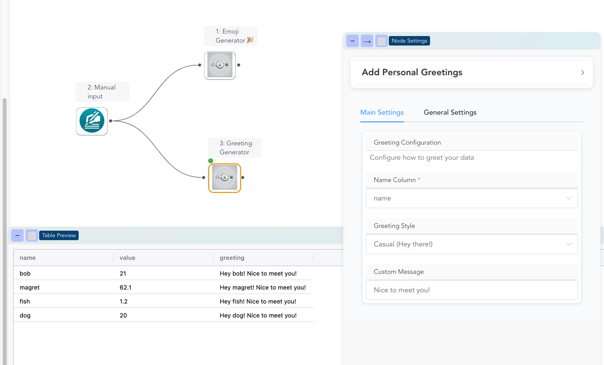

# Creating Custom Nodes

Build your own data transformation nodes with custom UI components and processing logic.

!!! warning "Beta Feature"
    Custom nodes are currently in beta. Some features like changing the icon are still in development.

## What Are Custom Nodes?

Custom nodes let you extend Flowfile with your own data transformations that appear as native nodes in the visual editor. Each custom node includes:

- **Custom UI** - Automatically generated settings panels with dropdowns, inputs, and toggles
- **Data Processing** - Polars-based transformation logic
- **Visual Integration** - Appears seamlessly in the node palette

## Quick Start

### 1. Create Your First Node

Create a new Python file in your custom nodes directory:

```bash
~/.flowfile/user_defined_nodes/my_first_node.py
```

!!! info "Custom Node Location"
    The `~/.flowfile/user_defined_nodes/` directory is automatically created when you first run Flowfile. Place all your custom nodes here.

Here's a simple example that adds a greeting column:

```python
import polars as pl
from flowfile_core.flowfile.node_designer import (
    CustomNodeBase,
    Section,
    NodeSettings,
    TextInput,
    SingleSelect,
    ColumnSelector,
    Types
)

class GreetingSettings(NodeSettings):
    main_config: Section = Section(
        title="Greeting Configuration",
        description="Configure how to greet your data",
        name_column=ColumnSelector(
            label="Name Column",
            data_types=Types.String,
            required=True
        ),
        greeting_style=SingleSelect(
            label="Greeting Style",
            options=[
                ("formal", "Formal (Hello, Mr/Ms)"),
                ("casual", "Casual (Hey there!)"),
                ("enthusiastic", "Enthusiastic (OMG HI!!!)"),
            ],
            default="casual"
        ),
        custom_message=TextInput(
            label="Custom Message",
            default="Nice to meet you!",
            placeholder="Enter your custom greeting..."
        )
    )

class GreetingNode(CustomNodeBase):
    node_name: str = "Greeting Generator"
    node_category: str = "Text Processing"
    title: str = "Add Personal Greetings"
    intro: str = "Transform names into personalized greetings"
    
    settings_schema: GreetingSettings = GreetingSettings()

    def process(self, input_df: pl.LazyFrame) -> pl.LazyFrame:
        # Get values from the UI
        name_col = self.settings_schema.main_config.name_column.value
        style = self.settings_schema.main_config.greeting_style.value
        custom = self.settings_schema.main_config.custom_message.value
        
        # Define greeting logic
        if style == "formal":
            greeting_expr = pl.concat_str([
                pl.lit("Hello, "), 
                pl.col(name_col), 
                pl.lit(f". {custom}")
            ])
        elif style == "casual":
            greeting_expr = pl.concat_str([
                pl.lit("Hey "), 
                pl.col(name_col), 
                pl.lit(f"! {custom}")
            ])
        else:  # enthusiastic
            greeting_expr = pl.concat_str([
                pl.lit("OMG HI "), 
                pl.col(name_col).str.to_uppercase(), 
                pl.lit(f"!!! {custom} 🎉")
            ])
        
        return input_df.with_columns([
            greeting_expr.alias("greeting")
        ])
```


### 2. Use Your Node

1. **Restart Flowfile** to load your new node
2. **Open the visual editor**
3. **Find your node** in the "Text Processing" category
4. **Drag it** onto the canvas
5. **Configure the settings** in the right panel
6. **Run your flow** and see the results!

<details markdown="1">
<summary style="cursor: pointer; font-size: clamp(0.9rem, 2vw, 1rem);"> Visual overview of the result! </summary>




</details>

## Understanding the Architecture

### Node Structure

Every custom node has three main parts:

```python
class MyCustomNode(CustomNodeBase):
    # 1. Metadata - How the node appears in Flowfile
    node_name: str = "My Amazing Node"
    node_category: str = "Data Enhancement"
    title: str = "Add Personal Greetings"
    intro: str = "Transform names into personalized greetings"

    # 2. Settings Schema - The UI configuration
    settings_schema: MySettings = MySettings()
    
    # 3. Processing Logic - What the node actually does
    def process(self, input_df: pl.LazyFrame) -> pl.LazyFrame:
        # Your transformation logic here
        return modified_df
```

#### 3. Process

!! Warning "Only one input supported for now"
    Currently, custom nodes only support a single input DataFrame. Support for multiple inputs is planned for future releases.


The process method is the engine of your node. This is where you write your Polars code to transform the data.

- Input: The method receives the incoming data as a Polars LazyFrame. If your node has multiple inputs, they will be passed as separate arguments (e.g., process(self, df1)).

- Accessing Settings: Inside this method, you can get the current values from your UI components using self.settings_schema.<section_name>.<component_name>.value.

- Output: The method must return a single Polars LazyFrame, which becomes the output of your node.


### Settings Architecture

Settings are organized in sections for clean UI organization:

```python
class MyNodeSettings(NodeSettings):
    # Each section becomes a collapsible panel in the UI
    basic_config: Section = Section(
        title="Basic Settings",
        description="Core functionality options",
        # Components go here as keyword arguments
        input_column=ColumnSelector(...),
        operation_type=SingleSelect(...)
    )
    
    advanced_options: Section = Section(
        title="Advanced Options",
        description="Fine-tune behavior",
        enable_caching=ToggleSwitch(...),
        max_iterations=NumericInput(...)
    )
```

## Available UI Components

### Text Input
For capturing string values:

```python
text_field = TextInput(
    label="Enter a value",
    default="Default text",
    placeholder="Hint text here..."
)
```

### Numeric Input
For numbers with optional validation:

```python
number_field = NumericInput(
    label="Count",
    default=10,
    min_value=1,
    max_value=100
)
```

### Single Select
Dropdown for one choice:

```python
choice_field = SingleSelect(
    label="Choose option",
    options=[
        ("value1", "Display Name 1"),
        ("value2", "Display Name 2"),
        ("simple", "Simple String Option")
    ],
    default="value1"
)
```

### Multi Select
For selecting multiple options:

```python
multi_field = MultiSelect(
    label="Select multiple",
    options=[
        ("opt1", "Option 1"),
        ("opt2", "Option 2"),
        ("opt3", "Option 3")
    ],
    default=["opt1", "opt2"]
)
```

### Toggle Switch
Boolean on/off control:

```python
toggle_field = ToggleSwitch(
    label="Enable feature",
    default=True,
    description="Turn this on to enable the feature"
)
```

### Column Selector
Smart column picker with type filtering:

```python
# Select any column
any_column = ColumnSelector(
    label="Pick a column",
    data_types=Types.All
)

# Select only numeric columns
numeric_column = ColumnSelector(
    label="Numeric column only",
    data_types=Types.Numeric,
    required=True
)

# Select multiple string columns
text_columns = ColumnSelector(
    label="Text columns",
    data_types=[Types.String, Types.Categorical],
    multiple=True
)
```

### Dynamic Column Options
Use `IncomingColumns` for dropdowns that populate with input columns:

```python
column_dropdown = SingleSelect(
    label="Choose input column",
    options=IncomingColumns  # Automatically filled with column names
)
```

## Type Filtering in Column Selector

The `Types` object provides convenient type filtering:

```python
from flowfile_core.flowfile.node_designer import Types

# Type groups
Types.Numeric    # All numeric types
Types.String     # String and categorical
Types.Date       # Date, datetime, time
Types.Boolean    # Boolean columns
Types.All        # All column types

# Specific types
Types.Int64      # 64-bit integers
Types.Float      # Float64
Types.Decimal    # Decimal types

# Mix and match
data_types=[Types.Numeric, Types.Date]  # Numbers and dates only
```

Combining these types will build the 

## Real-World Examples

### Data Quality Node

```python
class DataQualityNode(CustomNodeBase):
    node_name: str = "Data Quality Checker"
    node_category: str = "Data Validation"
    
    settings_schema: DataQualitySettings = DataQualitySettings(
        validation_rules=Section(
            title="Validation Rules",
            columns_to_check=ColumnSelector(
                label="Columns to Validate",
                data_types=Types.All,
                multiple=True
            ),
            null_threshold=NumericInput(
                label="Max Null Percentage",
                default=5.0,
                min_value=0,
                max_value=100
            ),
            add_summary=ToggleSwitch(
                label="Add Quality Summary",
                default=True
            )
        )
    )

    def process(self, input_df: pl.LazyFrame) -> pl.LazyFrame:
        columns = self.settings_schema.validation_rules.columns_to_check.value
        threshold = self.settings_schema.validation_rules.null_threshold.value
        
        # Calculate quality metrics
        quality_checks = []
        for col in columns:
            null_pct = (input_df[col].is_null().sum() / len(input_df)) * 100
            quality_checks.append({
                "column": col,
                "null_percentage": null_pct,
                "quality_flag": "PASS" if null_pct <= threshold else "FAIL"
            })
        
        # Add quality flags to original data
        result_df = input_df
        for check in quality_checks:
            if check["quality_flag"] == "FAIL":
                result_df = result_df.with_columns([
                    pl.col(check["column"]).is_null().alias(f"{check['column']}_has_issues")
                ])
        
        return result_df
```

### Text Processing Node

```python
class TextCleanerNode(CustomNodeBase):
    node_name: str = "Text Cleaner"
    node_category: str = "Text Processing"
    
    settings_schema: TextCleanerSettings = TextCleanerSettings(
        cleaning_options=Section(
            title="Cleaning Options",
            text_column=ColumnSelector(
                label="Text Column",
                data_types=Types.String,
                required=True
            ),
            operations=MultiSelect(
                label="Cleaning Operations",
                options=[
                    ("lowercase", "Convert to lowercase"),
                    ("remove_punctuation", "Remove punctuation"),
                    ("remove_extra_spaces", "Remove extra spaces"),
                    ("remove_numbers", "Remove numbers"),
                    ("trim", "Trim whitespace")
                ],
                default=["lowercase", "trim"]
            ),
            output_column=TextInput(
                label="Output Column Name",
                default="cleaned_text"
            )
        )
    )

    def process(self, input_df: pl.LazyFrame) -> pl.LazyFrame:
        text_col = self.settings_schema.cleaning_options.text_column.value
        operations = self.settings_schema.cleaning_options.operations.value
        output_col = self.settings_schema.cleaning_options.output_column.value
        
        # Start with original text
        expr = pl.col(text_col)
        
        # Apply selected operations
        if "lowercase" in operations:
            expr = expr.str.to_lowercase()
        if "remove_punctuation" in operations:
            expr = expr.str.replace_all(r"[^\w\s]", "")
        if "remove_extra_spaces" in operations:
            expr = expr.str.replace_all(r"\s+", " ")
        if "remove_numbers" in operations:
            expr = expr.str.replace_all(r"\d+", "")
        if "trim" in operations:
            expr = expr.str.strip_chars()
            
        return input_df.with_columns([expr.alias(output_col)])
```

## Best Practices

### 1. Organize Settings Logically
Group related settings into sections:

```python
settings_schema = MySettings(
    input_config=Section(
        title="Input Configuration",
        # Input-related settings
    ),
    processing_options=Section(
        title="Processing Options", 
        # Algorithm settings
    ),
    output_settings=Section(
        title="Output Settings",
        # Output format settings
    )
)
```

### 2. Provide Good Defaults
Make your nodes work out of the box:

```python
algorithm_type=SingleSelect(
    label="Algorithm",
    options=[...],
    default="fast"  # Sensible default
)
```

### 3. Use Descriptive Labels
Help users understand what each setting does:

```python
threshold=NumericInput(
    label="Similarity Threshold (0-100)",  # Clear range
    default=75,
    min_value=0,
    max_value=100
)
```

### 4. Handle Edge Cases
Make your processing robust:

```python
def process(self, input_df: pl.LazyFrame) -> pl.LazyFrame:
    column = self.settings_schema.main.column.value
    
    # Handle missing column
    if column not in input_df.columns:
        return input_df.with_columns([
            pl.lit("Column not found").alias("error")
        ])
    
    # Handle null values
    result = input_df.with_columns([
        pl.col(column).fill_null("N/A").alias("processed")
    ])
    
    return result
```

### 5. Use Type Hints
Make your code maintainable:

```python
def process(self, input_df: pl.LazyFrame) -> pl.LazyFrame:
    # Type hints help with development
    threshold: float = self.settings_schema.config.threshold.value
    columns: List[str] = self.settings_schema.config.columns.value
    
    return input_df
```

## Troubleshooting

### Node Doesn't Appear
1. Check the file is in `~/.flowfile/user_defined_nodes/`
2. Restart Flowfile completely
3. Check for Python syntax errors in terminal
4. Ensure your class inherits from `CustomNodeBase`

### Settings Don't Work
1. Verify `settings_schema` is properly assigned
2. Check component imports
3. Ensure section structure is correct
4. Use `.value` to access component values in `process()`

### Processing Errors
1. Check input DataFrame exists and has expected columns
2. Use `print()` or logging for debugging
3. Handle null values and edge cases
4. Ensure return type is `pl.LazyFrame`


## Coming Soon

The following features are planned for future releases:

- **Node Templates** - Quick-start templates for common patterns
- **Custom Icons** - Upload custom icons for your nodes
- **Node Categories** - Create your own node categories
- **Testing Framework** - Built-in testing for custom nodes
- **Node Publishing** - Share nodes with the community

---

Ready to build? Start with the [Custom Node Tutorial](custom-node-tutorial.md) for a step-by-step walkthrough!