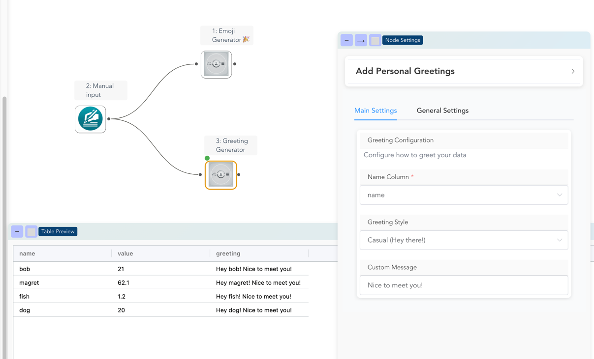

# Creating Custom Nodes

This page is the reference for building a custom node in Python with the Node Designer SDK — its class structure, the UI components you can put in the settings panel, type filtering, the `process()` contract, execution environments, and the dry-run test loop. After reading it you can write a node file that appears in the palette with a generated settings form. For a guided end-to-end build, see the [Custom Node Tutorial](custom-node-tutorial.md).

!!! tip "Visual alternative"
    You can build the same node without writing a file directly in the [Node Designer](../users/visual-editor/node-designer.md). A node file written in the visual subset of the SDK reopens in the visual editor, so the two paths interoperate.

## What are custom nodes?

Custom nodes extend Flowfile with your own data transformations that appear alongside the built-in nodes in the visual editor. Each one is a single `.py` file — the file is the whole node, the single source of truth. A node has:

- **A settings panel** — generated automatically from a schema (dropdowns, inputs, toggles, column pickers).
- **Processing logic** — a `process()` method written in Polars.
- **Palette placement** — driven by `node_category` (see [Palette placement](#palette-placement)).

## The canonical import

Import the SDK through the `flowfile` package and alias it `nd`:

```python
from flowfile import node_designer as nd
```

`nd.CustomNodeBase`, `nd.Section`, `nd.ColumnSelector`, `nd.Types`, and every other symbol come from this one import. The SDK lives in `shared/node_designer` and is side-effect-free — importing it pulls in no database, no migrations, and no other Flowfile internals — which is what lets your node run in the worker and in isolated kernels.

!!! note "The import contract"
    A custom node file may import **only** the node-designer SDK (plus the standard library and third-party packages). Importing any other `flowfile` / `flowfile_core` internal from a node file raises an `ImportError` when the node runs in the worker. The designer warns about such imports at save time.

Older files that import `from flowfile_core.flowfile.node_designer import ...` still load through a compatibility shim — the symbols are the same classes — but new files should use the canonical spelling.

## Quick start

### 1. Create your first node

Create a Python file in your custom-nodes directory:

```bash
~/.flowfile/user_defined_nodes/my_first_node.py
```

!!! info "Custom-node location"
    The `~/.flowfile/user_defined_nodes/` directory is created the first time you run Flowfile. Files placed there are picked up automatically. You can also register additional directories — see [Mounting other directories](#mounting-other-directories).

Here is a complete node that adds a greeting column. Note the `process` signature — it receives one or more `pl.LazyFrame` inputs (variadic `*inputs`) and returns a `pl.LazyFrame` or `pl.DataFrame`:

```python
--8<-- "docs/examples/custom_node.py:example"
```

This example is tested against the current API.

### 2. Use your node

1. **Save the file.** Flowfile hot-reloads the custom-nodes directory on save — no restart. If the node was added while Flowfile was already open, click **Rescan** in the Node Designer's browser (or the Catalog's Custom Nodes tab) to pick it up.
2. **Open the visual editor.**
3. **Find your node** in the palette. It lands in the group named after its `node_category` (see [Palette placement](#palette-placement)).
4. **Drag it** onto the canvas and connect an input.
5. **Configure the settings** in the right panel.
6. **Run your flow.**

<details markdown="1">
<summary>Visual overview of the result</summary>



</details>

## Node structure

Every custom node has three parts: metadata, a settings schema, and a `process` method.

```python
import polars as pl

from flowfile import node_designer as nd


class MyCustomNode(nd.CustomNodeBase):
    # 1. Metadata — how the node appears in Flowfile
    node_name: str = "My Node"
    node_category: str = "Data Enhancement"
    title: str = "Add greetings"
    intro: str = "Prefix a name column with a greeting."

    # 2. Settings schema — the UI configuration
    settings_schema: MySettings = MySettings()

    # 3. Processing logic — what the node does
    def process(self, *inputs: pl.LazyFrame) -> pl.LazyFrame:
        lf = inputs[0]
        # ... transformation logic ...
        return lf
```

### The `process` contract

`process` is the engine of the node.

- **Inputs are always `pl.LazyFrame`.** One frame per connected input port, passed positionally: `inputs[0]` is the first port, `inputs[1]` the second, and so on. This holds everywhere the node runs — worker, local fallback, isolated kernel, and dry-run.
- **Return a `pl.LazyFrame` or `pl.DataFrame`.** The framework normalizes either. For a multi-output node, return a `dict[str, pl.LazyFrame | pl.DataFrame]` keyed by output name (see [Multiple outputs](#multiple-outputs)).
- **Reading settings:** `self.settings_schema.<section_name>.<component_name>.value`.

!!! tip "Collect only when you must"
    Because inputs are lazy, prefer to express the transform as lazy Polars operations and return the `LazyFrame` unmaterialized — that keeps the frame streamable. If a step genuinely needs eager data (row-wise Python, `map_elements`, a shape-dependent branch), call `.collect()` **inside** `process` on just that frame. `process` never runs on core's hot path, so an in-node `.collect()` is fine — it materializes in the worker subprocess, not in core.

### Palette placement

`node_category` is a real palette group. A node with `node_category = "Text Processing"` appears under a **Text Processing** group in the palette; the group is created from the category name (slugified internally, displayed as written). The default category, `"Custom"`, keeps the historical **User Defined Operations** group. A node can also target a built-in group by naming it exactly.

### Settings architecture

Settings are organized into sections. Each `Section` becomes a collapsible panel in the node's settings drawer; components are passed as keyword arguments, and the keyword is the field name you read in `process`.

```python
class MyNodeSettings(nd.NodeSettings):
    basic_config: nd.Section = nd.Section(
        title="Basic Settings",
        description="Core options",
        input_column=nd.ColumnSelector(...),
        operation_type=nd.SingleSelect(...),
    )

    advanced_options: nd.Section = nd.Section(
        title="Advanced Options",
        description="Fine-tune behavior",
        enable_caching=nd.ToggleSwitch(...),
        max_iterations=nd.NumericInput(...),
    )
```

## Available UI components

### Text Input

```python
text_field = nd.TextInput(
    label="Enter a value",
    default="Default text",
    placeholder="Hint text here...",
)
```

### Numeric Input

```python
number_field = nd.NumericInput(
    label="Count",
    default=10,
    min_value=1,
    max_value=100,
)
```

### Single Select

```python
choice_field = nd.SingleSelect(
    label="Choose option",
    options=[
        ("value1", "Display Name 1"),
        ("value2", "Display Name 2"),
    ],
    default="value1",
)
```

### Multi Select

```python
multi_field = nd.MultiSelect(
    label="Select multiple",
    options=[
        ("opt1", "Option 1"),
        ("opt2", "Option 2"),
        ("opt3", "Option 3"),
    ],
    default=["opt1", "opt2"],
)
```

### Toggle Switch

```python
toggle_field = nd.ToggleSwitch(
    label="Enable feature",
    default=True,
    description="Turn this on to enable the feature",
)
```

### Column Selector

Type-filtered column picker:

```python
# Any column
any_column = nd.ColumnSelector(label="Pick a column", data_types=nd.Types.All)

# Numeric columns only, required
numeric_column = nd.ColumnSelector(
    label="Numeric column only",
    data_types=nd.Types.Numeric,
    required=True,
)

# Multiple string/categorical columns
text_columns = nd.ColumnSelector(
    label="Text columns",
    data_types=[nd.Types.String, nd.Types.Categorical],
    multiple=True,
)
```

### Secret Selector

Access stored secrets (API keys, credentials, tokens). Add `SecretSelector` inside a `Section` like any other component — the keyword is the field name. It has only a `label`, no `name=`:

```python
class ApiSettings(nd.NodeSettings):
    connection: nd.Section = nd.Section(
        title="Connection",
        api_key=nd.SecretSelector(label="API Key"),
    )


class MyNode(nd.CustomNodeBase):
    node_name: str = "API Reader"
    settings_schema: ApiSettings = ApiSettings()

    def process(self, *inputs: pl.LazyFrame) -> pl.LazyFrame:
        key = self.settings_schema.connection.api_key.secret_value
        ...
```

The dropdown lists the secrets configured by the current user. Read the decrypted value with `self.settings_schema.connection.api_key.secret_value` — it is only resolvable during execution. On a run, core pre-resolves the secret to its `$ffsec$` ciphertext and ships that to the worker, which decrypts it locally; the plaintext never leaves the worker process.

!!! warning "Secrets are not available in isolated kernels"
    A node whose `environment = "kernel"` runs its `process` in a Docker kernel that has no access to the secret store. Reading `secret_value` inside a kernel node raises at runtime. Use `environment = "local"` (the default) for secret-backed nodes.

### Dynamic Column Options

Use `IncomingColumns` for a dropdown that populates with the input's column names:

```python
column_dropdown = nd.SingleSelect(
    label="Choose input column",
    options=nd.IncomingColumns,
)
```

## Type filtering in Column Selector

`nd.Types` provides type groups and specific types:

```python
# Type groups
nd.Types.Numeric    # all numeric types
nd.Types.String     # string and categorical
nd.Types.AnyDate    # date, datetime, time, duration
nd.Types.Boolean    # boolean columns
nd.Types.All        # all column types

# Specific types
nd.Types.Int64
nd.Types.Float
nd.Types.Decimal
nd.Types.Date       # the Date type specifically (not the date group)

# Mix
data_types=[nd.Types.Numeric, nd.Types.AnyDate]
```

## Execution environment

Every node declares where its `process` runs, via the `environment` attribute:

```python
class MyNode(nd.CustomNodeBase):
    node_name: str = "My Node"
    environment: str = "local"   # "local" (default) or "kernel"
    dependencies: list[str] = []  # pip specs, kernel-only
```

- **`"local"`** (default) — `process` runs in a `flowfile_worker` subprocess: a killable, isolated child process that owns the dataset memory. The worker environment does not pip-install anything, so a local node may use only packages already available to Flowfile.
- **`"kernel"`** — `process` runs inside an isolated Docker kernel. Use this when the node needs third-party libraries or stronger isolation. List them in `dependencies` (e.g. `dependencies = ["scikit-learn", "xgboost"]`); the kernel installs them. Kernel nodes can also declare multiple named outputs. Secrets are not available in kernel nodes.

The legacy `requires_kernel = True` flag still loads (it maps to `environment = "kernel"` with a deprecation warning), as does a class-level `kernel_id`. Prefer `environment` in new code.

!!! info "Docker required for kernel nodes"
    Kernel execution needs Docker. When Docker is unavailable, the Node Designer's environment picker shows the local option only and explains how to enable kernels. See [Kernel Execution](../users/visual-editor/kernels.md).

## Multiple inputs

A node reads as many input frames as it declares in `number_of_inputs`; they arrive positionally in `*inputs`, in the order the input ports are connected on the canvas.

```python
class JoinerSettings(nd.NodeSettings):
    keys: nd.Section = nd.Section(
        title="Join Keys",
        left_key=nd.TextInput(label="Left key column", default="id"),
        right_key=nd.TextInput(label="Right key column", default="id"),
    )


class TwoInputJoiner(nd.CustomNodeBase):
    node_name: str = "Inner Join Two Inputs"
    node_category: str = "Joins"
    number_of_inputs: int = 2
    settings_schema: JoinerSettings = JoinerSettings()

    def process(self, *inputs: pl.LazyFrame) -> pl.LazyFrame:
        left, right = inputs[0], inputs[1]
        left_key = self.settings_schema.keys.left_key.value
        right_key = self.settings_schema.keys.right_key.value
        return left.join(right, left_on=left_key, right_on=right_key, how="inner")
```

## Multiple outputs

Declare the output names in `output_names`; `process` then returns a `dict` keyed by those names. Each name becomes a separate output handle on the node.

```python
class SplitterSettings(nd.NodeSettings):
    config: nd.Section = nd.Section(
        title="Split",
        threshold_column=nd.ColumnSelector(
            label="Numeric column",
            data_types=nd.Types.Numeric,
            required=True,
        ),
        threshold=nd.NumericInput(label="Threshold", default=0.0),
    )


class ThresholdSplitter(nd.CustomNodeBase):
    node_name: str = "Threshold Splitter"
    node_category: str = "Filtering"
    number_of_outputs: int = 2
    output_names: list[str] = ["above", "below"]
    settings_schema: SplitterSettings = SplitterSettings()

    def process(self, *inputs: pl.LazyFrame) -> dict[str, pl.LazyFrame]:
        lf = inputs[0]
        col = self.settings_schema.config.threshold_column.value
        cutoff = self.settings_schema.config.threshold.value
        return {
            "above": lf.filter(pl.col(col) >= cutoff),
            "below": lf.filter(pl.col(col) < cutoff),
        }
```

Every declared name must be present in the returned dict, or the run fails with an explicit error naming the missing output.

## Testing a node before you ship it

You do not need to add a node to a flow to test it. Two paths run its `process` against sample data:

- **In the designer:** the [Test tab](../users/visual-editor/node-designer.md#test-tab) runs the node against a small sample you provide (grid or CSV paste) and shows a per-output preview, logs, and any error — the same execution path as a real run.
- **Bake samples into the file:** two optional class attributes make the dry-run reproducible and travel with the node:

```python
class MyNode(nd.CustomNodeBase):
    node_name: str = "My Node"
    settings_schema: MySettings = MySettings()

    # One column-oriented dict per input port.
    example_inputs: list[dict[str, list]] = [
        {"name": ["Alice", "Bob"], "score": [91, 40]},
    ]
    # The settings values to test with: {section: {component: value}}.
    example_settings: dict[str, dict] = {
        "config": {"threshold_column": "score", "threshold": 50.0},
    }
```

`example_inputs` is column-oriented — one `{column: [values]}` dict per input port, directly constructible with `pl.LazyFrame(...)`. Both attributes round-trip through the designer: saving "test setup with node" in the Test tab writes them into the file, and reopening the node restores them.

Under the hood, both the designer's Test tab and the `example_inputs` path call the dry-run endpoint (`POST /user_defined_components/dry-run`), which runs the candidate node against the bounded sample frames through the same worker seam as a real run (with `flow_id = -1` and row/timeout caps).

## Worker execution semantics

For a `"local"` node, a run does not execute `process` inside core. Core ships the node's **source text**, the resolved settings values, any secret ciphertext, and the serialized input plans to `flowfile_worker`, which:

1. Registers alias modules so the SDK import spellings resolve, then loads the node source in a spawned subprocess.
2. Enforces the [import contract](#the-canonical-import) — a non-SDK `flowfile` import raises here.
3. Instantiates the node, applies settings, decrypts any secrets locally, and calls `process(*lazy_inputs)`.
4. Writes each output as Arrow IPC and returns paths and row counts. Core binds the primary output back with `pl.scan_ipc` and never materializes the dataset.

This is why the [import contract](#the-canonical-import) and the lazy `process` signature matter: the node body must run standalone in a process that has the SDK but not the rest of core.

## Real-world examples

### Data quality node

```python
class DataQualityNode(nd.CustomNodeBase):
    node_name: str = "Data Quality Checker"
    node_category: str = "Data Validation"

    settings_schema: nd.NodeSettings = nd.NodeSettings(
        validation_rules=nd.Section(
            title="Validation Rules",
            columns_to_check=nd.ColumnSelector(
                label="Columns to Validate",
                data_types=nd.Types.All,
                multiple=True,
            ),
            null_threshold=nd.NumericInput(
                label="Max Null Percentage",
                default=5.0,
                min_value=0,
                max_value=100,
            ),
        )
    )

    def process(self, *inputs: pl.LazyFrame) -> pl.LazyFrame:
        lf = inputs[0]
        columns = self.settings_schema.validation_rules.columns_to_check.value
        threshold = self.settings_schema.validation_rules.null_threshold.value

        # Row count is shape-dependent, so collect once for the null ratios.
        df = lf.collect()
        row_count = df.height
        result = df
        for col in columns:
            null_pct = (df[col].null_count() / row_count) * 100 if row_count else 0.0
            if null_pct > threshold:
                result = result.with_columns(
                    pl.col(col).is_null().alias(f"{col}_has_issues")
                )
        return result
```

### Text processing node

```python
class TextCleanerNode(nd.CustomNodeBase):
    node_name: str = "Text Cleaner"
    node_category: str = "Text Processing"

    settings_schema: nd.NodeSettings = nd.NodeSettings(
        cleaning_options=nd.Section(
            title="Cleaning Options",
            text_column=nd.ColumnSelector(
                label="Text Column",
                data_types=nd.Types.String,
                required=True,
            ),
            operations=nd.MultiSelect(
                label="Cleaning Operations",
                options=[
                    ("lowercase", "Convert to lowercase"),
                    ("remove_punctuation", "Remove punctuation"),
                    ("trim", "Trim whitespace"),
                ],
                default=["lowercase", "trim"],
            ),
            output_column=nd.TextInput(label="Output Column Name", default="cleaned_text"),
        )
    )

    def process(self, *inputs: pl.LazyFrame) -> pl.LazyFrame:
        lf = inputs[0]
        text_col = self.settings_schema.cleaning_options.text_column.value
        operations = self.settings_schema.cleaning_options.operations.value
        output_col = self.settings_schema.cleaning_options.output_column.value

        expr = pl.col(text_col)
        if "lowercase" in operations:
            expr = expr.str.to_lowercase()
        if "remove_punctuation" in operations:
            expr = expr.str.replace_all(r"[^\w\s]", "")
        if "trim" in operations:
            expr = expr.str.strip_chars()
        return lf.with_columns(expr.alias(output_col))
```

## Mounting other directories

The default directory is `~/.flowfile/user_defined_nodes/`, but you can register additional folders (for example a version-controlled repo of shared nodes). Register a directory in the Catalog's **Custom Nodes** tab or via `POST /custom-node-mounts`; the registrations persist in a `mounts.json` next to the default directory.

Mounted directories are **read-only sources** — the designer edits and saves them, but a fresh save from the designer always writes to the default directory, never into a mount. Nodes from mounts appear in the palette and the Custom Nodes tab like any other.

## The visual round-trip

A node file written in the SDK's "designer subset" reopens in the visual editor: Browse the node, click **Edit**, and its metadata, sections, components, and `process` code load back into the Form and Code tabs. The first time you save a hand-written node from the designer, its formatting is canonicalized (the designer shows a diff preview before writing). Files that use constructs outside the subset (builder objects, dynamic construction, non-literal component kwargs) still load — they open in code-only mode, with the Test tab fully functional. See [Code-only mode](../users/visual-editor/node-designer.md#code-only-mode).

## Troubleshooting

### Node doesn't appear
1. Check the file is in `~/.flowfile/user_defined_nodes/` (or a registered mount).
2. Click **Rescan** in the Node Designer browser or the Catalog Custom Nodes tab.
3. Check the browser: a file with a syntax or load error stays listed with its error attached.
4. Ensure the class inherits from `nd.CustomNodeBase`.

### Settings don't work
1. Verify `settings_schema` is assigned.
2. Ensure components are keyword arguments inside a `Section`.
3. Read component values with `.value` in `process`.

### Processing errors
1. Check the input has the expected columns.
2. Ensure `process` returns a `LazyFrame`/`DataFrame` (or a dict of them for multi-output).
3. Confirm the node file imports only the node-designer SDK — a non-SDK `flowfile` import fails at run time in the worker.

---

For a step-by-step walkthrough, see the [Custom Node Tutorial](custom-node-tutorial.md).
