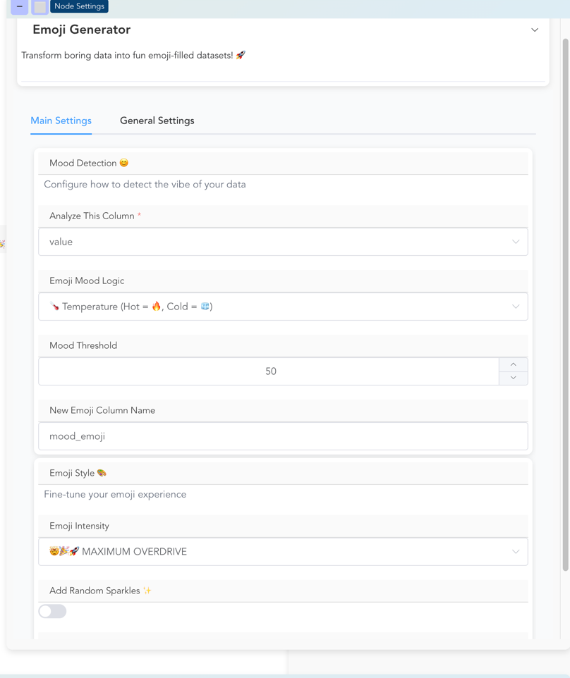

# Custom Node Tutorial: Build an Emoji Generator

Learn to create custom nodes by building a fun emoji generator that transforms boring data into expressive datasets with visual flair.

!!! info "What You'll Build"
    By the end of this tutorial, you'll have created a fully functional "Emoji Generator" node that:
    - Takes numeric data and converts it into mood-based emojis
    - Provides 7 different emoji themes (performance, temperature, money, etc.)
    - Includes intensity controls and random sparkle effects
    - Features a sophisticated multi-section UI

## Prerequisites

- Flowfile installed and working (`pip install flowfile`)
- Basic understanding of Python
- Familiarity with Polars DataFrames (helpful but not required)

## Step 1: Set Up Your Development Environment

First, locate your custom nodes directory:

```bash
# Check if the directory exists
ls ~/.flowfile/user_defined_nodes/

# If it doesn't exist, start Flowfile once to create it
flowfile run ui
```

Create your node file:

```bash
touch ~/.flowfile/user_defined_nodes/emoji_generator.py
```

## Step 2: Import Required Components

Start by importing all the components you'll need:

```python
import polars as pl
import random
from typing import List

from flowfile_core.flowfile.node_designer import (
    CustomNodeBase,
    Section,
    NodeSettings,
    TextInput,
    NumericInput,
    SingleSelect,
    ToggleSwitch,
    ColumnSelector,
    MultiSelect,
    Types
)
```

## Step 3: Design Your Settings Schema

We'll create a two-section UI: one for mood detection and one for styling options.

### Create the First Section

```python
class EmojiMoodSection(Section):
    source_column: ColumnSelector = ColumnSelector(
        label="Analyze This Column",
        multiple=False,
        required=True,
        data_types=Types.Numeric  # Only show numeric columns
    )

    mood_type: SingleSelect = SingleSelect(
        label="Emoji Mood Logic",
        options=[
            ("performance", "📈 Performance Based (High = 😎, Low = 😰)"),
            ("temperature", "🌡️ Temperature (Hot = 🔥, Cold = 🧊)"),
            ("money", "💰 Money Mode (Rich = 🤑, Poor = 😢)"),
            ("energy", "⚡ Energy Level (High = 🚀, Low = 🔋)"),
            ("love", "❤️ Love Meter (High = 😍, Low = 💔)"),
            ("chaos", "🎲 Pure Chaos (Random emojis!)"),
            ("pizza", "🍕 Pizza Scale (Everything becomes pizza)")
        ],
        default="performance"
    )

    threshold_value: NumericInput = NumericInput(
        label="Mood Threshold",
        default=50.0,
        min_value=0,
        max_value=100
    )

    emoji_column_name: TextInput = TextInput(
        label="New Emoji Column Name",
        default="mood_emoji",
        placeholder="Name your emoji column..."
    )
```

### Create the Second Section

```python
class EmojiStyleSection(Section):
    emoji_intensity: SingleSelect = SingleSelect(
        label="Emoji Intensity",
        options=[
            ("subtle", "😐 Subtle (One emoji)"),
            ("normal", "😊 Normal (1-2 emojis)"),
            ("extra", "🤩 Extra (2-3 emojis)"),
            ("maximum", "🤯🎉🚀 MAXIMUM OVERDRIVE")
        ],
        default="normal"
    )

    add_random_sparkle: ToggleSwitch = ToggleSwitch(
        label="Add Random Sparkles ✨",
        default=True,
        description="Randomly sprinkle ✨ for extra pizzazz"
    )

    emoji_categories: MultiSelect = MultiSelect(
        label="Allowed Emoji Categories",
        options=[
            ("faces", "😀 Faces & Emotions"),
            ("animals", "🦄 Animals"),
            ("food", "🍔 Food & Drink"),
            ("nature", "🌈 Nature"),
            ("objects", "🎮 Objects"),
            ("symbols", "💯 Symbols"),
            ("flags", "🏴‍☠️ Flags")
        ],
        default=["faces", "animals", "food"]
    )
```

### Combine Sections into Settings

```python
class EmojiSettings(NodeSettings):
    mood_config: EmojiMoodSection = EmojiMoodSection(
        title="Mood Detection 😊",
        description="Configure how to detect the vibe of your data"
    )

    style_options: EmojiStyleSection = EmojiStyleSection(
        title="Emoji Style 🎨",
        description="Fine-tune your emoji experience"
    )
```

## Step 4: Create the Main Node Class

```python
class EmojiGenerator(CustomNodeBase):
    # Node metadata - how it appears in Flowfile
    node_name: str = "Emoji Generator 🎉"
    node_category: str = "Fun Stuff"  # This creates a new category
    node_group: str = "custom"
    title: str = "Emoji Generator"
    intro: str = "Transform boring data into fun emoji-filled datasets! 🚀"

    # I/O configuration
    number_of_inputs: int = 1
    number_of_outputs: int = 1

    # Link to our settings schema
    settings_schema: EmojiSettings = EmojiSettings()

    def process(self, input_df: pl.DataFrame) -> pl.DataFrame:
        # We'll implement this in the next step
        pass
```

## Step 5: Implement the Processing Logic

Now for the fun part - the actual emoji generation logic:

```python
def process(self, input_df: pl.DataFrame) -> pl.DataFrame:
    # Get settings values from the UI
    column_name = self.settings_schema.mood_config.source_column.value
    mood_type = self.settings_schema.mood_config.mood_type.value
    threshold = self.settings_schema.mood_config.threshold_value.value
    emoji_col_name = self.settings_schema.mood_config.emoji_column_name.value
    intensity = self.settings_schema.style_options.emoji_intensity.value
    add_sparkle = self.settings_schema.style_options.add_random_sparkle.value

    # Define emoji sets for different moods
    emoji_sets = {
        "performance": {
            "high": ["😎", "💪", "🏆", "👑", "🌟", "💯", "🔥"],
            "low": ["😰", "😓", "📉", "😢", "💔", "🆘", "😵"]
        },
        "temperature": {
            "high": ["🔥", "🌋", "☀️", "🥵", "🌡️", "♨️", "🏖️"],
            "low": ["🧊", "❄️", "⛄", "🥶", "🌨️", "🏔️", "🐧"]
        },
        "money": {
            "high": ["🤑", "💰", "💎", "🏦", "💳", "🪙", "📈"],
            "low": ["😢", "💸", "📉", "🏚️", "😭", "🥺", "📊"]
        },
        "energy": {
            "high": ["🚀", "⚡", "💥", "🎯", "🏃", "🤸", "🎪"],
            "low": ["🔋", "😴", "🛌", "🐌", "🥱", "😪", "💤"]
        },
        "love": {
            "high": ["😍", "❤️", "💕", "🥰", "💘", "💝", "👨‍❤️‍👨"],
            "low": ["💔", "😢", "😭", "🥀", "😔", "💀", "🖤"]
        },
        "chaos": {
            "high": ["🦖", "🎸", "🚁", "🎪", "🦜", "🎭", "🏴‍☠️"],
            "low": ["🥔", "🧦", "📎", "🦷", "🧲", "🔌", "🪣"]
        },
        "pizza": {
            "high": ["🍕", "🍕🍕", "🍕🔥", "🍕😍", "🍕🎉", "🍕💯", "🍕👑"],
            "low": ["🍕", "🍕😢", "🍕💔", "🍕😭", "🍕🥺", "🍕😔", "🍕"]
        }
    }

    # Helper function to get emoji based on value
    def get_emoji(value, mood_type, threshold, intensity):
        if value is None:
            return "❓"

        emoji_list = emoji_sets.get(mood_type, emoji_sets["performance"])

        if mood_type == "chaos":
            # Random emoji from both lists
            all_emojis = emoji_list["high"] + emoji_list["low"]
            base_emoji = random.choice(all_emojis)
        elif mood_type == "pizza":
            # Everything is pizza
            base_emoji = "🍕"
        else:
            # Use threshold to determine high/low
            if value >= threshold:
                base_emoji = random.choice(emoji_list["high"])
            else:
                base_emoji = random.choice(emoji_list["low"])

        # Add intensity
        if intensity == "subtle":
            result = base_emoji
        elif intensity == "normal":
            result = base_emoji
            if random.random() > 0.5:
                result += random.choice(["", "✨", ""])
        elif intensity == "extra":
            extras = ["✨", "💫", "⭐", ""]
            result = base_emoji + random.choice(extras) + random.choice(extras)
        else:  # maximum
            chaos_emojis = ["🎉", "🚀", "💥", "🌈", "✨", "🔥", "💯", "⚡"]
            result = base_emoji + "".join(random.choices(chaos_emojis, k=3))

        # Add random sparkle
        if add_sparkle and random.random() > 0.7:
            result += "✨"

        return result

    # Create emoji column using map_elements
    emoji_expr = (
        pl.col(column_name)
        .map_elements(
            lambda x: get_emoji(x, mood_type, threshold, intensity),
            return_dtype=pl.String
        )
        .alias(emoji_col_name)
    )

    # Add bonus columns based on intensity
    if intensity == "maximum":
        # Add extra fun columns in maximum mode
        return input_df.with_columns([
            emoji_expr,
            pl.lit("🎉 PARTY MODE 🎉").alias("vibe_check"),
            pl.col(column_name).map_elements(
                lambda x: "🔥" * min(int((x or 0) / 20), 5) if x else "💤",
                return_dtype=pl.String
            ).alias("fire_meter")
        ])
    else:
        return input_df.with_columns([emoji_expr])
```


## Step 6: Test Your Node

Save your file and test it:

1. **Restart Flowfile** completely:
   ```bash
   # Stop any running Flowfile processes
   # Then start again
   flowfile run ui
   ```

2. **Create a test flow**:
   - Create a new flow
   - Add a "Manual Input" node with some test data:
    ```
    [
      {
        "name": "bob",
        "value": "21"
      },
      {
        "name": "magret",
        "value": "62.1"
      },
      {
        "name": "fish",
        "value": "1.2"
      },
      {
        "name": "dog",
        "value": "20"
      }
    ]
    ```

   - Look for your "Emoji Generator 🎉" in the "User defined operations" category
   - Connect it to your manual input
   - Configure the settings and run!

<details markdown="1">
<summary style="cursor: pointer; font-size: clamp(0.9rem, 2vw, 1rem);"> Visual overview of the result! </summary>




</details>

### Performance Tips

1. **Use Polars expressions** instead of Python loops when possible
2. **Avoid collecting DataFrames** in the middle of processing
3. **Handle large datasets** by checking input size and warning users
4. **Cache expensive operations** like random number generation
5. **Use lazy evaluation** - let Polars optimize the query plan

## Complete Working Example

Here's the complete, working emoji generator node:

```python
import polars as pl
import random
from typing import List

from flowfile_core.flowfile.node_designer import (
    CustomNodeBase,
    Section,
    NodeSettings,
    TextInput,
    NumericInput,
    SingleSelect,
    ToggleSwitch,
    ColumnSelector,
    MultiSelect,
    Types
)


class EmojiMoodSection(Section):
    source_column: ColumnSelector = ColumnSelector(
        label="Analyze This Column",
        multiple=False,
        required=True,
        data_types=Types.Numeric  # Only show numeric columns
    )

    mood_type: SingleSelect = SingleSelect(
        label="Emoji Mood Logic",
        options=[
            ("performance", "📈 Performance Based (High = 😎, Low = 😰)"),
            ("temperature", "🌡️ Temperature (Hot = 🔥, Cold = 🧊)"),
            ("money", "💰 Money Mode (Rich = 🤑, Poor = 😢)"),
            ("energy", "⚡ Energy Level (High = 🚀, Low = 🔋)"),
            ("love", "❤️ Love Meter (High = 😍, Low = 💔)"),
            ("chaos", "🎲 Pure Chaos (Random emojis!)"),
            ("pizza", "🍕 Pizza Scale (Everything becomes pizza)")
        ],
        default="performance"
    )

    threshold_value: NumericInput = NumericInput(
        label="Mood Threshold",
        default=50.0,
        min_value=0,
        max_value=100
    )

    emoji_column_name: TextInput = TextInput(
        label="New Emoji Column Name",
        default="mood_emoji",
        placeholder="Name your emoji column..."
    )


class EmojiStyleSection(Section):
    emoji_intensity: SingleSelect = SingleSelect(
        label="Emoji Intensity",
        options=[
            ("subtle", "😐 Subtle (One emoji)"),
            ("normal", "😊 Normal (1-2 emojis)"),
            ("extra", "🤩 Extra (2-3 emojis)"),
            ("maximum", "🤯🎉🚀 MAXIMUM OVERDRIVE")
        ],
        default="normal"
    )

    add_random_sparkle: ToggleSwitch = ToggleSwitch(
        label="Add Random Sparkles ✨",
        default=True,
        description="Randomly sprinkle ✨ for extra pizzazz"
    )

    emoji_categories: MultiSelect = MultiSelect(
        label="Allowed Emoji Categories",
        options=[
            ("faces", "😀 Faces & Emotions"),
            ("animals", "🦄 Animals"),
            ("food", "🍔 Food & Drink"),
            ("nature", "🌈 Nature"),
            ("objects", "🎮 Objects"),
            ("symbols", "💯 Symbols"),
            ("flags", "🏴‍☠️ Flags")
        ],
        default=["faces", "animals", "food"]
    )


class EmojiSettings(NodeSettings):
    mood_config: EmojiMoodSection = EmojiMoodSection(
        title="Mood Detection 😊",
        description="Configure how to detect the vibe of your data"
    )

    style_options: EmojiStyleSection = EmojiStyleSection(
        title="Emoji Style 🎨",
        description="Fine-tune your emoji experience"
    )


class EmojiGenerator(CustomNodeBase):
    # Node metadata - how it appears in Flowfile
    node_name: str = "Emoji Generator 🎉"
    node_category: str = "Fun Stuff"  # This creates a new category
    node_group: str = "custom"
    title: str = "Emoji Generator"
    intro: str = "Transform boring data into fun emoji-filled datasets! 🚀"

    # I/O configuration
    number_of_inputs: int = 1
    number_of_outputs: int = 1

    # Link to our settings schema
    settings_schema: EmojiSettings = EmojiSettings()

    def process(self, input_df: pl.DataFrame) -> pl.DataFrame:
        # Get settings values from the UI
        # Note how we can just access these from the settings that we have defined
        column_name = self.settings_schema.mood_config.source_column.value
        mood_type = self.settings_schema.mood_config.mood_type.value
        threshold = self.settings_schema.mood_config.threshold_value.value
        emoji_col_name = self.settings_schema.mood_config.emoji_column_name.value
        intensity = self.settings_schema.style_options.emoji_intensity.value
        add_sparkle = self.settings_schema.style_options.add_random_sparkle.value

        # Define emoji sets for different moods
        emoji_sets = {
            "performance": {
                "high": ["😎", "💪", "🏆", "👑", "🌟", "💯", "🔥"],
                "low": ["😰", "😓", "📉", "😢", "💔", "🆘", "😵"]
            },
            "temperature": {
                "high": ["🔥", "🌋", "☀️", "🥵", "🌡️", "♨️", "🏖️"],
                "low": ["🧊", "❄️", "⛄", "🥶", "🌨️", "🏔️", "🐧"]
            },
            "money": {
                "high": ["🤑", "💰", "💎", "🏦", "💳", "🪙", "📈"],
                "low": ["😢", "💸", "📉", "🏚️", "😭", "🥺", "📊"]
            },
            "energy": {
                "high": ["🚀", "⚡", "💥", "🎯", "🏃", "🤸", "🎪"],
                "low": ["🔋", "😴", "🛌", "🐌", "🥱", "😪", "💤"]
            },
            "love": {
                "high": ["😍", "❤️", "💕", "🥰", "💘", "💝", "👨‍❤️‍👨"],
                "low": ["💔", "😢", "😭", "🥀", "😔", "💀", "🖤"]
            },
            "chaos": {
                "high": ["🦖", "🎸", "🚁", "🎪", "🦜", "🎭", "🏴‍☠️"],
                "low": ["🥔", "🧦", "📎", "🦷", "🧲", "🔌", "🪣"]
            },
            "pizza": {
                "high": ["🍕", "🍕🍕", "🍕🔥", "🍕😍", "🍕🎉", "🍕💯", "🍕👑"],
                "low": ["🍕", "🍕😢", "🍕💔", "🍕😭", "🍕🥺", "🍕😔", "🍕"]
            }
        }

        # Helper function to get emoji based on value
        def get_emoji(value, mood_type, threshold, intensity):
            if value is None:
                return "❓"

            emoji_list = emoji_sets.get(mood_type, emoji_sets["performance"])

            if mood_type == "chaos":
                # Random emoji from both lists
                all_emojis = emoji_list["high"] + emoji_list["low"]
                base_emoji = random.choice(all_emojis)
            elif mood_type == "pizza":
                # Everything is pizza
                base_emoji = "🍕"
            else:
                # Use threshold to determine high/low
                if value >= threshold:
                    base_emoji = random.choice(emoji_list["high"])
                else:
                    base_emoji = random.choice(emoji_list["low"])

            # Add intensity
            if intensity == "subtle":
                result = base_emoji
            elif intensity == "normal":
                result = base_emoji
                if random.random() > 0.5:
                    result += random.choice(["", "✨", ""])
            elif intensity == "extra":
                extras = ["✨", "💫", "⭐", ""]
                result = base_emoji + random.choice(extras) + random.choice(extras)
            else:  # maximum
                chaos_emojis = ["🎉", "🚀", "💥", "🌈", "✨", "🔥", "💯", "⚡"]
                result = base_emoji + "".join(random.choices(chaos_emojis, k=3))

            # Add random sparkle
            if add_sparkle and random.random() > 0.7:
                result += "✨"

            return result

        # Create emoji column using map_elements
        emoji_expr = (
            pl.col(column_name)
            .map_elements(
                lambda x: get_emoji(x, mood_type, threshold, intensity),
                return_dtype=pl.String
            )
            .alias(emoji_col_name)
        )

        # Add bonus columns based on intensity
        if intensity == "maximum":
            # Add extra fun columns in maximum mode
            return input_df.with_columns([
                emoji_expr,
                pl.lit("🎉 PARTY MODE 🎉").alias("vibe_check"),
                pl.col(column_name).map_elements(
                    lambda x: "🔥" * min(int((x or 0) / 20), 5) if x else "💤",
                    return_dtype=pl.String
                ).alias("fire_meter")
            ])
        else:
            return input_df.with_columns([emoji_expr])
```

Save this as `~/.flowfile/user_defined_nodes/emoji_generator.py`, restart Flowfile, and enjoy your new emoji-powered data transformations!

## Congratulations! 🎉

You've successfully created a fully functional custom node

- ✅ Multi-section UI with 6 different component types
- ✅ Complex processing logic with multiple mood themes
- ✅ Advanced features like intensity control and random effects
- ✅ Professional documentation and structure
