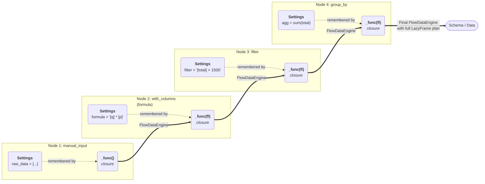
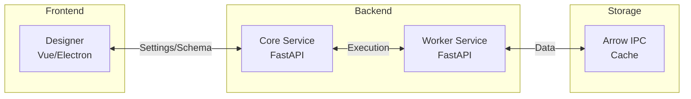

# The Architecture Story: How Flowfile Bridges Code and Visual Worlds

<strong>📋 TL;DR - Key Takeaways</strong>

!!! abstract "Key Points"
    - **Two ways to build pipelines**: Write Python code or use drag-and-drop UI - both create the same thing
    - **Settings-based design**: Every transformation is just a configuration object (Pydantic model)
    - **Clear separation**: Graph structure, settings, and execution are handled separately
    - **Happy accident**: Started as a UI project, ended up with an architecture that works great for both UI and code


!!! info "Navigation"
    - **This page**: Architecture overview and design decisions
    - **[Core Developer Guide](flowfile-core.md)**: Technical implementation details
    - **[Python API](../users/python-api/index.md)**: How to use Flowfile in your projects

<strong>👥 Who Should Read This?</strong>
!!! question "Target Audience"
    - Contributors who want to understand the codebase
    - Users curious about how things work internally
    - Developers building similar dual-interface tools
    - Anyone interested in bridging UI and code approaches

## The Problem We Solved

Most data tools force you to choose: either use a visual interface (easy but limited) or write code (powerful but complex). We wanted both in the same tool.

The challenge: How do you make a visual drag-and-drop interface that creates the exact same pipelines as writing code?

The platform started with a clean, settings-based backend where every transformation is a declarative configuration object. This design is perfect for a UI. But developers don't think in configuration objects—they think in code:

```python
# How developers want to write data code
df.filter(col("price") > 100).group_by("region").sum()
```

The breakthrough came from realizing that the Polars API would be able to convert to our settings object and therefore creating the same settings object that the UI creates. Both interfaces become different ways to build the same underlying configuration, giving developers the expressiveness they want while maintaining the structured settings the UI needs.

## The result

!!! abstract "How It Actually Happened"
    This wasn't some grand plan. I started building a drag-and-drop UI and needed a clean way to configure nodes. Settings objects made sense for the UI. But the development of Flowfile has never been a planned approach, it was just about building what sounded _fun_.
    Later, when looking at other projects, I realized I could just have the API methods create the same settings objects, well that is **_fun_**. Suddenly there were two equivalent interfaces almost by accident,.
    Since Polars does the actual data processing, our settings just configure what Polars should do. This turned out to be an easy abstraction layer that showed it's potential from the start.

The result is a Python API that constructs the exact same configuration objects as the visual editor:

- **The Python API** `df.filter(...)`  translates directly to a `NodeFilter` object
- **The Visual Editor** creates an identical `NodeFilter` object through clicks and drags

Both interfaces are different ways to build the same Directed Acyclic Graph (DAG), providing the experience of a code-native API combined with the accessibility of a visual editor.

## One Pipeline, Two Ways

Let's build the same pipeline using both approaches to see how they produce identical results.

### Sample Data

```python
import flowfile as ff

raw_data = [
    {"id": 1, "region": "North", "quantity": 10, "price": 150},
    {"id": 2, "region": "South", "quantity": 5, "price": 300},
    {"id": 3, "region": "East", "quantity": 8, "price": 200},
    {"id": 4, "region": "West", "quantity": 12, "price": 100},
    {"id": 5, "region": "North", "quantity": 20, "price": 250},
    {"id": 6, "region": "South", "quantity": 15, "price": 400},
    {"id": 7, "region": "East", "quantity": 18, "price": 350},
    {"id": 8, "region": "West", "quantity": 25, "price": 500},
]
```

### Method 1: The Flowfile API (Developer Experience)

**Code:**
```python
import flowfile as ff
from flowfile_core.flowfile.flow_graph import FlowGraph

graph: FlowGraph = ff.create_flow_graph()

# Create pipeline with fluent API
df_1 = ff.FlowFrame(raw_data, flow_graph=graph)

df_2 = df_1.with_columns(
    flowfile_formulas=['[quantity] * [price]'],
    output_column_names=["total"]
)

df_3 = df_2.filter(flowfile_formula="[total]>1500")

df_4 = df_3.group_by(['region']).agg([
    ff.col("total").sum().alias("total_revenue"),
    ff.col("total").mean().alias("avg_transaction"),
])
```

<details markdown="1">
<summary>Inspecting the graph</summary>

**Graph Introspection:**
```python
# Access all nodes that were created in the graph
print(graph._node_db)
# {1: Node id: 1 (manual_input),
#  3: Node id: 3 (formula),
#  4: Node id: 4 (filter),
#  5: Node id: 5 (group_by)}

# Find the starting node(s) of the graph
print(graph._flow_starts)
# [Node id: 1 (manual_input)]

# From every node, access the next node that depends on it
print(graph.get_node(1).leads_to_nodes)
# [Node id: 3 (formula)]

# The other way around works too
print(graph.get_node(3).node_inputs)
# NodeStepInputs(Left Input: None, Right Input: None,
#                Main Inputs: [Node id: 1 (manual_input)])

# Access the settings and type of any node
print(graph.get_node(4).setting_input)
print(graph.get_node(4).node_type)
```
</details>

### Method 2: Direct Graph Construction (What Happens Internally)

**Code:**
```python
from flowfile_core.schemas import node_interface, transformation_settings, RawData
from flowfile_core.flowfile.flow_graph import add_connection

flow = ff.create_flow_graph()

# Node 1: Manual input
node_manual_input = node_interface.NodeManualInput(
    flow_id=flow.flow_id,
    node_id=1,
    raw_data_format=RawData.from_pylist(raw_data)
)
flow.add_manual_input(node_manual_input)

# Node 2: Add formula for total
formula_node = node_interface.NodeFormula(
    flow_id=1,
    node_id=2,
    function=transformation_settings.FunctionInput(
        field=transformation_settings.FieldInput(
            name="total",
            data_type="Double"
        ),
        function="[quantity] * [price]"
    )
)
flow.add_formula(formula_node)
add_connection(flow,
    node_interface.NodeConnection.create_from_simple_input(1, 2))

# Node 3: Filter high value transactions
filter_node = node_interface.NodeFilter(
    flow_id=1,
    node_id=3,
    filter_input=transformation_settings.FilterInput(
        filter_type="advanced",
        advanced_filter="[total]>1500"
    )
)
flow.add_filter(filter_node)
add_connection(flow,
    node_interface.NodeConnection.create_from_simple_input(2, 3))

# Node 4: Group by region
group_by_node = node_interface.NodeGroupBy(
    flow_id=1,
    node_id=4,
    groupby_input=transformation_settings.GroupByInput(
        agg_cols=[
            transformation_settings.AggColl("region", "groupby"),
            transformation_settings.AggColl("total", "sum", "total_revenue"),
            transformation_settings.AggColl("total", "mean", "avg_transaction")
        ]
    )
)
flow.add_group_by(group_by_node)
add_connection(flow,
    node_interface.NodeConnection.create_from_simple_input(3, 4))
```

**Schema Inspection:**
```python
# Check the schema at any node
print([s.get_minimal_field_info() for s in flow.get_node(4).schema])
# [MinimalFieldInfo(name='region', data_type='String'),
#  MinimalFieldInfo(name='total_revenue', data_type='Float64'),
#  MinimalFieldInfo(name='avg_transaction', data_type='Float64')]
```

<details markdown="1">

<summary>Both methods produce the exact same Polars execution plan:</summary>
This is the polars query plan generated by both methods:

    ```
    AGGREGATE[maintain_order: false]
      [col("total").sum().alias("total_revenue"),
       col("total").mean().alias("avg_transaction")] BY [col("region")]
      FROM
      FILTER [(col("total")) > (1500)]
      FROM
      WITH_COLUMNS:
      [[(col("quantity")) * (col("price"))].alias("total")]
      DF ["id", "region", "quantity", "price"]; PROJECT 3/4 COLUMNS
    ```

</details>

## Core Architecture

### Three Fundamental Concepts

#### 1. The DAG is Everything

Every Flowfile pipeline is a Directed Acyclic Graph where. This is captured in the  [FlowGraph](python-api-reference.md#flowgraph)

- **Nodes** are transformations (filter, join, group_by, etc.)
- **Edges** represent data flow between nodes
- **Settings** are Pydantic models configuring each transformation

#### 2. Settings Drive Everything

Every node is composed of two parts: the **Node class** (a Pydantic BaseModel) that holds metadata and the **Settings** (often dataclasses) that configure the transformation:

Read more about [Nodes](python-api-reference.md#input_schema) and the [transformations](python-api-reference.md#transform_schema)

```python
# The Node: metadata and graph position
class NodeGroupBy(NodeSingleInput):
    groupby_input: transform_schema.GroupByInput = None

class NodeSingleInput(NodeBase):
    depending_on_id: Optional[int] = -1  # Parent node reference

class NodeBase(BaseModel):
    flow_id: int
    node_id: int
    cache_results: Optional[bool] = False
    pos_x: Optional[float] = 0
    pos_y: Optional[float] = 0
    description: Optional[str] = None
    # ... graph metadata ...

# The Settings: transformation configuration (dataclass)
@dataclass
class GroupByInput:
    """Defines how to perform the group by operation"""
    agg_cols: List[AggColl]

@dataclass
class AggColl:
    """Single aggregation operation"""
    old_name: str      # Column to aggregate
    agg: str          # Aggregation function ('sum', 'mean', etc.)
    new_name: Optional[str]  # Output column name
    output_type: Optional[str] = None
```

!!! tip "Settings Power The Backend"
    This dual structure—Nodes for graph metadata, Settings for transformation logic—drives the backend:

    - 🔧 **Code generation** (method signatures match settings)
    - 💾 **Serialization** (graphs can be saved/loaded)
    - 🔮 **Schema prediction** (output types are inferred from AggColl)
    - 🎨 **UI structure** (defines what the frontend needs to collect, though forms are manually built)

#### 3. Execution is Everything

The [`FlowDataEngine`](python-api-reference.md#flowfile_core.flowfile.flow_data_engine.flow_data_engine.FlowDataEngine) orchestrates everything about execution. While the DAG defines structure and settings define configuration, FlowDataEngine is the runtime brain that makes it all happen.

FlowDataEngine handles:
- **Compute location** (worker service vs local execution)
- **Caching strategy** (when to materialize, where to store)
- **Schema caching** (avoiding redundant schema calculations)
- **Lazy vs eager evaluation** (performance vs debugging modes)
- **Data movement** (passing LazyFrames between transformations)

This separation is powerful: the DAG remains a pure specification, settings stay declarative, and FlowDataEngine owns all execution concerns. It wraps a Polars LazyFrame/DataFrame but is really the execution orchestrator—deciding where, when, and how transformations run.

### Understanding FlowNode

The `FlowNode` class is the heart of each transformation in the graph. Each node encapsulates everything needed for a single transformation step:

!!! info "Core FlowNode Components"
    **Essential State:**

    - **`_function`**: The closure containing the transformation logic
    - **`leads_to_nodes`**: List of downstream nodes that depend on this one
    - **`node_information`**: Metadata (id, type, position, connections)
    - **`_hash`**: Unique identifier based on settings and parent hashes

    **Runtime State:**

    - **`results`**: Holds the resulting data, errors, and example data paths
    - **`node_stats`**: Tracks execution status (has_run, is_canceled, etc.)
    - **`node_settings`**: Runtime settings (cache_results, streamable, etc.)
    - **`state_needs_reset`**: Flag indicating if the node needs recalculation

    **Schema Information:**

    - **`node_schema`**: Input/output columns and predicted schemas
    - **`schema_callback`**: Function to calculate schema without execution

The beauty is that FlowNode doesn't know about specific transformations—it just orchestrates the execution of its `_function` closure with the right inputs and manages the resulting state.

## Flowfile: The Use of Closures

When a method like `.filter()` is called, no data is actually filtered. Instead, a `FlowNode` is created containing a function—a closure that remembers its settings.

**Visual: How Closures Build the Execution Chain**


Each `_func` is a closure that wraps around the previous one, building up a chain. The beauty is that Polars can track the schema through this entire chain without executing any data transformations—it just builds the query plan!

#### The Closure Pattern in Practice

Here's how closures are actually created in [FlowGraph](python-api-reference.md#flowgraph):

```python
# From the FlowGraph implementation
def add_group_by(self, group_by_settings: input_schema.NodeGroupBy):
    # The closure: captures group_by_settings
    def _func(fl: FlowDataEngine) -> FlowDataEngine:
        return fl.do_group_by(group_by_settings.groupby_input, False)

    self.add_node_step(
        node_id=group_by_settings.node_id,
        function=_func,  # This closure remembers group_by_settings!
        node_type='group_by',
        setting_input=group_by_settings,
        input_node_ids=[group_by_settings.depending_on_id]
    )

def add_union(self, union_settings: input_schema.NodeUnion):
    # Another closure: captures union_settings
    def _func(*flowfile_tables: FlowDataEngine):
        dfs = [flt.data_frame for flt in flowfile_tables]
        return FlowDataEngine(pl.concat(dfs, how='diagonal_relaxed'))

    self.add_node_step(
        node_id=union_settings.node_id,
        function=_func,  # This closure has everything it needs
        node_type='union',
        setting_input=union_settings,
        input_node_ids=union_settings.depending_on_ids
    )
```

Each `_func` is a closure that captures its specific settings. When these functions are composed during execution, they form a chain:

```python
# Conceptual composition of the closures
result = group_by._func(
    filter._func(
        formula._func(
            manual_input._func()
        )
    )
)

# Result is a FlowDataEngine with a LazyFrame that knows its schema
print(result.data_frame.collect_schema())
# Schema([('region', String), ('total_revenue', Float64), ('avg_transaction', Float64)])
```

!!! example "Why This Works"
    1. **Each `_func` is a closure** containing the node's settings
    2. **Functions only need FlowDataEngine as input** (or multiple for joins/unions)
    3. **LazyFrame tracks schema changes** through the entire chain
    4. **No data is processed**—Polars just builds the query plan

    The result: instant schema feedback without running expensive computations!

### Fallback: Schema Callbacks

For nodes that can't infer schemas automatically (external data sources), each FlowNode can have a `schema_callback`:

```python
def schema_callback(settings, input_schema):
    """Pure function: settings + input schema → output schema"""
    # Calculate output schema without data
    return new_schema
```

## Execution Methods

Flowfile offers flexible execution strategies depending on your needs:

### 🚀 Available Execution Methods

#### Performance Mode

**When to use:** Production pipelines, large datasets

```python
# Get the final result efficiently
result = flow.get_node(final_node_id).get_resulting_data()
```

**Characteristics:**

- ⚡ Pull-based execution from the final node
- 🎯 Polars optimizes the entire pipeline
- 💨 Data flows once through optimized plan
- 🚫 No intermediate materialization

#### Development Mode

**When to use:** Debugging, inspection, incremental development

```python
# Execute with caching enabled
import flowfile as ff

flow = ff.create_flow_graph()
flow.flow_settings.execution_mode = "Development"

# Add transformations here
flow.run_graph()

# Inspect intermediate results
node_3_result = flow.get_node(3).results.get_example_data()

flow.get_node(3).needs_run(performance_mode=False) # False

```

**Characteristics:**
- 📝 Push-based execution in topological order
- 💾 Each node's output written to disk
- 🔍 Inspect any intermediate result
- 🔄 When re-running the flow, only the steps that have changed(directly and indirectly) will run

#### Explain Plan

**When to use:** Optimization, understanding deeply the execution plan.

!!! warning This feature uses directly the Polars implementation, when the full flow cannot be fully converted to Polars, it will show partial executions.

```python
# See what Polars will actually do
plan = flow.get_node(node_id).get_resulting_data().data_frame.explain()
print(plan)
```

**Characteristics:**
- 📊 Shows optimized query plan
- 🔍 Understand Polars optimizations
- 📈 Identify performance bottlenecks
- 🎯 No actual execution

## System Architecture

### Service Architecture



!!! info "Service Responsibilities"
    **Designer:**
    - Visual graph building interface
    - Node configuration forms (manually implemented)
    - Real-time schema feedback

    **Core:**
    - DAG management
    - Execution orchestration
    - Schema prediction

    **Worker:**
    - Polars transformations
    - Data caching (Arrow IPC)
    - Isolated from Core for scalability

### Project Structure

```
flowfile/
├── flowfile_core/
│   ├── nodes/              # Node implementations
│   ├── schemas/            # Pydantic models
│   └── flowfile/          # Graph management
├── flowfile_worker/
│   ├── execution/         # Polars execution
│   └── cache/            # Arrow IPC caching
└── flowfile_frontend/
    ├── components/       # Vue components
    └── electron/        # Desktop app
```

## Contributing

!!! warning "Current State of Node Development"
    While the backend architecture elegantly uses settings-driven nodes, adding new nodes requires work across multiple layers. The frontend currently requires manual implementation for each node type—the visual editor doesn't automatically generate forms from Pydantic schemas yet.

    However, there are also opportunities for more focused contributions! Integration with databases and cloud services is needed—these are smaller, more targeted tasks since the core structure is already in place. There's a lot of active development happening, so it's an exciting time to contribute!

### Adding a New Node: The Full Picture

Adding a node isn't as simple as defining settings and a function. Here's what's actually required:

#### Backend Requirements

1. **Define the Pydantic settings model** in `schemas/`
2. **Implement the transformation method** on `FlowDataEngine`
3. **Add the node method** to `FlowGraph` (e.g., `add_custom_transform()`)
4. **Create the closure function** that captures settings
5. **Define schema callbacks** for predicting output schemas
6. **Register the node** in the node registry

Example of what's really needed in FlowGraph:

```python
def add_custom_transform(self, transform_settings: input_schema.NodeCustomTransform):
    # Create the closure that captures settings
    def _func(fl: FlowDataEngine) -> FlowDataEngine:
        return fl.do_custom_transform(transform_settings.transform_input)

    # Register with the graph
    self.add_node_step(
        node_id=transform_settings.node_id,
        function=_func,
        node_type='custom_transform',
        setting_input=transform_settings,
        input_node_ids=[transform_settings.depending_on_id]
    )

    # Don't forget schema prediction!
    node = self.get_node(transform_settings.node_id)
    # ... schema callback setup ...
```

#### Frontend Requirements

Currently, you'll need to:

1. Create a new Vue component for the node's configuration form
2. Handle the visual representation in the graph editor
3. Map the UI inputs to the backend settings structure
4. Add the node type to the visual editor's palette

This manual process ensures full control over the UI/UX but requires significant development effort.

### Future Vision

The goal is to eventually auto-generate UI from Pydantic schemas, which would complete the settings-driven architecture. This would make adding new nodes closer to just defining the backend settings and transformation logic, with the UI automatically following.

The beauty of Flowfile's architecture—discovered through the organic evolution from a UI-first approach—is that even though adding nodes requires work across multiple layers today, the settings-based design provides a clear contract between visual and code interfaces.

I hope you enjoyed learning about Flowfile's architecture and found the dual-interface approach as exciting as I do! If you have questions, ideas, or want to contribute, ]
feel free to reach out via [GitHub](https://github.com/edwardvaneechoud/Flowfile) or check our [Core Developer Guide](flowfile-core.md). Happy building!
