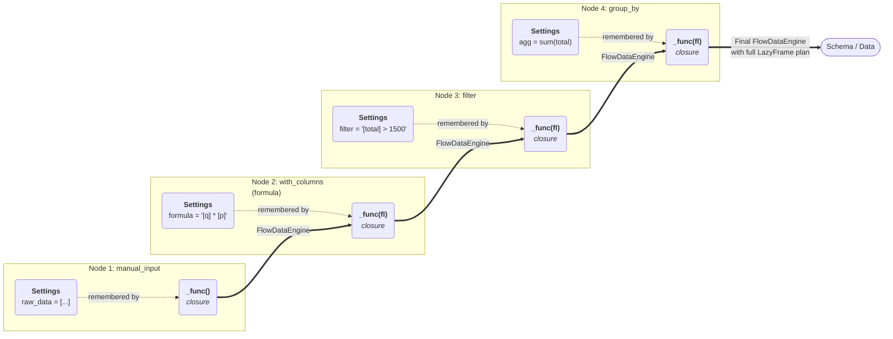

# Design Philosophy: Code and Visual Are One Model

This page explains the core design decision behind Flowfile: the Python API and the visual editor construct the same underlying objects. It is for contributors mapping the codebase, and for anyone curious how a drag-and-drop tool and a code API can stay in lockstep.

!!! info "Related pages"
    - [Technical Architecture](architecture.md) — the three services and execution modes
    - [Core Developer Guide](flowfile-core.md) — internal implementation, hands-on
    - [Python API](../users/python-api/index.md) — using Flowfile in your own projects

## The problem

Most data tools make you choose: a visual interface (approachable but limited) or code (expressive but harder). Flowfile aims for both in one tool, which raises one hard question — how do you make a drag-and-drop interface produce the exact same pipelines as writing code?

The backend was built around a settings-based model: every transformation is a declarative configuration object (a Pydantic model). That model suits a UI well, but developers think in code, not configuration objects:

```python
# How developers want to write data code
df.filter(col("price") > 100).group_by("region").sum()
```

The resolution is to have the Python API build those same settings objects. Both interfaces become different front-ends to one underlying configuration: developers get an expressive, chainable API, and the UI gets the structured settings it needs.

## The result

Flowfile grew out of a visual editor. Nodes were configured with settings objects because that is a clean fit for a UI. Later, the Python API was wired to construct those same settings objects, so a method call and a dropped node produce identical configuration. Because Polars does the actual data processing, the settings only describe *what* Polars should do — a thin, stable abstraction layer.

The result is a Python API that constructs the exact same configuration objects as the visual editor:

- **The Python API** `df.filter(...)`  translates directly to a `NodeFilter` object
- **The Visual Editor** creates an identical `NodeFilter` object through clicks and drags

Both interfaces are different ways to build the same Directed Acyclic Graph (DAG), providing the experience of a code-native API combined with the accessibility of a visual editor.

## One Pipeline, Two Ways

The same pipeline built both ways produces identical results.

### Sample Data

```python
import flowfile as ff

raw_data = [
    {"id": 1, "region": "North", "quantity": 10, "price": 150},
    {"id": 2, "region": "South", "quantity": 5, "price": 300},
    {"id": 3, "region": "East", "quantity": 8, "price": 200},
    {"id": 4, "region": "West", "quantity": 12, "price": 100},
    {"id": 5, "region": "North", "quantity": 20, "price": 250},
    {"id": 6, "region": "South", "quantity": 15, "price": 400},
    {"id": 7, "region": "East", "quantity": 18, "price": 350},
    {"id": 8, "region": "West", "quantity": 25, "price": 500},
]
```

### Method 1: The Flowfile API (Developer Experience)

**Code:**
```python
import flowfile as ff
from flowfile_core.flowfile.flow_graph import FlowGraph

graph: FlowGraph = ff.create_flow_graph()

# Create pipeline with fluent API
df_1 = ff.FlowFrame(raw_data, flow_graph=graph)

df_2 = df_1.with_columns(
    flowfile_formulas=['[quantity] * [price]'], 
    output_column_names=["total"]
)

df_3 = df_2.filter(flowfile_formula="[total]>1500")

df_4 = df_3.group_by(['region']).agg([
    ff.col("total").sum().alias("total_revenue"),
    ff.col("total").mean().alias("avg_transaction"),
])
```

<details markdown="1">
<summary>Inspecting the graph</summary>

**Graph Introspection:**
```python
# Access all nodes that were created in the graph.
# Node ids come from a global incrementing counter (generate_node_id), so
# the exact numbers depend on how many ids were minted before this run.
print(graph._node_db)
# {<id>: Node id: <id> (manual_input),
#  <id>: Node id: <id> (formula),
#  <id>: Node id: <id> (filter),
#  <id>: Node id: <id> (group_by)}

# Find the starting node(s) of the graph
print(graph._flow_starts)
# [Node id: <id> (manual_input)]

# Each FlowFrame exposes the node id it produced
manual_id = df_1.node_id
formula_id = df_2.node_id

# From every node, access the next node that depends on it
print(graph.get_node(manual_id).leads_to_nodes)
# [Node id: <formula_id> (formula)]

# The other way around works too
print(graph.get_node(formula_id).node_inputs)
# NodeStepInputs(Left Input: None, Right Input: None,
#                Main Inputs: [Node id: <manual_id> (manual_input)])

# Access the settings and type of any node
print(graph.get_node(formula_id).setting_input)
print(graph.get_node(formula_id).node_type)
```
</details>

### Method 2: Direct Graph Construction (What Happens Internally)

**Code:**
```python
from flowfile_core.schemas import node_interface, transformation_settings, RawData
from flowfile_core.flowfile.flow_graph import add_connection

flow = ff.create_flow_graph()

# Node 1: Manual input
node_manual_input = node_interface.NodeManualInput(
    flow_id=flow.flow_id, 
    node_id=1,
    raw_data_format=RawData.from_pylist(raw_data)
)
flow.add_manual_input(node_manual_input)

# Node 2: Add formula for total
formula_node = node_interface.NodeFormula(
    flow_id=1,
    node_id=2,
    function=transformation_settings.FunctionInput(
        field=transformation_settings.FieldInput(
            name="total", 
            data_type="Double"
        ),
        function="[quantity] * [price]"
    )
)
flow.add_formula(formula_node)
add_connection(flow, 
    node_interface.NodeConnection.create_from_simple_input(1, 2))

# Node 3: Filter high value transactions
filter_node = node_interface.NodeFilter(
    flow_id=1,
    node_id=3,
    filter_input=transformation_settings.FilterInput(
        filter_type="advanced",
        advanced_filter="[total]>1500"
    )
)
flow.add_filter(filter_node)
add_connection(flow, 
    node_interface.NodeConnection.create_from_simple_input(2, 3))

# Node 4: Group by region
group_by_node = node_interface.NodeGroupBy(
    flow_id=1,
    node_id=4,
    groupby_input=transformation_settings.GroupByInput(
        agg_cols=[
            transformation_settings.AggColl("region", "groupby"),
            transformation_settings.AggColl("total", "sum", "total_revenue"),
            transformation_settings.AggColl("total", "mean", "avg_transaction")
        ]
    )
)
flow.add_group_by(group_by_node)
add_connection(flow, 
    node_interface.NodeConnection.create_from_simple_input(3, 4))
```

**Schema Inspection:**
```python
# Check the schema at any node
print([s.get_minimal_field_info() for s in flow.get_node(4).schema])
# [MinimalFieldInfo(name='region', data_type='String'), 
#  MinimalFieldInfo(name='total_revenue', data_type='Float64'), 
#  MinimalFieldInfo(name='avg_transaction', data_type='Float64')]
```

<details markdown="1">

<summary>Both methods produce the exact same Polars execution plan:</summary>
This is the polars query plan generated by both methods:

    ```
    AGGREGATE[maintain_order: false]
      [col("total").sum().alias("total_revenue"), 
       col("total").mean().alias("avg_transaction")] BY [col("region")]
      FROM
      FILTER [(col("total")) > (1500)]
      FROM
      WITH_COLUMNS:
      [[(col("quantity")) * (col("price"))].alias("total")]
      DF ["id", "region", "quantity", "price"]; PROJECT 3/4 COLUMNS
    ```

</details>

## Core Architecture

### Three Fundamental Concepts

#### 1. The DAG is Everything

Every Flowfile pipeline is a Directed Acyclic Graph where nodes are operations and edges are data dependencies, captured in the [FlowGraph](python-api-reference.md#flowgraph):

- **Nodes** are transformations (filter, join, group_by, etc.)
- **Edges** represent data flow between nodes
- **Settings** are Pydantic models configuring each transformation

#### 2. Settings Drive Everything

Every node is composed of two parts: the **Node class** (a Pydantic BaseModel) that holds metadata, and the **Settings** (also Pydantic BaseModels) that configure the transformation:

Read more about [Nodes](python-api-reference.md#input_schema) and the [transformations](python-api-reference.md#transform_schema)

```python
# The Node: metadata and graph position
class NodeGroupBy(NodeSingleInput):
    groupby_input: transform_schema.GroupByInput = None

class NodeSingleInput(NodeBase):
    depending_on_id: Optional[int] = -1  # Parent node reference

class NodeBase(BaseModel):
    flow_id: int
    node_id: int
    cache_results: Optional[bool] = False
    pos_x: Optional[float] = 0
    pos_y: Optional[float] = 0
    description: Optional[str] = None
    # ... graph metadata ...

# The Settings: transformation configuration (Pydantic BaseModel
# with a custom __init__ that also accepts positional args)
class GroupByInput(BaseModel):
    """Defines how to perform the group by operation"""
    agg_cols: List[AggColl]

class AggColl(BaseModel):
    """Single aggregation operation"""
    old_name: str            # Column to aggregate
    agg: str                 # Aggregation function ('sum', 'mean', etc.)
    new_name: Optional[str]  # Output column name
    output_type: Optional[str] = None
```

!!! tip "Settings power the backend"
    This dual structure — Nodes for graph metadata, Settings for transformation logic — drives the backend:

    - **Code generation** — method signatures match settings.
    - **Serialization** — graphs can be saved and loaded.
    - **Schema prediction** — output types are inferred from settings like `AggColl`.
    - **UI structure** — defines what the frontend collects (native-node forms are hand-built; custom nodes are auto-generated).

#### 3. Execution is Everything

The [`FlowDataEngine`](python-api-reference.md#flowfile_core.flowfile.flow_data_engine.flow_data_engine.FlowDataEngine) owns execution. While the DAG defines structure and settings define configuration, FlowDataEngine wraps a Polars LazyFrame/DataFrame and decides where, when, and how transformations run:

- **Compute location** (worker service vs local execution)
- **Caching strategy** (when to materialize, where to store)
- **Schema caching** (avoiding redundant schema calculations)
- **Lazy vs eager evaluation** (performance vs debugging modes)
- **Data movement** (passing LazyFrames between transformations)

### Understanding FlowNode

Each `FlowNode` wraps a single transformation: it holds the `_function` closure that carries the node's logic, its downstream links, hash, runtime state, and schema. FlowNode doesn't know about specific transformations — it orchestrates its `_function` closure with the right inputs and manages the resulting state. For the full component-by-component walkthrough, see the [Core Developer Guide](flowfile-core.md).

## Flowfile: The Use of Closures

When a method like `.filter()` is called, no data is actually filtered. Instead, a `FlowNode` is created containing a function—a closure that remembers its settings.

**Visual: How Closures Build the Execution Chain**

```mermaid
graph LR
    subgraph "Node 1: manual_input"
        direction TB
        settings1("<b>Settings</b><br/>raw_data = [...]")
        func1("<b>_func()</b><br/><i>closure</i>")
        settings1 -.-> |remembered by| func1
    end

    subgraph "Node 2: with_columns<br/>(formula)"
        direction TB
        settings2("<b>Settings</b><br/>formula = '[q] * [p]'")
        func2("<b>_func(fl)</b><br/><i>closure</i>")
        settings2 -.-> |remembered by| func2
    end

    subgraph "Node 3: filter"
        direction TB
        settings3("<b>Settings</b><br/>filter = '[total] > 1500'")
        func3("<b>_func(fl)</b><br/><i>closure</i>")
        settings3 -.-> |remembered by| func3
    end

    subgraph "Node 4: group_by"
        direction TB
        settings4("<b>Settings</b><br/>agg = sum(total)")
        func4("<b>_func(fl)</b><br/><i>closure</i>")
        settings4 -.-> |remembered by| func4
    end

    Result([Schema / Data])

    func1 ==> |FlowDataEngine| func2
    func2 ==> |FlowDataEngine| func3
    func3 ==> |FlowDataEngine| func4
    func4 ==> |Final FlowDataEngine<br/>with full LazyFrame plan| Result
```

Each `_func` is a closure that wraps around the previous one, building up a chain. Polars tracks the schema through this entire chain without executing any data transformations — it just builds the query plan.

#### The Closure Pattern in Practice

Here's how closures are actually created in [FlowGraph](python-api-reference.md#flowgraph):

```python
# From the FlowGraph implementation
def add_group_by(self, group_by_settings: input_schema.NodeGroupBy):
    # The closure: captures group_by_settings
    def _func(fl: FlowDataEngine) -> FlowDataEngine:
        return fl.do_group_by(group_by_settings.groupby_input, False)
    
    self.add_node_step(
        node_id=group_by_settings.node_id,
        function=_func,  # This closure remembers group_by_settings!
        node_type='group_by',
        setting_input=group_by_settings,
        input_node_ids=[group_by_settings.depending_on_id]
    )

def add_union(self, union_settings: input_schema.NodeUnion):
    # Another closure: captures union_settings
    def _func(*flowfile_tables: FlowDataEngine):
        dfs = [flt.data_frame for flt in flowfile_tables]
        return FlowDataEngine(pl.concat(dfs, how='diagonal_relaxed'))
    
    self.add_node_step(
        node_id=union_settings.node_id,
        function=_func,  # This closure has everything it needs
        node_type='union',
        setting_input=union_settings,
        input_node_ids=union_settings.depending_on_ids
    )
```

Each `_func` is a closure that captures its specific settings. When these functions are composed during execution, they form a chain:

```python
# Conceptual composition of the closures
result = group_by._func(
    filter._func(
        formula._func(
            manual_input._func()
        )
    )
)

# Result is a FlowDataEngine with a LazyFrame that knows its schema
print(result.data_frame.collect_schema())
# Schema([('region', String), ('total_revenue', Float64), ('avg_transaction', Float64)])
```

### Fallback: Schema Callbacks

For nodes that can't infer schemas automatically (external data sources), each FlowNode can have a `schema_callback`:

```python
def schema_callback(settings, input_schema):
    """Pure function: settings + input schema → output schema"""
    # Calculate output schema without data
    return new_schema
```

## Running a flow

The two execution modes — **Development** and **Performance** — are described in full on the [Technical Architecture page](architecture.md#execution-modes). The code below shows how each is invoked and how to read the query plan.

**Performance mode.** Pull the final result; Polars optimizes and runs the whole pipeline once, with no intermediate materialization.

```python
result = flow.get_node(final_node_id).get_resulting_data()
```

**Development mode.** Push-based execution in topological order; each node's output is written to disk so any intermediate result can be inspected. On re-run, only changed nodes (and their descendants) run again.

```python
import flowfile as ff

flow = ff.create_flow_graph()
flow.flow_settings.execution_mode = "Development"

# ... add transformations ...
flow.run_graph()

# Inspect an intermediate result by node id
node = flow.get_node(some_node_id)
example = node.results.get_example_data()
node.needs_run(performance_mode=False)  # False once it has run
```

**Explain plan.** See the optimized Polars plan without executing.

```python
plan = flow.get_node(node_id).get_resulting_data().data_frame.explain()
print(plan)
```

!!! warning "Partial plans"
    Explain uses the Polars plan directly. When part of the flow cannot be expressed as Polars, the plan shows only the convertible portion.

## System Architecture

The three-service split (Designer, Core, Worker) and Arrow IPC data exchange are covered on the [Technical Architecture page](architecture.md#three-service-architecture).

### Project Structure

Each Python package nests its importable code one level down (e.g. `flowfile_core/flowfile_core/`). The key directories:

```
Flowfile/
├── flowfile_core/flowfile_core/
│   ├── flowfile/          # FlowGraph, FlowNode, FlowDataEngine, node_designer
│   ├── schemas/           # Pydantic settings + request/response models
│   ├── configs/           # node_store/nodes.py registry, settings.py
│   ├── routes/            # FastAPI routers
│   ├── ai/ · kernel/ · catalog/ · auth/ · scheduler/ · alembic/
├── flowfile_worker/flowfile_worker/   # flat modules: funcs.py, routes.py,
│                                       # process_manager.py, viz_session_worker.py, …
├── flowfile_frame/        # Polars-like Python API (FlowFrame, Expr)
└── flowfile_frontend/
    ├── src/renderer/      # Vue 3 renderer (shared by desktop + web)
    └── src-tauri/         # Tauri 2 Rust shell + sidecar boot
```

## Contributing

Adding a **built-in native node** touches multiple layers: the frontend needs a hand-written settings form (native nodes are not auto-generated from Pydantic schemas). Smaller, self-contained tasks — new database and cloud connectors — are a good entry point, because the surrounding structure already exists.

!!! tip "Prefer a custom node?"
    If you want a new transformation without touching the frontend, build a [custom node](../users/visual-editor/creating-custom-nodes.md) with the Node Designer API. Custom nodes get an auto-generated settings panel and land in the **User Defined Operations** palette section.

### Adding a native node: the full picture

A native node is more than a settings model and a function.

#### Backend

1. Define the Pydantic settings model in `schemas/`.
2. Implement the transformation method on `FlowDataEngine`.
3. Add the node method to `FlowGraph` (e.g. `add_<node_type>()`).
4. Create the closure function that captures settings.
5. Define a schema callback for predicting output schemas.
6. Register the node in `configs/node_store/nodes.py`.

The `FlowGraph.add_<node_type>` method follows the same closure pattern shown earlier — construct a `_func` that captures the settings and hand it to `add_node_step`. See `add_group_by` / `add_union` above for real examples.

#### Frontend

1. Create a Vue settings component for the node's form.
2. Handle its visual representation in the graph editor.
3. Map the UI inputs to the backend settings structure.
4. Add the node type to the palette.

!!! note "Future direction"
    A long-term goal is to auto-generate the native-node settings UI from Pydantic schemas, the way custom nodes already work — which would reduce a native node to its backend settings and transformation logic. This is aspirational, not shipped.

Questions and ideas are welcome via [GitHub](https://github.com/edwardvaneechoud/Flowfile), and the [Core Developer Guide](flowfile-core.md) goes deeper on the internals.