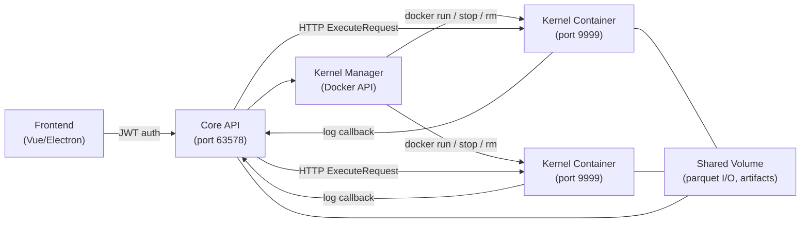
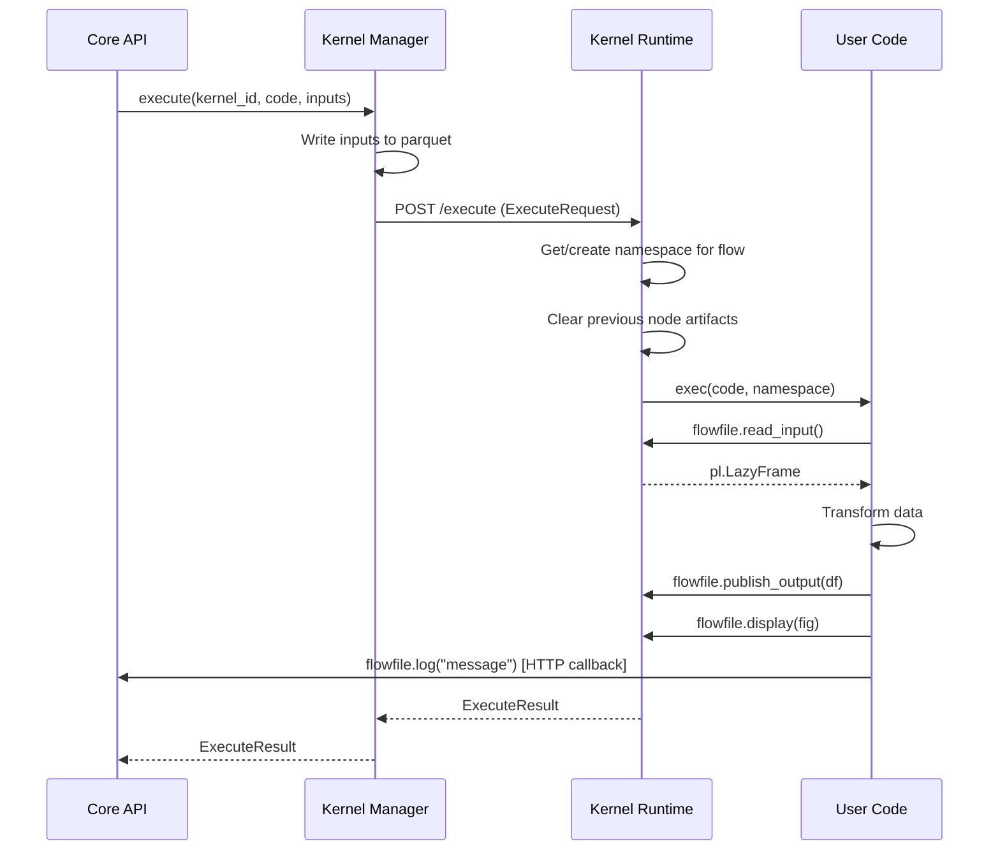

# Kernel Architecture

The kernel system provides isolated Python code execution inside Docker containers. This page explains the internal architecture, component interactions, and key design decisions.

!!! info "Looking for the user guide?"
    See [Kernel Execution](../users/visual-editor/kernels.md) for the user-facing documentation on how to write code and use the `flowfile` API inside kernels.

---

## Overview

The kernel system consists of two main components:

1. **Kernel Manager** (`flowfile_core/flowfile_core/kernel/`) — Orchestrates Docker container lifecycle and proxies execution requests from the Core API
2. **Kernel Runtime** (`kernel_runtime/`) — A FastAPI application that runs inside each Docker container, executes user code, and manages artifacts



---

## Kernel Manager

**Location:** `flowfile_core/flowfile_core/kernel/manager.py`

The `KernelManager` is a singleton that runs inside the Core service. It manages all kernel containers for all users.

### Container Lifecycle

| Operation | What Happens |
|-----------|-------------|
| **Create** | Allocates a `KernelInfo` record, persists config to the database |
| **Start** | Verifies the `flowfile-kernel` Docker image exists, runs `docker.containers.run()`, polls `/health` until ready (120s timeout) |
| **Execute** | Serializes inputs to parquet, sends `ExecuteRequest` via HTTP, tracks kernel state |
| **Stop** | Stops and removes the Docker container |
| **Delete** | Stops if running, removes from in-memory registry and database |
| **Shutdown** | Called on Core shutdown — stops all running kernel containers |

### Port Allocation

- **Local mode:** Allocates ports from the range 19000–19999. Each kernel gets a unique host port mapped to container port 9999.
- **Docker-in-Docker mode:** Skips port allocation entirely. Containers communicate via container names on the shared Docker network (`flowfile-network`).

### Docker-in-Docker Support

When the Core service itself runs inside Docker (e.g., via `docker compose`), the manager auto-detects:

- The Docker network to attach kernel containers to
- The named volume covering the shared storage path
- Whether to use container names or `localhost:port` for communication

This is configured automatically — no manual setup required beyond mounting the Docker socket.

### Environment Variables Passed to Kernels

```
KERNEL_PACKAGES="{space-separated packages}"
FLOWFILE_CORE_URL="{core service URL}"
FLOWFILE_INTERNAL_TOKEN="{auth token}"
FLOWFILE_KERNEL_ID="{kernel_id}"
FLOWFILE_HOST_SHARED_DIR="{host path}"          # local mode only
FLOWFILE_KERNEL_SHARED_DIR="{container path}"
PERSISTENCE_ENABLED="true|false"
PERSISTENCE_PATH="{path to artifact storage}"
RECOVERY_MODE="lazy|eager|clear"
```

---

## Kernel Runtime

**Location:** `kernel_runtime/kernel_runtime/main.py`

The runtime is a FastAPI application (port 9999) that runs inside each Docker container. It executes user code and manages artifacts.

### Execution Flow

When the Core sends an `ExecuteRequest`:

1. **Namespace creation** — Creates or reuses a persistent Python namespace for the flow (Jupyter-style cell execution)
2. **Artifact cleanup** — Clears artifacts from previous executions of the same node
3. **Context setup** — Sets up the `flowfile` API context (paths, artifact store, auth token)
4. **Code execution** — Runs user code in a worker thread via `asyncio.to_thread()`
5. **Output capture** — Collects stdout, stderr, display outputs, and artifact metadata
6. **Response** — Returns `ExecuteResult` with all outputs back to Core

<details markdown="1">
<summary>View execution sequence diagram</summary>



</details>

### Thread-based Execution

User code runs in a dedicated thread so the FastAPI event loop stays responsive. The thread ID is tracked to enable cancellation:

- **HTTP interrupt:** `POST /interrupt` injects `KeyboardInterrupt` via `PyThreadState_SetAsyncExc()`
- **Signal fallback:** Docker `kill -SIGUSR1` for blocking C extensions

### Persistent Namespaces

Each flow gets its own Python namespace dictionary (like a Jupyter kernel). Variables defined in one execution are available in subsequent executions of the same flow. Namespaces are stored in an LRU cache (default: 20 flows) to bound memory.

---

## Artifact System

### In-Memory Store

**Location:** `kernel_runtime/kernel_runtime/artifact_store.py`

The `ArtifactStore` is a thread-safe, flow-scoped, in-memory store with optional disk persistence:

- **Flow isolation** — Artifacts are keyed by `(flow_id, name)`, preventing cross-flow conflicts
- **Lazy loading** — Disk-persisted artifacts can be loaded into memory on first access
- **LRU eviction** — Prevents unbounded memory growth for lazy-indexed artifacts
- **Per-key locks** — Lazy loading uses per-key locks to avoid blocking the global lock during I/O

### Disk Persistence

**Location:** `kernel_runtime/kernel_runtime/artifact_persistence.py`

When persistence is enabled, artifacts are written to disk using cloudpickle:

```
{persistence_path}/{flow_id}/{artifact_name}/
  ├── data.artifact     # cloudpickle-serialized object
  └── meta.json         # JSON metadata + SHA-256 checksum
```

SHA-256 checksums validate data integrity on load. Path components are sanitized to prevent directory traversal.

### Serialization

**Location:** `kernel_runtime/kernel_runtime/serialization.py`

Format is auto-detected based on object type:

| Object Type | Format | Rationale |
|-------------|--------|-----------|
| Polars / Pandas DataFrame | Parquet | Efficient columnar storage |
| scikit-learn, NumPy, SciPy, XGBoost, LightGBM, CatBoost | Joblib | Optimized for ML objects |
| Everything else | Cloudpickle | Handles closures and dynamic classes |

A pre-serialization check (`check_pickleable`) validates that objects can be serialized before committing to API calls, providing clear error messages for common issues (lambdas, local classes, open file handles).

---

## Flowfile Client API

**Location:** `kernel_runtime/kernel_runtime/flowfile_client.py`

This module provides the `flowfile` namespace available to user code. It uses `contextvars` for thread-safe execution context management.

### Path Translation

In local Docker mode, the Core API returns paths using the host filesystem. The client translates these to the container's `/shared` mount:

```
Host:      /Users/you/.flowfile/shared/data/input.parquet
Container: /shared/data/input.parquet
```

In Docker-in-Docker mode, paths are identical (same named volume).

### Global Artifact Flow

Publishing to the global catalog follows a three-step protocol:

1. **Prepare** — Kernel calls `POST /artifacts/prepare-upload` to get a staging path (shared filesystem) or presigned URL (S3)
2. **Serialize** — Object is written directly to the staging location
3. **Finalize** — Kernel calls `POST /artifacts/finalize` with checksum and size; Core moves the file to permanent storage

---

## Core-side Components

### API Routes

**Location:** `flowfile_core/flowfile_core/kernel/routes.py`

All endpoints require JWT authentication and enforce user ownership:

| Endpoint | Description |
|----------|-------------|
| `GET /kernels/` | List user's kernels |
| `POST /kernels/` | Create a kernel |
| `POST /kernels/{id}/start` | Start kernel container |
| `POST /kernels/{id}/stop` | Stop kernel container |
| `DELETE /kernels/{id}` | Delete kernel |
| `POST /kernels/{id}/execute` | Execute code |
| `POST /kernels/{id}/execute_cell` | Execute in interactive mode |
| `POST /kernels/{id}/interrupt` | Cancel execution |
| `GET /kernels/{id}/artifacts` | List artifacts |
| `POST /kernels/{id}/clear` | Clear all artifacts |
| `GET /kernels/{id}/display_outputs` | Get display outputs |
| `GET /kernels/{id}/memory` | Get memory usage |
| `GET /kernels/docker-status` | Check Docker availability |

### Database Persistence

**Location:** `flowfile_core/flowfile_core/kernel/persistence.py`

Kernel configurations (id, name, packages, CPU, memory, GPU) are persisted to the SQLAlchemy database. Runtime state (container ID, port, process state) is ephemeral and reconstructed at startup by reclaiming running containers.

### Data Models

**Location:** `flowfile_core/flowfile_core/kernel/models.py`

Key models:

- `KernelConfig` — Input for creating a kernel
- `KernelInfo` — Full kernel state including runtime info
- `KernelState` — Enum: `STOPPED`, `STARTING`, `IDLE`, `EXECUTING`, `ERROR`
- `ExecuteRequest` / `ExecuteResult` — Code execution request and response
- `DisplayOutput` — Rendered visualization (mime_type + data)

---

## Security Model

### Authentication

| Boundary | Mechanism |
|----------|-----------|
| Frontend → Core | JWT tokens (user login) |
| Core → Kernel | Internal token (`X-Internal-Token` header) |
| Kernel → Core (callbacks) | Same internal token |

The internal token is passed per-request in the `ExecuteRequest` and also set as an environment variable in the container for fallback.

### Sandboxing

- **Process isolation** — Each kernel runs in its own Docker container
- **Resource limits** — Memory (`mem_limit`) and CPU (`nano_cpus`) are enforced by Docker
- **Filesystem isolation** — Only the shared volume is mounted; the host filesystem is not accessible
- **User ownership** — Each kernel is owned by the user who created it; other users cannot access it

### Trust Boundaries

Artifact serialization uses pickle/cloudpickle. This is acceptable because:

- Artifacts are only written by user code running inside the kernel
- Users already have arbitrary code execution privileges
- No untrusted external data flows into the artifact store

---

## Docker Setup

### Building the Kernel Image

```bash
# Via docker compose
docker compose build flowfile-kernel

# Or directly
docker build -t flowfile-kernel -f kernel_runtime/Dockerfile kernel_runtime/
```

The image is based on `python:3.12-slim` and includes:

- **Data stack:** Polars, PyArrow, NumPy
- **ML stack:** scikit-learn, Joblib
- **Serialization:** cloudpickle
- **Server:** FastAPI + Uvicorn

### Docker Compose Integration

The `docker-compose.yml` includes a build-only service for the kernel image:

```yaml
flowfile-kernel:
  build:
    context: kernel_runtime
    dockerfile: Dockerfile
  image: flowfile-kernel
  entrypoint: ["true"]
  restart: "no"
  profiles:
    - kernel
```

This service is not started by `docker compose up` — it only builds the image. The Core service creates kernel containers dynamically via the Docker API.

!!! warning "Docker Socket"
    The Core service requires access to the Docker socket (`/var/run/docker.sock`) to manage kernel containers. In production, consider using a Docker socket proxy (e.g., `tecnativa/docker-socket-proxy`) to restrict API access.

### Network Configuration

The Docker network uses a fixed name (`flowfile-network`) so that dynamically created kernel containers can join it:

```yaml
networks:
  flowfile-network:
    driver: bridge
    name: flowfile-network
```

---

## Testing

### Unit Tests

```bash
# Kernel runtime unit tests
pip install -e "kernel_runtime/[test]"
python -m pytest kernel_runtime/tests -v
```

### Integration Tests (Docker Required)

```bash
# Build the kernel image first
docker build -t flowfile-kernel -f kernel_runtime/Dockerfile kernel_runtime/

# Run kernel integration tests
poetry run pytest flowfile_core/tests -m kernel -v
```

The `kernel` pytest marker identifies tests that require Docker. These tests are skipped in environments without Docker and run in a separate CI job.

---

## Related Documentation

- [Kernel Execution](../users/visual-editor/kernels.md) — User guide for writing kernel code
- [Architecture](architecture.md) — Overall Flowfile architecture
- [Docker Deployment](../users/deployment/docker.md) — Docker compose reference
