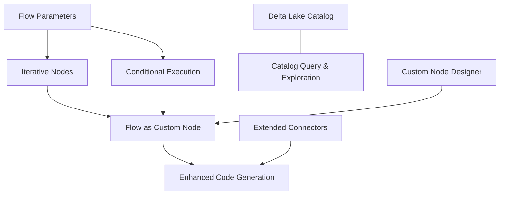

# Feature Roadmap

This section outlines nine planned features for Flowfile. Each feature has a dedicated implementation plan covering motivation, current state, proposed design, schema changes, and affected files.

!!! info "Status"
    These features are in the planning phase. Designs may evolve as implementation progresses.

---

## Foundational Decision: Node Containment Model

Several features (Iterative Nodes, Conditional Execution, Flow as Custom Node) require **container nodes** — nodes that visually and semantically contain other nodes. Today Flowfile uses a flat storage model where every node is a peer in a single list (`FlowfileData.nodes`). There is no `parent_node_id`, no sub-flow nesting, and no cross-flow referencing.

Three approaches were evaluated. **Different features use different approaches** based on their semantics:

| Approach | Description | Used By |
|----------|-------------|---------|
| **Option A — Parent Pointer** | Add `parent_node_id: int \| None` to `FlowfileNode`. Children reference their container. The flat list stays flat. | [Conditional Execution](02_conditional_execution.md) |
| **Option B — Embedded Sub-flow** | The container node's `setting_input` holds a nested `FlowfileData`. The sub-graph is self-contained and independently executable. | [Iterative Nodes](01_iterative_nodes.md) |
| **Option C — Referenced Flow** | The container node stores a `referenced_flow_id` pointing to a catalog-registered flow. The sub-flow is a completely separate file. | [Flow as Custom Node](08_flow_as_custom_node.md) |

### Why not one approach for all three?

- **Conditional branches** are lightweight inline routing — a parent pointer is sufficient and keeps serialization simple. No sub-graph isolation is needed; the branch nodes execute in the same context as the rest of the flow.
- **Iteration** requires a self-contained sub-graph that executes repeatedly per partition. An embedded sub-flow provides clean encapsulation — the execution engine can treat the container as a unit, scatter input, execute the sub-flow N times, and collect results. This avoids implicit sub-graph reconstruction from `parent_node_id` filtering.
- **Flow-as-node** is about reuse across flows. A referenced flow lives in the catalog and can be used by many parent flows. Embedding it would duplicate the definition; a pointer allows single-source-of-truth management and independent versioning.

### Current `FlowfileNode` Schema

```
flowfile_core/flowfile_core/schemas/schemas.py (line 227)
```

```python
class FlowfileNode(BaseModel):
    id: int
    type: str
    is_start_node: bool = False
    description: str | None = ""
    node_reference: str | None = None
    x_position: int | None = 0
    y_position: int | None = 0
    left_input_id: int | None = None
    right_input_id: int | None = None
    input_ids: list[int] | None = Field(default_factory=list)
    outputs: list[int] | None = Field(default_factory=list)
    setting_input: Any | None = None
```

---

## Feature Overview

| # | Feature | Summary | Containment Model |
|---|---------|---------|-------------------|
| 1 | [Iterative Nodes](01_iterative_nodes.md) | Scatter-gather execution over partitions with embedded sub-flows | Option B |
| 2 | [Conditional Execution](02_conditional_execution.md) | If/else branching via parent-pointer grouping | Option A |
| 3 | [Delta Lake Catalog Storage](03_delta_lake_catalog.md) | ACID-compliant catalog storage with time travel | — |
| 4 | [Flow Parameters](04_flow_parameters.md) | Runtime-configurable flow inputs | — |
| 5 | [Catalog Query & Data Exploration](05_catalog_query_exploration.md) | SQL queries and GraphicWalker on catalog tables | — |
| 6 | [Extended Connectors](06_extended_connectors.md) | MySQL, ADLS, GCS, BigQuery, Snowflake + PostgreSQL enhancements | — |
| 7 | [Standardized Custom Node Designer](07_custom_node_designer.md) | Visual designer, packaging, and sharing | — |
| 8 | [Flow as Custom Node](08_flow_as_custom_node.md) | Reuse catalog-registered flows as nodes | Option C |
| 9 | [Enhanced Code Generation](09_enhanced_code_generation.md) | Catalog reads/writes and kernel code wrapping | — |

---

## Dependencies Between Features



- **Flow Parameters (4)** is a prerequisite for iteration (loop variable) and conditions (branch expression).
- **Iterative Nodes (1)** and **Conditional Execution (2)** share containment concepts but use different storage models.
- **Flow as Custom Node (8)** builds on the catalog (for flow registration) and the custom node framework (for UI).
- **Enhanced Code Generation (9)** extends to cover all new node types introduced by other features, including new connectors.
- **Delta Lake (3)** and **Catalog Query (5)** both enhance the catalog layer (internal data managed within Flowfile).
- **Extended Connectors (6)** adds external database/cloud read and write nodes — independent of the catalog.
