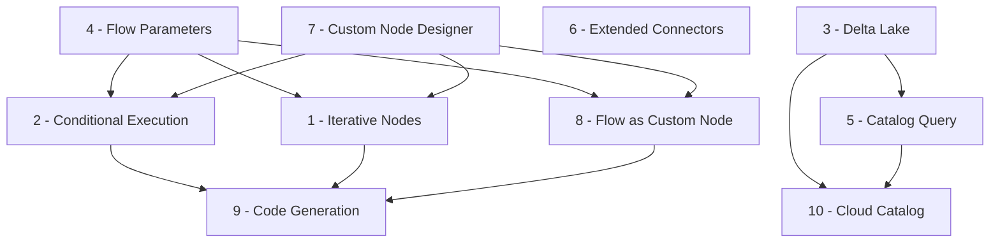

# Feature Roadmap

This section outlines planned features for Flowfile. Each feature has a dedicated implementation plan covering motivation, current state, proposed design, schema changes, and affected files.

!!! info "Status"
    These features are in the planning phase. Designs may evolve as implementation progresses.

---

## Recently Shipped (Context for Roadmap)

These features have landed on `main` and form the foundation for the planned work:

| Feature | PR | Impact on Roadmap |
|---------|----|--------------------|
| **Parallel Execution** | Stage-based topological sort, `ThreadPoolExecutor`, `max_parallel_workers` | Foundation for Features 1 & 2 (iterative/conditional execution stages) |
| **Kernel Runtime** | Docker-based sandboxed Python execution, parquet I/O, artifact management | Foundation for Feature 7 (custom node kernel syntax) |
| **Named Inputs/Outputs** | Python script nodes support multiple named outputs with edge labels | Enables multi-output patterns in Features 7 & 9 |
| **Flow Catalog** | Registration, runs, favorites, hierarchical namespaces, YAML version snapshots | Foundation for Features 3, 5, 8, 10 |
| **Catalog Reader/Writer Nodes** | `catalog_reader`/`catalog_writer` with lineage tracking (`CatalogTableReadLink`) | Foundation for Features 3, 5, 9 |
| **Scheduling Service** | Interval and table-trigger scheduling with distributed locking | Complements Feature 4 (parameterized scheduled runs) |
| **Embeddable WASM** | `FlowfileEditor` as a Vue component library with Pyodide | Informs WASM constraints for Features 3 & 10 |

---

## Foundational Decision: Node Containment Model

Several features (Iterative Nodes, Conditional Execution, Flow as Custom Node) require **container nodes** — nodes that visually and semantically contain other nodes. Today Flowfile uses a flat storage model where every node is a peer in a single list (`FlowfileData.nodes`). There is no `parent_node_id`, no sub-flow nesting, and no cross-flow referencing.

Three approaches were evaluated. **Different features use different approaches** based on their semantics:

| Approach | Description | Used By |
|----------|-------------|---------|
| **Option A — Parent Pointer** | Add `parent_node_id: int \| None` to `FlowfileNode`. Children reference their container. The flat list stays flat. | [Conditional Execution](02_conditional_execution.md) |
| **Option B — Embedded Sub-flow** | The container node's `setting_input` holds a nested `FlowfileData`. The sub-graph is self-contained and independently executable. | [Iterative Nodes](01_iterative_nodes.md) |
| **Option C — Referenced Flow** | The container node stores a `referenced_flow_id` pointing to a catalog-registered flow. The sub-flow is a completely separate file. | [Flow as Custom Node](08_flow_as_custom_node.md) |

### Why not one approach for all three?

- **Conditional branches** are lightweight inline routing — a parent pointer is sufficient and keeps serialization simple. No sub-graph isolation is needed; the branch nodes execute in the same context as the rest of the flow.
- **Iteration** requires a self-contained sub-graph that executes repeatedly per partition. An embedded sub-flow provides clean encapsulation — the execution engine can treat the container as a unit, scatter input, execute the sub-flow N times, and collect results. This avoids implicit sub-graph reconstruction from `parent_node_id` filtering.
- **Flow-as-node** is about reuse across flows. A referenced flow lives in the catalog and can be used by many parent flows. Embedding it would duplicate the definition; a pointer allows single-source-of-truth management and independent versioning.

### Current `FlowfileNode` Schema

```
flowfile_core/flowfile_core/schemas/schemas.py (line 227)
```

```python
class FlowfileNode(BaseModel):
    id: int
    type: str
    is_start_node: bool = False
    description: str | None = ""
    node_reference: str | None = None
    x_position: int | None = 0
    y_position: int | None = 0
    left_input_id: int | None = None
    right_input_id: int | None = None
    input_ids: list[int] | None = Field(default_factory=list)
    outputs: list[int] | None = Field(default_factory=list)
    setting_input: Any | None = None
```

---

## Feature Overview

| # | Feature | Summary | Status |
|---|---------|---------|--------|
| 4 | [Flow Parameters](04_flow_parameters.md) | Runtime-configurable flow inputs | **In progress** (`feature/add-flow-parameters`) |
| 3 | [Delta Lake Catalog Storage](03_delta_lake_catalog.md) | ACID-compliant catalog storage with time travel | Planned |
| 6 | [Extended Connectors](06_extended_connectors.md) | MySQL, ADLS, GCS, BigQuery, Snowflake | Planned |
| 5 | [Catalog Query & Data Exploration](05_catalog_query_exploration.md) | SQL queries and GraphicWalker on catalog tables | Planned |
| 7 | [Standardized Custom Node Designer](07_custom_node_designer.md) | Unified kernel syntax, packaging, and sharing | Planned |
| 2 | [Conditional Execution](02_conditional_execution.md) | Flow-level if/else branching (Option A) | Planned |
| 1 | [Iterative Nodes](01_iterative_nodes.md) | Scatter-gather with embedded sub-flows (Option B) | Planned |
| 9 | [Enhanced Code Generation](09_enhanced_code_generation.md) | Package output, catalog/kernel code, flowfile imports | Planned |
| 8 | [Flow as Custom Node](08_flow_as_custom_node.md) | Reuse catalog-registered flows as nodes (Option C) | Planned |
| 10 | [Cloud & Distributed Catalog](10_cloud_distributed_catalog.md) | PostgreSQL metadata, cloud storage, federation | Planned |

---

## Implementation Order

The features are ordered by a combination of **dependency chains**, **foundational value**, and **user impact**. The numbering (1–10) is the original feature ID; the order below is the recommended implementation sequence.

### Phase 1: Foundations

**Feature 4 — Flow Parameters** (in progress)

Merge the existing `feature/add-flow-parameters` branch. Parameters are a prerequisite for conditional expressions (`if df.count() == ${expected_count}`) and iteration variables. The resolver, frontend panel, CLI support, and 763 lines of tests already exist. Remaining work: typed parameters, execution-time prompt, code generation.

**Feature 3 — Delta Lake Catalog Storage**

The catalog already has reader/writer nodes, lineage tracking, and table registration. Switching from Parquet to Delta Lake as the storage format adds ACID writes, time travel, and schema evolution. This is a storage layer change — the catalog API stays the same. Uses Polars' native `sink_delta()`.

### Phase 2: Expand Connectivity

**Feature 6 — Extended Connectors**

Add MySQL (highest impact), then ADLS/GCS cloud storage, then BigQuery/Snowflake. Each requires implementation, tests, frontend UI, and documentation. PostgreSQL enhancements (partitioned reads, bulk writes) can happen in parallel.

**Feature 5 — Catalog Query & Data Exploration**

With Delta Lake in place and more data flowing through the catalog, add SQL query capability (via `pl.SQLContext`) and enhanced GraphicWalker exploration. The catalog already has table metadata, schemas, and lineage — this makes them queryable and explorable.

### Phase 3: Control Flow

**Feature 7 — Custom Node Designer (kernel unification)**

The visual designer already exists and works well. The focus here is unifying the kernel execution syntax so `process()` code runs as-is in the kernel (no proxy class generation), plus standardized packaging (`.flownode` format). This must land before Features 1 and 2 because iterative/conditional sub-graphs will contain custom nodes.

**Feature 2 — Conditional Execution**

Flow-level if/else branching. Requires `parent_node_id` on `FlowfileNode` (Option A), `ConditionalExecutionStage` in the execution orderer, and VueFlow container rendering. Depends on Feature 4 (parameter expressions in conditions).

**Feature 1 — Iterative Nodes**

Scatter-gather over partitions with embedded sub-flows (Option B). Requires `IterativeExecutionStage`, sub-flow serialization in `setting_input`, and the parallel execution infrastructure already on main. More complex than conditions — benefits from the lessons learned implementing Feature 2.

### Phase 4: Composition & Generation

**Feature 9 — Enhanced Code Generation**

Package output (not single script). Each sub-flow, iterator, condition branch, and custom node becomes a module with a `process()` function. `from flowfile import read_from_catalog` for catalog operations. This can only be complete after Features 1, 2, 7, and 8 define all the node types it needs to generate.

**Feature 8 — Flow as Custom Node**

Reference catalog-registered flows as nodes (Option C). Depends on the catalog system (done), flow parameters (Feature 4), and the custom node framework (Feature 7). Input/output port mapping, parameter passthrough, and version pinning.

### Phase 5: Scale

**Feature 10 — Cloud & Distributed Catalog**

PostgreSQL as metadata database (replacing SQLite), cloud storage for catalog table data (S3/ADLS/GCS), shared catalog for teams, and catalog federation for external tables. This is the most infrastructure-heavy feature and benefits from all prior catalog work being stable.

---

## Dependencies Between Features



- **Flow Parameters (4)** is a prerequisite for conditions, iteration, and flow-as-node.
- **Custom Node Designer (7)** must unify kernel syntax before container nodes (1, 2) contain custom nodes.
- **Iterative Nodes (1)** and **Conditional Execution (2)** share the containment concept but use different storage models.
- **Code Generation (9)** needs all node types finalized before it can generate complete packages.
- **Flow as Custom Node (8)** builds on catalog registration and the custom node framework.
- **Cloud & Distributed Catalog (10)** is the capstone — requires stable catalog infrastructure.
