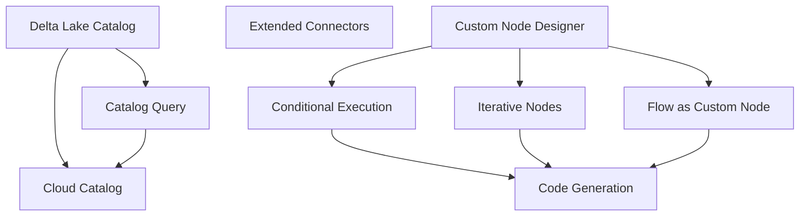

# Feature Roadmap

This section outlines planned features for Flowfile, ordered by implementation sequence. Each feature has a dedicated plan covering motivation, current state, proposed design, and affected files.

---

## Foundational Decision: Node Containment Model

Several features (Iterative Nodes, Conditional Execution, Flow as Custom Node) require **container nodes** — nodes that visually and semantically contain other nodes. Today Flowfile uses a flat storage model where every node is a peer in a single list (`FlowfileData.nodes`). There is no `parent_node_id`, no sub-flow nesting, and no cross-flow referencing.

Three approaches were evaluated. **Different features use different approaches** based on their semantics:

| Approach | Description | Used By |
|----------|-------------|---------|
| **Option A — Parent Pointer** | Add `parent_node_id: int \| None` to `FlowfileNode`. Children reference their container. The flat list stays flat. | [Conditional Execution](02_conditional_execution.md) |
| **Option B — Embedded Sub-flow** | The container node's `setting_input` holds a nested `FlowfileData`. The sub-graph is self-contained and independently executable. | [Iterative Nodes](01_iterative_nodes.md) |
| **Option C — Referenced Flow** | The container node stores a `referenced_flow_id` pointing to a catalog-registered flow. The sub-flow is a completely separate file. | [Flow as Custom Node](08_flow_as_custom_node.md) |

### Why not one approach for all three?

- **Conditional branches** are lightweight inline routing — a parent pointer is sufficient and keeps serialization simple. No sub-graph isolation is needed; the branch nodes execute in the same context as the rest of the flow.
- **Iteration** requires a self-contained sub-graph that executes repeatedly per partition. An embedded sub-flow provides clean encapsulation — the execution engine can treat the container as a unit, scatter input, execute the sub-flow N times, and collect results. This avoids implicit sub-graph reconstruction from `parent_node_id` filtering.
- **Flow-as-node** is about reuse across flows. A referenced flow lives in the catalog and can be used by many parent flows. Embedding it would duplicate the definition; a pointer allows single-source-of-truth management and independent versioning.

### Current `FlowfileNode` Schema

```
flowfile_core/flowfile_core/schemas/schemas.py (line 227)
```

```python
class FlowfileNode(BaseModel):
    id: int
    type: str
    is_start_node: bool = False
    description: str | None = ""
    node_reference: str | None = None
    x_position: int | None = 0
    y_position: int | None = 0
    left_input_id: int | None = None
    right_input_id: int | None = None
    input_ids: list[int] | None = Field(default_factory=list)
    outputs: list[int] | None = Field(default_factory=list)
    setting_input: Any | None = None
```

---

## Implementation Order

| Phase | Feature | Summary |
|-------|---------|---------|
| **1 — Storage** | [Delta Lake Catalog Storage](03_delta_lake_catalog.md) | ACID-compliant catalog storage with time travel and merge support |
| **2 — Connectivity** | [Extended Connectors](06_extended_connectors.md) | MySQL, ADLS, GCS, BigQuery, Snowflake + PostgreSQL enhancements |
| **2 — Connectivity** | [Catalog Query & Data Exploration](05_catalog_query_exploration.md) | SQL queries and GraphicWalker on catalog tables |
| **3 — Control Flow** | [Custom Node Designer](07_custom_node_designer.md) | Unified kernel syntax, packaging, and sharing |
| **3 — Control Flow** | [Conditional Execution](02_conditional_execution.md) | Flow-level if/else branching (Option A) |
| **3 — Control Flow** | [Iterative Nodes](01_iterative_nodes.md) | Scatter-gather with embedded sub-flows (Option B) |
| **4 — Composition** | [Enhanced Code Generation](09_enhanced_code_generation.md) | Package output, catalog/kernel code, flowfile imports |
| **4 — Composition** | [Flow as Custom Node](08_flow_as_custom_node.md) | Reuse catalog-registered flows as nodes (Option C) |
| **5 — Scale** | [Cloud & Distributed Catalog](10_cloud_distributed_catalog.md) | PostgreSQL metadata, cloud storage, federation |

---

### Phase 1: Storage

**Delta Lake Catalog Storage** — The catalog already has reader/writer nodes, lineage tracking, and table registration. Switching from Parquet to Delta Lake adds ACID writes, time travel, and schema evolution. Uses Polars' native `sink_delta()`. This is a storage layer change — the catalog API stays the same.

### Phase 2: Connectivity

**Extended Connectors** — Add MySQL (highest impact), then ADLS/GCS cloud storage, then BigQuery/Snowflake. Each requires implementation, tests, frontend UI, and documentation. PostgreSQL enhancements (partitioned reads, bulk writes) can happen in parallel.

**Catalog Query & Data Exploration** — With Delta Lake in place and more data flowing through the catalog, add SQL query capability (via `pl.SQLContext`) and enhanced GraphicWalker exploration. The catalog already has table metadata, schemas, and lineage — this makes them queryable and explorable.

### Phase 3: Control Flow

**Custom Node Designer (kernel unification)** — The visual designer already exists and works well. The focus is unifying the kernel execution syntax so `process()` code runs as-is in the kernel (no proxy class generation), plus standardized packaging (`.flownode` format). This must land before iterative/conditional nodes because their sub-graphs will contain custom nodes.

**Conditional Execution** — Flow-level if/else branching. Requires `parent_node_id` on `FlowfileNode` (Option A), `ConditionalExecutionStage` in the execution orderer, and VueFlow container rendering.

**Iterative Nodes** — Scatter-gather over partitions with embedded sub-flows (Option B). Requires `IterativeExecutionStage`, sub-flow serialization in `setting_input`, and the parallel execution infrastructure already on main. More complex than conditions — benefits from lessons learned implementing conditional execution.

### Phase 4: Composition & Generation

**Enhanced Code Generation** — Package output (not single script). Each sub-flow, iterator, condition branch, and custom node becomes a module with a `process()` function. `from flowfile import read_from_catalog` for catalog operations. This can only be complete after all node types are defined.

**Flow as Custom Node** — Reference catalog-registered flows as nodes (Option C). Input/output port mapping, parameter passthrough, and version pinning.

### Phase 5: Scale

**Cloud & Distributed Catalog** — PostgreSQL as metadata database (replacing SQLite), cloud storage for catalog table data (S3/ADLS/GCS), shared catalog for teams, and catalog federation for external tables.

---

## Dependencies


