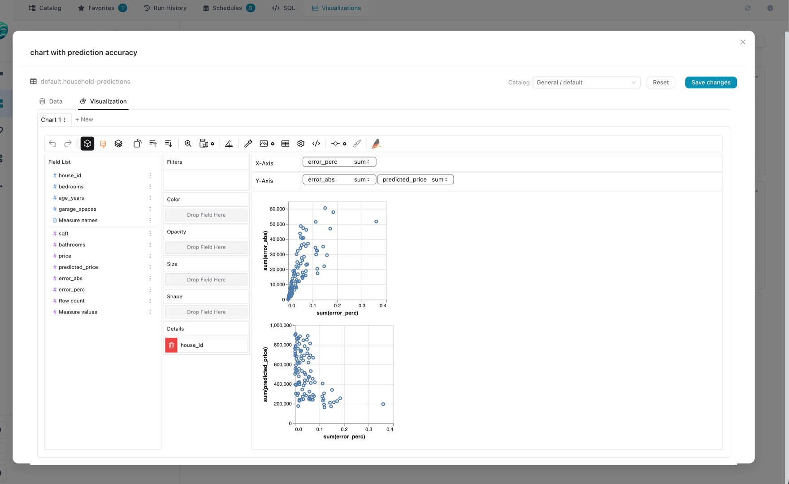

# Visualizations & Graphic Walker

Flowfile users build interactive charts on top of any catalog table or SQL query. The chart UI itself is [Graphic Walker](https://github.com/Kanaries/graphic-walker), and every aggregation it produces runs through [polars-gw](https://github.com/Edwardvaneechoud/polars-gw) against the underlying data. The feature has two distinct halves: a small CRUD surface that saves chart specifications in the catalog, and a hot path that answers a flood of small Polars queries while the user is editing.

This page covers the *why* — how the data is kept warm, where each request goes, and what cleans up. The user-facing tour lives at [Visual Editor → Catalog → Visualizations](../users/visual-editor/catalog/visualizations.md).



*The Graphic Walker editor mounted in the catalog; every drag on a shelf produces a Polars query against the source.*

---

## The shape of the problem

Graphic Walker fires a query at the backend **every time the user drops or removes a field**. Sum of `revenue` by `region` is one query; switching the aggregation to mean is another; adding a year filter is a third. Each individual query is small, but they arrive in rapid bursts and they all hit the same dataset.

Reopening the source for every query would feel terrible — every drag would re-scan or re-load gigabytes. The data has to stay warm in memory between queries. But it also can't sit inside Flowfile's main API process: a pinned `LazyFrame` would fatten the core process, monopolise its event loop, and bring everything down with the first slow query.

That tension drives the rest of the design.

---

## The four-process picture

```
Frontend (Vue + Graphic Walker)
       │
       │  HTTP
       ▼
flowfile_core         catalog CRUD, auth, "where does this viz read from?"
       │
       │  HTTP
       ▼
flowfile_worker       thin FastAPI; routes requests to the right child
       │
       │  multiprocessing queues
       ▼
spawned child         imports Polars, holds the LazyFrame, runs polars-gw
```

Two boundaries do real work here:

- **Core never touches a `LazyFrame`.** It resolves *where* a visualization reads from — a Delta table, a SQL string, a Python flow — and ships a small descriptor to the worker. That keeps core small and responsive.
- **The worker's FastAPI process doesn't import Polars either.** It dispatches. The actual heavy lifting — Polars, polars-gw, dataset memory — lives in spawned child processes that the parent only knows about through queues.

The second boundary is the unusual one. Polars is memory-heavy and aggressively multithreaded; mixing it into the request-serving process means one slow query starves every other chart. Pushing it out to a child fixes that.

---

## The pool

When a chart query arrives, the worker looks up the source's `session_key` and either reuses a long-lived child dedicated to that source, or spawns one. The child has already opened the data, so it just runs the new chart workflow against an in-memory `LazyFrame` and ships rows back.

That makes it a **pool**. The first query to a source pays the load cost; the next thousand are cheap. Every interaction in the editor reduces to "push request onto a queue, run polars-gw, return rows" — no disk I/O, no re-parse, no Python startup.

Two properties fall out of how the pool is keyed:

- **Same source, same child.** Successive queries from one visualization reuse the warm `LazyFrame`. A per-handle lock guarantees that two browser tabs editing the same visualization don't trip over each other's responses.
- **Different sources, different children, in parallel.** Two users on two tables — or one user with two visualization tabs open — run in separate processes that don't block each other. There is no global lock between sessions.

`flowfile_worker/viz_sessions.py` is the registry. `flowfile_worker/viz_session_worker.py` is the entry point that runs inside each spawned process — and the **only** place anywhere in the worker that imports Polars and polars-gw.

---

## Why the pool cleans itself up

Each child holds a real, live dataset, so left alone they accumulate and the worker host eventually OOMs. The pool is bounded and self-pruning, with several overlapping mechanisms because no single one catches every scenario:

- **Idle children expire.** A reaper thread runs every 30s and tears down anything that hasn't been used in roughly five minutes.
- **Old children rotate out.** After a long lifetime (~30 minutes) or enough requests served (~500), the next request gets a fresh child. This catches slow memory drift inside Polars and polars-gw — the kind that doesn't surface in any single query.
- **The pool itself is capped.** Beyond ~32 concurrent sessions the least-recently-used one is evicted.
- **Catalog edits evict.** Deleting a saved visualization, or changing the source table, fires an explicit evict so stale data isn't returned.
- **Shutdown reaps everyone.** The worker's FastAPI lifespan hook drains queues and kills every child on exit.

Every one of these paths runs the child through the same shutdown sequence: send a graceful stop, wait briefly, terminate, kill if it's still alive, drop references. Nothing is kept around on the assumption it might be needed later.

The actual numeric thresholds live as constants at the top of `viz_sessions.py` and are tunable knobs, not load-bearing magic.

---

## What a "visualization" looks like at rest

A visualization is a row in `catalog_visualizations`: a name, a Graphic Walker chart spec (JSON, possibly multi-tab), a pointer to either a catalog table or an inline SQL query, and a thumbnail PNG captured client-side at save time. Schemas live in `flowfile_core/schemas/catalog_schema.py`.

A visualization never embeds the data — it embeds *how to find the data*. That's why deleting the underlying table doesn't cascade-delete the visualization (it becomes orphaned and the library labels it as such), why moving a visualization between namespaces is free, and why a SQL visualization can reference whatever tables exist in the catalog at query time.

---

## Adding a new source kind

To support a new source — a remote Postgres, a parquet on S3, anything — the touchpoints are:

1. Extend the source descriptor in core, and the matching worker model, so the new kind is expressible.
2. Teach `CatalogService` to translate it into a worker descriptor and emit a deterministic `session_key`. The session key is what lets the pool reuse children.
3. Teach `viz_session_worker._build_viz_loader_in_child` to open the new kind as a Polars `LazyFrame`.

Path validation and source resolution live in core on purpose. The worker child should treat its inputs as already-validated names plus an opaque chart payload — defence-in-depth is core's job.

---

## Tests

- `flowfile_core/tests/test_catalog_visualizations.py` — CRUD, validation, dispatch into the worker triggers.
- `flowfile_worker/tests/test_catalog_visualize.py` — registry behaviour and the spawned-child path, including a structural test that the per-handle lock really is per-handle.
- `flowfile_worker/tests/test_resolve_virtual_table.py` — the IPC materialisation step used when a visualization reads from a Python flow.
