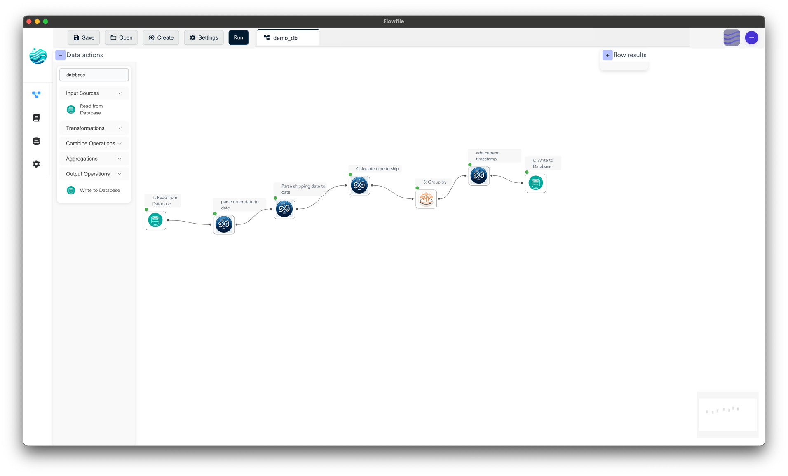
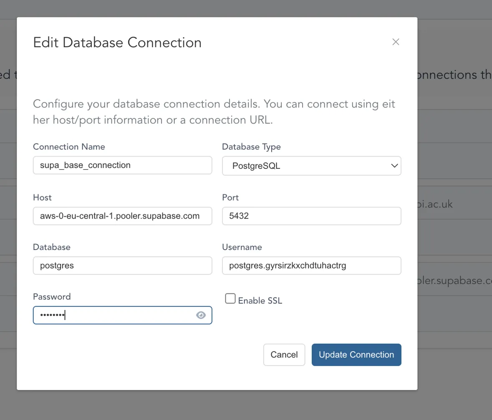
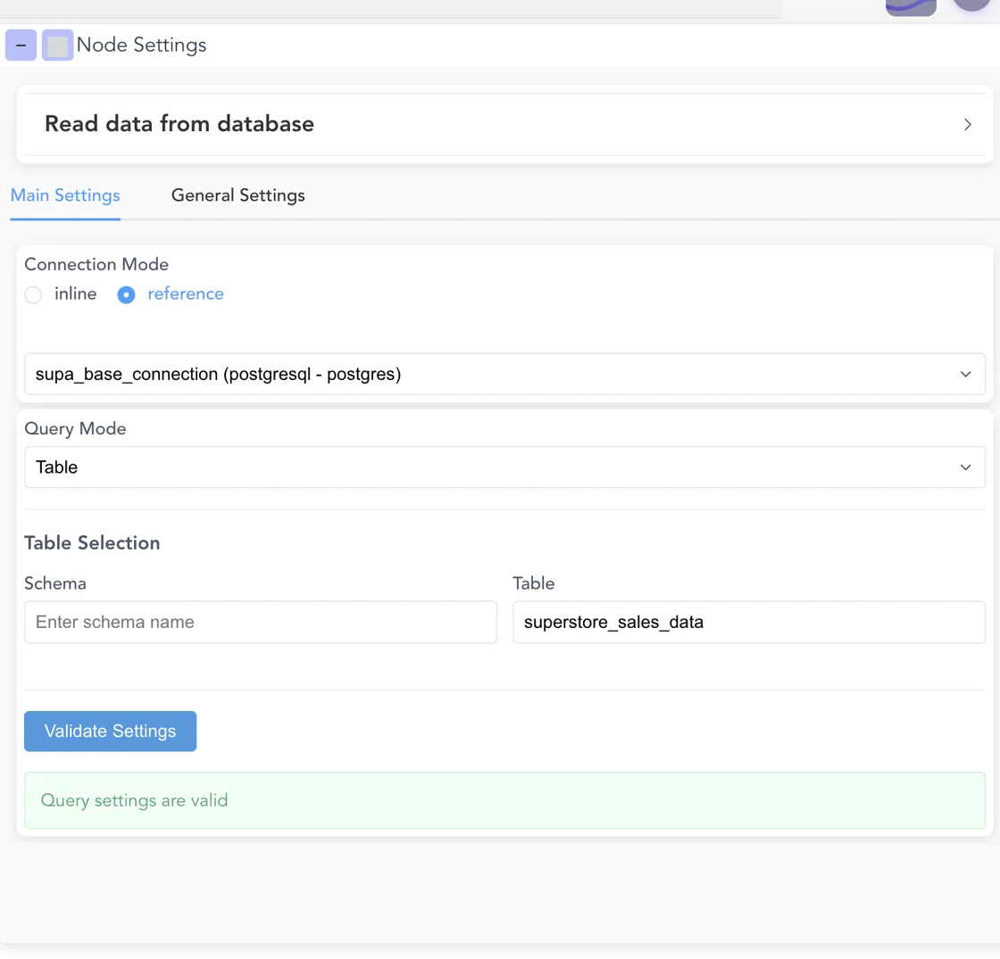
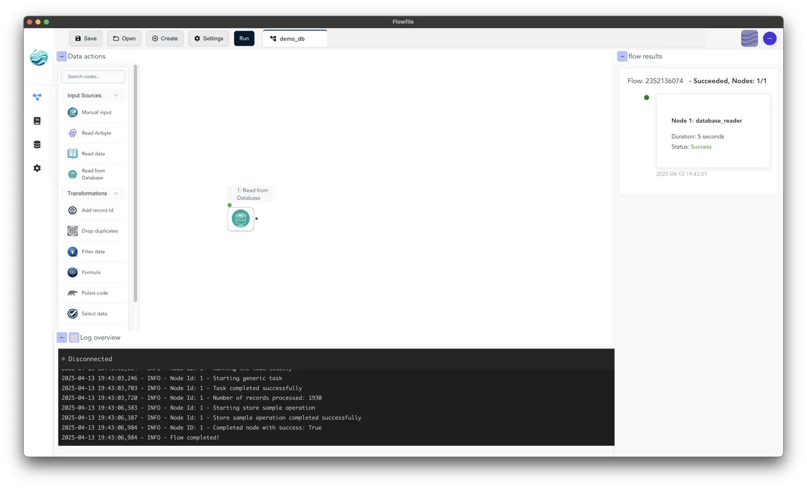
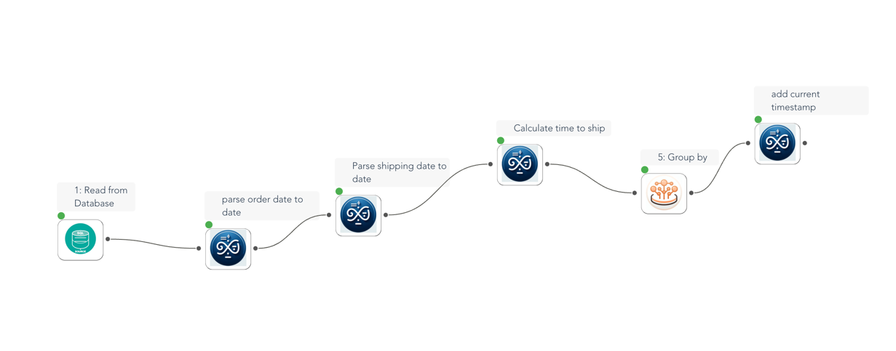
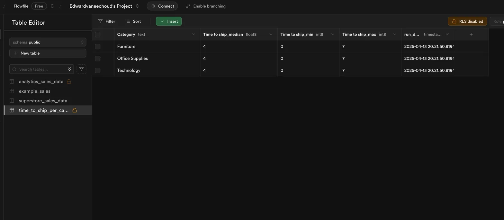

# How to Connect and Work with PostgreSQL Databases in Flowfile

###  Full flow overview

Flowfile's latest release introduces powerful database connectivity features that allow you to seamlessly integrate with PostgreSQL databases like Supabase. In this comprehensive guide, I'll walk you through the entire process of connecting to a database, reading data, transforming it, and writing it back.

## Prerequisites

Before diving in, make sure you have:

- A Flowfile account (free tier works fine)
- A Supabase account ([sign up here](https://supabase.com) if needed)
- Sample data to work with (we're using the [Sales Forecasting Dataset](https://www.kaggle.com/datasets/rohitsahoo/sales-forecasting) from Kaggle)

## Step 1: Set Up Your Supabase Database

1. Create a new project in Supabase
2. Download the sample dataset from Kaggle
3. Create a new table in your Supabase project (e.g., `superstore_sales_data`)
4. Import the dataset into your table
5. Note your database connection details (host, port, username, password)

## Step 2: Configure Your Database Connection in Flowfile

1. Open Flowfile and navigate to the database connection manager
2. Click "Create New Connection"
3. Fill in your connection details:
   - Connection Name: `supa_base_connection` (or any name you prefer)
   - Database Type: PostgreSQL
   - Host: Your Supabase host (e.g., `aws-0-eu-central-1.pooler.supabase.com`)
   - Port: `5432`
   - Database: `postgres`
   - Username: Your Supabase username
   - Password: Your Supabase password
   - Enable SSL: Check if required by your database
4. Click "Update Connection" to save

###  Connection overview

## Step 3: Create a New Data Flow

1. Click "Create" or "New Flow" to start a fresh workflow
2. Navigate to the "Data actions" panel on the left sidebar
3. Find the "Read from Database" node (look for the database icon)
4. Drag and drop this node onto your canvas

## Step 4: Configure Your Database Read Operation

1. Click on the "Read from Database" node to open its settings
2. Select "reference" for Connection Mode
3. Choose your `supa_base_connection` from the dropdown
4. Configure the table settings:
   - Schema: `public` (or your specific schema)
   - Table: `superstore_sales_data`
5. Click "Validate Settings" to ensure everything is working
6. You should see a green confirmation message: "Query settings are valid"
###  Node Settings panel showing database read configuration

## Step 5: Run Your Initial Flow

1. Click the "Run" button in the top toolbar
2. Watch the flow execution in the log panel
3. When completed, you'll see a success message and the number of records processed
4. You can now click on the node to preview the data that was read from your database

###  Flow execution with logs showing successful database connection 

## Step 6: Add Data Transformations

Now that you've successfully read data from your database, you can add transformation steps:

1. Add transformation nodes from the left panel to your workflow:
   - Parse date nodes for order and shipping dates
   - Formula nodes for calculations
   - Aggregation nodes for grouping data
2. Connect these nodes in sequence by dragging from the output dot of one node to the input dot of the next
3. Configure each node with the specific transformations you need
4. For example, creating time-to-ship metrics by category:
   - Add a "Formula" node to calculate shipping time
   - Add a "Group by" node to aggregate by product category
   - Calculate min, max, and median shipping times
###  Overview of connected transformation nodes

## Step 7: Add a Write to Database Node

1. From the left panel, find and drag the "Write to Database" node onto your canvas
2. Connect it to the last transformation node in your workflow
3. Configure the write operation:
   - Select the same database connection
   - Choose the schema (e.g., `public`)
   - Enter a name for your output table (e.g., `time_to_ship_per_category`)
   - Select how to handle existing tables:
     - **Append**: Add new data to an existing table
     - **Replace**: Delete existing table and create new one
     - **Fail**: Abort if table already exists

###  Setup write to database

## Step 8: Run Your Complete Workflow

1. Click "Run" to execute the full workflow
2. The system will:
   - Read data from your source table
   - Apply all transformations
   - Write the results to your destination table
3. Check the logs to confirm successful execution
4. You'll see messages confirming the number of records processed and stored
5. Navigate to the Table in Supabase and checkout the new data!
###  Overview of complete run with logs showing successful database connection

## Conclusion

Flowfile's database integration capabilities make it incredibly simple to build professional-grade data pipelines without writing code. By connecting to Supabase or other PostgreSQL databases, you can easily extract, transform, and load data in a visual, intuitive environment.

Whether you're creating business dashboards, data warehousing solutions, or just exploring your data, the combination of Flowfile's visual workflow and Supabase's powerful PostgreSQL hosting gives you a robust platform for all your data needs.

Feel free to experiment with different transformation nodes and workflow patterns to build increasingly sophisticated data pipelines!

---

*This guide is based on Flowfile v0.2.0, which introduced database connectivity features including PostgreSQL support, secure credential storage, and flexible connection management options.*