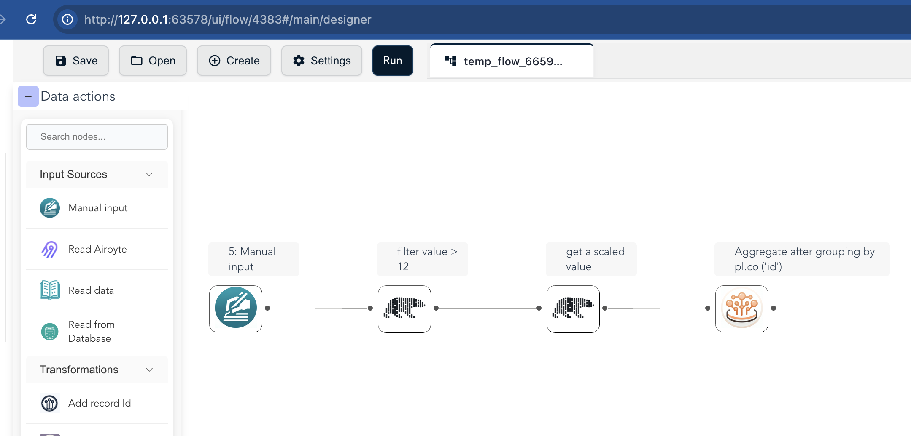
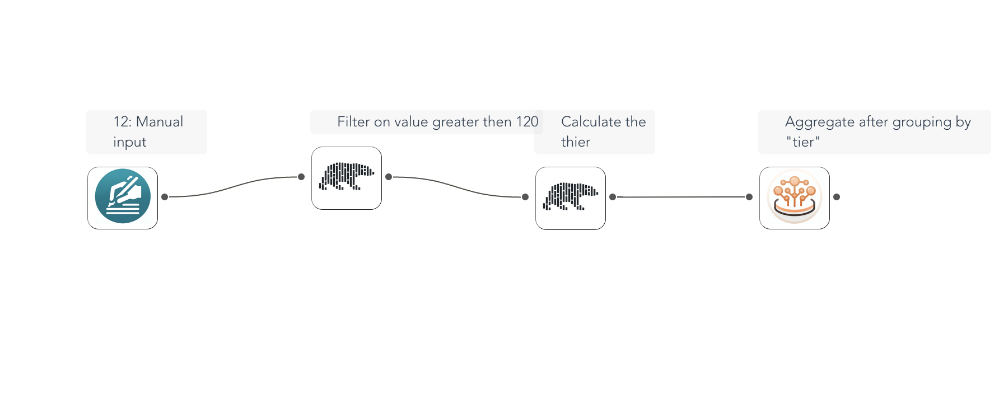

# Building Flows with code

The `flowfile_frame` module provides a powerful, Polars-like API that allows you to define and execute data transformation pipelines in Python while automatically generating a visual ETL graph.  
<sub><sup>[Source: readme.md]</sup></sub>

---

## Overview

`flowfile_frame` is designed to bridge the gap between writing code and visual workflow design. It offers:

- A familiar API for those accustomed to Pandas or Polars.  
- Automatic generation of an ETL graph from your Python code.  
- The ability to visualize, save, and share your data pipelines in the Flowfile Designer UI.  
- The performance benefits of the Polars engine.  

---

## Installation

The `flowfile_frame` module is included with the standard `flowfile` package.

```bash
pip install flowfile
```

### Quick Start
You can create a data pipeline programmatically and see the results:


```python
import flowfile as ff
from flowfile import col, open_graph_in_editor

df = ff.from_dict({
    "id": [1, 2, 2],
    "value": [10, 20, 15]
})

result = df.filter(col("value") > 12, description="filter value > 12").with_columns(
    (col("value") * 10).alias("scaled_value"), description="get a scaled value"
).group_by(col("id")).agg(col("value").sum().alias("sum_value"),
                        col("value").max().alias("max_value"),
                        col("value").min().alias("min_value"))
df = result.collect()  # provides a polars dataframe
open_graph_in_editor(result.flow_graph)
```
<details markdown="1">
<summary>Generated Flow in Flowfile UI</summary>


</details>

## Visualizing Your Pipeline

One of the most powerful features of `flowfile_frame` is its ability to convert your code into a visual graph that can be opened in the Flowfile UI.

You can build more advanced pipelines with conditional logic, grouping, and aggregation — and then instantly visualize them.

```python
import flowfile as ff
from flowfile import open_graph_in_editor

# Create a more complex data pipeline
df = ff.from_dict({
    "id": [1, 2, 3, 4, 5],
    "category": ["A", "B", "A", "C", "B"],
    "value": [100, 200, 150, 300, 250]
})

aggregated_df = (
    df
    .filter(ff.col("value") > 120, description='Filter on value greater then 120')
    .with_columns([
        (ff.col("value") * 1.1).alias("adjusted_value"),
        ff.when(ff.col("category") == "A").then(ff.lit("Premium"))
          .when(ff.col("category") == "B").then(ff.lit("Standard"))
          .otherwise(ff.lit("Basic")).alias("tier")
    ], description='Calculate the thier')
    .group_by("tier")
    .agg([
        ff.col("adjusted_value").sum().alias("total_value"),
        ff.col("id").count().alias("count")
    ])
)

# This will launch the Flowfile Designer UI and render your pipeline
open_graph_in_editor(aggregated_df.flow_graph)
```
<details markdown="1">
<summary>Generated Flow in Flowfile UI</summary>


</details>

When you run `open_graph_in_editor(...)`, the Flowfile Designer UI will open and display a visual graph of your pipeline. You can:

* Inspect each transformation node
* Continue modifying your logic visually
* Share or export your pipeline

### Benefits Summary
By combining the declarative power of a Polars-like API with Flowfile’s interactive designer, `flowfile_frame` gives you:

* Code-first development with automatic visualization
* Zero-config ETL graph generation
* Easy debugging and collaboration