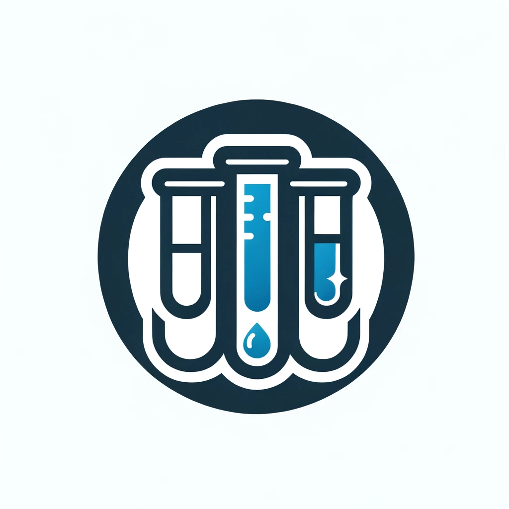

# Transform Nodes

Transform nodes modify and shape your data. These nodes handle everything from basic operations like filtering and sorting to more complex transformations like custom formulas and text manipulation.

## Node Details

### { width="50" height="50" } Formula

The Formula node allows you to create new columns or modify existing ones using expressions.

**Key Features:**
- Create new columns
- Modify existing columns
- Use mathematical operations
- Apply string functions
- Perform conditional logic

**Usage:**
1. Drag the Formula node onto your canvas
2. Connect input data
3. Write your formula expression
4. Preview the results
5. Configure column names

---

### { width="50" height="50" } Select Data

The Select Data node lets you choose which columns to keep and in what order.

**Key Features:**
- Select specific columns
- Reorder columns
- Rename columns
- Default settings available

**Usage:**
1. Connect input data
2. Choose columns to keep
3. Drag to reorder columns
4. Optionally rename columns
5. Preview the result

---

### { width="50" height="50" } Filter Data

The Filter Data node allows you to keep only the rows that match specific conditions.

**Key Features:**
- Filter by single or multiple conditions
- Support for different operators (equals, greater than, etc.)
- Combine conditions with AND/OR logic
- Filter by column values

**Usage:**
1. Set up filter conditions
2. Choose comparison operators
3. Set filter values
4. Preview filtered results

---

### { width="50" height="50" } Sort Data

The Sort Data node orders your data based on one or more columns.

**Key Features:**
- Sort by multiple columns
- Ascending or descending order
- Default settings available
- Maintain sort stability

**Usage:**
1. Select columns to sort by
2. Choose sort direction for each column
3. Preview sorted data

---

### { width="50" height="50" } Add Record ID

The Add Record ID node creates a unique identifier for each row in your dataset.

**Key Features:**
- Generate sequential IDs
- Customize ID column name
- Option for different ID formats
- Preserve existing order

**Usage:**
1. Configure ID column name
2. Choose ID format
3. Preview results

---

### { width="50" height="50" } Take Sample

The Take Sample node lets you work with a subset of your data.

**Key Features:**
- Random sampling
- Fixed size samples
- Percentage-based sampling
- Default settings available

**Usage:**
1. Choose sample method
2. Set sample size
3. Preview sampled data

---

### { width="50" height="50" } Drop Duplicates

The Drop Duplicates node removes duplicate records from your dataset.

**Key Features:**
- Select columns to check for duplicates
- Keep first or last occurrence
- Track duplicate removal
- View duplicate counts

**Usage:**
1. Select columns to check
2. Choose keep strategy
3. Preview unique records

---

### { width="50" height="50" } Text to Rows

The Text to Rows node splits text in a column into multiple rows.

**Key Features:**
- Split by delimiter
- Handle multiple split patterns
- Preserve other columns
- Configure output structure

**Usage:**
1. Select text column
2. Configure split options
3. Preview split results

---

### { width="50" height="50" } Polars Code

The Polars Code node allows you to write custom Polars DataFrame operations.

**Key Features:**
- Write custom Polars code
- Access full Polars API
- Multiple operations in one node
- Code validation

**Usage:**
1. Write Polars code
2. Test transformation
3. Preview results
4. Validate output

## Technical Notes

### Input/Output Specifications
| Node | Inputs | Output |
|------|--------|---------|
| Formula | 1 | 1 |
| Select Data | 1 | 1 |
| Filter Data | 1 | 1 |
| Sort Data | 1 | 1 |
| Add Record ID | 1 | 1 |
| Take Sample | 1 | 1 |
| Drop Duplicates | 1 | 1 |
| Text to Rows | 1 | 1 |
| Polars Code | 1 | 1 |

### Best Practices
- Preview transformations before connecting to other nodes
- Use descriptive names for new columns
- Consider performance with large datasets
- Test edge cases in your transformations