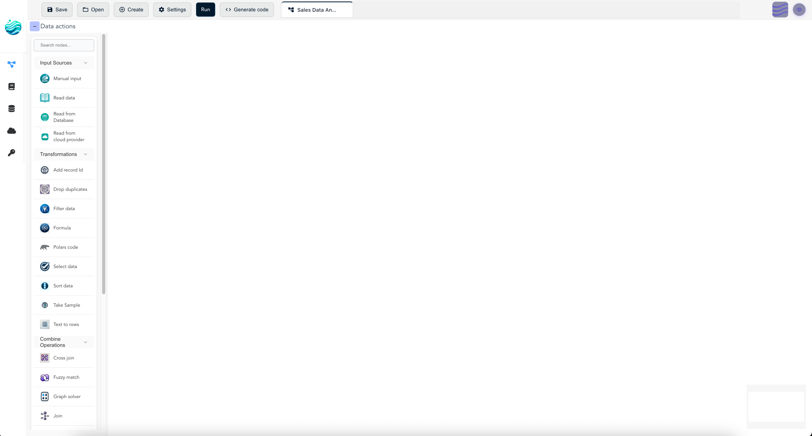
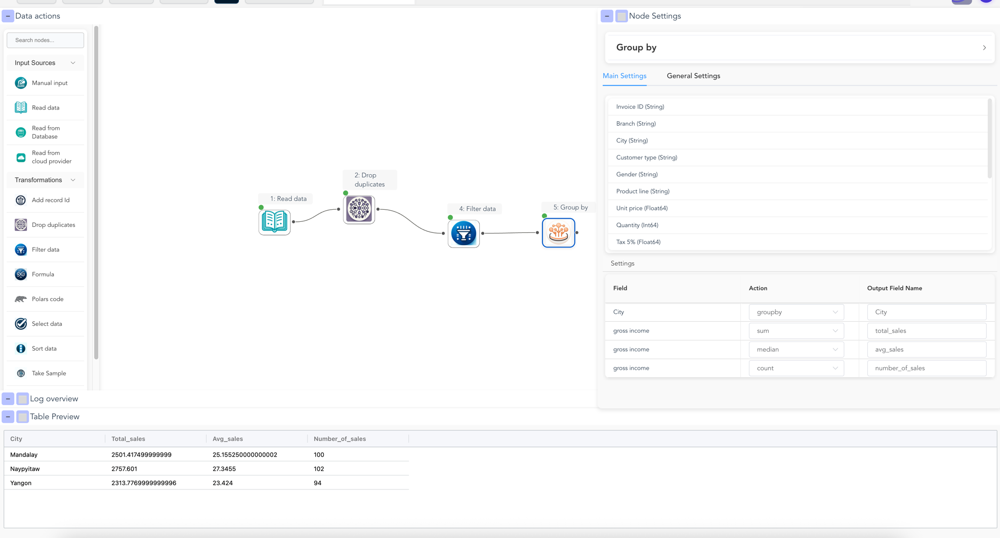
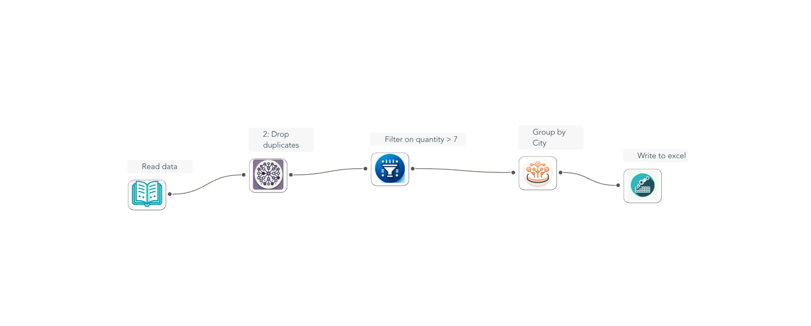

# Quick Start Guide

<div align="center" style="padding: 1rem;">
  
  <h2 style="font-size: clamp(1.5rem, 4vw, 2rem); margin: 1rem 0;">Get Started with Flowfile in 5 Minutes</h2>
</div>

## Installation

<div style="background: linear-gradient(135deg, #667eea 0%, #764ba2 100%); padding: clamp(1rem, 3vw, 2rem); border-radius: 12px; color: white; margin: 2rem auto; max-width: 100%;">
  <h3 style="margin-top: 0; color: white; font-size: clamp(1.2rem, 3vw, 1.5rem);">Recommended quickstart: Install from PyPI</h3>
  <pre style="background: rgba(0,0,0,0.3); padding: 1rem; border-radius: 8px; color: white; overflow-x: auto; -webkit-overflow-scrolling: touch;"><code>pip install flowfile</code></pre>
  <p style="margin-bottom: 0; font-size: clamp(0.9rem, 2vw, 1rem);">This installs everything you need - the Python API, visual editor, and all services.</p>
</div>

### Alternative Installation Methods

<details markdown="1">
<summary><b>Desktop Application (Pre-built Installer)</b></summary>

Download the latest installer for your platform:
- **Windows**: [Flowfile-Setup.exe](https://github.com/Edwardvaneechoud/Flowfile/releases)
- **macOS**: [Flowfile.dmg](https://github.com/Edwardvaneechoud/Flowfile/releases) 

> **Note**: You may see security warnings since the installer isn't signed. On Windows, click "More info" → "Run anyway". On macOS, right-click → "Open" → confirm.

</details>

<details>
<summary><b>Development Setup (From Source)</b></summary>

```bash
# Clone repository
git clone https://github.com/edwardvaneechoud/Flowfile.git
cd Flowfile

# Install with Poetry
poetry install

# Start services
poetry run flowfile_worker  # Terminal 1 (port 63579)
poetry run flowfile_core    # Terminal 2 (port 63578)

# Start frontend
cd flowfile_frontend
npm install
npm run dev:web  # Terminal 3 (port 8080)
```

</details>

---

## Choose Your Path

<div style="display: grid; grid-template-columns: repeat(auto-fit, minmax(280px, 1fr)); gap: clamp(1rem, 3vw, 2rem); margin: clamp(2rem, 4vw, 3rem) 0;">

<div style="border: 2px solid #00CED1; border-radius: 12px; padding: clamp(1rem, 3vw, 1.5rem); background: linear-gradient(135deg, rgba(0,206,209,0.05) 0%, rgba(107,70,193,0.05) 100%);">
  <h3 style="color: #00CED1; margin-top: 0; font-size: clamp(1.1rem, 2.5vw, 1.3rem);">Non-Technical Users</h3>
  <p style="font-size: clamp(0.9rem, 2vw, 1rem);"><strong>Perfect for:</strong> Analysts, business users, Excel power users</p>
  <p style="font-size: clamp(0.9rem, 2vw, 1rem);"><strong>No coding required!</strong></p>
  
  <ul style="list-style: none; padding: 0; margin: 1rem 0;">
    <li style="padding: 0.25rem 0; font-size: clamp(0.85rem, 2vw, 0.95rem);">✅ Drag and drop interface</li>
    <li style="padding: 0.25rem 0; font-size: clamp(0.85rem, 2vw, 0.95rem);">✅ Visual data preview</li>
    <li style="padding: 0.25rem 0; font-size: clamp(0.85rem, 2vw, 0.95rem);">✅ Export to Excel/CSV</li>
    <li style="padding: 0.25rem 0; font-size: clamp(0.85rem, 2vw, 0.95rem);">✅ Built-in transformations</li>
  </ul>
  
  <a href="#non-technical-quickstart" style="display: inline-block; background: #00CED1; color: white; padding: clamp(0.6rem, 2vw, 0.8rem) clamp(1rem, 3vw, 1.5rem); border-radius: 8px; text-decoration: none; font-weight: bold; margin-top: 1rem; font-size: clamp(0.9rem, 2vw, 1rem); text-align: center; width: 100%; box-sizing: border-box;">Start Visual Tutorial →</a>
</div>

<div style="border: 2px solid #8B5CF6; border-radius: 12px; padding: clamp(1rem, 3vw, 1.5rem); background: linear-gradient(135deg, rgba(139,92,246,0.05) 0%, rgba(0,206,209,0.05) 100%);">
  <h3 style="color: #8B5CF6; margin-top: 0; font-size: clamp(1.1rem, 2.5vw, 1.3rem);">Technical Users</h3>
  <p style="font-size: clamp(0.9rem, 2vw, 1rem);"><strong>Perfect for:</strong> Developers, data scientists, engineers</p>
  <p style="font-size: clamp(0.9rem, 2vw, 1rem);"><strong>Full programmatic control!</strong></p>
  
  <ul style="list-style: none; padding: 0; margin: 1rem 0;">
    <li style="padding: 0.25rem 0; font-size: clamp(0.85rem, 2vw, 0.95rem);">✅ Polars-compatible API</li>
    <li style="padding: 0.25rem 0; font-size: clamp(0.85rem, 2vw, 0.95rem);">✅ Cloud storage integration</li>
    <li style="padding: 0.25rem 0; font-size: clamp(0.85rem, 2vw, 0.95rem);">✅ Version control friendly</li>
    <li style="padding: 0.25rem 0; font-size: clamp(0.85rem, 2vw, 0.95rem);">✅ Complex dynamic logic</li>
  </ul>
  
  <a href="#technical-quickstart" style="display: inline-block; background: #8B5CF6; color: white; padding: clamp(0.6rem, 2vw, 0.8rem) clamp(1rem, 3vw, 1.5rem); border-radius: 8px; text-decoration: none; font-weight: bold; margin-top: 1rem; font-size: clamp(0.9rem, 2vw, 1rem); text-align: center; width: 100%; box-sizing: border-box;">Start Python Tutorial →</a>
</div>

</div>

---

## Quick Start for Non-Technical Users {#non-technical-quickstart}

<div style="background: linear-gradient(135deg, #667eea 0%, #764ba2 100%); padding: clamp(1rem, 3vw, 1.5rem); border-radius: 8px; margin: 2rem 0; color: white;">
<strong style="font-size: clamp(0.95rem, 2vw, 1.1rem);">Goal:</strong> <span style="font-size: clamp(0.9rem, 2vw, 1rem);">Clean and analyze sales data without writing any code</span>
</div>

### Step 1: Start Flowfile, and create a Flow

Open your terminal (Command Prompt on Windows, Terminal on Mac) and type:

```bash
flowfile run ui
```
Your browser should automatically open to the Flowfile UI.
!!! warning "If the browser does not open automatically"
    If the browser does not open automatically, you can manually navigate to [http://127.0.0.1:63578/ui#/main/designer](http://127.0.0.1:63578/ui#/main/designer) in your web browser.

<div markdown="1" style="background-color: rgba(0, 0, 0, 0.1); padding: clamp(1rem, 3vw, 1.5rem); border-radius: 8px; margin: 1rem 0;">

**Creating your First Flow:**

1. **Click "Create"** to create a new data pipeline
2. **Click "Create New File Here"**
3. **Name your flow** (e.g., "Sales Data Analysis")
4. **Click on "Settings"** in the top right to configure your flow
5. **Set the Execution mode** to "Development"

</div>

Your should see now an empty flow:
New clean flow interface


### Step 2: Load Your Data

<div markdown="1" style="background-color: rgba(0, 0, 0, 0.1); padding: clamp(1rem, 3vw, 1.5rem); border-radius: 8px; margin: 1rem 0;">

**Loading a CSV or Excel file:**

1. **Find the "Read Data" node** in the left panel under "Input"
2. **Drag it** onto the canvas (center area)
3. **Click the node** to open settings on the right
4. **Click "Browse"** and select your file
5. **Configure options** (if needed):
      - For CSV: Check "Has Headers" if your file has column names
      - For Excel: Select the sheet name
6. **Click "Run"** (top toolbar) to load the data
7. **Click the node** to preview your data in the bottom panel

</div>

### Step 3: Clean Your Data

Let's remove duplicate records and filter for high-value transactions:

<div style="display: grid; grid-template-columns: repeat(auto-fit, minmax(250px, 1fr)); gap: 1rem; margin: 1.5rem 0;">

<div markdown="1" style="background-color: rgba(0, 0, 0, 0.1); padding: clamp(1rem, 3vw, 1.5rem); border-radius: 8px;">
<h4 style="margin-top: 0; color: #00CED1; font-size: clamp(1rem, 2.5vw, 1.2rem);">Remove Duplicates</h4>
<ol style="margin: 0.5rem 0; padding-left: 1.5rem; font-size: clamp(0.85rem, 2vw, 0.95rem);">
<li>Drag "Drop Duplicates" node from Transform section</li>
<li>Connect it to your Read Data node</li>
<li>Select columns to check for duplicates</li>
<li>Click Run</li>
</ol>
</div>

<div markdown="1" style="background-color: rgba(0, 0, 0, 0.1); padding: clamp(1rem, 3vw, 1.5rem); border-radius: 8px;">
<h4 style="margin-top: 0; color: #00CED1; font-size: clamp(1rem, 2.5vw, 1.2rem);">Filter Data</h4>
<ol style="margin: 0.5rem 0; padding-left: 1.5rem; font-size: clamp(0.85rem, 2vw, 0.95rem);">
<li>Drag "Filter Data" node from Transform section</li>
<li>Connect it to Drop Duplicates node</li>
<li>Enter formula: <code>[Quantity] > 7</code></li>
<li>Click Run</li>
</ol>
</div>

</div>

### Step 4: Analyze Your Data

**Create a summary by city:**

1. **Add a Group By node** from the Aggregate section
2. **Connect it** to your Filter node
3. **Configure the aggregation**:
   - Group by: `city`
   - Aggregations:
     - `gross income` → Sum → Name it `total_sales`
     - `gross income` → Average → Name it `avg_sale`
     - `gross income` → Count → Name it `number_of_sales`
4. **Click Run** to see your summary

<details markdown="1">
<summary>Data after group by</summary>



</details>

### Step 5: Save Your Results

<div markdown="1" style="background-color: rgba(0, 0, 0, 0.1); padding: clamp(1rem, 3vw, 1.5rem); border-radius: 8px; margin: 1rem 0;">

**Export your cleaned data:**

1. **Add a "Write Data" node** from Output section
2. **Connect it** to your final transformation
3. **Choose format**:
     - **Excel**: Best for sharing with colleagues
     - **CSV**: Best for Excel/Google Sheets
     - **Parquet**: Best for large datasets
4. **Set file path** (e.g., `cleaned_sales.xlsx`)
5. **Click Run** to save

</div>

<div markdown="1" style="background: linear-gradient(135deg, #667eea 0%, #764ba2 100%); padding: clamp(1.5rem, 3vw, 2rem); border-radius: 12px; color: white; margin: 2rem 0;">

### Here's what your complete flow should look like:



</div>

### Congratulations!

You've just built your first data pipeline! You can:
- **Save this flow** using File → Save (creates a `.flowfile`)
- **Share it** with colleagues who can run it without any setup
- **Schedule it** to run automatically (coming soon)
- **Export as Python code** if you want to see what's happening behind the scenes

<div markdown="1" style="background: linear-gradient(135deg, #667eea 0%, #764ba2 100%); padding: clamp(1.5rem, 3vw, 2rem); border-radius: 12px; color: white; margin: 2rem 0;">
<h3 style="font-size: clamp(1.1rem, 2.5vw, 1.3rem); margin-top: 0;">Pro Tips for Non-Technical Users:</h3>
<ul style="margin: 0.5rem 0; padding-left: 1.5rem; font-size: clamp(0.85rem, 2vw, 0.95rem);">
<li><strong>Use descriptions:</strong> Right-click nodes and add descriptions to document your work</li>
<li><strong>Preview often:</strong> Click nodes after running to see data at each step</li>
<li><strong>Start small:</strong> Test with a sample of your data first</li>
<li><strong>Save versions:</strong> Save different versions of your flow as you build</li>
</ul>
</div>

### Next Steps

<div markdown="1" style="padding: clamp(1.5rem, 3vw, 2rem); border-radius: 12px; margin: 2rem 0; display: flex; justify-content: center; align-items: center; gap: clamp(0.5rem, 2vw, 1rem); flex-wrap: wrap;">
  <a href="users/visual-editor/building-flows.html" style="padding: clamp(0.6rem, 2vw, 0.8rem) clamp(1rem, 3vw, 1.5rem); color: white; border-radius: 50px; text-decoration: none; background: rgba(255, 255, 255, 0.1); border: 1px solid rgba(255, 255, 255, 0.3); transition: all 0.3s ease; font-size: clamp(0.85rem, 2vw, 0.95rem); text-align: center; white-space: nowrap;" onmouseover="this.style.background='rgba(255, 255, 255, 0.2)'" onmouseout="this.style.background='rgba(255, 255, 255, 0.1)'">Complete Visual Guide</a>
  <a href="users/visual-editor/nodes/index.html" style="padding: clamp(0.6rem, 2vw, 0.8rem) clamp(1rem, 3vw, 1.5rem); color: white; border-radius: 50px; text-decoration: none; background: rgba(255, 255, 255, 0.1); border: 1px solid rgba(255, 255, 255, 0.3); transition: all 0.3s ease; font-size: clamp(0.85rem, 2vw, 0.95rem); text-align: center; white-space: nowrap;" onmouseover="this.style.background='rgba(255, 255, 255, 0.2)'" onmouseout="this.style.background='rgba(255, 255, 255, 0.1)'">Learn All Nodes</a>
  <a href="users/visual-editor/tutorials/database-connectivity.html" style="padding: clamp(0.6rem, 2vw, 0.8rem) clamp(1rem, 3vw, 1.5rem); color: white; border-radius: 50px; text-decoration: none; background: rgba(255, 255, 255, 0.1); border: 1px solid rgba(255, 255, 255, 0.3); transition: all 0.3s ease; font-size: clamp(0.85rem, 2vw, 0.95rem); text-align: center; white-space: nowrap;" onmouseover="this.style.background='rgba(255, 255, 255, 0.2)'" onmouseout="this.style.background='rgba(255, 255, 255, 0.1)'">Connect to Databases</a>
</div>

---

## Code-first? Use the Python API {#technical-quickstart}

Prefer to build pipelines in code? The **[Python API Quick Start](users/python-api/quickstart.md)**
is the canonical guide — get your first FlowFrame pipeline running in five minutes:

```python
import flowfile as ff

df = ff.read_csv("sales.csv")
result = (
    df.filter(ff.col("amount") > 100)
      .group_by("region")
      .agg(ff.col("amount").sum())
)
ff.open_graph_in_editor(result.flow_graph)   # see it as a visual flow
```

From there:

- **[Core Concepts](users/python-api/concepts/index.md)** — FlowFrame, FlowGraph, and lazy evaluation
- **[Formula syntax](users/python-api/concepts/expressions.md)** — Excel-style `[column]` expressions
- **[API Reference](users/python-api/reference/index.md)** — reading/writing, cloud storage, joins, aggregations
- **[Tutorials](users/python-api/tutorials/index.md)** — end-to-end pipelines, including cloud and production patterns

---

## 🌟 Why Flowfile?

<div style="display: grid; grid-template-columns: repeat(auto-fit, minmax(200px, 1fr)); gap: clamp(1rem, 3vw, 1.5rem); margin: 2rem 0;">

<div markdown="1" style="background: linear-gradient(135deg, #667eea 0%, #764ba2 100%); padding: clamp(1.5rem, 3vw, 2rem); border-radius: 8px; color: white;">
<h4 style="color: #00CED1; margin-top: 0; font-size: clamp(1rem, 2.5vw, 1.2rem);">⚡ Performance</h4>
<p style="font-size: clamp(0.85rem, 2vw, 0.95rem); margin: 0;">Built on Polars - Uses the speed of Polars</p>
</div>

<div markdown="1" style="background: linear-gradient(135deg, #667eea 0%, #764ba2 100%); padding: clamp(1.5rem, 3vw, 2rem); border-radius: 8px; color: white;">
<h4 style="color: #00CED1; margin-top: 0; font-size: clamp(1rem, 2.5vw, 1.2rem);">🔄 Dual Interface</h4>
<p style="font-size: clamp(0.85rem, 2vw, 0.95rem); margin: 0;">Same pipeline works in both visual and code. Switch anytime, no lock-in.</p>
</div>

<div markdown="1" style="background: linear-gradient(135deg, #667eea 0%, #764ba2 100%); padding: clamp(1.5rem, 3vw, 2rem); border-radius: 8px; color: white;">
<h4 style="color: #00CED1; margin-top: 0; font-size: clamp(1rem, 2.5vw, 1.2rem);">📦 Export to Production</h4>
<p style="font-size: clamp(0.85rem, 2vw, 0.95rem); margin: 0;">Generate pure Python/Polars code. Deploy anywhere without Flowfile.</p>
</div>

<div markdown="1" style="background: linear-gradient(135deg, #667eea 0%, #764ba2 100%); padding: clamp(1.5rem, 3vw, 2rem); border-radius: 8px; color: white;">
<h4 style="color: #00CED1; margin-top: 0; font-size: clamp(1rem, 2.5vw, 1.2rem);">☁️ Cloud Support</h4>
<p style="font-size: clamp(0.85rem, 2vw, 0.95rem); margin: 0;">Direct S3/cloud storage support, no need for expensive clusters to analyse your data</p>
</div>

</div>

---

## Troubleshooting

<details>
<summary><strong>Installation Issues</strong></summary>

```bash
# If pip install fails, try:
pip install --upgrade pip
pip install flowfile

# For M1/M2 Macs:
pip install flowfile --no-binary :all:

# Behind corporate proxy:
pip install --proxy http://proxy.company.com:8080 flowfile
```
</details>

<details>
<summary><strong>Port Already in Use</strong></summary>

```bash
# Find what's using port 63578
lsof -i :63578  # Mac/Linux
netstat -ano | findstr :63578  # Windows

# Kill the process or use different port:
FLOWFILE_PORT=8080 flowfile run ui
```
</details>

### Get Help

<div style="display: grid; grid-template-columns: repeat(auto-fit, minmax(200px, 1fr)); gap: clamp(0.5rem, 2vw, 1rem); margin: 2rem 0;">
  <div style="text-align: center;">
    <strong style="font-size: clamp(0.9rem, 2vw, 1rem);">Documentation</strong><br>
    <a href="users/index.html" style="color: #667eea; font-size: clamp(0.85rem, 2vw, 0.95rem);">Full Documentation</a>
  </div>
  <div style="text-align: center;">
    <strong style="font-size: clamp(0.9rem, 2vw, 1rem);">Discussions</strong><br>
    <a href="https://github.com/Edwardvaneechoud/Flowfile/discussions" style="color: #667eea; font-size: clamp(0.85rem, 2vw, 0.95rem);">GitHub Discussions</a>
  </div>
  <div style="text-align: center;">
    <strong style="font-size: clamp(0.9rem, 2vw, 1rem);">Issues</strong><br>
    <a href="https://github.com/Edwardvaneechoud/Flowfile/issues" style="color: #667eea; font-size: clamp(0.85rem, 2vw, 0.95rem);">GitHub Issues</a>
  </div>
</div>

---

<div align="center" style="margin-top: clamp(2rem, 4vw, 3rem); padding: clamp(1.5rem, 3vw, 2rem); background: linear-gradient(135deg, #667eea 0%, #764ba2 100%); border-radius: 12px; color: white;">
  <h2 style="color: white; margin-top: 0; font-size: clamp(1.5rem, 4vw, 2rem);">Ready to Transform Your Data?</h2>
  <p style="font-size: clamp(0.95rem, 2.5vw, 1.1rem); margin: 1rem 0;">Join thousands of users building data pipelines with Flowfile</p>
  <div style="display: flex; gap: clamp(0.5rem, 2vw, 1rem); justify-content: center; flex-wrap: wrap;">
    <a href="users/visual-editor/index.html" style="background: white; color: #667eea; padding: clamp(0.6rem, 2vw, 0.8rem) clamp(1.5rem, 3vw, 2rem); border-radius: 50px; text-decoration: none; font-weight: bold; font-size: clamp(0.85rem, 2vw, 0.95rem); display: inline-block; min-width: 140px; text-align: center;">Start Visual (No Code) →</a>
    <a href="users/python-api/index.html" style="border: 2px solid white; color: white; padding: clamp(0.6rem, 2vw, 0.8rem) clamp(1.5rem, 3vw, 2rem); border-radius: 50px; text-decoration: none; font-weight: bold; font-size: clamp(0.85rem, 2vw, 0.95rem); display: inline-block; min-width: 140px; text-align: center;">Start Coding (Python) →</a>
  </div>
</div>