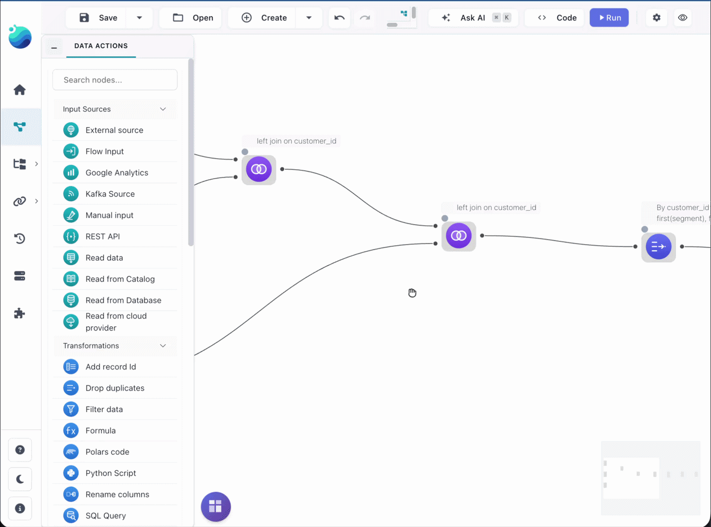
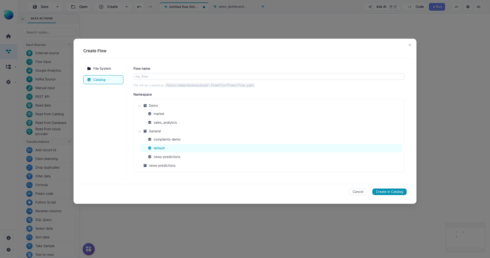
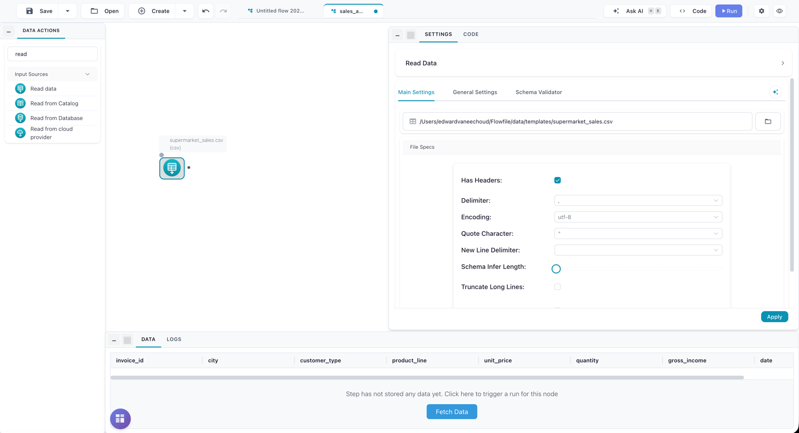
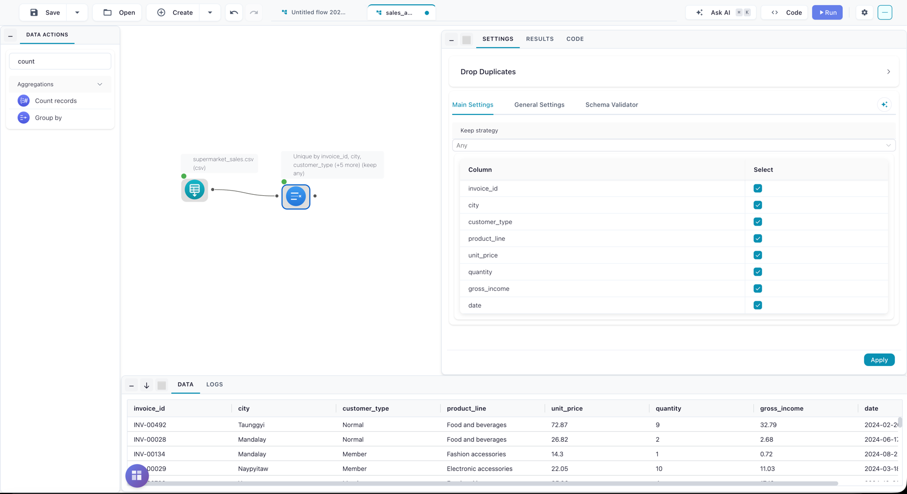
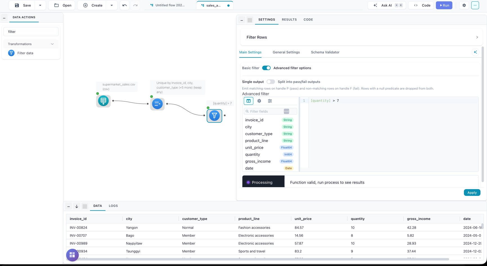
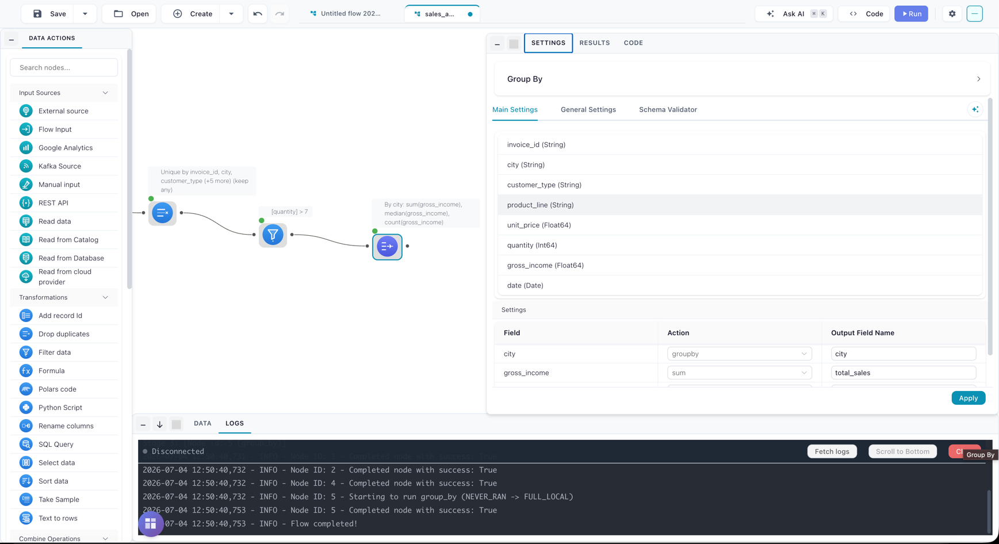
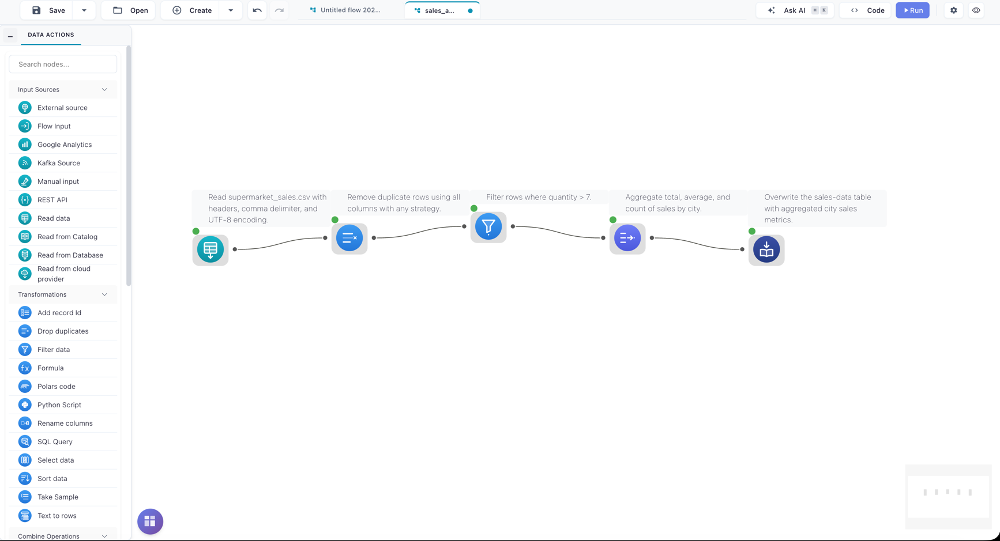
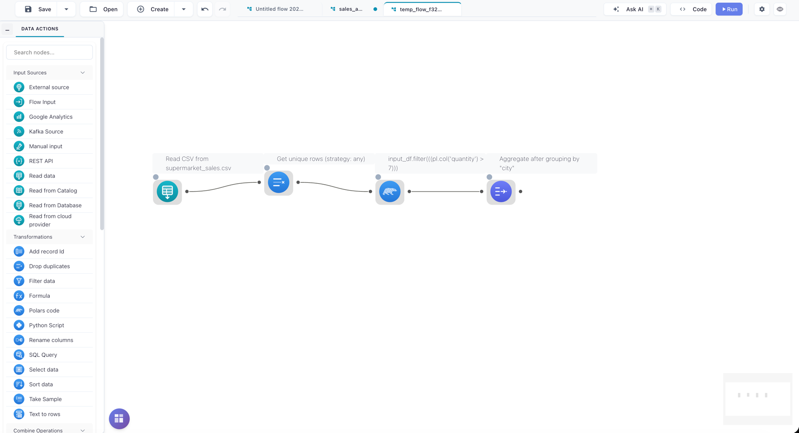

# Quickstart

Install Flowfile, build a real pipeline on the canvas, and see the same pipeline as Python code — in about ten minutes. The example cleans a sales dataset: remove duplicate rows, keep bulk orders, and summarize income per city. Everything on this page is backed by files in the repository and validated by the test suite, so what you see is what will run.

## Install

The fast path — the Python package brings the visual editor, the Python API, and all services:

```bash
pip install flowfile
flowfile run ui
```

Your browser opens the Flowfile designer. If it doesn't, go to [http://127.0.0.1:63578/ui#/main/designer](http://127.0.0.1:63578/ui#/main/designer) manually. Every other way in — desktop app, Docker, browser-only, from source — is on the [Installation](installation.md) page.

## Choose your path

Both tracks build the same pipeline — pick the one that matches how you work, or do both:

<div class="ff-paths">
<a class="ff-path ff-path-teal" href="#your-first-flow-visually">
<strong>Build it visually</strong>
Drag nodes onto the canvas, preview the data at every step, publish the result to the catalog. No code.
</a>
<a class="ff-path ff-path-purple" href="#the-same-pipeline-in-python">
<strong>Write it in Python</strong>
A Polars-style API that builds the identical flow — and opens it on the canvas whenever you want.
</a>
</div>

---

## Your first flow, visually

You'll build this pipeline: **read → drop duplicates → filter → group by**.

<!-- IMAGE-PLACEHOLDER-TO-CHANGE: the finished sales_pipeline flow on the canvas, with the Group by node selected and its 5-row result visible in the data preview -->

!!! tip "Skip the typing"
    The finished flow ships with Flowfile: **Create → From template → "Sales pipeline: clean, filter, aggregate"**. The sample data is provisioned automatically. You can also [download the flow](assets/flows/sales_pipeline.yaml) as a `.yaml` file. The steps below build the same thing by hand so you learn the moves.

### 1. Create a flow

1. Run `flowfile run ui` and click **Create** in the toolbar.
2. Name the flow (for example `sales_analysis`) and create it.
3. Open **Settings** (top right) and set the execution options for step-by-step previews (see the note below).

!!! tip "See your data at every step"
    To get a data preview under every node as you build this demo, match these flow settings:

    - **Execution Mode:** Development
    - **Execution location:** Local
    - **Show details during execution:** on

    

<details markdown="1">
<summary>See it: the empty flow</summary>



</details>

### 2. Read the data

The walkthrough uses a committed sample: [`supermarket_sales.csv`](https://raw.githubusercontent.com/edwardvaneechoud/Flowfile/main/data/templates/supermarket_sales.csv) — 1,030 sales rows with `city`, `quantity`, and `gross_income` columns (and 30 deliberately duplicated rows to clean up). Any CSV or Excel file of your own works too.

1. Drag **Read data** from the Input section onto the canvas.
2. Click the node, then **Browse** to your file.
3. Click **Run** (top toolbar), then click the node to preview the rows in the bottom panel.

<details markdown="1">
<summary>See it: the data preview after reading</summary>



</details>

### 3. Drop duplicates

1. Drag **Drop duplicates** from the Transform section and connect **Read data** to it.
2. Select all columns to compare whole rows.
3. Run — the sample data goes from 1,030 rows to 1,000.

<details markdown="1">
<summary>See it: after deduplication</summary>



</details>

### 4. Filter to bulk orders

1. Drag **Filter data** onto the canvas and connect it.
2. Switch the filter to advanced mode and enter the formula:

    ```text
    [quantity] > 7
    ```

3. Run — 314 rows remain. The `[column]` syntax is Flowfile's [formula language](users/formulas/index.md); if you can write an Excel formula, you already know it.

<details markdown="1">
<summary>See it: after the filter</summary>



</details>

### 5. Group by city

1. Drag **Group by** from the Aggregate section and connect it.
2. Configure: group on `city`; aggregate `gross_income` twice — **Sum** named `total_income`, **Median** named `median_income`.
3. Run, and click the node — the preview shows one row per city with its total and median income.

<details markdown="1">
<summary>See it: the grouped result and the complete flow</summary>





</details>

Save the flow (File → Save) — flows are plain `.yaml` files you can version, share, and run headlessly with `flowfile run flow <path>`.

### 6. Put the result to work

Instead of exporting a file, publish the result into Flowfile's catalog and analyze it there:

1. Drag **Write to Catalog** from the Output section, connect it to **Group by**, pick the default namespace, and name the table (for example `sales_by_city`). Run once.
2. Open the **Catalog** tab: your table is there as a Delta table with schema, preview, and history.
3. Query it in the [SQL editor](users/visual-editor/catalog/sql-editor.md), or open it in a [visualization](users/visual-editor/catalog/visualizations.md) and chart income per city.
4. When the numbers should stay fresh, [schedule the flow](users/visual-editor/catalog/schedules.md).

That loop — build, publish, analyze, schedule — is the core of working in Flowfile. A `Write data` node exports to Excel/CSV/Parquet instead whenever a file is what you need.

---

## The same pipeline in Python

The `flowfile` package exposes a Polars-style API that builds the identical flow:

```python
--8<-- "docs/examples/sales_pipeline.py:example"
```

`result.collect()` returns the same five-city table as step 5. Nothing executes until `.collect()` — every method call just adds a node to a flow graph, which means you can also look at it on the canvas:

```python
ff.open_graph_in_editor(result.flow_graph)
```

<details markdown="1">
<summary>See it: the code-built pipeline on the canvas</summary>



</details>

This snippet is included from a repository file that runs in CI on every change — it cannot drift from the real API. To go deeper — expressions, joins, databases, cloud storage — continue with the [Python API quickstart](users/python-api/quickstart.md).

---

## Troubleshooting

<details markdown="1">
<summary><strong>Port 63578 is already in use</strong></summary>

The web UI is fixed to port 63578 — it cannot be moved to another port. Free it instead:

```bash
lsof -i :63578          # macOS/Linux
netstat -ano | findstr :63578   # Windows
```

Stop the process holding it (often a previous Flowfile session), then run `flowfile run ui` again.

</details>

<details markdown="1">
<summary><strong>pip install fails</strong></summary>

```bash
pip install --upgrade pip
pip install flowfile
```

Flowfile supports Python 3.10–3.13. Check `python --version` if the resolver complains.

</details>

For anything else: [GitHub Discussions](https://github.com/edwardvaneechoud/Flowfile/discussions) for questions, [Issues](https://github.com/edwardvaneechoud/Flowfile/issues) for bugs.

## Where next

Pick the route written for your situation:

- [Coming from Excel](users/coming-from-excel.md) — VLOOKUP, pivot tables, and IF-formulas translated to flows.
- [Build flows visually](users/build-flows-visually.md) — from first flow to a reusable toolkit.
- [Analyze your data](users/analyze-your-data.md) — from question to a chart that refreshes itself.
- [Your data lives elsewhere](users/data-elsewhere.md) — warehouse, S3, Kafka, APIs.
- [Write Python](users/write-python.md) — the Polars-style API, connectors, and CI.
- [Extend the palette](users/visual-editor/node-designer.md) — need an operation Flowfile doesn't have? Build your own node in the Node Designer, no code file required.
- [Run Flowfile for a team](users/deploy-for-a-team.md) — the operator's route.
