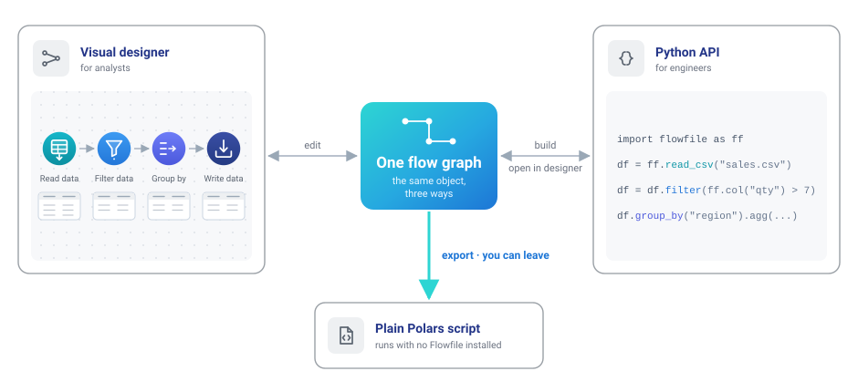

# Roadmap background

This page holds the architecture, implementation notes and technology
choices behind the [roadmap](roadmap.md). The roadmap is the place to check
priorities, status and the scope of 1.0. The options here may change as the
work develops.

## Design context

Visual tools like Alteryx, KNIME and Power Query start with a canvas and let
you add scripts where needed. Tools like dbt, Airflow and Dagster start with
code and show you a graph of what you wrote. Both approaches work.

In Flowfile, the canvas and Python API edit **the same graph**. An analyst
can build a flow visually, and an engineer can open it in Python and carry
on from there, with the same node IDs.

It works the other way too: a flow written in Python opens as editable nodes
on the canvas. Both export to a Polars script that runs without Flowfile
installed.

This is roughly where we place Flowfile alongside other tools:

*This is our view of each tool's priorities. Product names belong to their
respective owners, and Flowfile isn't affiliated with them.*

Enso is the closest neighbour. It also treats the diagram and code as one
thing, using its own language. Flowfile uses Python and Polars, which many
data teams already work with.

The Alteryx importer reports what it couldn't reproduce for each tool.
The canvas notebook shows the open flow as Python cells and writes edits
back to it. On every commit, tests compare exported code with the canvas
result. The same requirement applies to new features: they need to work on
the canvas, in the Python API and in the export.

## Longer-term direction

As the deployment options grow, these are the four things we want to support:

| | Requirement | What it means |
|---|---|---|
| 1 | **Your compute** | Data is processed on machines you choose and control. |
| 2 | **Open formats** | Other engines can read your tables without Flowfile. |
| 3 | **Your catalog** | You run the catalog. It passes credentials to the compute, so the flow doesn't need to hold them. |
| 4 | **Keep your work** | If you stop using Flowfile, your pipeline still runs. |

The first target is work that fits on one good machine. Many analytics
pipelines deal with gigabytes, and a single machine handles them fine. When
you do need a cluster, you should be able to use one without rebuilding the
flow.

These requirements also matter to teams moving to European or on-premises
infrastructure. Choosing a datacenter is part of data sovereignty; the tools
you use every day need to support that choice too.

### The target architecture

The idea is to let you choose the parts of the stack, and replace them when
you need to.

**Legend:** plain cards are shipped · `GAP` marks a known limitation in
something shipped · dimmed cards are planned.

The diagram marks two gaps. Code export still has coverage gaps, including
Google Analytics and API response nodes. The worker has its
own URL and authentication, but returns results as a path on its local
disk. Core needs to read that file, so the two still need a shared
filesystem. Both need fixing.

## Implementation notes

### Canvas, Python and export

You should be able to switch between the canvas and Python without fixing
the flow by hand, and export it when you want to run it elsewhere.

Round-trip tests and a regression ledger already cover a committed set of
flows. SQL-query export is implemented too. The next step is to extend that
coverage to the remaining export handlers and expressions that are stored
as opaque blobs because the Python API can't turn them back into source.

Completion means the agreed flow corpus keeps node types and settings
through the canvas/Python round-trip, and exported code produces matching
results without Flowfile installed. Track unsupported exports and opaque
expressions explicitly, with a target of zero for the supported scope.
Document how interactive-only nodes are handled rather than silently
dropping meaningful work.

### Everyday reliability

A working pipeline should survive closing the app and upgrading it. When a
run fails, the user needs to be able to find the cause, fix it and continue.

The first step is to agree on the supported versions and a representative
set of everyday flows. Use those to check save/reopen, upgrades, export and
recovery from failed runs. Include common failures such as missing inputs
and invalid expressions. Record the compatibility policy and any required
migration steps.

The local quickstart should also be checked from a clean installation.
These checks form the core 1.0 release criteria described in the roadmap;
they don't require an external catalog or an organization identity provider.

### Remote workers

Run a flow on your laptop, a VM in your own account or a managed Polars
cluster without changing it. The worker is already a separate service with
its own URL and authentication. The remaining dependency is its result
file: core opens it to read the schema and preview.

The first step is to return a limited sample, schema and row count over the
network, behind a feature flag. Core should no longer need access to the
worker's files. We'll verify this by running the end-to-end suite with core
and worker on separate hosts and no shared filesystem.

After that, we'll replace the scattered local-or-remote branches with one
execution interface and support backends as entry-point plugins. That makes
room for Polars Cloud, with no credentials in submitted plans, and kernels
running on a remote Docker host.

### Open formats and catalogs

Other engines should be able to read Flowfile's tables, and Flowfile should
work with the catalogs you already use. Delta stays the internal format. It
doesn't require a catalog, and our change data feed, merge, SCD2, row edits
and time travel support already use it.

The first step is reading Iceberg data. Catalog-backed writes follow, with
Lakekeeper as the initial integration. Polaris, Unity, Glue and S3 Tables
are candidates for later support through the Iceberg REST API.

First comes an Iceberg reader that takes a metadata path. It will run in the
worker so credentials stay out of the plan. The writer follows once the
catalog connection is in place, since committing to Iceberg requires a
catalog operation. Choosing a table format per catalog root comes after
the reader and writer work.

The first check is to read an Iceberg table stored in MinIO and written by
another engine, using the node, Python API and exported code. Later, a Delta
table written by Flowfile should appear in Lakekeeper and be readable by
another engine, using credentials supplied by the catalog. That engine
shouldn't need storage keys in its config.

### Shared catalogs and team deployment

Separate Flowfile installs should be able to share a catalog, each with its
own compute. We have the parts: PostgreSQL metadata, data in your bucket,
and secrets that any instance with the master key can re-derive. We still
need to prove they work together safely.

We'll start with a test: two cores, one PostgreSQL catalog, one MinIO bucket
and a worker for each core. Instance B must read what instance A wrote.
Cloud-backed reads must never replay a plan containing another instance's
credentials.

Once that runs in CI, the next step is OIDC login in server mode, passing
the user's identity to external catalogs. Then custom nodes, flow
references and connections can move from per-instance files into the shared
catalog.

### Reference deployment

One command should start the full stack on your own machines: PostgreSQL
for metadata, MinIO for tables, Lakekeeper as the catalog, plus core, worker
and kernels. This gives people a working setup to try the whole roadmap
end to end.

First comes a `sovereign` Docker Compose profile with PostgreSQL and MinIO.
Lakekeeper joins once the catalog integration is ready. This deployment has
its own acceptance checks, separate from the local 1.0 requirements.

We'll check the setup with a documented walkthrough: install it, write a
table, read that table from another engine, run a flow on a second worker,
then export the flow and run it with Flowfile uninstalled. A new contributor
should be able to do this on a clean machine in under an hour. Every step
must also run in CI.

### AI planner reliability

The aim is to spend less time correcting the planner and to catch
regressions before release.

The planner already shows changes as a diff for review. It pauses if you
edit the canvas while it's working, and applies or rejects each set of
changes in full. We still need a reliable measure of how often it gets the
job right.

We'll start with a held-out benchmark using recorded provider responses,
measuring success rate and retries. We'll set the pass thresholds in
advance, and the planner must meet them without a person correcting tool
names. We'll also track refusals and use the benchmark to check fixes where
the planner hands work to the executor.

### Later options

Once remote execution works, a common execution interface can support
backend plugins and a Polars Cloud experiment behind a feature flag. A
stable backend depends on that experiment, including keeping credentials
out of submitted plans.

Other follow-ups include Lakekeeper in delegate mode, custom nodes and
connections shared through the catalog, and kernels on a remote Docker
host. A deployment checklist should map the four longer-term requirements
to the relevant settings.

## Scope

Flowfile handles part of a data platform. For the rest, we'll integrate with
existing tools.

| Layer | What we do | What we leave to other tools |
|---|---|---|
| **Compute at scale** | Pluggable backends, your workers, and Polars Cloud as the reference scale-out backend | Cluster management and distributed engines |
| **Catalog servers** | Connect to Iceberg REST catalogs and mirror our tables into them | Building an Iceberg REST server |
| **Identity** | OIDC login and token pass-through | Providing an identity service |
| **Orchestration** | A small embedded scheduler, plus exports and a CLI for use with any orchestrator | Full orchestration, as in Airflow or Dagster |
| **Storage** | Read and write S3-compatible stores, ADLS, GCS and local disk | Operating storage |
| **Language models** | Use your own key and provider, or a local model | Training and hosting models |
| **Analytics and BI** | Previews at every node and lightweight exploration dashboards | A full BI product |
| **Warehouses** | Read and write through database nodes | Building a warehouse |

Delta remains the internal table format, and Polars remains the pipeline
engine. We plan to keep SQL metadata and standard migrations. Certification
work and a hosted multi-tenant service are outside the current roadmap.

## Technology choices

What we use, what we're looking at, and what we've dropped.

| Tool | Role in Flowfile | Status | Why |
|---|---|---|---|
| **Polars** | Data engine | Keeping | One pinned version across platforms; plugins and the kernel image update with it |
| **delta-rs** | Catalog table storage | Keeping | No catalog required; supports CDC, merge, SCD2, row edits and time travel |
| **Apache Iceberg** (pyiceberg) | Reading and writing tables across tools | Adopting | Already a dependency; the reader comes before catalog-backed writes |
| **Lakekeeper** | Reference Iceberg catalog | Adopting | Apache 2.0, Rust, credential vending and OIDC; also registers non-Iceberg tables |
| **Polars Cloud** | Reference scale-out backend | Evaluating | Same API, compute in your account or on-prem, European vendor. They run the control plane, so it will remain one of several backend options |
| **PostgreSQL** | Catalog metadata | Shipped | Available alongside SQLite; CI runs the migrations against both |
| **OIDC** (any provider) | Server-mode identity | Adopting | Needed for per-user authorization in external catalogs |
| **Docker kernels** | Sandboxed Python execution | Shipped | Support for a remote Docker host is planned |
| **Tauri** | Desktop shell | Migrated in May 2026 | Replaced Electron for a smaller, faster app with signed sidecars |
| **Alteryx `.yxmd` import** | Importing existing visual workflows | Shipped | Reports unsupported behaviour per tool instead of silently approximating it |
| **Airbyte connector** | Cloud ingestion | Retired in July 2025 | Replaced by native cloud-storage reads |
| **In-house fuzzy matcher** | Fuzzy join | Extracted in August 2025 | Now an external package imported by the worker |
| **DuckDB** | Second SQL engine | Not planned | A frequent request, but Polars SQL covers the SQL nodes. Keeping one engine makes it easier to keep canvas, API and export results consistent |
| **Spark** | Distributed compute | Not planned | We'll add scale through execution backends |
