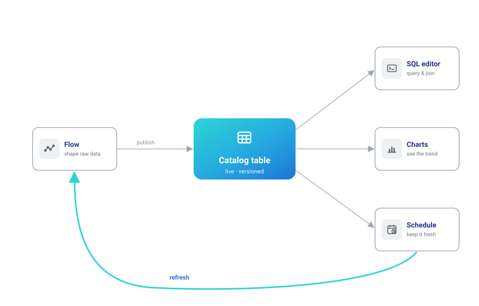
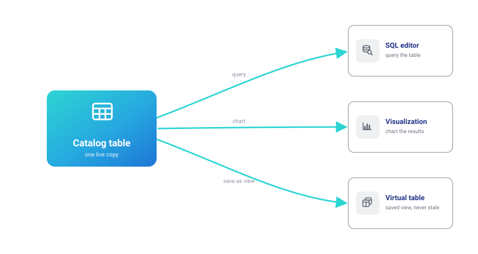

# Analyze your data

This route covers analysis that has to keep working: shaping data on the canvas, publishing the result as a catalog table, then querying, charting, and refreshing it without rebuilding anything.

An exported file can't do that — it goes stale, and nothing connects it back to how it was made. The loop below — **shape → publish → query → chart → refresh** — keeps each piece connected to the ones before it.



## 1. Get the data in

Start from wherever the data is today. A file on your machine is a [Read data node](visual-editor/nodes/input.md) — CSV, Excel, or Parquet, previewed the moment it loads. Data in company systems (a database, a bucket, an API) is a [saved connection](visual-editor/connections.md) plus the matching reader node; the [data-elsewhere route](data-elsewhere.md) covers that situation properly.

And if you have nothing at hand and just want to see the loop working:

```bash
flowfile seed-demo
```

One command creates a populated demo catalog — sales tables under a `Demo` namespace, a working flow that produced them, and a schedule that keeps one fresh — so you can explore every step below with real content before committing your own data.

## 2. Shape it on the canvas

The canvas makes each cleaning step *inspectable*: drop duplicates, filter, join, aggregate — and after every node, look at the data before moving on. A mistake shows up at the node that made it, rather than at the end of a run.

The logic itself reads like a spreadsheet formula. Keeping high-quantity orders is:

```text
[quantity] > 7
```

and a margin classification is:

```text
if [gross_income] > 30 then "high" else "standard" endif
```

— the whole [formula language](formulas/index.md) works like that, compiled to native Polars underneath. The [Quickstart](../quickstart.md#your-first-flow-visually) walks a real example (deduplicate a sales export, filter it, summarize income per city), and the finished flow is [one click away in your browser](../assets/try-sales-pipeline.html).

## 3. Publish, don't export

An exported file is a *snapshot*: no history, no connection to how it was made, and a fresh copy every time it's sent. A [Write to Catalog node](visual-editor/nodes/output.md#catalog-writer) publishes the same result as a **live table**: versioned (Delta under the hood, history and time travel included), with lineage back to the flow that produced it, and one canonical copy that every downstream query and chart reads.

Practically: "which numbers did we report in March?" becomes a version lookup.


## 4. Query and chart it

Once results are tables, day-to-day analysis stops needing the canvas. The [SQL editor](visual-editor/catalog/sql-editor.md) queries and joins anything in the catalog; a query worth keeping becomes a [virtual table](visual-editor/catalog/virtual-tables.md) — a saved view that recomputes from current data on every read, so it can never be stale. [Visualizations](visual-editor/catalog/visualizations.md) chart tables or SQL results in Graphic Walker and are stored next to the data they describe.




Prefer to work in code? The same table is a line away in a [**notebook**](visual-editor/catalog/notebooks.md) — notebooks live in the catalog, right next to the tables they analyze — and any Python script can make the same round-trip: publish an aggregate, read it back with SQL.

<details markdown="1">
<summary>See the round-trip in Python (tested in CI on every commit)</summary>

```python
--8<-- "docs/examples/catalog_analysis.py:example"
```

</details>

## 5. Make it refresh itself

[Schedules](visual-editor/catalog/schedules.md) close the loop: run the flow on a cron, or trigger it whenever an upstream table updates — so a fresh sync cascades into fresh summaries into fresh charts, with nobody pressing Run.

## 6. When the analysis outgrows clicking

Nothing above locks you in. The [Python API](write-python.md) builds the same flows in code, catalog tables pull straight into scripts and notebooks, and any visual flow [exports as Python](visual-editor/tutorials/code-generator.md) — pure-transformation flows as Polars with no `flowfile` import, I/O-bearing flows with an `ff` import for their connections — the day a pipeline graduates into an engineering codebase.

---

**Start here:** `pip install flowfile`, then `flowfile seed-demo`, then `flowfile run ui` — open the Catalog tab and start querying the demo tables.
