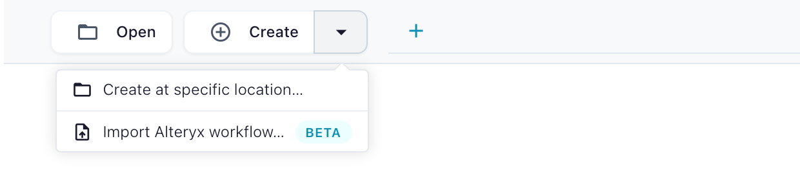
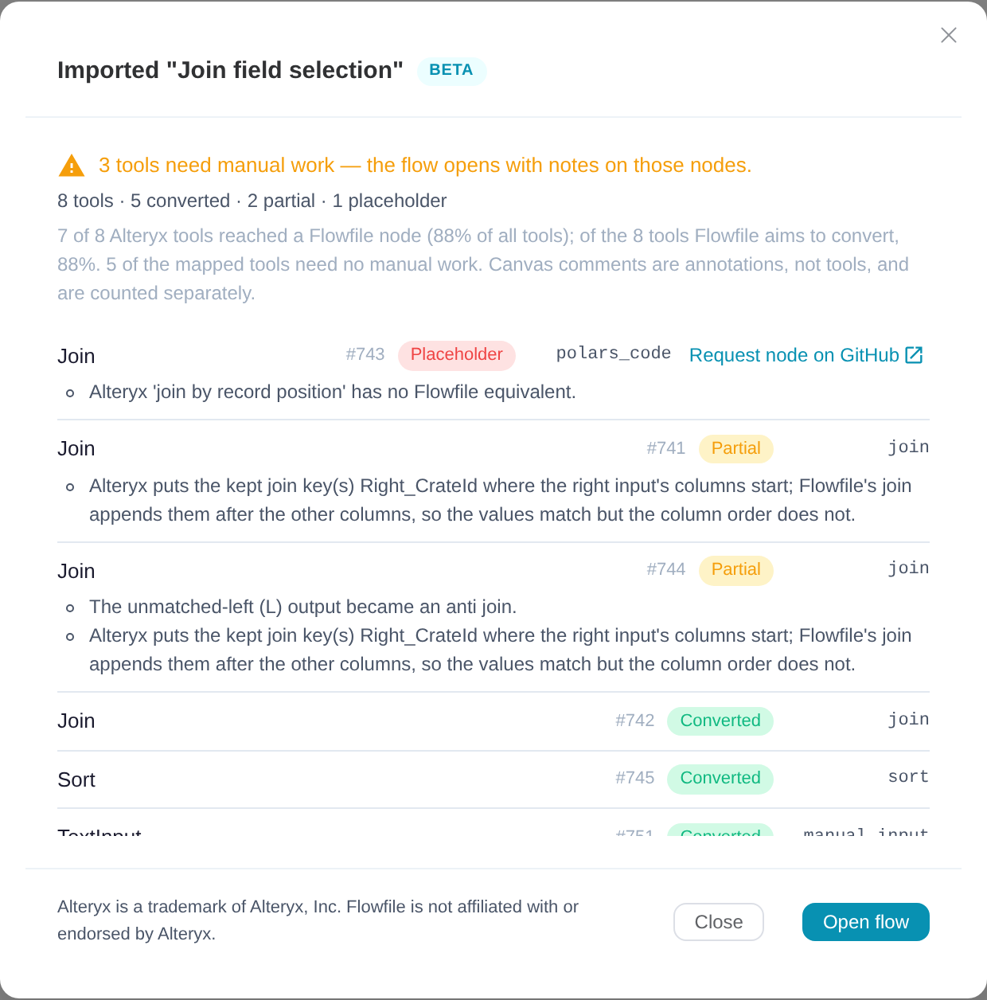
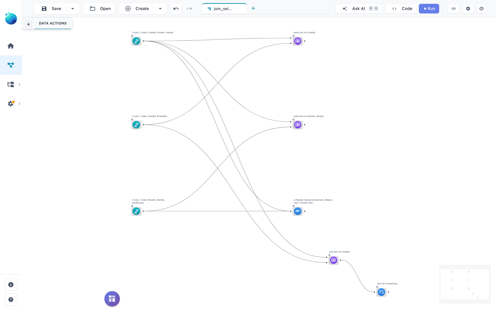
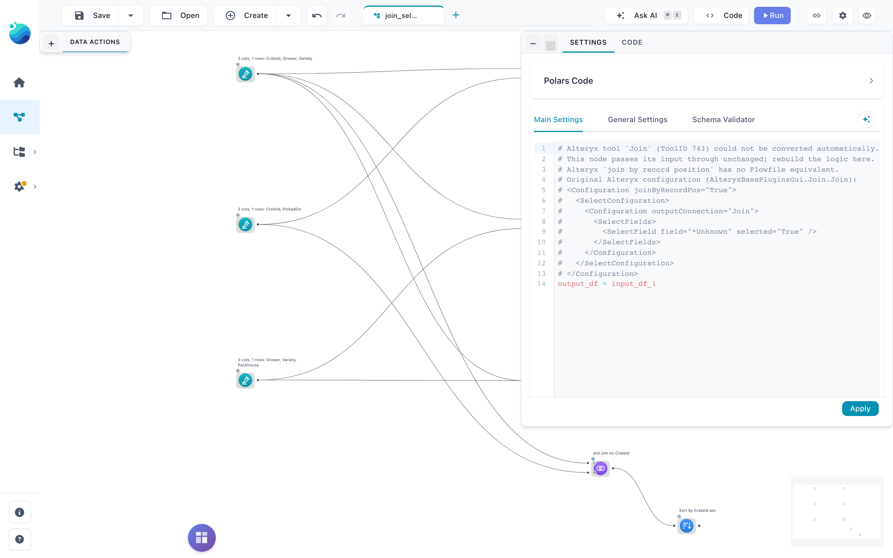

# Coming from Alteryx

Flowfile can import an Alteryx Designer workflow (`.yxmd`) and rebuild it as a Flowfile flow. Every tool becomes a Flowfile node, a piece of generated Polars code, or a clearly marked placeholder, and you get a report that says which is which. Nothing is silently guessed: a tool Flowfile cannot reproduce faithfully is marked, never approximated with a green badge.

## How to import

**In the app:** open the **Create** dropdown in the header and choose **Import Alteryx workflow…** (the empty canvas offers the same button), pick a `.yxmd` file, and read the report before you run the flow.



**From the command line:**

```bash
flowfile import alteryx my_workflow.yxmd
```

Add `--inspect` to print the report without writing a flow, `--format md` for a Markdown table, and a directory instead of a file to import a whole folder:

```bash
flowfile import alteryx ./workflows --inspect --format md --out coverage.md
```

## What the report tells you

Every Alteryx tool gets one row with a status:

| Status | Meaning |
|---|---|
| `converted` | A Flowfile node that does the same thing. Run it. |
| `partial` | A node was built, but something needs your eye: the message says exactly what (row order, an invented column name, an option Alteryx has and Flowfile does not). |
| `commented` | The tool's expression could not be translated. The original is kept as a comment inside a stub node so you can rewrite it. |
| `placeholder` | No Flowfile equivalent. A pass-through node carries the tool's full configuration as comments so you can rebuild it by hand. |
| `out_of_scope` | Spatial, reporting, Calgary, machine-learning, computer-vision and GenAI tools. Not planned. |
| `no_op` | Tools with no data effect (Message, Test, Detour). Nothing is emitted. |

Every wire that could not be connected is reported on both of its ends.



Open the flow and the report's notes are on the canvas: a placeholder node carries a visible warning label, and its settings hold the original Alteryx configuration as comments so you can rebuild the step in place.





## Coverage, measured

Measured on Alteryx's own 121 One Tool Example workflows (923 tools). Numbers as of Flowfile 0.18.0. Earlier 0.17.x releases ship an older importer that covers fewer tools; upgrade before comparing. Open the sections below for the per-tool detail.

| | |
|---|---|
| Tools in scope (everything except the out-of-scope categories above) | 678 |
| Mapped to a node (`converted` + `partial` + `commented`) | **559 · 82%** |
| Fully converted, no caveat | 409 · 60% |
| Of all 923 tools, mapped | 61% |
| Sample workflows that run end to end without a placeholder in the chain | 39 of 121 |

??? success "Tools that convert cleanly on every sample instance"

    Tools Flowfile converts cleanly on every sample instance: Select, Filter (simple and custom), Formula, Sort, Unique, Summarize, Join, Union, Transpose, Cross Tab, Record ID, Text To Columns, Text Input, Browse, Data Cleansing (both macros), Multi-Field Formula, Dynamic Rename, Date Time, Rank, Imputation, Weighted Average, Random Records, Count Records, Append Fields, API Output.

??? warning "Tools that convert with a caveat (partial), and why"

    Tools that convert with a caveat on some or all instances (`partial`), and why:

    | Tool | Why partial |
    |---|---|
    | Input Data (`.yxdb`) | Flowfile reads Parquet, not `.yxdb`. Convert the data first with `flowfile convert yxdb`; the node is pre-pointed at the Parquet path. |
    | Output Data | Same for `.yxdb` output; multi-file output is refused. |
    | Pearson Correlation, Spearman Correlation | The arithmetic is verified; the output layout and the name of the leading column are Flowfile's. |
    | Field Summary, Basic Data Profile | The profile columns are Flowfile's choice. The rendered-report anchors have no Flowfile equivalent. |
    | Sample, Select Records, Running Total, Make Group, Rank | Order-dependent. Alteryx keeps arrival order; Flowfile only promises order after an explicit Sort. Converted cleanly when a Sort feeds them. |
    | Summarize | `First`/`Last` are order-dependent; a few exotic aggregations are generated code. |
    | Join | Alteryx's join-select configuration is applied where the source columns are known; otherwise you are told. |
    | Union | By-position and manual modes carry a message; by-name converts. |
    | Generate Rows | Loops that are a plain numeric or date range convert; a step that depends on a column is refused. |
    | Create Samples | Split sizes match; membership differs because the two shuffles are different generators. |
    | Date Time Now | One row, evaluated when the flow runs. |
    | RegEx | Regex dialects differ; the generated pattern is shown for you to verify. |
    | Dynamic Rename (right-input modes) | Resolved at import time when the name source is a Text Input; otherwise refused. |

??? failure "Tools not converted yet (placeholder)"

    Not converted (placeholder), by frequency in the samples: Directory, Join Multiple, Blob Convert, Fuzzy Match, XML Parse, Find Replace, Jupyter Code, Multi-Row Formula, Tile, Blob Input, Make Columns, Multi-Field Binning, Arrange, Dynamic Input, Dynamic Select, Dynamic Replace, JSON Parse, Base64 Encoder, Auto Field, Oversample Field. Each placeholder carries the tool's configuration as comments. If one of these blocks a real workflow of yours, [open a node request](https://github.com/Edwardvaneechoud/Flowfile/issues/new?template=alteryx_node_request.yml); requests are ranked by how often they come up.

## Known limitations

The importer is measured on Alteryx's sample workflows, not on production ones. These are the gaps we know about and have not closed:

- **Numbers are checked against Alteryx's own comment boxes, not against Designer.** One real-world workflow has been verified frame-equal end to end. Where a sample workflow states an expected value, the converted flow reproduces it; where it does not, nothing has been compared.
- **Row order.** Alteryx preserves arrival order; Flowfile does not promise it without a Sort. Tools that depend on it are marked `partial` unless a Sort feeds them.
- **Nulls in correlations.** Pearson's grid turns a variable with any null into NaN; covariance and Spearman drop the pair. Alteryx's rule is not stated anywhere we could check. Covariance divides by n−1; Alteryx's divisor is unrecorded.
- **A fixed date in a simple-mode Filter** is compared as text. On a real date column that raises at run time. Fix: use a formula filter, or convert the column first.
- **Rank tie rules (Standard, Competition) and Sample's Random and First-N-percent modes** are not built; the sample workflows describe their behaviour and the nodes are refused until built.
- **Cross Tab** column names: Alteryx replaces special characters with underscores; Flowfile keeps the raw values. No golden output has been compared yet.
- **Fuzzy Match** is not built. The placeholder tells you how to rebuild it with Flowfile's Fuzzy Match node (mode, field, threshold), and warns that the matches will differ: Alteryx's default JaroTFIDF weights words by rarity and strips stop words; Flowfile's node does not.
- **Regex** patterns are compiled by Polars' engine at import time; lookaround and backreferences are refused, everything else is shown for you to verify.
- **MD5 and Base64.** `MD5_UTF8` and both Base64 functions map exactly; `MD5_ASCII` and `MD5_UNICODE` hash different bytes and are refused.
- **Macros and wizards** (`.yxmc`, `.yxwz`) are imported for their data tools; control wires and questions are not reproduced.
- **Comments** travel as text only; colours, fonts and shapes are dropped.
- **Text Input dates.** A Text Input column whose cells are all `yyyy-MM-dd` or `yyyy-MM-dd HH:mm:ss` is typed Date or Datetime, as Alteryx does. Padded cells are trimmed first, a code column that happens to hold dates is typed too, and `HH:mm:ss` stays text because Flowfile has no Time column. A Formula that parses such a column with `DateTimeParse` raises, because the column is already a date.

If you hit something not on this list, that is the report we want: open an issue with the report row and, if you can, the tool's configuration.

---

*Alteryx is a trademark of Alteryx, Inc. Flowfile is an independent project and is not affiliated with, sponsored by or endorsed by Alteryx, Inc. The importer reads workflow files you own; it contains no Alteryx software.*
