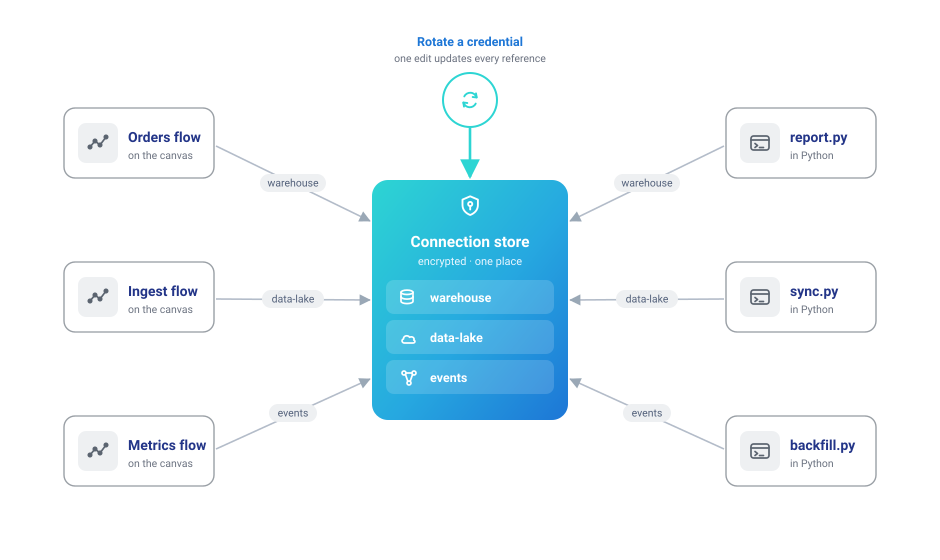

# Your data lives somewhere else

Almost nobody's data starts as a tidy local file. It's rows in Postgres or MySQL, Parquet in S3 or a data lake, events accumulating on a Kafka topic, marketing numbers behind the GA4 API, records in some SaaS tool with a REST endpoint. Whether you're the analyst who keeps asking engineering for extracts, the engineer tired of writing the same connection boilerplate, or the one person at the company who knows where everything actually lives — the job is the same: work with data *where it is*, and stop hand-carrying copies around.

None of this route requires code: every source below is a node in the visual editor, and connections are configured in the UI. The Python calls are the equivalent for those who prefer a script — an option, not a prerequisite.

## 1. Connect once, reference everywhere

The founding idea: **credentials and pipelines are separate things.** A connection — host, credentials, region, auth method — is saved once under a name, [encrypted at rest](visual-editor/catalog/secrets.md). Flows then reference the *name*. That split is what makes everything downstream safe and repeatable: a flow file never contains a secret (safe to share, safe to version), rotating a credential is one edit instead of a hunt through every pipeline, and the same name works from the canvas and from Python because both read one store.



Supported out of the box: databases (PostgreSQL, MySQL, SQLite), cloud storage (S3, Azure Data Lake, Google Cloud Storage — with auth methods from stored keys to ambient `aws-cli`/environment credentials), Kafka/Redpanda brokers, and Google Analytics 4 properties. [Connections](visual-editor/connections.md) covers every form field.

## 2. Read from the source, not from copies

Each source is a drag-and-drop node on the canvas — with a matching `ff.*` call for code workflows:

| Your data is in… | On the canvas | In Python |
|---|---|---|
| PostgreSQL / MySQL / SQLite | Database Reader | `ff.read_database` |
| S3 / ADLS / GCS (CSV, Parquet, JSON, Delta, Iceberg) | Cloud Storage Reader | `ff.scan_parquet_from_cloud_storage`, … |
| A Kafka / Redpanda topic | Kafka Source | `ff.read_kafka` |
| A REST endpoint | REST API Reader | `ff.read_api` |
| Google Analytics 4 | Google Analytics Reader | — |

Reading from the source is what kills the staleness problem — there's no "which extract is this?" when the flow pulls directly. This is the database path in code, tested in CI against a real PostgreSQL:

```python
--8<-- "docs/examples/integrations/database_read.py:example"
```

The [database tutorial](visual-editor/tutorials/database-connectivity.md) and [cloud storage tutorial](visual-editor/tutorials/cloud-connections.md) walk the same paths in the UI, form by form, and the [connector matrix](connect/index.md) is the complete reference of every source and sink.

## 3. Transform in flight

Between reading and writing it's a normal Flowfile pipeline: join the Postgres orders against the S3 product export, standardize the columns, aggregate — visually or in code, with [Polars](https://pola.rs) underneath. Two behaviors matter to this persona specifically:

- **Database reads can push work to the source.** The Database Reader takes a query, not just a table name — filter and pre-aggregate in the warehouse when that's cheaper than pulling raw rows.
- **Kafka reads are incremental by consumer group.** Each run picks up where the last one stopped (offsets commit only after a successful run), so a scheduled flow consumes exactly what arrived in between — no manual bookkeeping, and [Reset Offsets](connect/kafka.md) rewinds when you want history again.

## 4. Write back where it belongs

Results leave the way they came in, to whichever system consumes them: a Database Writer back into the warehouse, a Cloud Storage Writer emitting CSV/Parquet/JSON/Delta into the bucket for other tools, or Flowfile's own [catalog](visual-editor/catalog/index.md) when the result is for analysis. The full write path — connection, format, write mode, round-trip — runs in CI against a real S3-compatible store:

```python
--8<-- "docs/examples/integrations/cloud_storage_s3.py:example"
```

## 5. Turn one-off pulls into standing syncs

The pattern that compounds: one small flow per source — read, normalize, land in the catalog — each on a [schedule](visual-editor/catalog/schedules.md). Kafka topics [sync into catalog tables](connect/kafka.md#kafka-to-catalog-sync) the same way. Downstream flows trigger off the tables they consume, so a fresh sync cascades through everything built on it, and the catalog becomes the one place where scattered systems meet as queryable, versioned tables.


## 6. Working in a team

In the multi-user [Docker deployment](deployment/docker.md), connections and secrets are [shareable with user groups](deployment/sharing.md) — teammates run flows against a shared connection without ever seeing the credential. One guardrail worth knowing exists on purpose: a colleague with manage rights who repoints a shared connection at a different host must re-enter the credentials, so nobody can quietly harvest yours by redirecting it.

---

**Fastest first taste:** the [database tutorial](visual-editor/tutorials/database-connectivity.md) — from connection form to a read-transform-write round trip in one sitting.
