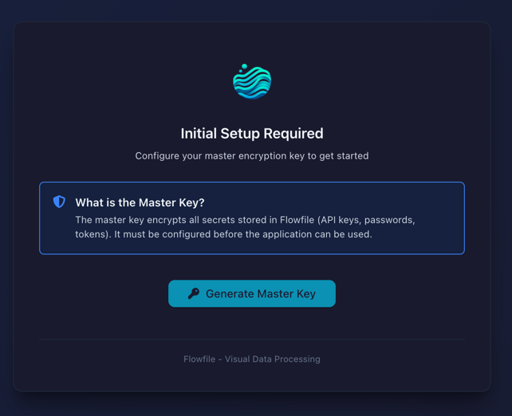
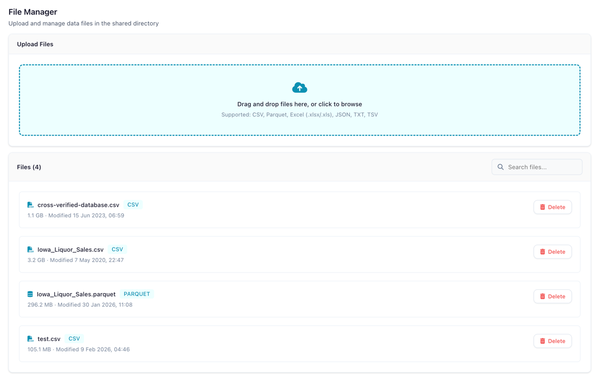

# Docker Reference

Run Flowfile with Docker using pre-built images from Docker Hub.

## Quick Start

```bash
git clone https://github.com/edwardvaneechoud/Flowfile.git
cd Flowfile
docker compose up -d
```

Access at `http://localhost:8080`. The setup wizard will guide you through master key configuration.



## Docker Images

| Image | Description |
|-------|-------------|
| `edwardvaneechoud/flowfile-frontend` | Web UI |
| `edwardvaneechoud/flowfile-core` | API server |
| `edwardvaneechoud/flowfile-worker` | Data processing |

Tags: `latest`, `0.6.3`, or specific version

## docker-compose.yml

```yaml
services:
  flowfile-frontend:
    image: edwardvaneechoud/flowfile-frontend:latest
    ports:
      - "8080:8080"
    networks:
      - flowfile-network
    depends_on:
      - flowfile-core
      - flowfile-worker

  flowfile-core:
    image: edwardvaneechoud/flowfile-core:latest
    ports:
      - "63578:63578"
    environment:
      - FLOWFILE_MODE=docker
      - FLOWFILE_ADMIN_USER=${FLOWFILE_ADMIN_USER:-admin}
      - FLOWFILE_ADMIN_PASSWORD=${FLOWFILE_ADMIN_PASSWORD:-changeme}
      - JWT_SECRET_KEY=${JWT_SECRET_KEY}
      - FLOWFILE_MASTER_KEY=${FLOWFILE_MASTER_KEY:-}
      - WORKER_HOST=flowfile-worker
    volumes:
      - ./flowfile_data:/app/user_data
      - ./saved_flows:/app/flowfile_core/saved_flows
      - flowfile-storage:/app/internal_storage
    networks:
      - flowfile-network

  flowfile-worker:
    image: edwardvaneechoud/flowfile-worker:latest
    ports:
      - "63579:63579"
    environment:
      - FLOWFILE_MODE=docker
      - CORE_HOST=flowfile-core
      - FLOWFILE_MASTER_KEY=${FLOWFILE_MASTER_KEY:-}
    volumes:
      - ./flowfile_data:/app/user_data
      - flowfile-storage:/app/internal_storage
    networks:
      - flowfile-network

networks:
  flowfile-network:

volumes:
  flowfile-storage:
```

## Environment Variables

| Variable | Description | Default |
|----------|-------------|---------|
| `FLOWFILE_MODE` | Set to `docker` for multi-user auth | `docker` |
| `FLOWFILE_ADMIN_USER` | Admin username | `admin` |
| `FLOWFILE_ADMIN_PASSWORD` | Admin password | `changeme` |
| `JWT_SECRET_KEY` | Token signing secret | Required |
| `FLOWFILE_MASTER_KEY` | Encryption key for secrets | Via setup wizard |
| `WORKER_HOST` | Worker hostname | `flowfile-worker` |
| `CORE_HOST` | Core hostname | `flowfile-core` |

## .env Example

```bash
FLOWFILE_ADMIN_USER=admin
FLOWFILE_ADMIN_PASSWORD=YourSecurePassword123!
JWT_SECRET_KEY=generate-with-openssl-rand-hex-32
FLOWFILE_MASTER_KEY=generated-from-setup-wizard
```

## Volumes

| Path | Purpose |
|------|---------|
| `./flowfile_data` | User data |
| `./saved_flows` | Flow definitions |
| `flowfile-storage` | Internal storage |

## Commands

```bash
docker compose up -d      # Start
docker compose down       # Stop
docker compose pull       # Update images
docker compose logs -f    # View logs
```

## Health Checks

| Service | Endpoint |
|---------|----------|
| Core | `http://localhost:63578/health` |
| Worker | `http://localhost:63579/health` |
| Frontend | `http://localhost:8080` |

---

## File Manager

*Docker mode only.*

The File Manager provides a web-based interface for uploading and downloading data files when running Flowfile in Docker (where users cannot browse the host filesystem).

<!-- PLACEHOLDER: Screenshot of the File Manager page -->


*The File Manager showing uploaded files*

### Supported Formats

CSV, Parquet, Excel (`.xlsx`), JSON, TSV, TXT

### File Size Limit

Maximum **500 MB** per file.

### Usage

1. Click the **File Manager** icon in the left sidebar
2. Click **Upload** to add a file
3. Uploaded files appear in the file list and can be used in **Read Data** input nodes
4. Click the delete icon to remove a file

### Access

The File Manager is only available when `FLOWFILE_MODE=docker` is set.
