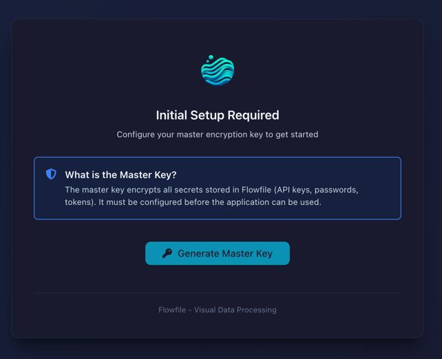
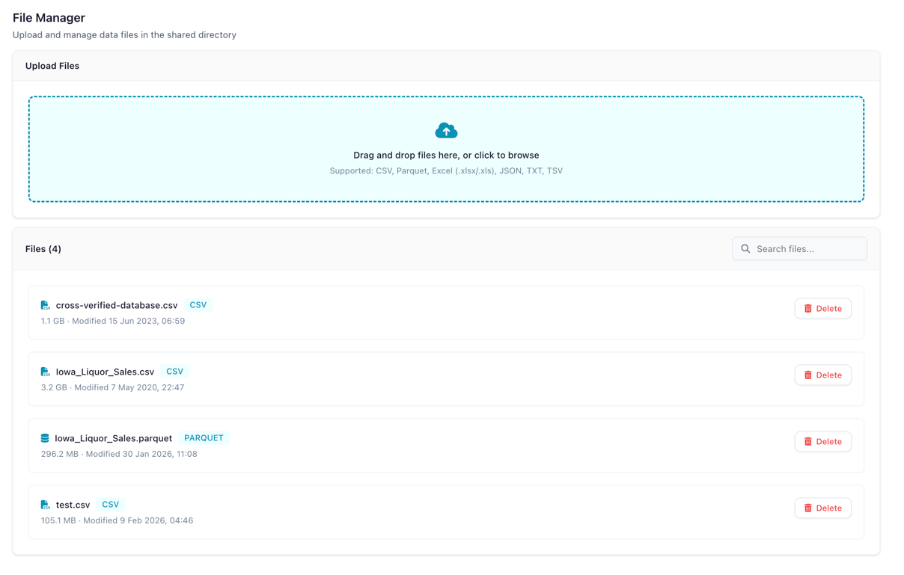

# Docker Reference

Run Flowfile as a multi-user stack with Docker. This is the deployment for teams and servers: authentication, encrypted secrets, a shared catalog, and (optionally) Docker-spawned kernels for Python-script nodes. This page covers quick start, configuration, security, kernels, and operations.

Two Docker paths exist, for different jobs:

- **Evaluating or developing** — this repo's bundled `docker-compose.yml`, which **builds the images from source** on first `up`. That's what the quick start below uses.
- **Deploying on a real server** — the [**flowfile-hosting kit**](https://github.com/Edwardvaneechoud/flowfile-hosting), a separate repository that runs the **published Docker Hub images** pinned to a version (`image: edwardvaneechoud/flowfile-core:${FLOWFILE_VERSION}`) and handles what this repo's compose does not: HTTPS ingress (Caddy with Let's Encrypt, a Cloudflare Tunnel for no-open-ports setups, or plain LAN), a guided installer (`./install.sh`, or `make init`) that generates secrets and verifies DNS, and day-two targets for `update`, `backup`, `restore`, and `health`. If the instance will have users other than you, start there.

## Quick Start

```bash
git clone https://github.com/edwardvaneechoud/Flowfile.git
cd Flowfile
docker compose up -d
```

Access at `http://localhost:8080`. On first run the setup wizard guides you through master-key configuration.



### First-run master key

The bundled compose leaves `FLOWFILE_MASTER_KEY` empty, so the setup screen prompts you to configure it:

1. Open `http://localhost:8080`.
2. Click **Generate Master Key** and copy the key.
3. Add it to your `.env`: `FLOWFILE_MASTER_KEY=<your-key>`.
4. Restart: `docker compose restart`.
5. Log in with the admin credentials (default `admin` / `changeme`; `FLOWFILE_ADMIN_USER` and `FLOWFILE_ADMIN_PASSWORD` set them).

For an automated deployment, generate the key ahead of time and set it before the first boot:

```bash
python -c "from cryptography.fernet import Fernet; print(Fernet.generate_key().decode())"
```

!!! warning "Losing the master key loses your secrets"
    The master key encrypts every stored secret. If you change or lose it, existing encrypted secrets become unreadable. Back up `.env` securely and never commit it to version control.

## Docker Images

| Image | Description |
|-------|-------------|
| `edwardvaneechoud/flowfile-frontend` | Web UI |
| `edwardvaneechoud/flowfile-core` | API server |
| `edwardvaneechoud/flowfile-worker` | Compute worker (heavy work runs in spawned subprocesses) |
| `edwardvaneechoud/flowfile-kernel-base` | Python-script kernel (base) |
| `edwardvaneechoud/flowfile-kernel-ml` | Python-script kernel with sklearn / xgboost / lightgbm / statsmodels |
| `edwardvaneechoud/flowfile-kernel-lite` | Slimmed Python-script kernel for constrained hosts |

The application images (`flowfile-frontend`, `flowfile-core`, `flowfile-worker`) share the project version and are published once per release: each `v*` tag pushes `:<version>`, and stable releases also move `:latest` (prerelease tags with a `-` suffix, e.g. `-rc.1`, don't). The kernel images carry their own version so the kernel runtime can evolve independently of the rest of the application; they are published only when that version is new, and the tag core pulls by default is set in `flowfile_core/flowfile_core/kernel/images.py` (`_KERNEL_IMAGE_*_DEFAULT`).

## docker-compose.yml

The compose file bundled at the repo root is the source of truth. A trimmed version showing the load-bearing settings:

```yaml
services:
  flowfile-frontend:
    image: edwardvaneechoud/flowfile-frontend:latest
    ports:
      - "8080:8080"
    networks:
      - flowfile-network
    depends_on:
      - flowfile-core
      - flowfile-worker

  flowfile-core:
    image: edwardvaneechoud/flowfile-core:latest
    ports:
      - "63578:63578"
    shm_size: '2gb'
    environment:
      - FLOWFILE_MODE=docker
      - FLOWFILE_ADMIN_USER=${FLOWFILE_ADMIN_USER:-admin}
      - FLOWFILE_ADMIN_PASSWORD=${FLOWFILE_ADMIN_PASSWORD:-changeme}
      - JWT_SECRET_KEY=${JWT_SECRET_KEY:-flowfile-dev-secret-change-in-production}
      # Shared secret for kernel → core authentication (must match the kernels)
      - FLOWFILE_INTERNAL_TOKEN=${FLOWFILE_INTERNAL_TOKEN:-flowfile-dev-internal-token-change-in-production}
      - FLOWFILE_MASTER_KEY=${FLOWFILE_MASTER_KEY:-}
      - FLOWFILE_SCHEDULER_ENABLED=true
      - FLOWFILE_ENABLE_PROJECTS=${FLOWFILE_ENABLE_PROJECTS:-true}
      - WORKER_HOST=flowfile-worker
      - FLOWFILE_STORAGE_DIR=/app/internal_storage
      - FLOWFILE_USER_DATA_DIR=/app/user_data
    volumes:
      # Docker socket lets core create kernel containers on the host.
      - /var/run/docker.sock:/var/run/docker.sock
      - ./flowfile_data:/app/user_data
      - flowfile-internal-storage:/app/internal_storage
      - ./saved_flows:/app/flowfile_core/saved_flows
    networks:
      - flowfile-network

  flowfile-worker:
    image: edwardvaneechoud/flowfile-worker:latest
    ports:
      - "63579:63579"
    shm_size: '2gb'
    environment:
      - FLOWFILE_MODE=docker
      - CORE_HOST=flowfile-core
      - FLOWFILE_MASTER_KEY=${FLOWFILE_MASTER_KEY:-}
      - FLOWFILE_STORAGE_DIR=/app/internal_storage
      - FLOWFILE_USER_DATA_DIR=/app/user_data
    volumes:
      - ./flowfile_data:/app/user_data
      - flowfile-internal-storage:/app/internal_storage
    networks:
      - flowfile-network

networks:
  flowfile-network:
    driver: bridge
    name: flowfile-network

volumes:
  flowfile-internal-storage:
    driver: local
```

## Environment Variables

| Variable | Description | Default |
|----------|-------------|---------|
| `FLOWFILE_MODE` | Set to `docker` for multi-user auth | `docker` |
| `FLOWFILE_ADMIN_USER` | Admin username | `admin` |
| `FLOWFILE_ADMIN_PASSWORD` | Admin password | `changeme` |
| `JWT_SECRET_KEY` | Token signing secret. Required in Docker mode. | Insecure dev fallback in compose |
| `FLOWFILE_INTERNAL_TOKEN` | Shared secret for kernel → core authentication. Required in Docker mode. | Insecure dev fallback in compose |
| `FLOWFILE_MASTER_KEY` | Encryption key for secrets | Empty (setup wizard prompts) |
| `FLOWFILE_SCHEDULER_ENABLED` | Auto-start the flow scheduler | `true` in the bundled compose (the code default when the var is entirely unset is off) |
| `FLOWFILE_ENABLE_PROJECTS` | Enable git project tracking (admin-only in Docker; the `/project` router 404s when off). Accepts `true`/`1`/`yes`/`on`. | `true` in the bundled compose |
| `FLOWFILE_STORAGE_DIR` | Internal storage path | `/app/internal_storage` |
| `FLOWFILE_USER_DATA_DIR` | User data path | `/app/user_data` |
| `WORKER_HOST` | Worker hostname | `flowfile-worker` |
| `CORE_HOST` | Core hostname | `flowfile-core` |
| `FLOWFILE_KERNEL_IMAGE` | Override the base kernel image for Python-script nodes | Registry default (unset ⇒ the tag in `kernel/images.py`) |
| `FLOWFILE_TELEMETRY` | Kill switch for anonymous usage telemetry. A falsy value (`0`/`false`/`no`/`off`) hard-disables it before any prompt or send; any other value grants nothing by itself. | `0` in the bundled compose |
| `FLOWFILE_TELEMETRY_ENDPOINT` | Collector URL for anonymous usage telemetry, used verbatim; overrides the built-in default `https://events.flowfile.app/events`. Unset or empty ⇒ that default, so blanking it does not disable telemetry. | Empty in the bundled compose ⇒ the built-in collector |

### Git project tracking

When `FLOWFILE_ENABLE_PROJECTS` is on, Flowfile can mirror your flows, connections and schedules into a versioned, secret-free git folder. In Docker it is **administrator-only**, and each user's projects are confined to their own `/app/user_data/projects/<owner_id>` area, so tenants stay isolated. Turn it off with `FLOWFILE_ENABLE_PROJECTS=false`.

### Anonymous usage telemetry

Flowfile's opt-in usage telemetry is hard-off in the bundled compose: it ships `FLOWFILE_TELEMETRY=0`, which disables everything before any consent prompt, file read, or send. To allow it, set `FLOWFILE_TELEMETRY=1` in your `.env` and have an administrator turn it on in the UI — no endpoint configuration is needed, because events go to the Flowfile project's collector at `events.flowfile.app` by default. To keep them in-house instead, set `FLOWFILE_TELEMETRY_ENDPOINT` to your own collector URL; note that the bundled compose passes that variable through as an empty value, which falls back to the built-in default, so leaving it blank is not a way to switch telemetry off. Consent here is not a per-user choice: it is one deployment-wide setting an administrator grants on behalf of every user of that server, so other users never see the consent dialog and view the state read-only under **Settings → Preferences → Privacy**. [Telemetry & Privacy](../telemetry.md) documents every event and field that can be sent.

## .env Example

```bash
FLOWFILE_ADMIN_USER=admin
FLOWFILE_ADMIN_PASSWORD=YourSecurePassword123!
JWT_SECRET_KEY=generate-with-openssl-rand-hex-32
FLOWFILE_INTERNAL_TOKEN=generate-with-openssl-rand-hex-32
FLOWFILE_MASTER_KEY=generated-from-setup-wizard
```

## Volumes

| Path | Purpose |
|------|---------|
| `./flowfile_data` | User data (uploads, files) |
| `./saved_flows` | Flow definitions |
| `flowfile-internal-storage` | Internal application data (catalog DB, logs) |

## Commands

```bash
docker compose up -d      # Start
docker compose down       # Stop
docker compose pull       # Update images
docker compose logs -f    # View logs
docker compose restart    # Restart after an .env change
```

## Health Checks

Core exposes a setup/health probe; the worker and frontend have no `/health` route — check them via their port or logs.

| Service | Endpoint |
|---------|----------|
| Core | `http://localhost:63578/health/status` |
| Frontend | `http://localhost:8080` |

## Security Architecture

The master key, JWT secret, and internal token are set via the env vars above. Two more components live in the database rather than the environment:

| Component | Purpose | Configuration |
|-----------|---------|---------------|
| **User Secrets** | API keys, passwords, tokens | Encrypted in the database |
| **User Password** | Authenticates users | Hashed in the database |

How they work together:

1. A user logs in with username/password.
2. The server issues a JWT (signed with `JWT_SECRET_KEY`).
3. The user creates a secret (e.g. `my_api_key = sk-xxx`).
4. The value is encrypted with a per-user key derived from the master key before storage.
5. At runtime, secrets are decrypted for use inside flow execution — never returned to the API.

### Production checklist

- [ ] Replace the compose's insecure dev fallbacks for `JWT_SECRET_KEY` and `FLOWFILE_INTERNAL_TOKEN` (both are literals published in `docker-compose.yml`, and both are effectively required in Docker mode) — generate each with `openssl rand -hex 32`
- [ ] Generate a unique `FLOWFILE_MASTER_KEY`
- [ ] Set a strong `FLOWFILE_ADMIN_PASSWORD`
- [ ] Never commit `.env` to version control
- [ ] Back up `.env` securely (losing the master key = losing all encrypted secrets)
- [ ] Terminate TLS with a reverse proxy (nginx / traefik / Caddy)
- [ ] Restrict access to the Docker socket mount (consider a socket proxy)

!!! info "Storage backend"
    The catalog database is SQLite, stored in the `flowfile-internal-storage` volume. There is no supported external-database (PostgreSQL) or Redis configuration — Flowfile resolves its database URL to a local SQLite file. Keep the internal-storage volume on durable, backed-up storage.

## Group-Based Sharing

In Docker (multi-user) mode Flowfile supports sharing resources — secrets, connections, catalog namespaces, tables, and flows — with **user groups** at `use` or `manage` level. The catalog is **private-by-default** in Docker mode: each user sees only what they own, what's shared with a group they belong to, and the seeded public system namespaces. This feature is dormant in the desktop/Electron app.

Sharing is **authorization-only**: granting a group access never copies or re-encrypts a credential. Secrets stay owner-keyed (`$ffsec$1$<owner_id>$…`), so a shared secret decrypts unchanged in both core and the worker.

For the full model — creating groups, the `use`/`manage` levels, how shared secrets and connections resolve, the catalog private-by-default upgrade, and operator notes — see **[Users, Groups & Sharing](sharing.md)**.

## Python Script (Kernel) Nodes

Python-script nodes run inside short-lived kernel containers spawned by `flowfile-core` via the host Docker socket. To enable them, mount the Docker socket into `flowfile-core` (the bundled compose already does) and pull the kernel image you want.

### 1. Pull the kernel image

Kernel images are versioned independently of the app; the default tag lives in `flowfile_core/flowfile_core/kernel/images.py`. Pull the matching tag:

```bash
docker pull edwardvaneechoud/flowfile-kernel-base:<tag>
# Or, for ML workloads (sklearn, xgboost, lightgbm, statsmodels pre-baked):
docker pull edwardvaneechoud/flowfile-kernel-ml:<tag>
```

### 2. Mount the Docker socket and set the image

On the `flowfile-core` service:

```yaml
flowfile-core:
  # ... existing config ...
  environment:
    # ... existing env vars ...
    - FLOWFILE_KERNEL_IMAGE=${FLOWFILE_KERNEL_IMAGE:-}
  volumes:
    - /var/run/docker.sock:/var/run/docker.sock
    # ... existing volumes ...
```

Leave `FLOWFILE_KERNEL_IMAGE` empty to use the registry default, or set it to point at a local or alternative image. Kernels default to 4 GB of memory.

### Adding extra packages

When you create a kernel from the UI, packages listed in the **Extra Python packages** field are baked into a per-kernel Docker image at creation time (a `FROM <flavour> + RUN pip install` layer pinned against the flavour's constraints file). Subsequent kernel starts reuse that image and boot quickly. The derived image is removed when you delete the kernel.

---

## File Manager

*Docker mode only.*

The File Manager provides a web-based interface for uploading and downloading data files when running Flowfile in Docker (where users cannot browse the host filesystem).



*The File Manager showing uploaded files*

### Supported formats

CSV, Parquet, Excel (`.xlsx` and `.xls`), JSON, TSV, TXT

### File size limit

Maximum **500 MB** per file.

### Usage

1. Open **Settings** (the gear icon in the left sidebar) and choose **Workspace → File Manager**
2. Click **Upload** to add a file
3. Uploaded files appear in the file list and can be used in **Read Data** input nodes
4. Click the delete icon to remove a file

### Access

The File Manager is only available when `FLOWFILE_MODE=docker` is set.

## Troubleshooting

**Setup wizard keeps appearing.** The master key is not configured. Add `FLOWFILE_MASTER_KEY` to your `.env` and restart.

**Invalid master key format.** The master key must be a valid Fernet key. Generate a new one with `python -c "from cryptography.fernet import Fernet; print(Fernet.generate_key().decode())"`. Changing the key makes existing encrypted secrets unreadable.

**Container fails to start.** Check the logs: `docker compose logs flowfile-core` / `docker compose logs flowfile-worker`.
