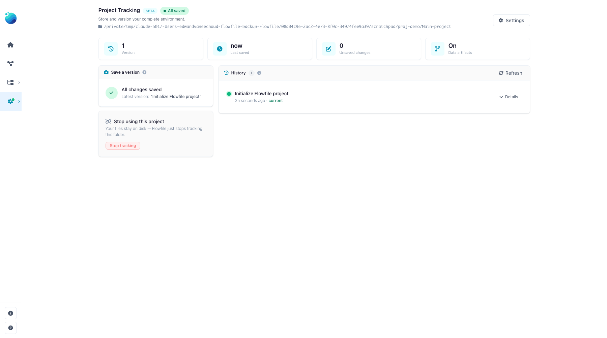

# Projects: version your work with git

This page is for anyone who wants a versioned, portable copy of their Flowfile work — flows, connections (without their secrets), schedules, and catalog metadata — tracked in a git repository. You'll learn how a project mirrors your install to a folder, how to save and open versions, and what does and doesn't end up in git.

## What a project is

A project is a folder that Flowfile keeps in sync with the resources you own. As you save flows, edit connections, and manage catalog metadata, Flowfile writes a deterministic, human-readable copy of everything into the project folder and tracks it with git. You get version history, diffs, and a folder you can commit to your own remote, share with a teammate, or copy to another machine.

Your Flowfile database stays the source of truth at runtime. The project folder is a **mirror**:

- **Projection (database → files)** happens automatically in the background whenever you save a flow, change a connection, edit a schedule, or update catalog metadata. You never trigger it by hand, and a sync error never blocks the save that caused it.
- **Import (files → database)** happens only at explicit moments: when you open a project, reload it from disk, or restore an older version.

!!! info "Not in Flowfile Lite"
    Projects require the full desktop or server build. The browser-only [Flowfile Lite](deployment/lite.md) edition does not track work in git.

## Secrets never enter the folder

A project folder is safe to commit. Secret **values** are never written into it — only the manifest of which secret names exist. Connections are mirrored without their bundled credentials. Flowfile also writes a `.gitignore` into every project (and hardens a hand-written one) so that credential and local-state files can never be committed, including `.env`, `*.secret`, `*.db`, `master_key.txt`, `*.key`, `*.pem`, and any materialized `data/` or `catalog_tables/`.

When you open a project on a new machine, the secret manifest tells Flowfile which values are still missing. Set them by name (see the CLI output below) or fill them in the app afterward.

## What's in the folder

A project folder holds YAML mirrors of your resources:

| Path | Contents |
|---|---|
| `project.yaml` | Project manifest — name, id, format version, data-tracking toggle. |
| `flows/` | One `.flow.yaml` per registered flow. |
| `connections/database/`, `connections/cloud/` | One `.yaml` per connection (no credentials). |
| `schedules/` | One `.yaml` per schedule. |
| `notebooks/` | One `.notebook.yaml` per notebook. |
| `secrets.yaml` | The names of secrets that must be supplied (no values). |
| `namespaces.yaml`, `tables.yaml`, `models.yaml`, `kernels.yaml`, `visualizations.yaml`, `dashboards.yaml` | Catalog metadata manifests. |
| `.gitignore` | Guards against committing secrets and local data. |

### Tracking data artifacts

The `project.yaml` manifest carries an all-or-nothing **track data artifacts** toggle (on by default). When on, catalog-table metadata (`tables.yaml`) and global-model metadata (`models.yaml`) are mirrored too. Turn it off to keep a project focused on flows and connections and leave data-artifact metadata out of git entirely. The materialized table data itself is never committed regardless — only its metadata.

## Working with projects in the app

Project actions live on the Project Tracking page: **Settings → Workspace → Project** (the gear icon in the left sidebar). The core operations are:

- **Initialize** a new project in a folder — writes the manifest and `.gitignore`, initializes git, and makes a first commit.
- **Open** an existing project folder — rebuilds your database resources from the files and reports what was imported.
- **Save a version** — projects the current state to files and commits it with your message.
- **Restore a version** — resets the folder to an earlier commit and rebuilds the database to match.
- **Reload from disk** — accepts changes made to the files outside Flowfile (for example a `git pull`) by rebuilding the database from them.



!!! warning "Restore and reload rebuild from the files"
    Restoring a version and reloading from disk both reset your resources to match the folder, pruning anything not present in the files. If you have unsaved changes, Flowfile stops and asks you to confirm; when you force the action it first autosaves your current state into git history so nothing is silently lost.

## Working with projects from the command line

Every core action has a headless equivalent, useful for scripting or CI. See the [CLI reference](deployment/cli.md#projects) for full details.

```bash
flowfile project init <folder>       # create a project in <folder>
flowfile project open <folder>       # open a project and import it
flowfile project save "<message>"    # save a version with a commit message
```

When you open a project whose secrets aren't set locally, `flowfile project open` reports how many values are missing. Supply them with `FLOWFILE_SECRET_<NAME>` environment variables or fill them in the app.

## Availability by mode

Projects are always available in the desktop app and the pip-installed package. In **Docker** (multi-tenant) mode the project router is disabled by default and returns 404; an operator enables it by setting `FLOWFILE_ENABLE_PROJECTS` to a truthy value (`true`/`1`/`yes`/`on`), and in that mode projects are admin-only and confined to each owner's own subtree.

## Related

- [CLI reference](deployment/cli.md) — headless `flowfile project` commands.
- [Catalog](visual-editor/catalog/index.md) — the flows, tables, and metadata a project mirrors.
- [Connections & secrets](visual-editor/connections.md) — connections are mirrored; their secrets are not.
- For the internals (projection hooks, import boundaries, the git folder contract), see [Architecture](../for-developers/architecture.md).
