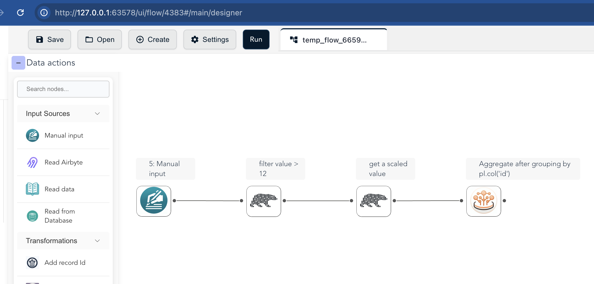
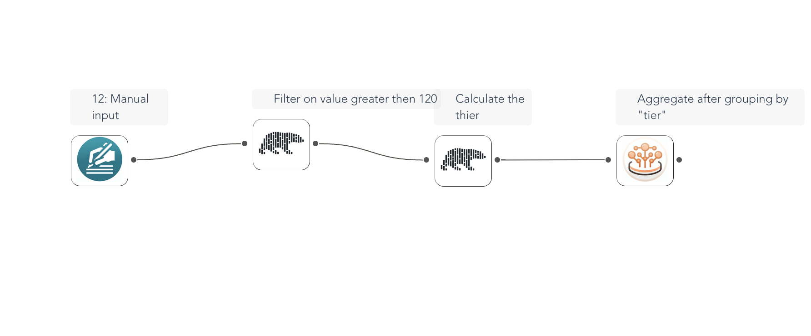

# Building Flows with Code

The `flowfile_frame` API lets you define and run data transformation pipelines in Python — with a Polars-like surface — while building a visual ETL graph as a side effect. This tutorial walks through a simple pipeline and a more involved one, and opens each in the Designer.

## Overview

`flowfile_frame` gives you a Polars-like API that generates an ETL graph from your Python code, which you can visualize, save, and share in the Flowfile Designer. Execution runs on the Polars engine.

## Installation

The `flowfile_frame` module ships with the standard `flowfile` package.

```bash
pip install flowfile
```

## A first pipeline

Build a pipeline programmatically and collect the result (this code runs in the test suite on every commit):

```python
--8<-- "docs/examples/code_to_flow.py:first"
```

Then open the graph in the Designer:

```python
ff.open_graph_in_editor(result.flow_graph)
```

<details markdown="1">
<summary>Generated flow in the Flowfile UI</summary>


</details>

## A more involved pipeline

You can add conditional logic, grouping, and aggregation, then visualize the result the same way:

```python
--8<-- "docs/examples/code_to_flow.py:involved"
```

```python
ff.open_graph_in_editor(aggregated.flow_graph)
```

<details markdown="1">
<summary>Generated flow in the Flowfile UI</summary>


</details>

When you call `open_graph_in_editor(...)`, the Designer opens and displays your pipeline, where you can inspect each node, continue editing visually, or save and export it.

!!! note "Grouping by an expression"
    `group_by(col("id"))` groups by an expression, which renders as a `polars_code` node rather than an editable group_by node. Grouping by a column name (`group_by("id")`) produces the editable node.

## Related

- [FlowFrame and FlowGraph](../concepts/design-concepts.md) — the model behind these graphs
- [Visual UI Integration](../reference/visual-ui.md) — launching and controlling the Designer from Python
- [API Reference](../reference/index.md) — the full method set
