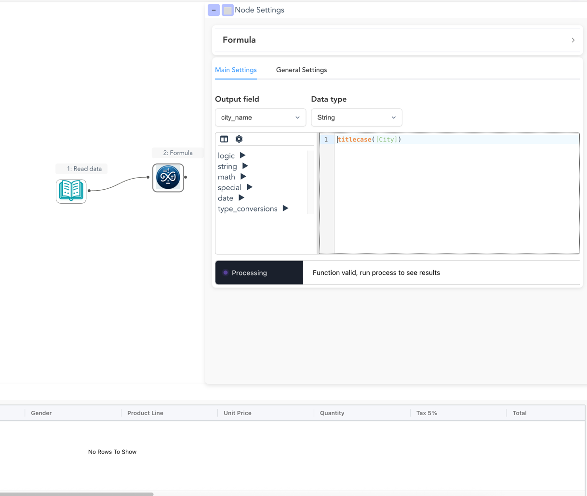

# Building Flows

Flowfile allows you to create data pipelines visually by connecting nodes that represent different data operations. This guide will walk you through the process of creating and running flows.

!!! info "Looking for a quickstart overview?"
    Check out our [Quick Start Guide](../../quickstart.md#quick-start-for-non-technical-users-non-technical-quickstart) to get up and running in minutes.

## Interface Overview

{ width="800px" }

*The complete Flowfile interface showing:*

- **Left sidebar**: Browse and select from available nodes 
- **Center canvas**: Build your flow by arranging and connecting nodes
- **Right sidebar**: Configure node settings and parameters
- **Bottom panel**: Preview data at each step

## Creating a Flow

  { width="1200px" }
  <figcaption>The Flowfile landing page when no flows are active, showing options to create a new flow or open an existing one</figcaption>

### Starting a New Flow
1. Click the **Create** button in the top toolbar
2. A new empty canvas will open
3. Save your flow at any time using the **Save** button
4. Flows are saved as `.yaml` or `.json` files (human-readable formats)

### Adding Nodes

1. Browse nodes in the left sidebar, organized by category:
     - Input Sources (for loading data)
     - Transformations (for modifying data)
     - Combine Operations (for joining data)
     - Aggregations (for summarizing data)
     - Output Destinations (for saving data)
2. Drag any node onto the canvas
3. Connect nodes to create a flow

## Configuring Nodes

### Node Settings

  

    
Click any node on the canvas to open its settings in the right sidebar. Each node type has unique configuration options tailored to its function.

    
For example, the <strong>"Formula"</strong> node shown here includes sections for:

    <ul style="margin: 0; padding-left: 1.5rem;">
      <li>🎛️ <strong>General:</strong> Add a custom description via general settings</li>
      <li>⚙️ <strong>Performance tweaking:</strong> Define if the data needs to be cached for better performance via general settings</li>
      <li>↔️ <strong>Transformations:</strong> Define the formula to be applied on the incoming data </li>
    </ul>
  

  

    
    
The settings panel for a "Formula" node.

  

### Data Preview
1. After configuration, each node shows the output schema of the action
2. Click on the **run** button to execute the node
3. The preview panel will show the output data

## Running Your Flow

### 1. Execution Options
Choose your execution mode from the settings panel:

- **Development**: Lets you view the data in every step of the process, at the cost of performance
- **Performance**: Only executes steps needed for the output (e.g., writing data), allowing for query optimizations and better performance

### 2. Running the Flow
1. Click the **Run** button in the top toolbar
2. Watch the execution progress:
     - 🟢 Green: Success
     - 🔴 Red: Error
     - 🟡 Yellow: Warning
     - ⚪ White: Not executed

### 3. Viewing Results
1. Click any node after execution to see its output data
2. Review the results in the preview panel
3. Check for any errors or warnings
4. Export results using output nodes

## Saving and Loading Flows

Flowfile saves your pipelines as human-readable YAML or JSON files, making them easy to version control, share, and collaborate on.

### Supported Formats

| Format | Extension | Best For |
|--------|-----------|----------|
| YAML | `.yaml`, `.yml` | Human readability, version control |
| JSON | `.json` | Programmatic access, API integration |

### Saving a Flow

1. Click the **Save** button in the toolbar
2. Choose a filename with `.yaml` or `.json` extension
3. Your flow is saved with all nodes, connections, and settings

### What Gets Saved

- **Flow settings**: Name, description, execution mode
- **All nodes**: Type, position, and configuration
- **Connections**: How nodes are linked together
- **Node settings**: All parameters and options

### Loading a Flow

1. Click **Open** in the toolbar
2. Select a `.yaml`, `.json`, or legacy `.flowfile`
3. The flow is fully restored and ready to run

### Version Control

YAML files work great with Git:

- Track changes to your pipelines over time
- Review diffs to see what changed
- Collaborate with team members
- Roll back to previous versions

!!! tip "Migrating from Legacy Format"
    If you have flows saved in the old `.flowfile` format, simply open them and save as `.yaml` to convert.

## Example Flow

Here's a typical flow that demonstrates common operations:
{ width="1200px" }

## Best Practices

### Organization
  - Give your flows clear, descriptive names
  - Arrange nodes logically from left to right
  - Group related operations together
  - Use comments or node labels for documentation

### Development
  - Save your work frequently
  - Test with a subset of data first
  - Use the auto-run mode during development
  - Break complex flows into smaller, manageable parts

### Troubleshooting
  - Check node configurations if errors occur
  - Review data previews to understand transformations
  - Ensure data types match between connected nodes
  - Look for error messages in node status

## Tips and Tricks

- **Node Management**:
      - Double-click canvas to pan
      - Use mouse wheel to zoom
      - Hold Shift to select multiple nodes
      - Right-click for context menu
      - Right-click on the text to add notes

- **Data Handling**:
    - Use sample nodes during development
    - Preview data frequently
    - Check column types early with *select* nodes

---

---
## Want to see another example? 
Checkout the [quickstart guide](../../quickstart.md#quick-start-for-non-technical-users-non-technical-quickstart)!

## Next Steps

After mastering basic flows, explore:

  - [Input sources](nodes/input.md)
  - [Complex transformations](nodes/transform.md)
  - [Data aggregation techniques](nodes/aggregate.md)
  - [Advanced joining methods](nodes/combine.md)
  - [Output options](nodes/output.md)