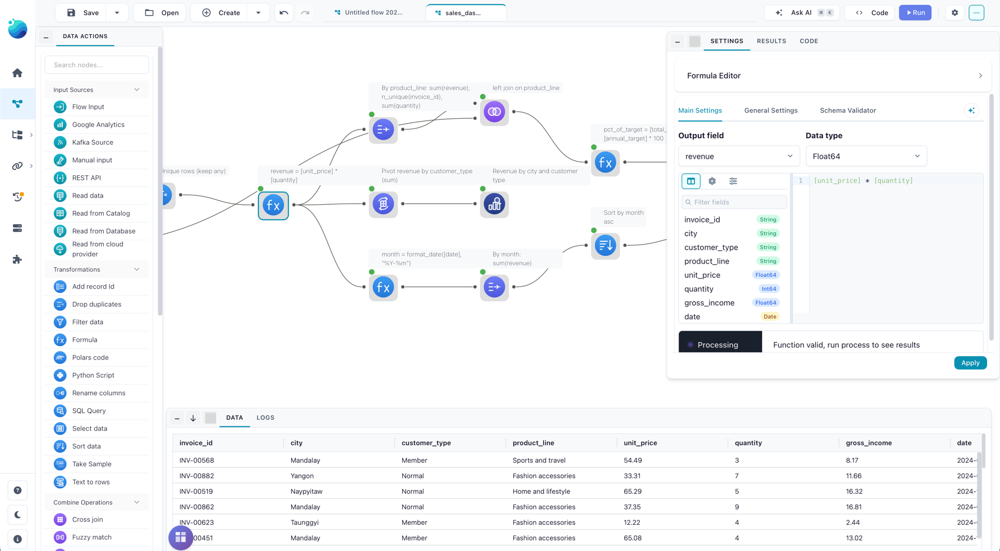
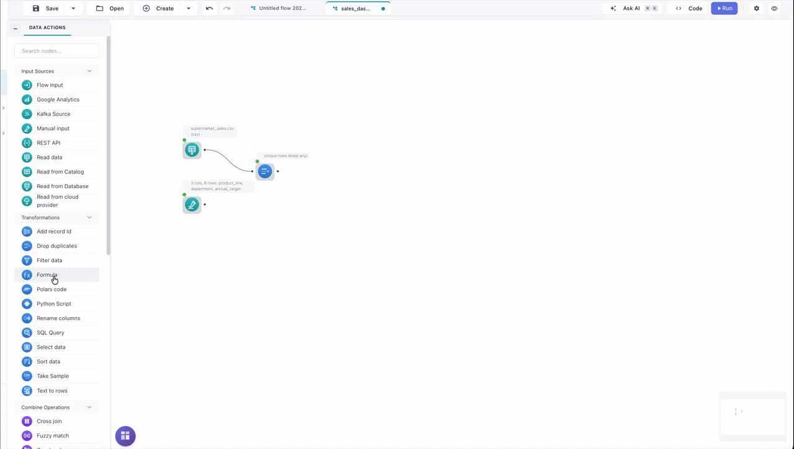
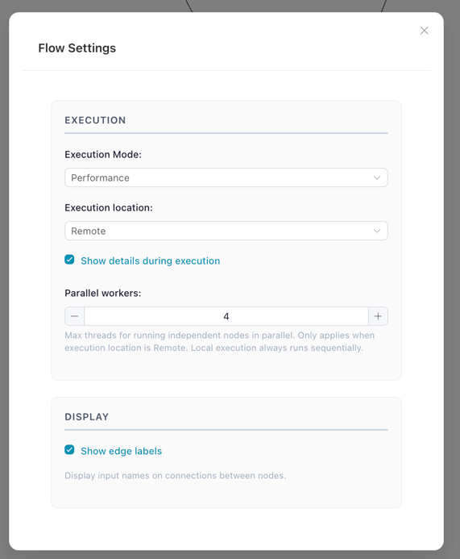

# Building Flows

This page covers the canvas mechanics: creating a flow, adding and connecting nodes, running, and saving. For a complete worked pipeline, follow the [Quickstart](../../quickstart.md#your-first-flow-visually) — or open the finished [sales pipeline in your browser](https://demo.flowfile.org), no install needed.

## The interface

{ width="800px" }

- **Left sidebar** — the node palette, grouped into six categories ([full reference](nodes/index.md))
- **Center canvas** — the flow itself
- **Right sidebar** — settings for the selected node
- **Bottom panel** — data preview for the selected node

| Canvas control | Action |
|---|---|
| Mouse wheel | Zoom |
| Drag empty canvas | Pan |
| Shift + drag | Select multiple nodes |
| Right-click | Context menu; add notes to the canvas |

## Create a flow

1. Click **Create** in the top toolbar and name the flow.
2. An empty canvas opens.
3. **Save** writes it as a `.yaml` file (`.json` also supported) — plain text that diffs and versions cleanly in Git. Legacy `.flowfile` files still open; re-save to convert.

## Add and connect nodes

1. Drag a node from the left sidebar onto the canvas.
2. Drag from a node's output handle to the next node's input to connect them.
3. Click a node to configure it in the right sidebar — alongside each node's own settings there is a shared **General Settings** tab with the node's description, its reference name (used for edge labels, see below), and a toggle to cache its result between runs.



## Run

1. Click **Run** in the top toolbar.
2. Node borders show execution state: green success, red failure, orange warning, grey not yet executed.
3. Click any executed node to inspect its output in the bottom panel.

In **Development** mode (the default) every node's data is available for preview after a run. Switch to **Performance** mode when the flow is done: only the steps needed for outputs execute, and the query optimizer works across nodes.

## Flow settings

The **gear icon** in the top toolbar opens the flow-level settings:



| Setting | Options |
|---|---|
| Execution mode | **Development** (preview everything) / **Performance** (optimized, outputs only) |
| Execution location | **Local** (core process, sequential) / **Remote** (worker service, independent nodes run in parallel) |
| Parallel workers | 1–32, default 4 — remote execution only |
| Show detailed progress | More granular per-node status during runs |
| Show edge labels | Display each connection's name on the canvas |
| Warn about invalid node settings | Flag nodes whose settings no longer match their input, before you run |

**Parallel workers** applies to Remote runs. The worker service runs independent steps at the same time, up to the number you set, so a flow with independent branches finishes in a few *rounds* instead of one step after another. At 1 — or on Local, which is always sequential — every step waits its turn.


### Settings warnings

With **Warn about invalid node settings** on (the default), Flowfile checks each node against the columns its input will actually produce and marks the ones that no longer add up — without running the flow. Two things are flagged:

- Settings that reference a column that is gone, usually after an upstream rename or a column dropped in a Select.
- Formula and filter expressions that cannot run against the input — `[amount] + "x"` on a numeric column, or an advanced filter that does not produce true or false.

An amber dot appears on the node; hover it to see what is wrong. Fix the setting and the dot clears — no run needed.

Nodes that *tolerate* a missing column are never flagged. Select and Dynamic rename skip a column that is no longer there and keep running, and a Join ignores unavailable entries in its column lists — only a missing **join key** breaks the node, so only that warns.

!!! info "Silence is not a clean bill of health"
    The check never guesses. A node stays unmarked whenever its input schema cannot be known without running the flow — downstream of a custom node or Python Script that has to execute once first — and raw Python and SQL nodes are never checked at all. Run the flow to catch what static analysis cannot see.

### Edge labels and Python Script nodes

Each connection's name comes from the source node's **node reference** (default `df_{node_id}`). With edge labels on, the canvas shows the exact name a [Python Script node](kernel-api.md#writing-output-data) uses to read that input:

```python
total_sales = flowfile_ctx.read_input("total_sales")
sales_per_city = flowfile_ctx.read_input("sales_per_city")
```

Python Script nodes likewise publish named outputs with `flowfile_ctx.publish_output(df, "name")`.

## From here

- Open the finished sales pipeline: in-app via **Create → From template**, [as a download](../../assets/flows/sales_pipeline.yaml), or [live in the browser](../../assets/try-sales-pipeline.html).
- [Worked examples](tutorials/index.md) — complete flows with data and expected results.
- [Node reference](nodes/index.md) — every node, per category.
