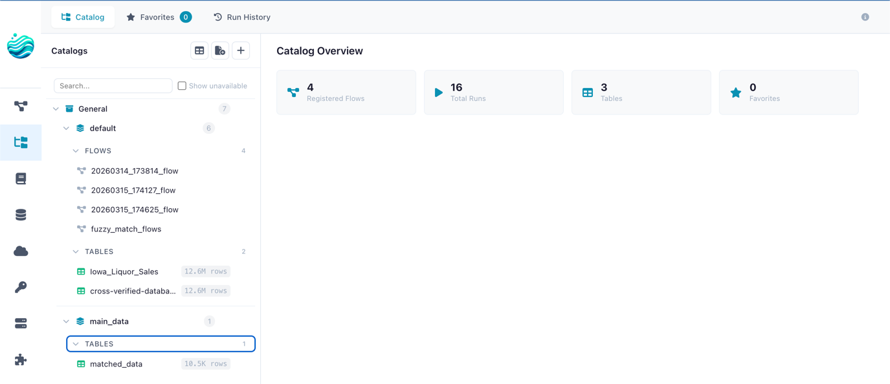
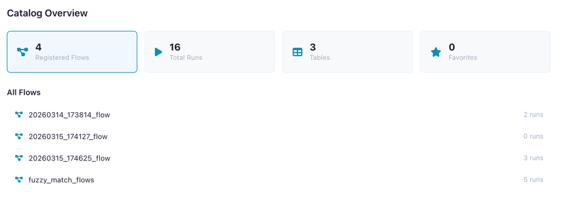
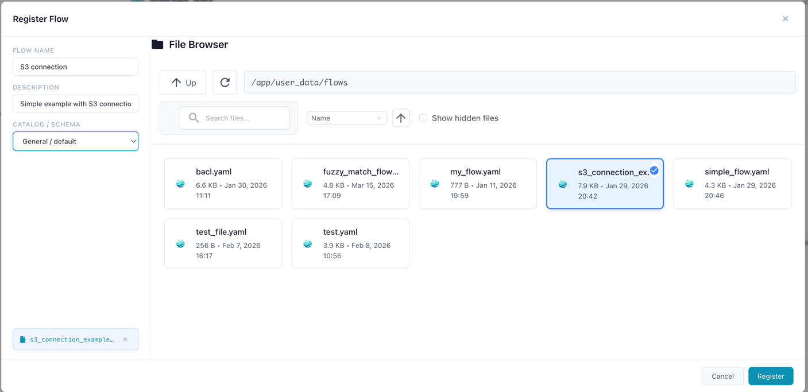
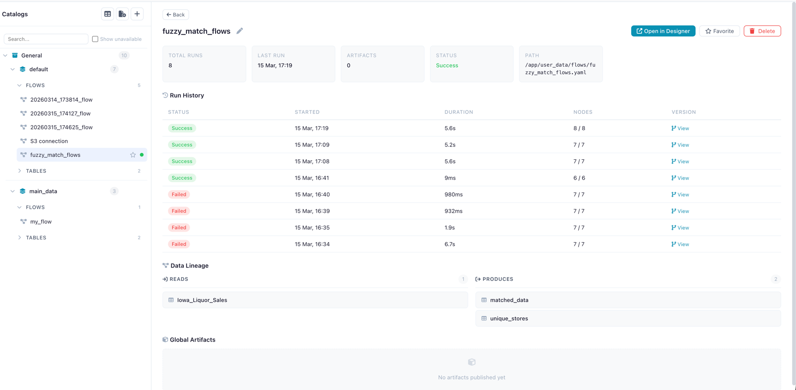
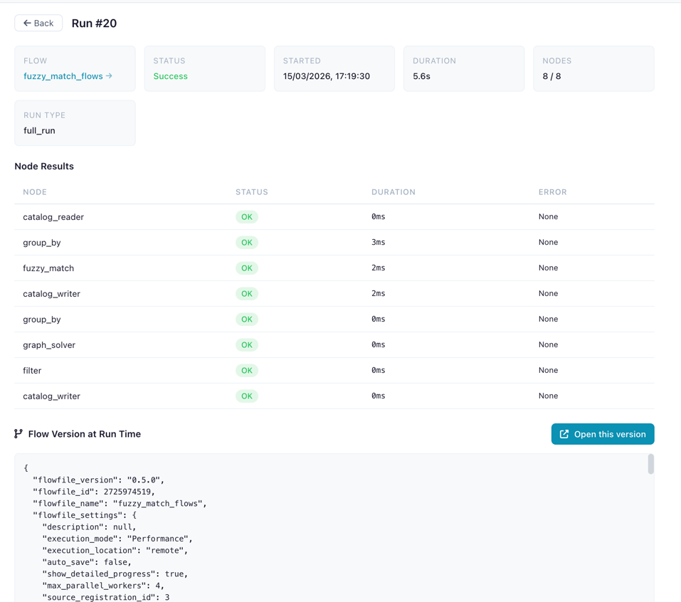
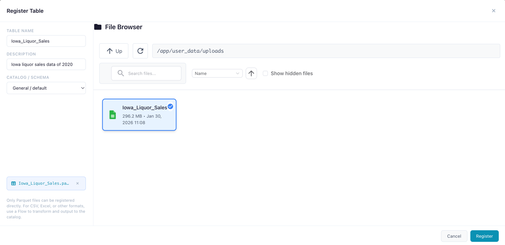
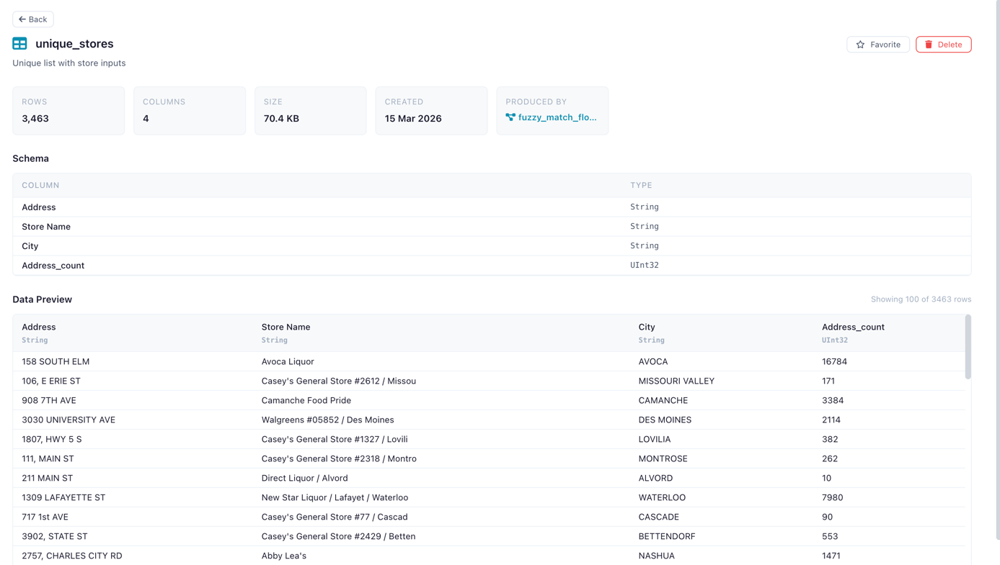

# Catalog

Organize, track, and govern your data flows and tables in a central catalog.

The Catalog provides a namespace hierarchy for managing flows,
tracking run history, registering data tables, and sharing artifacts across flows.

<!-- PLACEHOLDER: Screenshot of the full Catalog view showing the sidebar tree and stats panel -->

*The Catalog page with namespace tree, tabs, and dashboard statistics*

---

## Opening the Catalog

Click the **Catalog** icon in the left sidebar menu to open the Catalog page.

---

## Dashboard

When no item is selected, the Catalog shows an overview dashboard with:

| Metric | Description |
|--------|-------------|
| **Registered Flows** | Flows tracked in the catalog |
| **Total Runs** | Number of flow executions recorded |
| **Tables** | Materialized data tables |
| **Favorites** | Your bookmarked flows |
| **Schedules** | Configured [schedules](schedules.md) for automated flow execution |

*Dashboard showing overview metrics*

---

## Namespaces

Namespaces organize your catalog into a two-level hierarchy:

- **Catalog** (level 0) — Top-level container (e.g., `production`, `development`)
- **Schema** (level 1) — Sub-container within a catalog (e.g., `sales`, `analytics`)

Flows, tables, and artifacts are always registered under a **schema**.

### Creating a Namespace

1. Click the **+** button next to "Catalog" in the tree sidebar
2. Choose whether to create a **Catalog** (top-level) or **Schema** (under an existing catalog)
3. Enter a name and optional description
4. Click **Create**

A default catalog and schema are created automatically on first use.

---

## Tabs

The sidebar offers four tabs:

| Tab | Description |
|-----|-------------|
| **Catalog** | Browse the namespace tree with flows, tables, and artifacts |
| **Favorites** | Your starred flows for quick access |
| **Run History** | Chronological list of all flow executions |
| **Schedules** | Manage automated flow schedules — see [Schedules](schedules.md) |

---

## Registering Flows

Register a flow to enable run tracking, artifact lineage, and catalog table production.

1. Navigate to the desired schema in the tree
2. Click **Register Flow**
3. Select the flow file (`.yaml`) from the file browser
4. Enter a name and optional description
5. Click **Register**

<!-- PLACEHOLDER: Screenshot of the Register Flow dialog -->

*Registering a flow file under a catalog schema*

### Flow Detail Panel

Click a registered flow to see its detail panel:

- **Name** (editable inline) and description
- **Metrics**: total runs, success rate, last run time, artifact count
- **Actions**: Open in Designer, Run Flow, Cancel Run, Favorite, Delete
- **Recent Runs** table with status, duration, and trigger type
- **Schedules** section — manage schedules for this flow (see [Schedules](schedules.md))
- **Produced Artifacts** list

<!-- PLACEHOLDER: Screenshot of the Flow Detail Panel -->

*Flow detail panel showing metrics, recent runs, and actions*

!!! warning "Missing Flow File"
    If the flow's `.yaml` file has been moved or deleted, a warning banner appears.
    The flow metadata and run history are preserved, but the flow cannot be opened in the designer.

---

## Run History

Every execution of a registered flow is recorded with:

| Field | Description |
|-------|-------------|
| **Status** | Success or failure (with error details) |
| **Started / Ended** | Timestamps |
| **Duration** | Execution time in seconds |
| **Nodes Completed** | Progress (`completed / total`) |
| **Run Type** | How the flow was triggered |
| **Flow Snapshot** | YAML snapshot of the flow version at run time |

### Run Detail Panel

Click a run to see its full detail:

- Status badge and metadata
- **Node Results** table: each node's status, duration, and error messages
- **Flow Snapshot**: the exact flow version that was executed
- **Open Snapshot in Designer** button to recreate the flow as it was

<!-- PLACEHOLDER: Screenshot of the Run Detail Panel -->

*Run detail showing node results and snapshot*

---

## Catalog Tables

Register materialized data tables in the catalog for reuse across flows.

!!! tip "Recommended: Register tables via a flow"
    It is recommended to register tables via a flow, as it supports more source types and ensures the table is interpreted exactly how you want it.

### Registering a Table

1. Navigate to a schema in the tree
2. Click **Register Table**
3. Select a Parquet file (`.parquet`)
4. Enter a name
5. Click **Register**

*Registering a new catalog table from a data file*

### Table Detail Panel

Click a table to view:

- **Metadata**: name, namespace, row count, column count, file size, creation date
- **Schema**: column names and data types
- **Data Preview**: scrollable preview of the first 100 rows
- **Delete** button with confirmation

*Table detail panel showing schema and data preview*

### Using Catalog Tables in Flows

Use the **Catalog Reader** input node to read a catalog table and the **Catalog Writer** output node to write results back. See [Input Nodes](nodes/input.md#catalog-reader) and [Output Nodes](nodes/output.md#catalog-writer).

### Lineage

The catalog tracks which flows produce and consume each table:

- **Source**: which registered flow and run created the table
- **Consumers**: which flows read from the table via Catalog Reader nodes

### How Storage Works

When you register a table — either by adding it directly in the catalog or by writing to it via a [Catalog Writer](nodes/output.md#catalog-writer) node in a flow — it is **stored as a Parquet file**. This ensures consistent, efficient storage with full schema preservation.

**Materialization process:**

1. The source file (CSV, TSV, TXT, Excel, or Parquet) is read by the worker service using Polars
2. The data is written as a single Parquet file to the catalog storage directory
3. Metadata is extracted from the materialized file: row count, column count, file size, and column schema (names + Polars data types)
4. A database record is created linking the table name, namespace, and file path

**Supported source format:** Parquet (`.parquet`)

**Storage location:**

| Environment | Path |
|-------------|------|
| Desktop / local | `~/.flowfile/catalog_tables/` |
| Docker | `/data/user/catalog_tables/` (mapped via `FLOWFILE_USER_DATA_DIR`) |

**File naming:** Each Parquet file is named `{table_name}_{uuid}.parquet` (e.g., `sales_data_a3f1b2c4.parquet`). The UUID suffix ensures uniqueness even when multiple tables share similar names.

!!! info "Flat storage"
    Namespaces (catalogs and schemas) are a **logical hierarchy** stored in the database — not filesystem directories. All materialized Parquet files live in a single flat directory. Table name uniqueness is enforced per namespace, so two schemas can each have a table called `customers` without conflict.

---

## Favorites

**Favorite** a flow (star icon) to bookmark it in the Favorites tab for quick access. Favorites are per-user and can be toggled from the flow detail panel or inline in the tree.

---

## Global Artifacts

Global artifacts are Python objects (ML models, DataFrames, configs) persisted in the catalog and accessible from any flow. They are published from [Kernel code](kernels.md#global-artifacts-catalog) using `flowfile.publish_global()`.

Click an artifact in the tree to view its versions, metadata, and producing flow.

---

## Related Documentation

- [Schedules](schedules.md) — Automating flow execution with schedules
- [Kernel Execution](kernels.md) — Publishing global artifacts from Python code
- [Input Nodes](nodes/input.md#catalog-reader) — Catalog Reader node
- [Output Nodes](nodes/output.md#catalog-writer) — Catalog Writer node
- [Building Flows](building-flows.md) — Creating workflows
