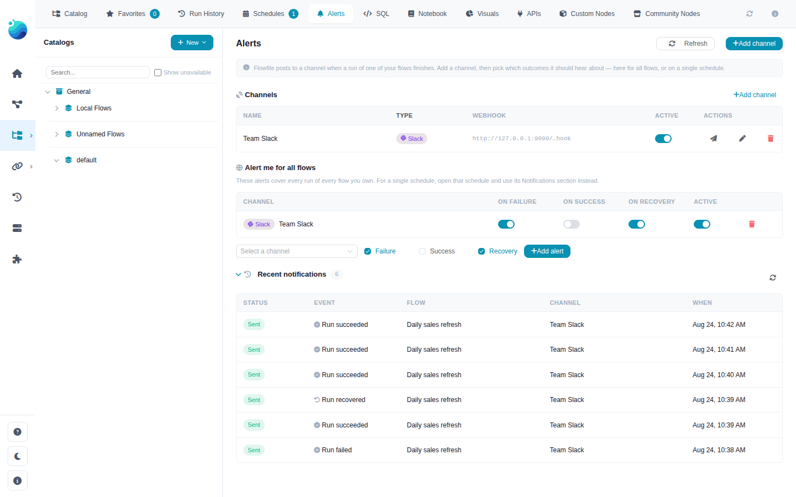
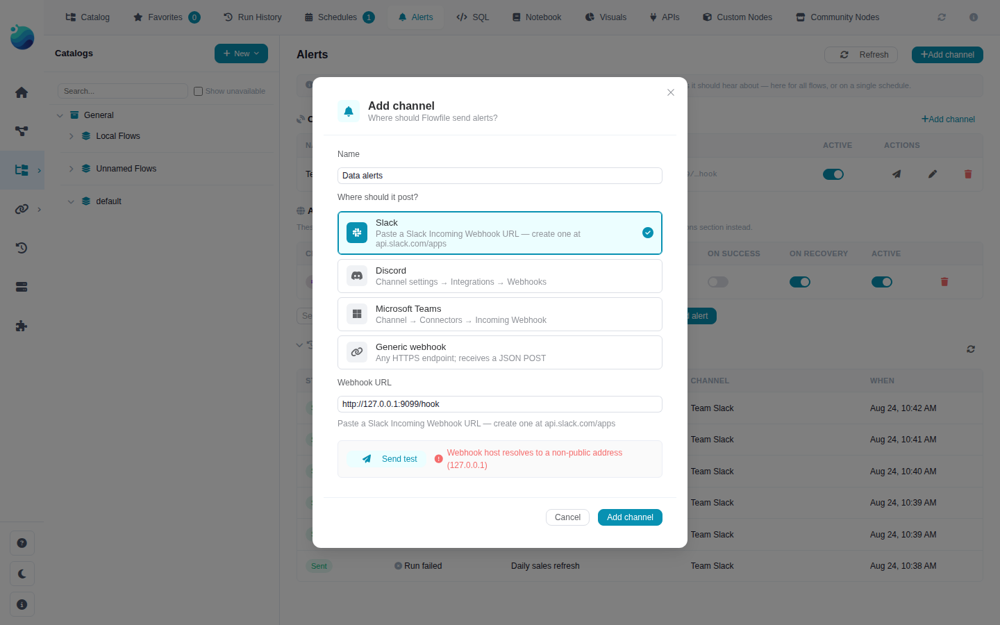
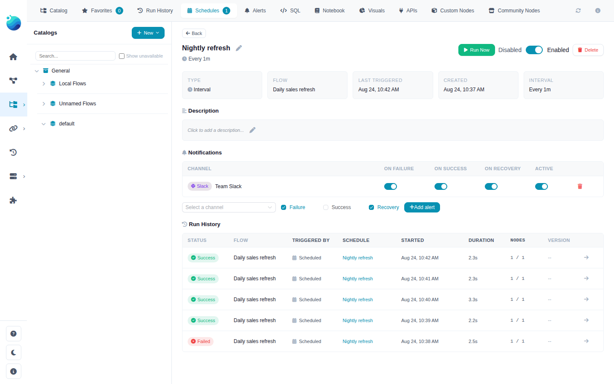

# Alerts & Notifications

Get a message in Slack, Discord, Microsoft Teams, or any webhook endpoint when a flow run fails, recovers, or succeeds — especially useful for scheduled flows that run while nobody is watching.

!!! info "Not in Flowfile Lite"
    Alerts are delivered by the scheduler / run machinery, which requires the full desktop/server build. The browser-only [Flowfile Lite](../../deployment/lite.md) edition cannot send notifications.



*The Alerts tab with a channel, an account-wide alert, and the delivery history*

---

## Overview

Alerting is built from two pieces, both managed from the **Alerts** tab in the Catalog:

| Piece | What it is |
|-------|------------|
| **Channel** | A webhook destination — where messages go (a Slack channel, a Teams channel, your own endpoint) |
| **Alert** (rule) | Which run outcomes are sent to which channel — for one schedule, one flow, or every flow you own |

When a run finishes, Flowfile checks the alerts that cover it and posts a message to each matching channel. Messages contain run metadata only — flow name, schedule, duration, node counts, and the failing nodes' error messages (truncated) — never row data.

The events that can fire:

| Event | When |
|-------|------|
| **Run failed** | The run finished unsuccessfully; the message names the failing node(s) and their errors |
| **Run was closed as orphaned** | The run's process died without reporting back (crash, OOM, host restart) and the scheduler closed it |
| **Run recovered** | The run succeeded after the previous run of the same flow had failed |
| **Run succeeded** | Every successful run (off by default — noisy) |

Runs started from the flow designer canvas are never alerted (you are already watching them), and cancelling a run yourself does not fire a failure alert.

---

## Creating a Channel

1. Open the **Alerts** tab in the Catalog and click **Add channel**
2. Pick the channel type — this controls how the message is formatted
3. Paste the webhook URL
4. Click **Send test** to verify a message arrives, then **Add channel**



*The Add channel dialog with per-provider instructions and a pre-save test*

Where to get the webhook URL:

| Type | How to get a URL |
|------|------------------|
| **Slack** | Create an app at [api.slack.com/apps](https://api.slack.com/apps), enable *Incoming Webhooks*, add a webhook to a channel |
| **Discord** | Channel settings → *Integrations* → *Webhooks* → *New Webhook* → *Copy Webhook URL* |
| **Microsoft Teams** | Channel → *Connectors* (or *Workflows*) → *Incoming Webhook* |
| **Generic webhook** | Any HTTPS endpoint you control — it receives a JSON `POST` with `{"event": ..., "data": {...}}` |

!!! note "The URL is a credential"
    Anyone holding a webhook URL can post into your channel, so Flowfile stores it encrypted (the same `$ffsec$` encryption used for [secrets](secrets.md)) and only ever shows a masked preview after saving. To change a URL, edit the channel and paste a new one.

---

## Adding Alerts

An alert connects a channel to a scope and a set of outcomes. **On failure** and **On recovery** are on by default; **On success** is off (it fires for every successful run).

### For one schedule

Open the schedule from the Schedules tab — its detail panel has a **Notifications** section listing the alerts for that schedule. Add one by picking a channel; toggle outcomes inline at any time.



*The Notifications section in a schedule's detail panel*

You can also tick **Notify on failure** directly in the create-schedule dialog to set this up in one step.

### For one flow

Create the alert with a flow scope via the flow's detail panel or the API — it then covers every scheduled/manual run of that flow regardless of which schedule started it.

### For everything you own

The **Alert me for all flows** section on the Alerts tab creates account-wide alerts covering every run of every flow you own. Useful as a safety net alongside more specific per-schedule alerts.

---

## Delivery

- Alerts are sent by the scheduler loop and by the finishing run itself, so they typically arrive within seconds of a run ending. They require Flowfile (or the [standalone scheduler](schedules.md#standalone-mode)) to be running.
- Failed deliveries are retried with increasing backoff (1m → 5m → 15m → 1h, up to 5 attempts) before being marked dead.
- The **Recent notifications** section on the Alerts tab shows every delivery attempt with its status; a failed delivery shows the error on hover.
- Deleting a channel also removes the alerts pointing at it. History is kept.

### Private / internal endpoints

By default Flowfile refuses webhook URLs that resolve to private, loopback, or link-local addresses — a safety guard, since the server makes the request. If your endpoint is on your internal network (e.g. a self-hosted Mattermost), opt in explicitly:

```bash
FLOWFILE_NOTIFY_ALLOW_PRIVATE_HOSTS=true
```

### Generic webhook payload

Generic channels receive the raw event as JSON:

```json
{
  "event": "run_failed",
  "data": {
    "event_type": "run_failed",
    "flow_name": "Daily sales refresh",
    "run_id": 42,
    "run_type": "scheduled",
    "schedule_id": 3,
    "schedule_name": "Nightly refresh",
    "success": false,
    "started_at": "2026-08-24T02:00:04",
    "ended_at": "2026-08-24T02:00:07",
    "duration_seconds": 2.5,
    "nodes_completed": 1,
    "number_of_nodes": 4,
    "failed_nodes": [
      {"node_id": 2, "node_name": "read", "error": "[Errno 2] No such file or directory: ..."}
    ],
    "log_path": "/home/user/.flowfile/logs/scheduled_run_42.log",
    "reason": null
  }
}
```

---

## Related Documentation

- [Schedules](schedules.md) — Automating flow execution (what the alerts watch)
- [Secrets & Encryption](secrets.md) — How credentials like webhook URLs are stored
- [Catalog](index.md) — Managing flows, tables, and run history
