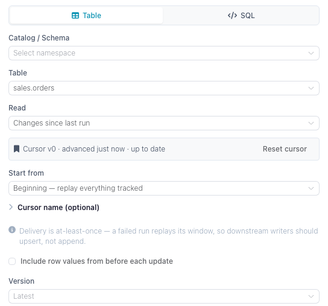

# Change Tracking

Change tracking lets a flow read only what changed in a Delta table instead of re-reading the whole table every run. It works on catalog tables and on Delta tables at a cloud storage path: turn it on for the table, point a reader at it in one of the **Changes** modes, and each run returns the inserts, updates and deletes committed in that window. This page covers how to turn it on, what the reader returns, the per-consumer cursor that catalog tables keep, how cloud paths differ, and the cases where tracking is refused or unsafe.

Underneath it is Delta Lake's change data feed: a table property that makes every write record its row-level changes alongside the data. Flowfile turns the property on, knows the version it was turned on at, and — for catalog tables — keeps a cursor per consumer.

## Catalog tables and cloud paths

The change feed, the columns it adds and the enable-only rule are the same for both. What differs is what Flowfile can keep about a table the catalog does not manage:

| | Catalog table | Delta table at a cloud path |
|---|---|---|
| Reader | [Read from Catalog](../nodes/input.md#catalog-reader) | [Read from cloud provider](../nodes/input.md#cloud-reading-changes), Delta Lake format |
| Writer | [Write to Catalog](../nodes/output.md#catalog-writer) | [Write to cloud provider](../nodes/output.md#cloud-storage-writer), Delta Lake format |
| Read modes | Since last run, since version, since time | Since version, since time |
| Cursor | One per consumer, advanced after each full run | None — a [flow parameter moves the window](#moving-the-window-on-a-cloud-path) |
| Tracking floor | Recorded when tracking is turned on | Read from the table's Delta log on every run |
| Storage | Wherever the catalog keeps its tables | S3 or Azure Data Lake Storage; not Google Cloud Storage |

## Turning it on

Tracking is **off by default**, **per table**, and **enable-only** — nothing in the UI turns it back off, because the changes a table stops recording cannot be recovered later. Every way of turning it on does the same thing:

- The writer's **Track changes** checkbox, on [Write to Catalog](../nodes/output.md#catalog-writer) or [Write to cloud provider](../nodes/output.md#cloud-storage-writer). On a new table the property is set at creation; on an existing untracked table the writer enables it just before writing, so that write is the first tracked commit.
- The **Enable change tracking** button in either reader's settings, shown when a change mode is picked on a table that is not tracked yet.
- For a catalog table, the **Change tracking** card on the table's detail page in the catalog browser.

In Python, pass `track_changes=True` to [`write_catalog_table`](../../python-api/reference/writing-data.md#catalog-writing) or `SchemaReference.write_table` for a catalog table, and to [`FlowFrame.write_delta`](../../python-api/reference/writing-data.md#delta-lake-writing) or `write_to_cloud_storage` for a cloud path.

!!! warning "Only commits made after enabling are tracked"
    The version tracking was turned on at is the floor for every change read. History written before it cannot be replayed — the change feed for those versions is either missing or inconsistent, so a window that starts earlier is moved up to the floor. A catalog table records the floor when tracking is enabled; for a cloud path Flowfile reads it from the Delta log: the commit that turned tracking on or, for a table created tracked, its oldest version still in the log. Turn tracking on when you create the table, not when you first need a change feed.

Tracking is refused on virtual tables, legacy parquet tables and [SCD2](slowly-changing-dimensions.md)-tracked tables, and on `gs://` paths. An SCD2 table already keeps row history in its `valid_from` / `valid_to` / `is_current` columns — read those instead.

## Reading changes

Both readers show a **Read** selector:



| Option | What the run returns |
|--------|----------------------|
| **Full table** (default) | The table as it is now. No change feed. |
| **Changes since last run** | Catalog tables only. Everything committed after the version this consumer last processed. Advances a cursor. |
| **Changes since version** | Everything committed after the version you pick. No cursor — the same window every run. |
| **Changes since time** | Everything committed at or after a timestamp (never below the tracking floor). No cursor. |

**Changes since version** and **Changes since time** also accept a flow parameter (`${name}`, offered in the drawer when the flow defines one of the matching type), so a scheduled, CLI or API run can pass the starting point at run time.

Every change mode adds three columns to the table's own:

| Column | Meaning |
|--------|---------|
| `_change_type` | `insert`, `update_postimage`, `delete` — plus `update_preimage` when preimages are included |
| `_commit_version` | The Delta commit version the row change belongs to |
| `_commit_timestamp` | When that commit landed |

By default the reader drops `update_preimage` rows, so an updated row appears once, with its new values. Tick **Include row values from before each update** (`include_change_preimage` in Python) to get the before-image rows as well; pair them with `_commit_version` to see what a row looked like before and after the same commit.

A run whose window contains nothing returns an empty frame with the full schema, not an error — a scheduled flow that fires during a quiet hour simply processes zero rows.

## Cursors

Only **Changes since last run** keeps a cursor, so cursors exist for catalog tables only. A cursor stores one number: the last Delta commit version that was fully processed. The next run reads from the version after it, up to the table's head at the moment the read starts.

**Which runs advance it.** A cursor moves only after a full flow run in which the reader and everything downstream of it completed — running the flow from the designer, from a schedule, or headlessly. Previewing a node, running a single node, or cancelling a run never advances it. A failure anywhere downstream leaves the cursor where it was, so the next run replays the same window.

**Delivery is at-least-once.** Because the cursor advances after the run rather than during it, a run that succeeds but whose commit fails, or one that is killed between writing and committing, will re-deliver its window. Make the downstream write idempotent — upsert on a key rather than append.

**Cursor identity.** By default a cursor belongs to the node in the flow it lives in: two flows reading the same table each get their own position, and each sees every change. Give the reader a **Cursor name** to share one position across flows or notebooks instead — named cursors are global to the table, so whichever run reads first consumes the window for all of them. Names may contain letters, digits and `_ . : -`.

!!! note "A named cursor is required outside a saved flow"
    The default cursor key is built from the flow's identity, so a reader in an unsaved flow has nothing to key on. Save the flow first, or give the cursor a name. In `flowfile_frame`, `changes_since="last_run"` needs `changes_consumer=` unless the graph is registered in the catalog.

**Where a cursor starts.** The first run with no cursor yet is governed by **Start from**: *Now* (the default) initializes the cursor at the current version and reads nothing, so processing starts with the next change; *Beginning* replays everything recorded since tracking was enabled.

**Reset and delete.** The reader's settings and the table detail page both list the table's cursors with how far behind they are, and offer **Reset** (move to the current version, skipping unread changes) and **Delete** (forget the position entirely — the next run re-initializes per **Start from**). Resetting to the beginning replays all tracked history.

## Delta tables at a cloud path { #cloud-delta-tables }

A [Read from cloud provider](../nodes/input.md#cloud-reading-changes) node in the Delta Lake format reads the change feed straight from the table's path, with no catalog entry. Three things work differently from a catalog table:

- **No cursor.** A bare path has nowhere to store one, so there is no **Changes since last run**; each run reads the window its **Changes since version** or **Changes since time** setting describes.
- **The floor comes from the Delta log.** With no catalog entry to record it in, the reader looks up the commit that turned tracking on each time it runs.
- **Tracking can be turned on without writing.** The reader's **Enable change tracking** button adds the table property as its own commit, so the next write is the first one tracked. A [Write to cloud provider](../nodes/output.md#cloud-storage-writer) node with **Track changes** ticked does the same as part of its write.

### Moving the window on a cloud path

To process each change once without a cursor, remember the highest `_commit_version` a run returned and pass it as the starting version of the next run. Define an integer [flow parameter](../subflows.md#add-parameters-optional), pick it under **Since version** in the reader, and set it per run — a headless run takes it as `--param`, a [published API](flow-api.md#parameters) as a query parameter:

```bash
flowfile run flow orders_sync.yaml --param since_version=41
```

That run reads every commit after version 41. Running it again with the same value reads the same window again, so keep the downstream write idempotent, as with a cursor.

## What each write mode produces

Any write to a tracked table records changes, but what shows up in the feed depends on how the data was written:

- **Upsert, update, delete** record exactly the rows they touched, with `update_preimage`/`update_postimage` pairs for modified rows. This is the combination change tracking is built for, and both writers offer it.
- **Append** records its new rows as inserts.
- **Overwrite** is not offered with **Track changes** on either writer (`track_changes` with `write_mode="overwrite"` is a validation error, as are the catalog's `"virtual"` and `"scd2"`). A tracked table that some other flow overwrites still produces a feed — but as a full set of deletes followed by a full set of inserts, which is rarely what a downstream consumer wants.

## Vacuum and history retention

A change feed can only be read while the underlying Delta history is still on disk. [Vacuum](index.md#delta-table-history) reclaims files older than the retention window, which can put the versions a cursor still needs out of reach.

Flowfile guards against that for catalog tables: a vacuum that would drop history a cursor still points into is refused with a warning listing the cursors at risk, and the dialog offers **Vacuum anyway** if you accept the loss. If a read later lands on a version that no longer exists, the reader fails with an error telling you to reset the cursor. A cloud path has no cursors to protect and no vacuum action in Flowfile, so a vacuum run on it by another tool is not checked.

Overwrite commits are the fragile case: their change feed is reconstructed from the files the overwrite replaced, so a vacuum breaks it. Merge-based writes (upsert, update, delete) materialize their changes explicitly and survive.

## From Python

`read_catalog_table` and `SchemaReference.read_table` take `changes_since` — an `int` for a version, `"last_run"` for a cursor, or an ISO-8601 string / `datetime` for a timestamp — plus `changes_consumer`, `changes_start` and `include_change_preimage`. See [Catalog References](../../python-api/reference/catalog-references.md) for the full signatures.

The tested example below writes a table twice with tracking on, then reads its change feed through a named cursor:

```python
--8<-- "docs/examples/catalog_change_feed.py:example"
```

For a cloud path, `ff.scan_delta` and `ff.read_from_cloud_storage` (with `file_format="delta"`) take the same `changes_since` and `include_change_preimage`, without `"last_run"`: a cloud path keeps no cursor, so `"last_run"` raises a `ValueError`. See [Reading Data](../../python-api/reference/reading-data.md#delta-lake-reading). The tested example upserts into a Delta table on S3 twice, then reads everything committed after version 0:

```python
--8<-- "docs/examples/integrations/cloud_delta_changes.py:example"
```

The feed holds order 2 as `update_postimage` and order 3 as `insert`, both at `_commit_version` 1. Order 1 is absent: the second write did not touch it.

## Related documentation

- [Read from Catalog](../nodes/input.md#catalog-reader) — the Read selector for a catalog table
- [Read from cloud provider](../nodes/input.md#cloud-reading-changes) — the Read selector for a cloud Delta path
- [Write to Catalog](../nodes/output.md#catalog-writer) and [Write to cloud provider](../nodes/output.md#cloud-storage-writer) — the Track changes flag
- [Slowly Changing Dimensions](slowly-changing-dimensions.md) — row-level history in ordinary columns, the alternative to a change feed
- [Catalog](index.md#delta-table-history) — Delta version history and vacuum
- [Schedules](schedules.md) — running an incremental flow on a timer
