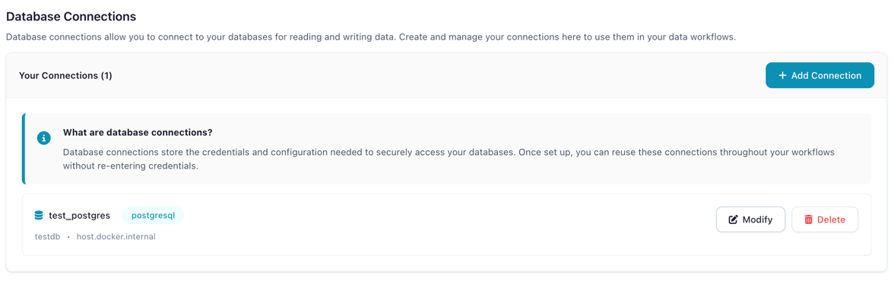
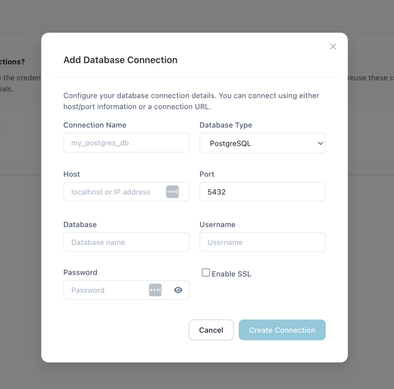
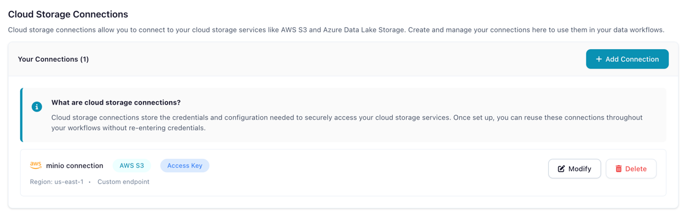

# Connections

Save and reuse database, cloud storage, and Kafka credentials across your flows.

All connection types and secrets are managed from a single **Connections** page, accessible
via the **Connections** icon in the left sidebar. Use the tabs to switch between
**Database**, **Cloud Storage**, **Kafka**, and **Secrets**.

Connections store your credentials securely (passwords are encrypted via [Secrets](secrets.md))
so you can reference them by name in Database Reader, Database Writer, Cloud Storage Reader,
and Cloud Storage Writer nodes without re-entering credentials each time.

---

## Database Connections

### Supported Databases

| Database | Type Key |
|----------|----------|
| **PostgreSQL** | `postgresql` |
| **MySQL** | `mysql` |

### Creating a Database Connection

1. Open the **Connections** page from the left sidebar and select the **Database** tab
2. Click **Create New Connection**
3. Fill in the connection fields:

| Field | Description | Example |
|-------|-------------|---------|
| **Connection Name** | Unique identifier for this connection | `prod_postgres` |
| **Database Type** | PostgreSQL or MySQL | `postgresql` |
| **Host** | Database server hostname | `db.example.com` |
| **Port** | Database port | `5432` |
| **Database** | Database name | `analytics` |
| **Username** | Database user | `readonly_user` |
| **Password** | Stored as an encrypted secret | |
| **Enable SSL** | Use SSL for the connection | Recommended for cloud databases |

4. Click **Update Connection** to save

<!-- should show the new tabbed Connections page with the Database tab active -->

*The Connections page showing the Database tab with saved connections*

<!-- should show the Add Database Connection dialog opened from the Database tab -->

*Creating a new PostgreSQL connection*

### Using Database Connections in Flows

In a **Database Reader** or **Database Writer** node:

1. Set **Connection Mode** to **Reference**
2. Select your saved connection from the dropdown
3. Configure schema, table, and query settings

!!! tip "Reference vs Inline Mode"
    **Reference** mode uses a saved connection (recommended). Credentials are encrypted,
    reusable, and supported by the [code generator](../tutorials/code-generator.md).

    **Inline** mode lets you enter credentials directly in the node settings. This is convenient for
    quick tests but credentials are not reusable and inline connections cannot be exported to Python code.

---

## Cloud Storage Connections

### Supported Providers

| Provider | Description |
|----------|-------------|
| **AWS S3** | Amazon Simple Storage Service (including S3-compatible services like MinIO) |

!!! note "Coming Soon"
    Azure Data Lake Storage and Google Cloud Storage support are planned for a future release.

### Creating a Cloud Storage Connection

1. Open the **Connections** page and select the **Cloud Storage** tab
2. Click **Add Connection**
3. Configure the connection:

| Field | Description |
|-------|-------------|
| **Connection Name** | Unique identifier (e.g., `my_s3_storage`) |
| **Storage Type** | AWS S3 |
| **AWS Access Key ID** | Your access key |
| **AWS Secret Access Key** | Stored as encrypted secret |
| **AWS Region** | e.g., `us-east-1` |
| **Custom Endpoint URL** | For S3-compatible services (MinIO, etc.) |
| **Verify SSL** | Disable only for self-signed certificates |
| **Allow Unsafe HTTP** | Enable for non-HTTPS endpoints (e.g., local MinIO) |

4. Click **Create Connection**

<!-- should show the new tabbed Connections page with the Cloud Storage tab active -->

*The Connections page showing the Cloud Storage tab*

### Using Cloud Connections in Flows

In a **Cloud Storage Reader** or **Cloud Storage Writer** node, select your saved connection from the dropdown.

For a step-by-step tutorial, see [Manage Cloud Storage](../tutorials/cloud-connections.md).

---

## Kafka Connections

### Creating a Kafka Connection

1. Open the **Connections** page and select the **Kafka** tab
2. Click **Add Connection**
3. Configure the connection:

| Field | Description |
|-------|-------------|
| **Connection Name** | Unique identifier (e.g., `prod_kafka`) |
| **Bootstrap Servers** | Comma-separated list of broker addresses (e.g., `broker1:9092,broker2:9092`) |
| **Security Protocol** | `PLAINTEXT`, `SSL`, `SASL_PLAINTEXT`, or `SASL_SSL` |
| **SASL Mechanism** | `PLAIN`, `SCRAM-SHA-256`, or `SCRAM-SHA-512` (when using SASL) |
| **SASL Username / Password** | Credentials for SASL authentication |
| **SSL CA Certificate** | CA certificate for SSL connections |
| **SSL Certificate / Key** | Client certificate and key for mutual TLS |
| **Schema Registry URL** | URL of the Confluent Schema Registry (optional) |

4. Click **Create Connection**

### Using Kafka Connections in Flows

Select your saved Kafka connection when configuring Kafka Reader or Kafka Writer nodes.

---

## Security

- Passwords and secret keys are stored as encrypted [Secrets](secrets.md) using Fernet encryption
- Connection metadata (host, port, database name) is stored in the local database
- Credentials are decrypted only at runtime when a flow executes
- Each user's connections are isolated (Docker multi-user mode)

---

## Related Documentation

- [Secrets](secrets.md) — How credential encryption works
- [Input Nodes: Database Reader](../nodes/input.md#database-reader) — Reading from databases
- [Output Nodes: Database Writer](../nodes/output.md#database-writer) — Writing to databases
- [Tutorial: Connect to PostgreSQL](../tutorials/database-connectivity.md)
- [Tutorial: Manage Cloud Storage](../tutorials/cloud-connections.md)
