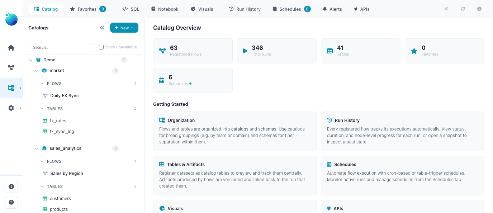
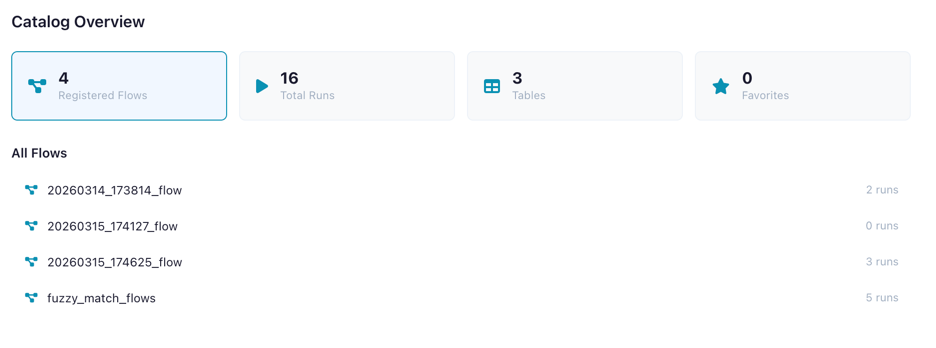
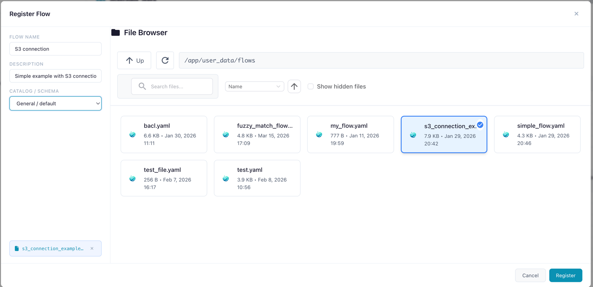
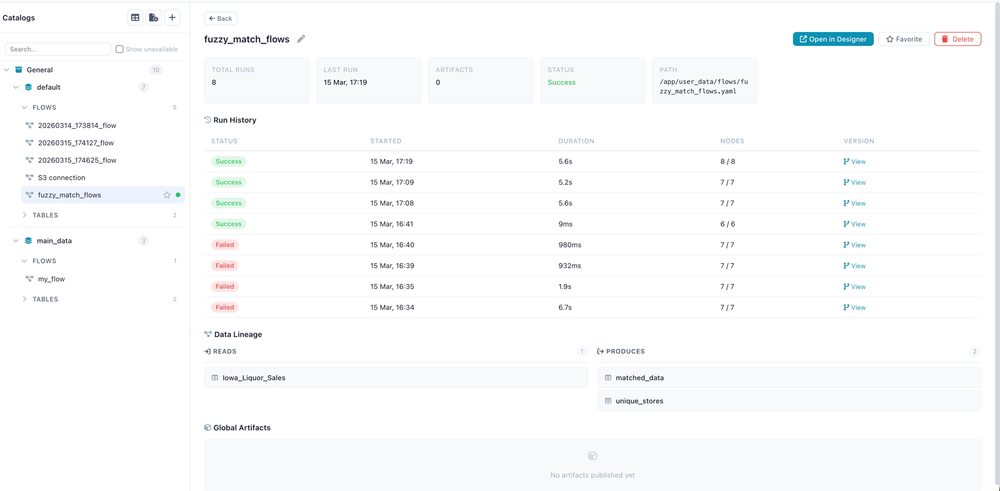
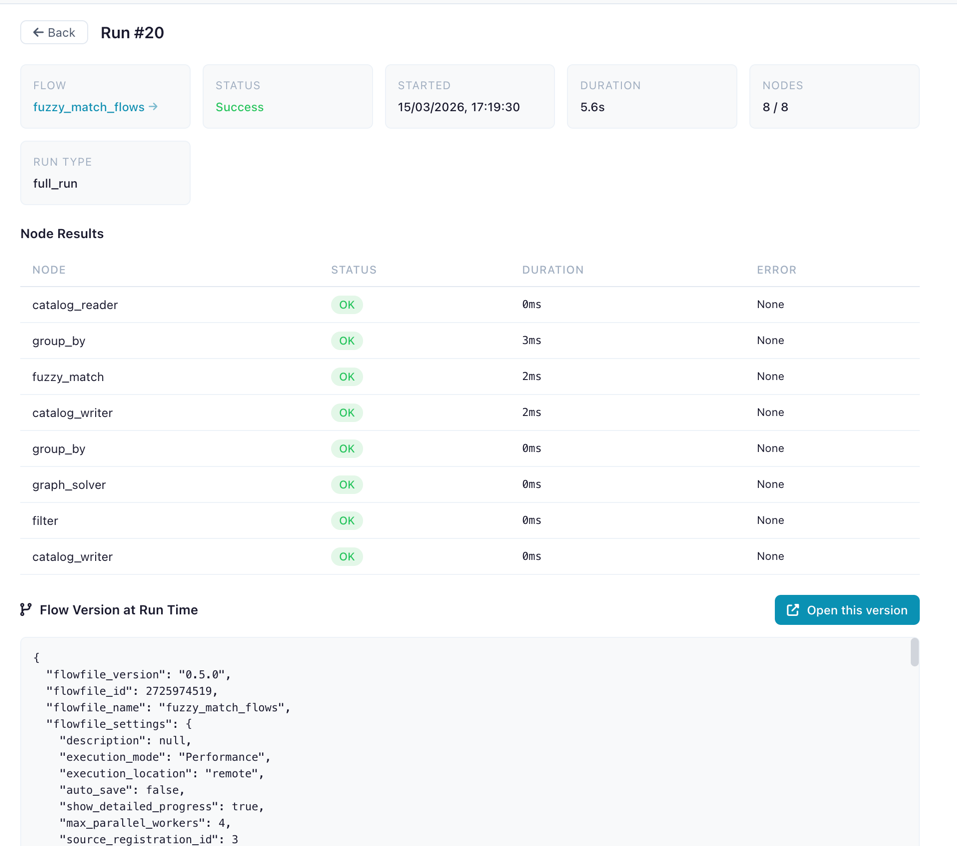
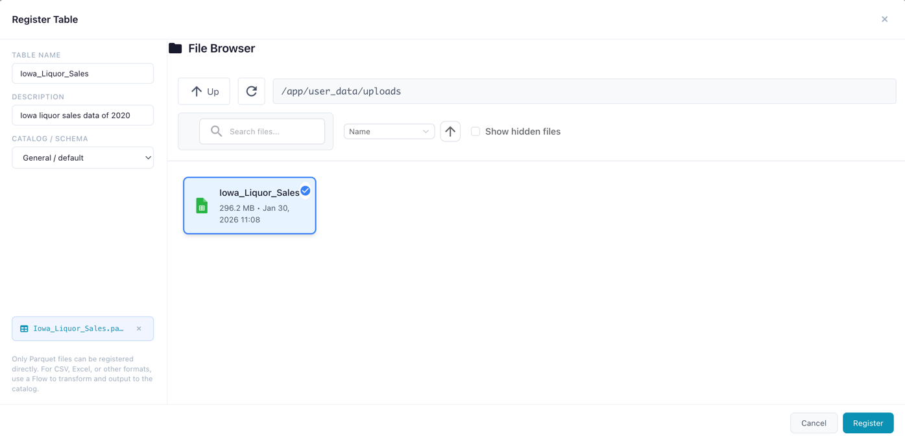
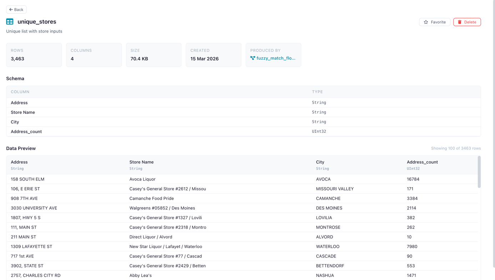
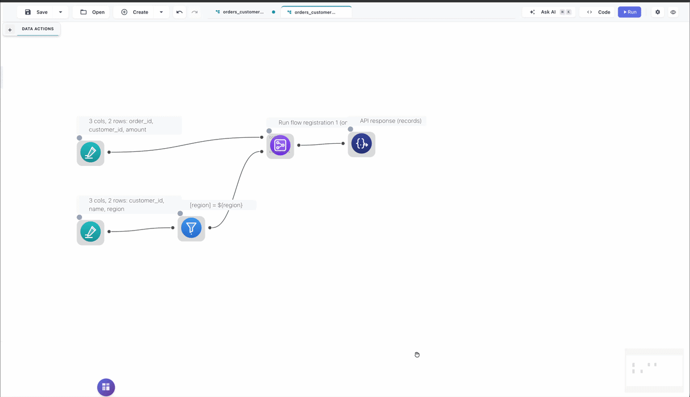
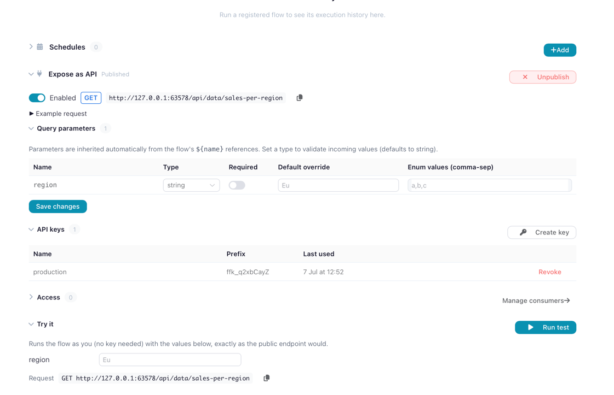

# Catalog

Organize, track, and govern your data flows and tables in a central catalog.

The Catalog is a central place to manage flows and track execution history. It registers data tables (physical and [virtual](virtual-tables.md)), queries data with [SQL](sql-editor.md), shares artifacts across flows, automates pipelines with [schedules](schedules.md), and serves flows as [API endpoints](#serve-flows-as-apis).

!!! info "Limited in Flowfile Lite"
    The browser-only [Flowfile Lite](../../deployment/lite.md) edition includes only a **lightweight in-browser catalog** (save and reuse CSV tables). The governed catalog described here — Delta-backed storage, version history, virtual tables, lineage, SQL, schedules, and secrets — requires the full desktop/server build.



*The Catalog page with namespace tree, tabs, and dashboard statistics*

---

## Opening the Catalog

Click the **Catalog** icon in the left sidebar menu to open the Catalog page.

---

## Start with a populated catalog

A fresh install starts with an empty catalog (only the `General > default` namespace). To explore the catalog with real content, seed the optional **Demo** catalog from the command line:

```bash
flowfile seed-demo
```

This one command:

- Creates a `Demo` catalog with two schemas — `sales_analytics` and `market`
- Writes four Delta tables under `Demo > sales_analytics` — `regions`, `products`, `customers`, and `sales`
- Registers a **Sales by Region** flow (under `sales_analytics`) and runs it once so its output table is populated
- Registers a **Daily FX Sync** flow (under `market`), schedules it with a `0 6 * * *` cron, and triggers an immediate first run

`seed-demo` is idempotent — running it again skips tables and flows that already exist. To remove everything under the `Demo` catalog (tables, flows, schedules, and namespaces) in one call:

```bash
flowfile remove-demo
```

!!! note "Demo flows are the source of truth"
    The seeded flows are imported from bundled YAML. Edit those flows in the designer and re-run them — they persist like any other registered flow until you run `flowfile remove-demo`.

---

## Dashboard

When no item is selected, the Catalog shows an overview dashboard with key metrics and quick-access panels.

| Metric | Description |
|--------|-------------|
| **Registered Flows** | Flows tracked in the catalog |
| **Total Runs** | Number of flow executions recorded |
| **Tables** | Catalog tables (physical + virtual) |
| **Virtual Tables** | [Virtual flow tables](virtual-tables.md) that resolve on demand |
| **Favorites** | Your bookmarked flows and tables |
| **Artifacts** | [Global artifacts](#global-artifacts) published by flows |
| **Schedules** | Configured [schedules](schedules.md) for automated flow execution |

The dashboard also shows **recent runs**, **favorite flows**, and **favorite tables** for quick navigation.



*Dashboard showing overview metrics*

---

## Namespaces

Namespaces organize your catalog into a two-level hierarchy:

- **Catalog** (level 0) — Top-level container (e.g., `production`, `development`)
- **Schema** (level 1) — Sub-container within a catalog (e.g., `sales`, `analytics`)

Flows, tables, and artifacts are always registered under a **schema**.

### Creating a Namespace

1. Click the **+** button next to "Catalog" in the tree sidebar
2. Choose whether to create a **Catalog** (top-level) or **Schema** (under an existing catalog)
3. Enter a name and optional description
4. Click **Create**

A default catalog (`General`) and schema (`default`) are created automatically on first use.

---

## Tabs

The Catalog view is split into tabs:

| Tab | Description |
|-----|-------------|
| **Catalog** | Browse the namespace tree with flows, tables, and artifacts |
| **Favorites** | Your starred flows and tables for quick access |
| **Run History** | Chronological list of all flow executions |
| **Schedules** | Manage automated flow schedules — see [Schedules](schedules.md) |
| **SQL** | Query catalog tables — see [SQL Editor](sql-editor.md) |
| **Notebook** | Notebooks stored next to the data — see [Notebooks](notebooks.md) |
| **Visuals** | Charts and dashboards built on catalog tables — see [Visualizations](visualizations.md) |
| **APIs** | Publish flows as HTTP endpoints and manage their keys — see [Serve flows as APIs](#serve-flows-as-apis) |

---

## Registering Flows

Register a flow to enable run tracking, artifact lineage, catalog table production, and [virtual tables](virtual-tables.md).

1. Navigate to the desired schema in the tree
2. Click **Register Flow**
3. Select the flow file (`.yaml`) from the file browser
4. Enter a name and optional description
5. Click **Register**



*Registering a flow file under a catalog schema*

!!! tip "When a flow joins the catalog"
    A flow appears in the catalog when you **save it into a schema** — via the Save dialog's catalog tab, or **Register Flow** above. Simply opening a `.yaml` in the designer, or starting a flow from a template, leaves it out of the catalog: browsing is read-only.

    Quick-created flows start as unregistered drafts — the file is written to the app's internal folder, but no catalog entry is made. A draft joins the catalog when you run it, or when you save it with **Also register in catalog** checked. Registering is what unlocks run history, schedules and API publishing.

    Accumulated entries under `Unnamed Flows` or `Python Editor` can be cleared in one go: hover the schema in the catalog tree and use the broom action. Flows with published artifacts are kept.

### Flow Detail Panel

Click a registered flow to see its detail panel:

- **Name** (editable inline) and description
- **Metrics**: total runs, success rate, last run time, artifact count
- **Actions**: Open in Designer, Run Flow, Cancel Run, Favorite, Delete
- **Recent Runs** table with status, duration, and trigger type
- **Schedules** section — manage schedules for this flow (see [Schedules](schedules.md))
- **Produced Artifacts** list



*Flow detail panel showing metrics, recent runs, and actions*

!!! warning "Missing Flow File"
    If the flow's `.yaml` file has been moved or deleted, a warning banner appears.
    The flow metadata and run history are preserved, but the flow cannot be opened in the designer.

---

## Run History

Every execution of a registered flow is recorded with:

| Field | Description |
|-------|-------------|
| **Status** | Success or failure (with error details) |
| **Started / Ended** | Timestamps |
| **Duration** | Execution time in seconds |
| **Nodes Completed** | Progress (`completed / total`) |
| **Run Type** | How the flow was triggered (manual, scheduled, table trigger) |
| **Flow Snapshot** | YAML snapshot of the flow version at run time |

### Run Detail Panel

Click a run to see its full detail:

- Status badge and metadata
- **Node Results** table: each node's status, duration, and error messages
- **Flow Snapshot**: the exact flow version that was executed
- **Open Snapshot in Designer** button to recreate the flow as it was



*Run detail showing node results and snapshot*

---

## Catalog Tables

Register data tables in the catalog for reuse across flows. Catalog tables come in two types:

| Type | Description |
|------|-------------|
| **Physical** | Data materialized as a Delta table on disk — fast reads, version history, full schema preservation |
| **Virtual** | No data on disk — executes a producer flow on demand to produce results. See [Virtual Flow Tables](virtual-tables.md) |

!!! tip "Recommended: Register tables via a flow"
    Use a [Catalog Writer](../nodes/output.md#catalog-writer) node in your flow: it supports more source types, ensures correct data interpretation, and enables lineage tracking.

### Registering a Physical Table

1. Navigate to a schema in the tree
2. Click **Register Table**
3. Select a Parquet file (`.parquet`)
4. Enter a name
5. Click **Register**

The file is materialized as a Delta table and registered with full metadata.



*Registering a new catalog table from a data file*

### Creating a Virtual Table

Virtual tables can be created in two ways: via a [Catalog Writer node](../nodes/output.md#catalog-writer) in virtual mode (flow-based), or via [Save as Virtual Table](sql-editor.md#save-as-virtual-table) in the SQL Editor (query-based). See [Virtual Flow Tables](virtual-tables.md) for the full guide.

### Table Detail Panel

Click a table to view:

- **Metadata**: name, namespace, row count, column count, file size, creation date
- **Schema**: column names and data types
- **Data Preview**: scrollable preview of the first 100 rows
- **Lineage**: source flow, producing flow, and consumer flows (see [Lineage](#lineage))
- **Favorite** toggle (star icon) to bookmark the table
- **Delete** button with confirmation

For virtual tables, the detail panel also shows:

- **Table type**: "virtual" badge
- **Producer flow**: the registered flow that produces this table
- **Optimization status**: whether the table uses optimized or standard resolution
- **Laziness blockers**: if not optimized, which nodes prevent lazy execution



*Table detail panel showing schema and data preview*

### Using Catalog Tables in Flows

Use the **Catalog Reader** input node to read a catalog table (physical or virtual) and the **Catalog Writer** output node to write results back. See [Input Nodes](../nodes/input.md#catalog-reader) and [Output Nodes](../nodes/output.md#catalog-writer).

---

## Lineage

The catalog tracks full data lineage — which flows produce and consume each table:

| Relationship | Description |
|---|---|
| **Source flow** | The registered flow (and specific run) that created or last wrote to the table |
| **Producer flow** | For [virtual tables](virtual-tables.md): the flow that produces data on demand |
| **Consumer flows** | Flows that read from this table via Catalog Reader nodes |

This lineage graph drives automation: when a table is updated, any [table trigger schedule](schedules.md#table-trigger) watching it fires automatically, creating reactive data pipelines.

---

## How Storage Works

### Physical Tables — Delta Format

When you register a table or write via a [Catalog Writer](../nodes/output.md#catalog-writer) node, the data is **materialized as a Delta table**. Delta provides:

- **Version history** — every write creates a new version, enabling time-travel queries
- **Schema evolution** — columns can be added or modified across versions
- **ACID transactions** — writes are atomic and consistent
- **Efficient storage** — columnar Parquet files with metadata tracking

**Materialization process:**

1. The source data is processed by the worker service using Polars
2. The data is written as a Delta table to the catalog storage directory
3. Metadata is extracted: row count, column count, file size, and column schema (names + Polars data types)
4. A database record links the table name, namespace, and file path

**Storage location:** the directory is resolved by `FLOWFILE_USER_DATA_DIR` (or `~/.flowfile` locally).

| Environment | Path |
|-------------|------|
| Desktop / local | `~/.flowfile/catalog_tables/` |
| Docker (code default) | `/data/user/catalog_tables/` |
| Docker (shipped `docker-compose.yml`) | `/app/user_data/catalog_tables/` — the compose file sets `FLOWFILE_USER_DATA_DIR=/app/user_data` |

**File naming:** Each Delta table directory is named `{table_name}_{uuid}` (e.g., `sales_data_a3f1b2c4/`). The UUID suffix ensures uniqueness even when multiple tables share similar names.

!!! info "Flat storage"
    Namespaces (catalogs and schemas) are a **logical hierarchy** stored in the database — not filesystem directories. All Delta table directories live in a single flat storage directory. Table name uniqueness is enforced per namespace, so two schemas can each have a table called `customers` without conflict.

### Virtual Tables — No Storage

Virtual tables store **no data on disk**. The catalog entry holds only metadata (name, schema, producer flow reference) and, for optimized tables, a serialized Polars `LazyFrame`. See [Virtual Flow Tables](virtual-tables.md) for details.

---

## Delta Table History

Physical catalog tables stored in Delta format maintain a full version history. You can browse historical versions and preview data at any point in time.

### Viewing History

In the table detail panel, the **History** section shows:

- **Current version** number
- **Version list** with timestamps, operation types, and metadata
- **Preview at version** — select any historical version to see the data as it was at that point

!!! info "Delta versioning is only available for physical tables"
    Virtual tables have no physical storage and therefore no version history. If you need historical snapshots, use a physical table.

---

## SQL Editor

Query catalog tables directly using SQL. See the dedicated [SQL Editor](sql-editor.md) page for full documentation, examples, and the Save as Flow feature.

---

## Notebooks

Notebooks live in the catalog next to the tables they analyze: Python and Markdown cells with code completions, Python executing on [Docker-isolated kernels](../kernels.md), cells reading and writing catalog tables directly through `flowfile_ctx`. See the dedicated [Notebooks](notebooks.md) page.

---

## Serve flows as APIs

Publish a registered flow as an HTTP endpoint so other systems can run it on demand. A published flow is served at `GET /api/data/{slug}`, which runs the flow synchronously and returns the output of its **API response** node as JSON.

- The flow must contain exactly one **API response** node — it marks the dataset returned to the caller.
- Endpoints are **API-key authenticated**. Keys belong to an *API consumer* — a client account that can be granted several published flows, so one key can call all of them. Publishing and key management live in the catalog's **APIs** tab.
- Flow parameters surface as request parameters, so a single published flow can serve many variations.

The flow you build and test in the designer becomes a data service other systems can call — a dashboard, a scheduled job, another application.



Once published, the flow's detail panel shows the **Expose as API** section: the live endpoint URL, the query parameters inherited from the flow's parameters, API-key management, and a **Try it** runner that calls the endpoint with your own values.



---

## Favorites

**Favorite** a flow or table (star icon) to bookmark it in the **Favorites** tab for quick access. Favorites are per-user and can be toggled from detail panels or inline in the tree.

---

## Global Artifacts

Global artifacts are Python objects (ML models, DataFrames, configs) persisted in the catalog and accessible from any flow. They are published from [Kernel code](../kernel-api.md#global-artifacts-catalog) using `flowfile_ctx.publish_global()`.

Click an artifact in the tree to view its versions, metadata, and producing flow.

---

## Related Documentation

- [Virtual Flow Tables](virtual-tables.md) — Non-materialized tables with on-demand resolution
- [Visualizations](visualizations.md) — Save Graphic Walker charts on top of catalog tables and SQL queries
- [Schedules](schedules.md) — Automating flow execution with schedules and table triggers
- [SQL Editor](sql-editor.md) — Ad-hoc SQL queries against catalog tables
- [Kernel Execution](../kernels.md) — Publishing global artifacts from Python code
- [Input Nodes](../nodes/input.md#catalog-reader) — Catalog Reader node
- [Output Nodes](../nodes/output.md#catalog-writer) — Catalog Writer node (physical and virtual modes)
- [Building Flows](../building-flows.md) — Creating workflows in the visual editor
- [Reading Data (Python API)](../../python-api/reference/reading-data.md#catalog-reading) — `read_catalog_table()` and `read_catalog_sql()`
- [Writing Data (Python API)](../../python-api/reference/writing-data.md#catalog-writing) — `write_catalog_table()` with virtual mode
