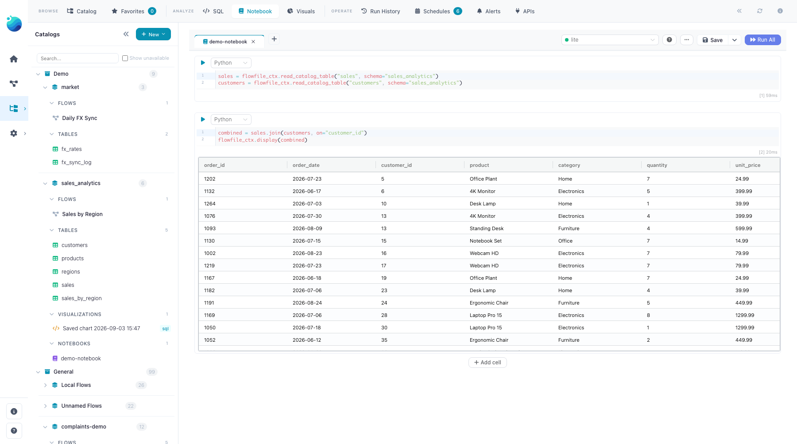
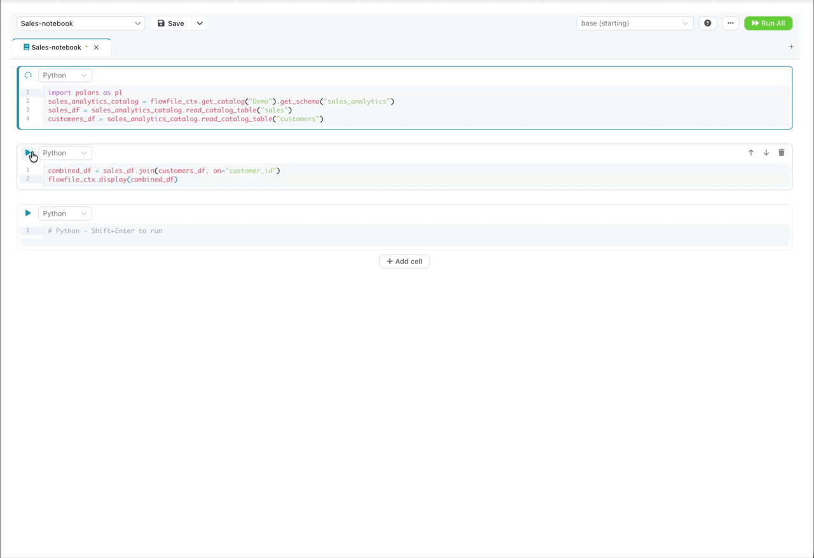

# Notebooks

Notebooks are the catalog's exploration console: Jupyter-style cells that live *next to your tables*, in the catalog rather than in one person's private folder. Open one from the catalog tree, point it at a kernel, and analyze catalog data with any Python library — with the environment pinned by the kernel, so the notebook runs the same for everyone who opens it.



## Creating and organizing

Notebooks are catalog residents: create one from the notebook panel (**New notebook**) and it takes a place in a [namespace](index.md#namespaces) like any table or flow — same tree, same organization, and in Docker mode the same [group-based sharing](../../deployment/sharing.md) (a grant on the namespace reaches the notebooks inside it).

## Cells

Two cell types, mixable freely:

- **Python** — executes on a [kernel](../kernels.md), which you pick in the toolbar. Any library the kernel image carries (or that you added to the kernel) is available. The notebook remembers your last-used kernel.
- **Markdown** — renders in place, no kernel needed. Use it for the narrative between the code.

Keybindings match Jupyter: **Shift+Enter** runs a cell (or renders a Markdown cell) and moves to the next — adding a blank cell after the last one, so you can keep going without reaching for the mouse. **Cmd/Ctrl+Enter** runs it in place and leaves the caret where it is. The cell you are working in carries a highlighted border. In cell mode the last expression displays automatically, Jupyter-style, and the editor gives you code completions as you type.

## Organizing cells

Reorder cells by dragging the six-dot handle at the left of a cell's toolbar: an insertion line shows where the cell will land, and Escape cancels the drag. With the handle focused, **Alt+↑** and **Alt+↓** move the cell one position and announce the result for screen readers ("Cell 3 moved to position 2 of 7"). The toolbar's **Undo** and **Redo** buttons revert and replay cell inserts, deletes and moves — the last 50 of them, per open notebook, discarded when you close the notebook tab; `Cmd/Ctrl+Z` inside a cell still undoes code edits. Reordering, inserting and deleting are disabled while the notebook is running, and the last remaining cell cannot be deleted.

The **⋯** menu on a cell's toolbar holds the rest: **Insert above** and **Insert below** place a new cell either side of this one and put the cursor in it, and **Duplicate** drops a copy immediately below — the code comes along, the old result does not, so you can fork a cell and change one thing without losing the original. **Collapse code** and **Collapse output** fold either half of a cell out of the way, which is what keeps a long notebook readable once the exploratory cells at the top have served their purpose. Collapsing hides nothing permanently: the code, its cursor and its text undo history are all still there when you expand it again, and the collapse itself is a view preference for this session only — it is never written to the notebook file, so a teammate opening it sees every cell expanded.

## Talking to the catalog

Cells see the catalog through the same `flowfile_ctx` API that Python Script nodes use. `display` and `explore` are bound as bare names, so they need no prefix:

```python
lf = flowfile_ctx.read_catalog_table("sales_by_city")   # by name; schema= / namespace_id= to disambiguate
display(lf)                                              # interactive table
explore(lf)                                              # Graphic Walker explorer
```

Reads come back as LazyFrames; `flowfile_ctx.write_catalog_table` persists a result as a real catalog table, and `flowfile_ctx.publish_global` saves a Python object (a trained model, a config) as a [global artifact](index.md#global-artifacts) that survives across sessions and flows. The full cell-side API — inputs, outputs, display, artifacts — is documented in [The flowfile_ctx API](../kernel-api.md).

<details markdown="1">
<summary>See it: a catalog notebook cell in action</summary>



</details>

## Versioned like flows

A notebook's cells are stored as one clean YAML file on disk — code as readable text, not an opaque blob — which is what lets [Projects](../../projects.md) version notebooks in git exactly like flows: diffs read like code review, and a teammate pulling the project gets your notebooks along with everything else.

## Related

- [Kernels](../kernels.md) — creating kernels, adding packages, the full `flowfile_ctx` API.
- [SQL Editor](sql-editor.md) — for pure-SQL exploration without a kernel.
- [Catalog Architecture](../../../for-developers/catalog-architecture.md#notebooks) — how notebooks are stored and routed, for contributors.
