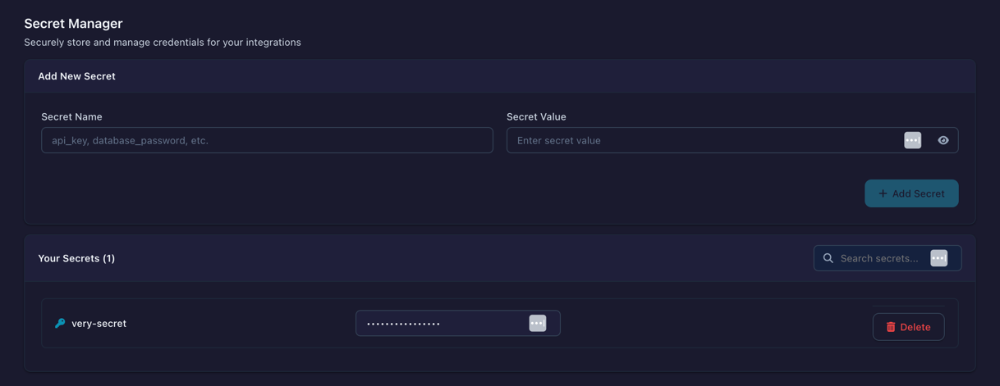

# Secrets

Store sensitive credentials — database passwords, cloud connection keys, API tokens — outside your flow definitions. Flowfile encrypts them at rest and decrypts them on demand at runtime.

This page is the operator's manual. It explains exactly what's encrypted, where the master key lives, how to back it up, and what to do when something goes wrong.

## What gets encrypted

Anything you enter into Flowfile that wouldn't be safe to print:

- Database connection passwords (PostgreSQL, MySQL, SQL Server, …)
- Cloud connection credentials — AWS secret keys, Azure account keys / SAS tokens / client secrets, GCS service account JSON
- OAuth refresh tokens (Google Analytics, etc.)
- Kafka SASL passwords and SSL keys
- AI provider API keys (the "BYOK" credentials in the AI panel)

**What's *not* encrypted:** the *names* you give your secrets and the *metadata* of your connections (host, port, username, etc.). Treat connection names as non-sensitive.

## How the encryption works

Three short ideas, in order.

**Master key.** One Fernet key per Flowfile instance. Every encrypted secret in your database is unlockable by this key — and only this key. If it's lost, the encrypted secrets are unrecoverable; there is no backdoor.

**Per-user derivation.** Each user's secrets are encrypted with a key *derived* from the master key plus that user's ID (HKDF-SHA256). User A's derived key cannot decrypt User B's secrets, even though both come from the same master key. This isolates accidental cross-user reads at the cryptographic level.

**Envelope format.** Each encrypted value in the database is stored as `$ffsec$1$<user_id>$<fernet_token>`. The `1` is a version digit reserved for future format changes. The `<user_id>` lets the worker process decrypt without being separately told who the secret belongs to.

## Where the master key lives

| Mode | Location |
|------|----------|
| **Desktop (Electron)** | Auto-generated on first launch. Files: `~/.config/flowfile/.secret_key` (store-encryption key) + `~/.config/flowfile/flowfile.json.enc` (encrypted master key). On Windows: `%APPDATA%\flowfile\`. |
| **Python API** | Same paths as Desktop. Auto-generated on first call to anything that needs encryption. |
| **Docker** | Supplied externally via `FLOWFILE_MASTER_KEY` environment variable, or via the Docker secret mounted at `/run/secrets/flowfile_master_key`. Never written to disk inside the container. |

### Desktop & Python API: first-run setup

The first time Flowfile needs a master key, it generates one and prints a one-time warning to your logs:

```
FLOWFILE MASTER KEY GENERATED — BACK UP THESE FILES IMMEDIATELY.
  fingerprint: 37028446
  file 1 (store key):  /home/you/.config/flowfile/.secret_key
  file 2 (encrypted secrets store): /home/you/.config/flowfile/flowfile.json.enc
If either file is lost, every secret encrypted by this Flowfile instance
becomes permanently unrecoverable. There is no recovery path.
```

You will see this exactly once — on the very first run. Subsequent runs use the existing key silently. Copy the fingerprint somewhere safe; it's how you'll verify a backup later.

### Docker: setup wizard

On first start without a master key, Flowfile shows a setup screen:

1. Click **Generate Master Key**
2. Copy the generated key **and** the displayed fingerprint
3. Add to your `.env` file: `FLOWFILE_MASTER_KEY=<your-key>`
4. Restart the containers


## Backing up the master key

**Desktop & Python API:** copy both files together (they're paired — neither is useful without the other):

```bash
cp ~/.config/flowfile/.secret_key ~/.config/flowfile/flowfile.json.enc /your/backup/location/
```

**Docker:** the key is the value of `FLOWFILE_MASTER_KEY` in your `.env`. Back up `.env`. Never commit it to version control.

### Verifying a backup matches the live key

The 8-character fingerprint printed at generation is `SHA-256(key)[:8]`. It's a one-way derivation, so it's safe to write down or share with a teammate — it can't be reversed back to the key. If you ever doubt whether a backup file matches the running instance, compare fingerprints.

You can re-derive the fingerprint from Python:

```python
import hashlib
key = "<paste the Fernet key>"
print(hashlib.sha256(key.encode()).hexdigest()[:8])
```

!!! note "Pair the fingerprint with the date you generated the key"
    A bare fingerprint is useless six months later if you've forgotten which install it belongs to. Note it as `flowfile master key fingerprint <hash> generated <date>`.

## Creating secrets

1. Open the **Connections** page from the left sidebar and select the **Secrets** tab
2. Click **Add Secret**
3. Enter name (e.g., `prod_database_password`)
4. Enter value
5. Save



## Using secrets

Reference secrets by name when configuring connections. The encrypted value is decrypted at runtime; the plaintext never appears in flow files or logs.

## Audit log

Every secret create / list / read / delete attempt — successful or failed — is recorded in the `secret_access_events` table. Each row captures:

- The acting user ID
- The action (`create`, `list`, `read`, `delete`)
- The secret name (when applicable)
- Result status (`success` or `error`) and error code (e.g. `not_found`, `duplicate_name`)
- Source IP address (best-effort, honors `X-Forwarded-For`)
- Timestamp

Admins can query the log via `GET /secrets/secrets/audit` (with optional `secret_name`, `action`, and `limit` query parameters). Non-admins see only their own events.

**What is *not* recorded:** per-secret decrypt events during flow execution. Logging every decrypt would dominate the table with routine activity. If you need decrypt-time accounting later, that's a separate feature.

## When things go wrong

Three real scenarios, in priority order. Identify which one you're in *before* you act — the wrong response can make a recoverable situation unrecoverable, and the right response for a real breach doesn't involve the Flowfile UI at all.

### 1. You lost the master key

Either `.secret_key` or `flowfile.json.enc` is gone (or the `FLOWFILE_MASTER_KEY` value is forgotten). **There is no recovery path.** Every encrypted secret in your database is now plaintext-unrecoverable garbage.

What to do:

1. Delete the `secrets` table content (it's just unusable bytes now) and the connection rows that depend on it.
2. Re-enter every credential by hand — open each connection in the UI and paste the password again.
3. Set up a backup procedure before this happens again. See [Backing up the master key](#backing-up-the-master-key).

!!! danger "There is no Flowfile-side recovery."
    The encryption is intentionally one-way without the key. Don't open a support issue expecting a backdoor — there isn't one, and there shouldn't be one.

### 2. The master key leaked, but you are confident the secrets database did not

Example: a developer accidentally committed `.env` to a public repo for ten minutes; the production database is on a separate hardened host with audit logs showing no unauthorized access.

Here, rotating the master key alone is a real mitigation. The attacker has the key but no ciphertext, so they can't decrypt anything offline. Once you swap the live key, even if they later breach the database, the stolen key is useless.

What to do:

1. Generate a new master key.
2. Re-enter every credential into Flowfile under the new key. (Flowfile does not currently offer transparent in-place rotation; the deferred feature would re-encrypt rows automatically. For now, re-enter manually.)
3. Retire the old key — delete the leaked copy from any backup that may have shared the exposure.
4. Verify the new fingerprint and store it in your backup record.

### 3. The master key leaked AND the secrets database may have leaked too

This is the conservative default whenever you can't *prove* scenario 2. In practice the master key file and the database often share the same exposure surface — same host, same backup, same compromised account, same git history.

In this scenario, **rotating the Flowfile master key does almost nothing.** The attacker has already decrypted the dumped `secrets` table offline on their own machine. They walk away with plaintext database passwords, plaintext cloud credentials, plaintext API tokens. Those plaintext credentials are what's dangerous, and they're permanently outside your control.

What to do — *in this order*:

1. **Rotate every upstream credential at its source.** Change every database password (on the database itself), regenerate every cloud access key (in IAM / Azure AD / GCP IAM), revoke every API token (in the issuer's dashboard). This is the load-bearing step — it makes the attacker's plaintext copies useless.
2. **Notify anyone affected** — coworkers, customers depending on those services, your security team, your auditors.
3. **Generate a new Flowfile master key** and re-enter the *new* (rotated-at-source) credentials. The old encrypted database is now defunct; clear it.
4. Then continue with the operational hygiene checklist below.

!!! danger "The master key alone is not the mitigation."
    Re-encrypting Flowfile's database with a fresh key doesn't reach into your DB / cloud provider / API issuer to change anything there. Only rotating at the source does. Treat steps 1–2 as the actual fix; step 3 is cleanup.

## Operational recommendations

A short checklist to keep the next incident smaller than the last one.

- [ ] Back up `.secret_key` + `flowfile.json.enc` (or `.env` for Docker) the day you set up Flowfile.
- [ ] Store that backup on **different media** from your database backup. Co-located backups defeat the point of separation.
- [ ] Write down the 8-char fingerprint together with the generation date. Stick it in your password manager or secrets vault.
- [ ] Use Docker mode (or env-var injection) for any deployment beyond local single-user — it keeps the key out of the database server's filesystem.
- [ ] Make sure `.env`, `master_key.txt`, and `*.json.enc` are in `.gitignore`. Never commit them.
- [ ] Periodically read the audit log (`GET /secrets/secrets/audit`) for read/delete activity you can't explain.

## Encryption details

For the curious:

- **Algorithm:** Fernet — AES-128-CBC for confidentiality, HMAC-SHA256 for authentication, both keys derived from a single 256-bit input.
- **Key derivation:** HKDF-SHA256 with `salt="flowfile-secrets-v1"` and `info=f"user-{user_id}"`. Deterministic, so the same master + user always derives the same Fernet key.
- **Storage:** encrypted value lives in the `encrypted_value` column of the `secrets` table in your Flowfile catalog DB.

For more on the internals — envelope versions, the shared crypto module, the audit table schema — see the developer reference at `docs/for-developers/secret-storage.md`.
