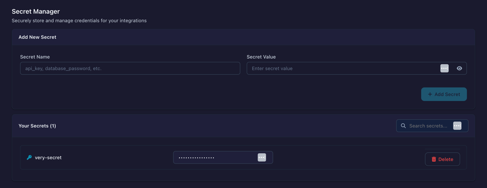

# Secrets

Store sensitive credentials like database passwords and API keys securely.

!!! info "Not in Flowfile Lite"
    Secrets storage requires the full desktop/server build. The browser-only [Flowfile Lite](../../deployment/lite.md) edition does not store credentials.

## How It Works

Secrets are encrypted before storage using a key derived from the **master key**. When a flow needs a credential, Flowfile decrypts it on-demand. The actual values never appear in flow definitions or logs.

## Two keys, two jobs

Flowfile uses two distinct keys. They are configured separately, and the one you care about depends on your mode:

| Key | Encrypts | Where it lives |
|-----|----------|----------------|
| **`FLOWFILE_MASTER_KEY`** (Fernet) | User secrets (this page) | Env var / setup wizard — see [Master key](#master-key) |
| Local secure-storage key (`.secret_key`) | OAuth tokens and locally-stored connection files | Auto-generated file managed by Flowfile — see below |

The **local secure-storage key** is generated automatically the first time Flowfile writes locally-stored credentials, and you never configure it by hand. Its location depends on `FLOWFILE_MODE`:

| Mode | Secure-storage directory |
|------|--------------------------|
| **Desktop (`electron` mode)** | `%APPDATA%\flowfile` on Windows, `~/.config/flowfile` elsewhere — the file is `.secret_key` |
| **Python API / package** | `SECURE_STORAGE_PATH` if set, otherwise `/tmp/.flowfile` |
| **Docker** | `SECURE_STORAGE_PATH` if set, otherwise `/tmp/.flowfile` |

The rest of this page is about the **master key**, which is what encrypts the secrets you create in the UI.

## Master Key

The master key is a Fernet key that encrypts all user secrets. Each user's secrets are encrypted with a per-user key derived from it. Without the master key, secrets cannot be decrypted.

### Configuration by Mode

| Mode | Configuration |
|------|---------------|
| **Desktop (`electron` mode)** | Managed automatically on first use — no manual configuration |
| **Python API / package** | Managed automatically on first use — no manual configuration |
| **Docker** | Generate via the setup wizard, then set as the `FLOWFILE_MASTER_KEY` env variable |

### Desktop & Python API

The master key is resolved automatically on first use — no manual configuration is needed. In these modes there is no separate file for you to back up: to move an install, migrate the whole storage directory (`~/.flowfile` by default, or `FLOWFILE_STORAGE_DIR` if set) together with your database, and your secrets keep decrypting.

### Docker

In Docker mode the master key must be supplied explicitly — it is **not** auto-generated to a file. On first start without a key, Flowfile shows a setup screen:

1. Click **Generate Master Key**
2. Copy the generated key
3. Add it to your `.env` file: `FLOWFILE_MASTER_KEY=<your-key>` (or provide it as a `master_key.txt` Docker secret — the env var wins)
4. Restart the containers

!!! danger "Protect your master key"
    - Store the value securely (`.env` file or Docker secret) and back it up
    - Never commit it to version control
    - Losing it means losing access to every encrypted secret — there is no recovery

## Creating Secrets

1. Open the **Connections** page from the left sidebar and select the **Secrets** tab
2. Click **Add Secret**
3. Enter name (e.g., `prod_database_password`)
4. Enter value
5. Save

<!-- should show the new tabbed Connections page with the Secrets tab active -->

## Using Secrets

Reference secrets by name when configuring connections. The encrypted value is decrypted at runtime.

## Encryption

- **Algorithm**: Fernet (AES-128-CBC + HMAC-SHA256)
- **Isolation**: each user's secrets are encrypted with their own key, derived from the master key
- **Storage**: Encrypted in SQLite database

## Shared Secrets (Docker / multi-user mode)

In Docker mode a secret can be shared with a user group, letting members run flows
with the credential without ever seeing its value. Sharing changes nothing about
how the secret is stored: it stays encrypted under the owner's key, and the owner's
identity is embedded in the stored value itself. At runtime Flowfile reads the owner
id from the value and derives the owner's key to decrypt — the identity of the user
running the flow is only used to check that they have been granted access. Revoking
the share takes effect immediately, with no rotation needed.

See [Group-Based Sharing](../../deployment/docker.md#group-based-sharing)
for the full sharing model.
