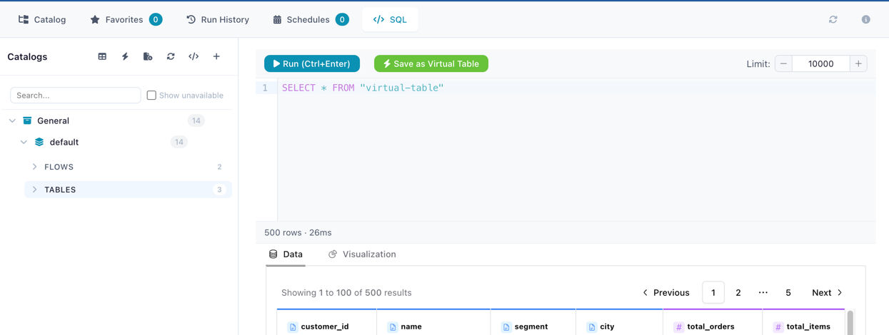

# SQL Editor

Query your catalog tables directly using SQL — no need to build a flow for quick ad-hoc analysis.

---

## Opening the SQL Editor

Click the **SQL** button in the catalog toolbar to open the SQL editor panel.

<!-- PLACEHOLDER: Screenshot of the SQL Editor panel in the catalog -->


*The SQL Editor panel with query input and results grid*

---

## Writing Queries

All catalog tables — both physical and [virtual](virtual-tables.md) — are automatically registered in the SQL context by their table name. You can query, join, filter, and aggregate across any combination of tables:

```sql
-- Simple query
SELECT * FROM customers WHERE region = 'Europe' LIMIT 100

-- Join across catalog tables
SELECT o.order_id, c.name, o.total
FROM orders o
JOIN customers c ON o.customer_id = c.id
WHERE o.total > 1000

-- Aggregate virtual and physical tables together
SELECT category, SUM(amount) as total
FROM sales_summary    -- virtual table
GROUP BY category
```

!!! tip "SQL dialect"
    The SQL editor uses the [Polars SQL context](https://docs.pola.rs/user-guide/sql/intro/), which supports standard SQL syntax including `SELECT`, `WHERE`, `JOIN`, `GROUP BY`, `ORDER BY`, `HAVING`, `UNION`, subqueries, and window functions.

---

## Save as Virtual Table

Turn any SQL query into a reusable [virtual table](virtual-tables.md). Click the **bolt icon** button after writing a query and fill in:

- **Table name** — name for the new virtual table
- **Catalog / Schema** — target namespace in the catalog hierarchy
- **Description** (optional)

### How It Works

When you save a query as a virtual table:

1. The SQL is **validated for safety** (only read operations are allowed)
2. The query is **executed once** with a single-row limit to derive the output schema (column names and types)
3. The **query text is stored** in the catalog — no data is materialized to disk

Each time the virtual table is read (via Catalog Reader, another SQL query, or the Python API), the stored query is **re-executed against the latest catalog data**. This means:

- Results are always fresh — reflecting the current state of all referenced tables
- The virtual table can reference other catalog tables, including other virtual tables
- Recursive references are supported up to 5 levels deep, with circular reference detection

!!! info "Query-based vs flow-based virtual tables"
    Query-based virtual tables (created here) store a SQL query. Flow-based virtual tables (created via a [Catalog Writer node](../nodes/output.md#catalog-writer)) store a reference to a producer flow. Both appear identically in the catalog and can be read the same way. See [Virtual Tables](virtual-tables.md) for the full comparison.

---

## Python API

You can also run SQL queries against catalog tables programmatically:

```python
import flowfile as ff

df = ff.read_catalog_sql("""
    SELECT o.order_id, c.name, o.total
    FROM orders o
    JOIN customers c ON o.customer_id = c.id
    WHERE o.total > 1000
""")
```

See [Reading Data — Catalog SQL](../../python-api/reference/reading-data.md#query-with-sql) for full documentation.

---

## Related Documentation

- [Catalog Overview](index.md) — Managing flows, tables, and namespaces
- [Virtual Tables](virtual-tables.md) — Non-materialized tables queryable via SQL
- [Reading Data (Python API)](../../python-api/reference/reading-data.md#query-with-sql) — `read_catalog_sql()` reference
