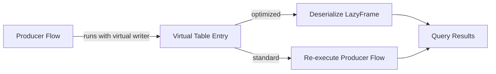
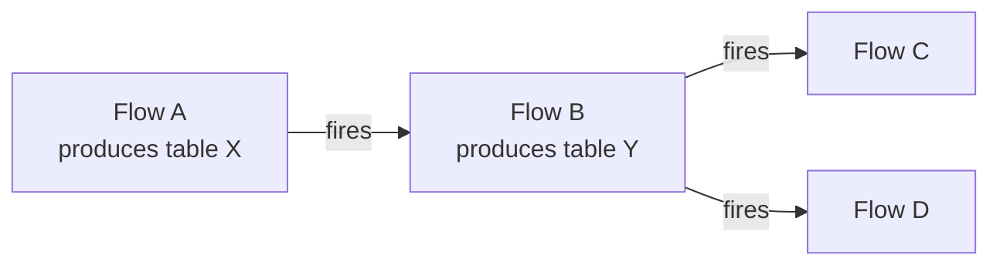

# Virtual Flow Tables

Create catalog tables that store **no data on disk**. When queried, a virtual table executes its producer flow on demand — delivering always-fresh results with zero storage overhead.

---

## Why Virtual Tables?

Virtual tables change the way you think about catalog data. Instead of materializing every intermediate result to disk, you can expose **computed views** of your data that stay up to date automatically.

| Benefit | Description |
|---------|-------------|
| **Zero storage cost** | No Delta files or Parquet files are written. The catalog entry holds only metadata and (when optimized) a serialized execution plan. |
| **Always-fresh data** | Every time a virtual table is read, it produces results from the latest version of the source data and flow logic. No stale snapshots. |
| **Automatic optimization** | Flowfile analyzes your pipeline and, when all upstream nodes support lazy execution, serializes the Polars execution plan for instant resolution — with predicate and projection pushdown. |
| **Full integration** | Virtual tables work everywhere physical tables work: Catalog Reader, SQL queries, table triggers, and schedules. |

!!! tip "When to use virtual tables"
    Virtual tables are ideal for derived/computed datasets, development exploration, and scenarios where data freshness matters more than query speed. For large datasets, performance-critical queries, or historical snapshots, use physical (materialized) tables instead. See [When to Use Virtual vs Physical](#when-to-use-virtual-vs-physical) for a detailed comparison.

---

## How They Work

A virtual table is a catalog entry linked to a **producer flow** — a registered flow that contains a Catalog Writer node in virtual mode. When something reads from the virtual table, Flowfile resolves it in one of two ways:



### Physical vs Virtual — At a Glance

| | Physical Table | Virtual Table |
|---|---|---|
| **Storage** | Delta table on disk | No file — metadata only |
| **Data freshness** | Snapshot at write time | Always current |
| **Read speed** | Instant (file scan) | Instant (optimized) or flow execution (standard) |
| **Delta versioning** | Yes — full history | No — no physical storage |
| **Storage cost** | Proportional to data size | Near zero |
| **Best for** | Large datasets, production, historical queries | Derived views, exploration, real-time freshness |

---

## Creating Virtual Tables

There are two ways to create a virtual table.

### Option 1: Via Catalog Writer Node

Add a **Catalog Writer** node to your flow and switch to virtual mode.

1. Add a **Catalog Writer** node to your flow and connect it to the upstream data
2. Enter a **table name** and select a **catalog / schema** namespace
3. Click the **Virtual Table** tab (instead of "Write to Catalog")
4. Review the **laziness check** result:
   - **Green checkmark**: your flow is fully lazy — the virtual table will be *optimized*
   - **Yellow warning**: some nodes prevent lazy execution — the table will use *standard* resolution (see [Laziness Blockers](#laziness-blockers))
5. Save and run the flow

!!! warning "Flow must be registered"
    Virtual tables require the flow to be registered in the catalog. If the flow isn't registered yet, the virtual write will fail with an error. Open the flow from the catalog, or register it first via the [catalog page](index.md#registering-flows).

### Option 2: Via the SQL Editor

Create a query-based virtual table directly from the catalog's [SQL Editor](sql-editor.md).

1. Open the **Catalog** page and click the **SQL** button in the toolbar
2. Write a SQL query against any combination of catalog tables
3. Click the **Save as Virtual Table** button (bolt icon)
4. Enter a **table name** and optional description
5. Select a **catalog / schema** namespace
6. Click **Create**

The SQL query is validated, executed once to derive the output schema, and then stored. No data is written to disk — each time the virtual table is read, the query re-executes against the latest catalog data.

!!! info "Query-based vs flow-based"
    Query-based virtual tables store a SQL query and re-execute it on demand. Flow-based virtual tables (Option 1) store a reference to a producer flow and can be optimized with serialized execution plans. See [SQL Editor — Save as Virtual Table](sql-editor.md#save-as-virtual-table) for more on how query-based resolution works.

---

## Optimization and Laziness

The key differentiator of virtual tables is the **laziness system**. Flowfile classifies every node in your pipeline as *lazy*, *eager*, or *conditional*, and uses this to determine whether a virtual table can be optimized.

### What Makes a Flow "Fully Lazy"?

A virtual table is **optimized** when every node upstream of the Catalog Writer supports Polars' lazy evaluation. This means the entire pipeline can be represented as a deferred execution plan — no intermediate computation required.

When a flow is fully lazy, Flowfile serializes the Polars `LazyFrame` execution plan and stores it alongside the virtual table metadata. Reading an optimized virtual table is nearly instant — it deserializes the plan and executes it with full query optimization, including predicate pushdown and projection pushdown.

### Node Laziness Classification

Every node type has a fixed laziness classification:

| Classification | Nodes | Behavior |
|---|---|---|
| **Lazy** | Manual Input, Filter, Select, Formula, Join, Group By, Sort, Add Record ID, Take Sample, Unpivot, Union, Drop Duplicates, Graph Solver, Count Records, Cross Join, Text to Rows, SQL Query, Catalog Reader | Operations are deferred — computation happens only when results are collected |
| **Eager** | Write Data, External Source, Explore Data, Pivot, Fuzzy Match, Python Script, Database Reader, Database Writer, Cloud Storage Writer, Catalog Writer, Kafka Source | Forces immediate computation — breaks the lazy chain |
| **Conditional** | Read Data, Polars Code, Cloud Storage Reader | Depends on input format or user code — treated as non-lazy for optimization purposes |

!!! tip "Design for laziness"
    To get the most out of virtual tables, design your pipeline using lazy nodes. For example, use **Filter** + **Select** + **Group By** instead of a **Pivot** (which is eager). If you need a pivot, consider placing it *after* the virtual table boundary.

### Optimized Resolution

When a virtual table is optimized (`is_optimized = true`):

1. The serialized `LazyFrame` is read from the catalog database
2. Polars deserializes the execution plan
3. The query engine applies predicate pushdown, projection pushdown, and other optimizations
4. Only the needed data is computed

This path is **extremely fast** — comparable to reading a physical table, with the added benefit that results always reflect the current source data.

### Standard Resolution

When a virtual table is **not** optimized (eager or conditional nodes upstream):

1. The producer flow is loaded and executed end-to-end
2. The Catalog Writer node's output is captured as a `LazyFrame`
3. The result is returned to the caller

This path is slower because it executes the entire producer flow, but it guarantees correct results regardless of pipeline complexity.

### Laziness Blockers

When the Catalog Writer's Virtual Table tab shows a yellow warning, it lists the specific **laziness blockers** — the nodes in your pipeline that prevent optimization.

Each blocker identifies:

- The **node name** and **ID** (e.g., "Node 'Pivot data' (id=3) is eager")
- Whether the node is **eager** (always forces computation) or **conditional** (may or may not be lazy)

!!! info "Blockers are scoped"
    The laziness check only examines nodes that **feed into** the Catalog Writer. Nodes on unrelated branches (e.g., an Explore Data node on a separate path) are ignored.

---

## Using Virtual Tables

Virtual tables integrate seamlessly into the catalog ecosystem.

### Reading in Flows

Use the **Catalog Reader** node to read a virtual table, just like a physical one. Virtual tables appear in the table dropdown with a **bolt icon** to distinguish them.

When the flow runs, the Catalog Reader resolves the virtual table automatically:

- **Optimized tables** → deserialize the stored execution plan (instant)
- **Standard tables** → execute the producer flow (may take longer)

### SQL Queries

Virtual tables are fully queryable via the [SQL Editor](sql-editor.md). They appear alongside physical Delta tables in the SQL context, so you can join, filter, and aggregate across both types in a single query.

```sql
-- Query a virtual table alongside a physical table
SELECT v.customer_id, v.score, p.region
FROM customer_scores v
JOIN regions p ON v.region_id = p.id
WHERE v.score > 0.8
```

### Table Triggers

A schedule can fire when a virtual table's producer flow finishes running, instead of (or in addition to) a cron. When the producer of a virtual table completes, any schedule with a table trigger on that table runs.

This shines when you want to **centralize trigger logic** across a chain or fan-out of flows:



Instead of Flow C and Flow D each managing their own cron trying to line up after A and B, one `A → B → { C, D }` trigger chain drives the whole graph off a single upstream event.

In many cases you won't need it. If a flow runs on its own cadence, a plain schedule is simpler.

!!! note
    Virtual tables store no data, so a consumer reading the table recomputes its full lineage — including the producer's logic. A table trigger is a scheduling signal, not a data hand-off.

---

## When to Use Virtual vs Physical

| Scenario | Recommendation | Why |
|----------|---------------|-----|
| Derived metrics or aggregations | **Virtual** | Always reflects latest source data, no storage duplication |
| Development and exploration | **Virtual** | Quick iteration without accumulating files |
| Small-to-medium computed datasets | **Virtual** | Negligible resolution time, zero storage cost |
| Production reporting with SLAs | **Physical** | Predictable read speed, no dependency on producer flow availability |
| Large datasets (millions+ rows) | **Physical** | Materialized reads are faster than on-demand computation |
| Historical snapshots / auditing | **Physical** | Delta versioning provides time-travel queries |
| Shared across many consumers | **Physical** | Compute once, read many times |
| Cross-system data landing | **Physical** | Need a stable file for external tools |

!!! tip "Start virtual, promote to physical"
    A practical workflow: start with virtual tables during development for fast iteration, then switch to physical materialization when you're ready for production. The Catalog Writer's tab makes this a one-click switch.

---

## Limitations

- **Non-optimized tables re-execute the full producer flow** on every read. For complex or slow flows, this can add significant latency.
- **Requires a registered producer flow** — the flow must be saved and registered in the catalog before a virtual table can reference it.
- **No Delta versioning** — since no physical data is stored, there's no version history or time-travel capability.
- **One virtual table per producer flow** — each registered flow can produce at most one virtual table entry (updates overwrite the existing entry).

---

## Related Documentation

- [Catalog](index.md) — Managing flows, tables, and the catalog hierarchy
- [Catalog Writer](../nodes/output.md#catalog-writer) — Writing data to the catalog (physical and virtual modes)
- [Catalog Reader](../nodes/input.md#catalog-reader) — Reading catalog tables in flows
- [Schedules](schedules.md) — Automating flows with table triggers
- [SQL Editor](sql-editor.md) — Ad-hoc SQL queries against catalog tables
- [FlowFrame Design Concepts](../../python-api/concepts/design-concepts.md) — Understanding lazy evaluation in Flowfile
- [Technical Architecture](../../../for-developers/architecture.md) — How lazy evaluation powers the execution engine
