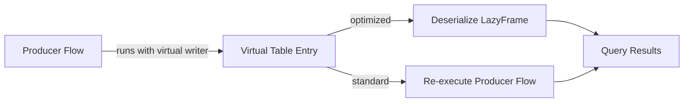
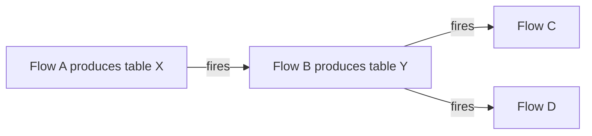

# Virtual Flow Tables

A virtual table is a catalog table that stores no data on disk. Reading one executes its producer flow on demand, so the result always reflects the current source data — a computed view rather than a snapshot. Virtual tables work everywhere physical tables do: Catalog Reader nodes, SQL queries, table triggers, and schedules.

!!! info "Not in Flowfile Lite"
    Virtual tables require the full desktop/server build and are not available in the browser-only [Flowfile Lite](../../deployment/lite.md) edition.

The trade against a physical table: nothing is written (the catalog entry holds only metadata and, when optimized, a serialized execution plan), nothing goes stale, and reads pay the producer's compute cost instead of a disk read. Whether that cost is trivial or substantial depends on the laziness classification below.

---

## How They Work

A virtual table is a catalog entry linked to a **producer flow** — a registered flow that contains a Catalog Writer node in virtual mode. When something reads from the virtual table, Flowfile resolves it in one of two ways:


```mermaid
graph LR
    A[Producer Flow] -->|runs with virtual writer| B[Virtual Table Entry]
    B -->|optimized| C[Deserialize LazyFrame]
    B -->|standard| D[Re-execute Producer Flow]
    C --> E[Query Results]
    D --> E
```

## Creating Virtual Tables

There are two ways to create a virtual table.

### Option 1: Via Catalog Writer Node

Add a **Catalog Writer** node to your flow and switch to virtual mode.

1. Add a **Catalog Writer** node to your flow and connect it to the upstream data
2. Enter a **table name** and select a **catalog / schema** namespace
3. Click the **Virtual Table** tab (instead of "Write to Catalog")
4. Review the **laziness check** result:
   - **Green checkmark**: your flow is fully lazy — the virtual table will be *optimized*
   - **Yellow warning**: some nodes prevent lazy execution — the table will use *standard* resolution (see [Laziness Blockers](#laziness-blockers))
5. Save and run the flow

!!! warning "Flow must be registered"
    Virtual tables require the flow to be registered in the catalog. If the flow isn't registered yet, the virtual write will fail with an error. Open the flow from the catalog, or register it first via the [catalog page](index.md#registering-flows).

### Option 2: Via the SQL Editor

Create a query-based virtual table directly from the catalog's [SQL Editor](sql-editor.md).

1. Open the **Catalog** page and click the **SQL** button in the toolbar
2. Write a SQL query against any combination of catalog tables
3. Click the **Save as Virtual Table** button (bolt icon)
4. Enter a **table name** and optional description
5. Select a **catalog / schema** namespace
6. Click **Create**

The SQL query is validated, executed once to derive the output schema, and then stored. No data is written to disk — each time the virtual table is read, the query re-executes against the latest catalog data.

!!! info "Query-based vs flow-based"
    Query-based virtual tables store a SQL query and re-execute it on demand. Flow-based virtual tables (Option 1) store a reference to a producer flow and can be optimized with serialized execution plans. See [SQL Editor — Save as Virtual Table](sql-editor.md#save-as-virtual-table) for more on how query-based resolution works.

---

## Optimization and Laziness

What a read costs depends on the **laziness system**. Flowfile classifies every node in your pipeline as *lazy*, *eager*, or *conditional*, and uses this to determine whether a virtual table can be optimized.

### What Makes a Flow "Fully Lazy"?

A virtual table is **optimized** when every node upstream of the Catalog Writer supports Polars' lazy evaluation. This means the entire pipeline can be represented as a deferred execution plan — no intermediate computation required.

When a flow is fully lazy, Flowfile serializes the Polars `LazyFrame` execution plan and stores it alongside the virtual table metadata. Reading an optimized virtual table deserializes that plan instead of re-executing the flow, and runs it with full query optimization, including predicate and projection pushdown.

### Node Laziness Classification

Every node type has a fixed laziness classification, defined in `flowfile_core/configs/node_store/nodes.py`. There are three classes:

| Classification | Nodes | Behavior |
|---|---|---|
| **Lazy** | Manual Input, Select data, Rename columns, Filter data, Formula, Join, Cross join, Group by, Window functions, Sort data, Add record Id, Take Sample, Random Split, Unpivot data, Union data, Drop duplicates, Graph solver, Count records, Text to rows, SQL Query, Read from Catalog, Flow Input, LazyFrame node | Operations are deferred — computation happens only when results are collected, so they keep the plan optimizable. |
| **Eager** | External source, Write data, API response, Fuzzy match, Explore data, Pivot data, Python Script, Read from Database, Write to Database, Write to Catalog, Write to cloud provider, Kafka Source, Google Analytics, REST API, Train Model, Apply Model, Evaluate Model, Wait For, Flow Output, Run Flow | Forces execution of upstream data — breaks the lazy plan, so the virtual table falls back to standard resolution. |
| **Conditional** | Read data, Polars code, Read from cloud provider | Lazy or eager depending on configuration (e.g. the file type read, or whether the custom Polars code stays lazy). Treated as a blocker unless the check can prove it stays lazy. |

### Optimized Resolution

When a virtual table is optimized (`is_optimized = true`):

1. The serialized `LazyFrame` is read from the catalog database
2. Polars deserializes the execution plan
3. The query engine applies predicate pushdown, projection pushdown, and other optimizations
4. Only the needed data is computed

Because the deserialized plan is a `LazyFrame`, Polars pushes the consumer's filters and column selections *through* the producer's execution plan — query optimization crosses the flow boundary. Work the consumer doesn't need never runs in the producer, and results always reflect the current source data.

### Standard Resolution

When a virtual table is **not** optimized (eager or conditional nodes upstream):

1. The producer flow is loaded and executed end-to-end
2. The Catalog Writer node's output is captured as a `LazyFrame`
3. The result is returned to the caller

This path is slower because it executes the entire producer flow, but it guarantees correct results regardless of pipeline complexity.

### Laziness Blockers

When the Catalog Writer's Virtual Table tab shows a yellow warning, it lists the specific **laziness blockers** — the nodes in your pipeline that prevent optimization.

Each blocker identifies:

- The **node name** and **ID** (e.g., "Node 'Pivot data' (id=3) is eager")
- Whether the node is **eager** (always forces computation) or **conditional** (may or may not be lazy)

!!! info "Blockers are scoped"
    The laziness check only examines nodes that **feed into** the Catalog Writer. Nodes on unrelated branches (e.g., an Explore Data node on a separate path) are ignored.

---

## Using Virtual Tables

Virtual tables work everywhere physical tables do.

### Reading in Flows

Use the **Catalog Reader** node to read a virtual table, just like a physical one. Virtual tables appear in the table dropdown with a **bolt icon** to distinguish them.

When the flow runs, the Catalog Reader resolves the virtual table automatically:

- **Optimized tables** → deserialize the stored execution plan (instant)
- **Standard tables** → execute the producer flow (may take longer)

### SQL Queries

Virtual tables are fully queryable via the [SQL Editor](sql-editor.md). They appear alongside physical Delta tables in the SQL context, so you can join, filter, and aggregate across both types in a single query.

```sql
-- Query a virtual table alongside a physical table
SELECT v.customer_id, v.score, p.region
FROM customer_scores v
JOIN regions p ON v.region_id = p.id
WHERE v.score > 0.8
```

### Table Triggers

A [table trigger schedule](schedules.md#table-trigger) fires when a watched catalog table's `updated_at` changes, instead of (or in addition to) a cron. That change happens whenever a producer flow finishes a run that updates the table — so a virtual table's producer completing a run is one way to drive the trigger.

This centralizes trigger logic across a chain of flows:


```mermaid
flowchart LR
    A[Flow A produces table X] -->|fires| B[Flow B produces table Y]
    B -->|fires| C[Flow C]
    B -->|fires| D[Flow D]
```

Instead of Flow C and Flow D each managing their own cron trying to line up after A and B, one `A → B → { C, D }` trigger chain drives the whole graph off a single upstream event. If a flow runs on its own cadence, a plain schedule is simpler.

!!! note
    Virtual tables store no data, so a consumer reading the table recomputes its full lineage — including the producer's logic. A table trigger is a scheduling signal, not a data hand-off.
---

## When to Use Virtual vs Physical

| Scenario | Recommendation | Why |
|----------|---------------|-----|
| Derived metrics or aggregations | **Virtual** | Always reflects latest source data, no storage duplication |
| Development and exploration | **Virtual** | Quick iteration without accumulating files |
| Small-to-medium computed datasets | **Virtual** | Negligible resolution time, zero storage cost |
| Production reporting with SLAs | **Physical** | Predictable read speed, no dependency on producer flow availability |
| Large datasets (millions+ rows) | **Physical** | Materialized reads are faster than on-demand computation |
| Historical snapshots / auditing | **Physical** | Delta versioning provides time-travel queries |
| Shared across many consumers | **Physical** | Compute once, read many times |
| Cross-system data landing | **Physical** | Need a stable file for external tools |


---

## Limitations

- **Non-optimized tables re-execute the full producer flow** on every read. For complex or slow flows, this can add significant latency.
- **Requires a registered producer flow** — the flow must be saved and registered in the catalog before a virtual table can reference it.
- **No Delta versioning** — since no physical data is stored, there's no version history or time-travel capability.

!!! note "Multiple virtual tables per flow"
    A single producer flow can register **multiple** virtual tables — one per Catalog Writer node in virtual mode, each keyed by its table name. Re-running the flow updates each entry in place (matched by producer registration + table name); it does not overwrite the others.

---

## Related Documentation

- [Catalog](index.md) — Managing flows, tables, and the catalog hierarchy
- [Catalog Writer](../nodes/output.md#catalog-writer) — Writing data to the catalog (physical and virtual modes)
- [Catalog Reader](../nodes/input.md#catalog-reader) — Reading catalog tables in flows
- [Schedules](schedules.md) — Automating flows with table triggers
- [SQL Editor](sql-editor.md) — Ad-hoc SQL queries against catalog tables
- [FlowFrame Design Concepts](../../python-api/concepts/design-concepts.md) — Understanding lazy evaluation in Flowfile
- [Technical Architecture](../../../for-developers/architecture.md) — How lazy evaluation powers the execution engine
