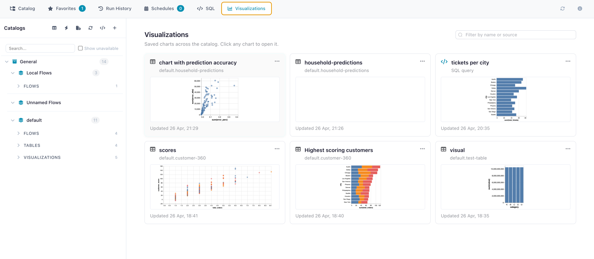

# Visualizations

Save interactive charts in the catalog and reopen them whenever you need them. A visualization sits on top of a catalog table or an inline SQL query and is built with [Graphic Walker](https://github.com/Kanaries/graphic-walker), so dragging fields onto axes, switching aggregations, and filtering happen live against the underlying data.

*The Visualizations library — saved charts as cards with thumbnails, filtered by namespace.*

---

## What a visualization is

A visualization is a saved chart specification — not a copy of the data. It contains:

| Field | What it stores |
|-------|----------------|
| Name and description | How you find it in the library |
| Chart spec | The Graphic Walker layout (axes, marks, filters, multi-tab dashboards) |
| Source | Either a **catalog table** or an inline **SQL query** |
| Namespace | Where it lives in the catalog tree (independent of the source's namespace) |
| Thumbnail | A small PNG captured at save time, used to preview cards in the library |

Because the data isn't embedded, every time you open a saved visualization it queries the **current** state of the source. Updating the underlying table immediately changes what the chart shows.

---

## Creating a visualization

There are two starting points.

### From a catalog table

1. Open a table's detail panel in the Catalog.
2. Switch to the **Visualizations** tab and click **Create Visualization**.
3. The Graphic Walker editor opens with the table's columns already available as fields.
4. Drag fields onto the axes, pick the chart type, set filters and aggregations.
5. Click **Save** and give the visualization a name.

### From a SQL query

1. Open the [SQL Editor](sql-editor.md).
2. Run any query you want as the source.
3. Click **Save as Visualization**.
4. The editor opens with the query's result columns as fields.
5. Build the chart and save.

The chart will re-execute the SQL each time it's opened, so it always reflects the latest data in the referenced tables.

---

## The Visualizations library

The catalog has a top-level **Visualizations** tab that lists every saved visualization across all namespaces. Each card shows:

- The chart's thumbnail
- Name, source type (table / SQL), and the source's name
- Last-edited timestamp

Click a card to open the visualization in viewer mode. From there you can edit, rename, or move it between namespaces.

A per-table view is also available from each table's detail panel — that one only lists visualizations whose source is that table.

---

## Editing and reorganising

From a visualization's detail panel you can:

- **Edit** the chart spec — opens Graphic Walker again with the saved layout pre-loaded.
- **Rename** or change the description.
- **Move** the visualization to a different namespace. The source link is unaffected — a visualization can live anywhere in the catalog tree, regardless of where its source table lives.
- **Update the thumbnail** — saving an edited chart re-captures the thumbnail automatically.
- **Delete** — removes only the visualization. The underlying table or SQL is never touched.

---

## What happens when the source changes

A visualization is a pointer to its source, not a copy. Concretely:

- **Source table updated** — the chart shows the new data on next open. No save required.
- **Source table deleted** — the visualization becomes "orphaned". It still appears in the library but the source name shows as missing; opening it for edit will fail until you reassign or delete it.
- **Source schema changed** — fields that no longer exist drop out of the saved spec; the chart re-renders with the remaining ones.
- **SQL source's referenced tables change** — the SQL is re-resolved on every open, so renaming or reassigning a referenced table can either fix or break a visualization depending on the change.

---

## Multi-tab dashboards

Graphic Walker supports multiple chart tabs in a single workspace. Flowfile saves the whole workspace, so a single visualization entry can carry several charts. Switch between them in the editor exactly the way Graphic Walker normally allows; the saved spec round-trips all tabs.

---

## Tips

- Use the same namespace as the underlying table when a visualization is the canonical chart for that table; use a separate namespace (e.g. `dashboards`) when collecting cross-cutting views.
- For the fastest editor experience, prefer table sources. SQL sources re-execute the query on every open; table sources load once and run every drag-and-drop against the warm dataset.
- Thumbnails are capped at 200 KB. Very large or very colourful charts may exceed that — Flowfile drops oversized thumbnails silently and falls back to the chart-type icon.

---

## Related documentation

- [Catalog overview](index.md) — namespaces, tables, and registration
- [SQL Editor](sql-editor.md) — building SQL queries as visualization sources
- [Virtual Flow Tables](virtual-tables.md) — using flow-produced tables as visualization sources
- For developers: [Visualizations & Graphic Walker (architecture)](../../../for-developers/visualizations.md)
