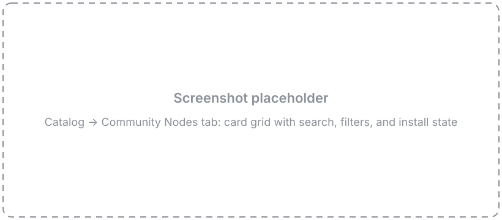
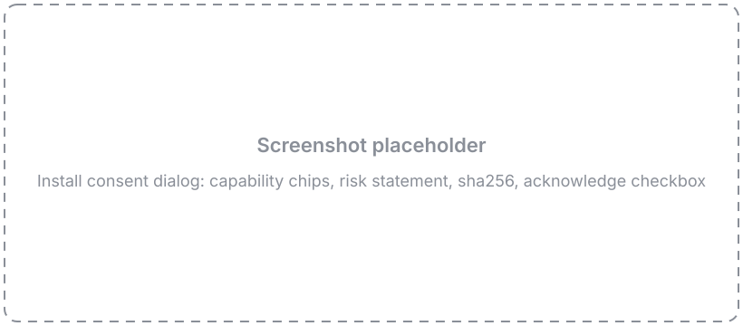
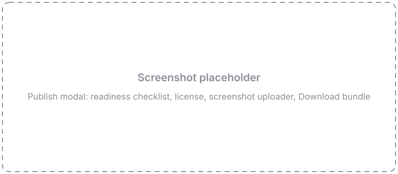

# Community Nodes

Custom nodes are single `.py` files — which means they travel. The **Community Nodes** registry lets you install nodes other people have published, and publish your own, without hosting anything yourself. Browsing and installing happen in the Catalog; publishing starts from the Node Designer.

Every install goes through the same trust model, stated plainly: community nodes are **scanned, human-reviewed, and installed only after you consent** — but they are **not sandboxed**. An installed node runs in Flowfile's worker with the same access your own code has. Install nodes the way you'd run any code from the internet: read what it does, and install only what you need.

!!! info "Not in Flowfile Lite"
    Community Nodes require the full desktop/server build. They are not available in the browser-only [Flowfile Lite](../deployment/lite.md) edition.

---

## Install a community node

Open the **Catalog** and select the **Community Nodes** tab.

See it: the Community Nodes tab

<!-- IMAGE-PLACEHOLDER-TO-CHANGE: the Catalog Community Nodes tab — a grid of node cards, each with an icon, category chip, intro, and author · version, with the search box and category filter above -->

### Browse

The tab shows a card for every published node. Each card carries the node's icon, its browse category, a one-line intro, and the author and version. Use the **search** box and the **category** filter to narrow the list, and **sort** to reorder it. When the registry has ratings, a 👍 count from GitHub also shows on the card; when it doesn't, the ratings simply don't appear — nothing else changes.

Click a card to open the **detail view**: the node's README, a strip of screenshots you can click through in a lightbox, its capabilities, and the source link.

### The consent dialog

Clicking **Install** opens a consent dialog before anything is downloaded. It shows:

- **Who wrote it** — the author's GitHub handle and the node version.
- **What it can do** — a list of **capability chips**. Each chip names one thing the node's code reaches for, surfaced by the publish-time security scan:

    | Chip | What it means |
    |------|---------------|
    | **Network access** | Opens network connections — can send or receive data over the internet. |
    | **Writes files** | Writes to the filesystem. |
    | **Reads files** | Reads from the filesystem. |
    | **Runs programs** | Launches a subprocess with fixed arguments. |
    | **Reads environment** | Reads specific environment variables, which may hold configuration or secrets. |
    | **Dynamic code** | Builds and runs code at runtime, which the scanner cannot fully inspect. |
    | **Uses secrets** | Requests a stored secret that is passed to the node when it runs. |
    | **Loads serialized data** | Deserializes data (for example `pickle`). |

    A node with none of these shows a note that it does no flagged operations.

- **Where it runs** — a local node runs on this machine's worker with your data and any secrets you assign it; a kernel node runs in an isolated Docker kernel where your secrets are not available.
- **The risk statement** — community nodes are reviewed and scanned, but scanning surfaces capabilities; it is not a safety guarantee. Install only nodes from authors you trust.
- **The pin** — the short `sha256` of the node file, plus a **View source on GitHub** link.

You must tick the acknowledgement checkbox before **Install** enables.

See it: the install consent dialog

<!-- IMAGE-PLACEHOLDER-TO-CHANGE: the install consent dialog — node identity at the top, capability chips, the environment note, the risk statement, the sha256 line with the GitHub link, and the acknowledgement checkbox gating the Install button -->

On confirm, Flowfile downloads the pinned node file and icon, **verifies the sha256**, re-scans the downloaded bytes, and drops the node into your local palette. The node appears in the palette right away — no restart. Nothing runs until you place the node in a flow.

### Node states

Once you've installed nodes, their cards reflect their state:

- **Installed** — already in your palette.
- **Update available** — the registry has a newer version than the one you installed.
- **Modified locally** — you edited the installed file, so it no longer matches the pinned version. Flowfile leaves your edits alone.
- **Incompatible** — the node needs a newer Flowfile than you're running.

### Uninstall

Uninstalling removes the node from your palette and deletes its file. Uninstall only touches nodes Flowfile installed for you — it never removes a custom node you authored yourself.

!!! note "Docker deployments: install is admin-only"
    Installing and uninstalling community nodes lands executable code for the whole install, so in server/Docker mode both actions require an **admin** account — the same gate as [mounting extra node directories](node-designer.md#mounting-other-directories). On the desktop, where the default user is an admin, this is frictionless.

---

## Publish your node

Publishing a node opens a pull request to the community repository — and Flowfile does the Git work for you. From the Node Designer you connect a GitHub account, and the app forks the registry, commits your node, and opens the PR. Don't have a GitHub account? There's a [bundle-download fallback](#no-github-account) below.

### Before you publish

Build and test the node in the [Node Designer](node-designer.md) first, then make sure:

- **Publishing metadata is set.** In the Node Settings panel's **Publishing** section, fill in **Author** (your GitHub login), a semver **Version** (for example `1.0.0`), and a few **Tags**.
- **The node has an intro.** The Description you write becomes the node's registry description.
- **A test setup is saved.** On the Test tab, tick **Save test setup with node** so your sample data persists as `example_inputs` and `example_settings`. These are **required** — the community CI actually runs your `process()` against them, and the app uses them for the browse preview. A node with no saved test setup is rejected.

You don't have to save the node by hand first: **Publish flushes your latest edits automatically** when you open the modal, so the version and tags you just typed are exactly what it publishes.

### Open the Publish modal

Click **Publish** in the designer toolbar. The modal opens on a **readiness checklist** — a live list of what's ready and what's still missing:

- Red rows block publishing: node health, a usable name, author, semver version, a 10-character description, a selected license, and **Test setup** — the row that turns red until you've saved sample data, with a message pointing you back to the Test tab.
- Amber rows are advisory and don't block: using the default icon, shipping no screenshot, or leaving the README empty (a TODO stub ships instead).

Below the checklist, a **version banner** tells you what this publish will do: *New node — will publish v1.0.0*, or *Update — published v1.0.0 → publishing v1.1.0*. If your version isn't newer than the published one, the banner warns you before GitHub ever gets involved, and **bump buttons** (patch / minor / major) raise the version in one click.

Fill in the **License** (a permissive SPDX license — MIT, Apache-2.0, BSD, MPL-2.0, Unlicense, or CC0), a **Category**, and an optional **Description** override and **Repository** link. Two more optional fields shape your node's registry presence:

- **Changelog** — one or two lines on what changed in this version. Users who have your node installed see it next to the update prompt, so it's worth filling in on every release.
- **README** — Markdown for your node's community page (what it does, inputs, settings). Leave it empty and a TODO-stub README ships for you to edit on GitHub later.

### Add screenshots

Upload one or more **PNG** screenshots — the browse preview uses them. Community media is PNG-only (up to five).

See it: the Publish modal

<!-- IMAGE-PLACEHOLDER-TO-CHANGE: the designer Publish modal — the readiness checklist (with the Test setup row), the license select, the screenshot uploader with a PNG thumbnail, and the Publish on GitHub card -->

### Connect GitHub

**Publishing requires a free GitHub account.** Your submission is a pull request, so Flowfile needs to act as you on GitHub. All GitHub traffic runs through Flowfile core — the desktop app never talks to GitHub directly.

Click **Connect GitHub**. Flowfile shows a short **device code** and a button to open **github.com/login/device**:

1. Copy the code, then open the GitHub page (the button opens it in your system browser).
2. Sign in if needed, enter the code, and authorize.
3. Flowfile detects the authorization and shows your **@login**.

Prefer a token? Expand **Use a personal access token instead** and paste a classic PAT with the `public_repo` scope. (Paste a token without that scope and Flowfile warns you — it can't fork or open a PR without it.)

### Create the pull request

Once connected, tick the confirmation checkbox — that your node does what its description says, with no hidden network calls or data collection — and click **Create pull request**. Flowfile forks the registry (the first fork takes a few seconds; the modal shows "Creating your fork…"), commits your `nodes/<id>/` folder, and opens the PR against `main` with you as the author. If a PR for this version is already open, Flowfile **updates it in place** — fresh files, refreshed title and description — and links you to it.

Your node's `<id>` is the slug of its name (`Mood Emoji` → `mood_emoji`) and is **permanent** — installed flows store it, so it can't change after publish.

### What happens next

The modal links you straight to the PR and shows what's coming:

- **Automated checks** validate your node and dry-run its test setup.
- **First time contributing?** GitHub holds the checks until a maintainer approves the run — that's expected, not stuck.
- **A maintainer reviews** your node and merges.
- Once merged, the registry index rebuilds within minutes. Apps pick it up on their next
  index refresh — immediately when someone hits **Refresh** in the browse tab, and within
  about an hour otherwise.

### Revising an open pull request

Your PR isn't frozen once it's open. Fix something in the designer — a review comment, a failed check — and publish again with the **same version**: Flowfile pushes your latest files to the open PR and refreshes its title and description. The success panel's **Update pull request** button takes you straight back to publish again, and the primary button reads **Update pull request** for the rest of the session.

### Releasing a new version

Shipping an update is the same loop as the first publish, with one extra step — the version bump:

1. **Bump the version** — use the banner's patch / minor / major buttons, or edit the Version field in the Publishing section. Semver must **strictly increase**; CI rejects a version that doesn't, and the banner warns you up front.
2. **Write a changelog line** — users see it when they're offered the update.
3. **Publish → Create pull request.** Flowfile opens a fresh PR for the new version (each version gets its own branch). If you still have an unmerged PR open for the old version, close it on GitHub once it's superseded — Flowfile doesn't touch it.
4. **CI re-checks everything** — the same validation, scan, and dry-run as a new node, plus the version rule. Only the node's `author.github` (or a listed maintainer) may publish updates.
5. **A maintainer merges**, the index rebuilds, and installed users see **Update available** on your node's card with your changelog. If the new version needs more capabilities than the old one, they re-consent before the update applies.

### No GitHub account? { #no-github-account }

You can still publish without connecting GitHub. In the Publish modal, click **Download bundle** for a zip shaped exactly like a registry folder — `nodes/<id>/` with your `node.py`, a pre-filled `manifest.json`, the icon, screenshots, your README (or a TODO stub if you left the field empty), and a `HOW_TO_PUBLISH.md`. Share that zip with a maintainer — post it in the main Flowfile repo's [Discussions](https://github.com/edwardvaneechoud/Flowfile/discussions) — and they open the PR for you, crediting you as the node's author.

---

## How it works

The registry is a single public GitHub repository — [edwardvaneechoud/flowfile-community-nodes](https://github.com/edwardvaneechoud/flowfile-community-nodes) — with no server behind it:

- **Git is the database.** Each node is a folder; publishing is a pull request; merging publishes. GitHub Actions runs the checks; the merge button is the security boundary.
- **The index is sha256-pinned.** A generated `index.json` lists every node and pins each file by `sha256`. Those pins are the root of trust: Flowfile verifies the hash of everything it downloads before writing it, so a mismatched or tampered file is rejected.
- **Everything is fetched through the Flowfile backend.** The desktop app never talks to GitHub or a CDN directly — the renderer's content-security policy forbids it. Your Flowfile core fetches the index, media, and node files, verifies the pins, and re-scans downloaded code, so the app is authoritative over the advisory consent dialog.
- **Ratings are GitHub-native.** A nightly Action bakes repo stars and per-node GitHub Discussions 👍 reactions into a `popularity.json`. When it's present, the 👍 counts show on cards; when it isn't, the UI hides them — there is no rating call from your machine.

For the full contributor contract, see the community repository's `CONTRIBUTING.md`.

---

## FAQ

**Why are community screenshots and icons PNG-only?**
PNG is verifiable in CI with the standard library — magic bytes and dimensions, nothing more. SVG is scriptable content (it can carry active markup), so it can't be cheaply vetted for a public registry. The rule only applies to what you publish: a local SVG icon still renders fine in your own install.

**Why can't node names have hyphens or other symbols?**
A community node name is letters, digits, underscores, and spaces. Flowfile slugifies it into the node's `id` (`Mood Emoji` → `mood_emoji`), and that id is the node's **permanent identity** across your flows, its file on disk, and the registry. It has to slug cleanly and can never change after publish, so the charset stays narrow.

**Why do I need a GitHub account to publish?**
Everything about publishing is GitHub-native: the submission is a pull request, your identity on it is your GitHub login (which becomes the manifest `author.github`), and node ratings are 👍 reactions on GitHub Discussions. So publishing needs a free GitHub account — but **installing** nodes needs no account at all.

---

## Related Documentation

- [Node Designer](node-designer.md) — build the custom node you're publishing.
- [Build your first custom node](custom-node-tutorial.md) — a guided end-to-end build.
- [Kernel Execution](kernels.md) — for nodes that run in a Docker kernel.
