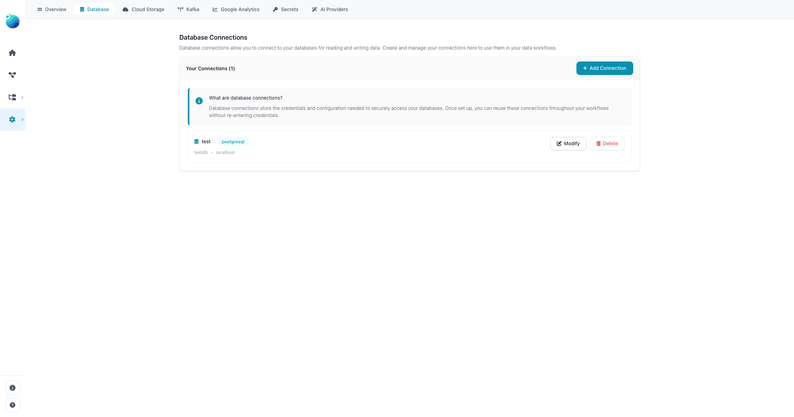
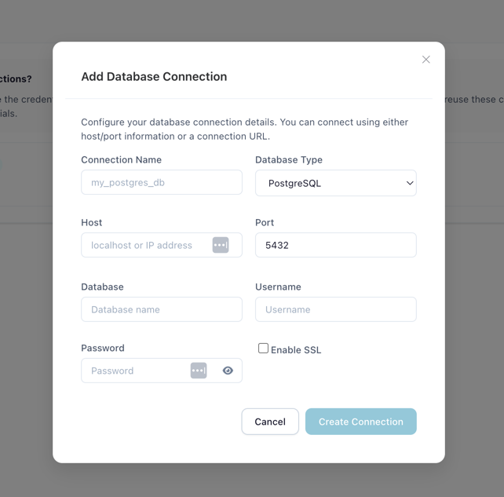
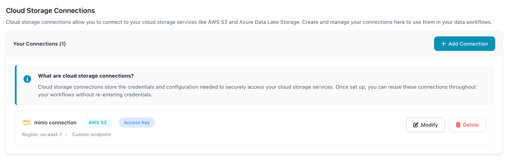

# Connections

Save and reuse database, cloud storage, and Kafka credentials across your flows.

All connection types and secrets are managed from a single **Connections** page, accessible
via the **Connections** icon in the left sidebar. Use the tabs to switch between
**Database**, **Cloud Storage**, **Kafka**, and **Secrets**.

Connections store your credentials securely (passwords are encrypted via [Secrets](catalog/secrets.md))
so you can reference them by name in Database Reader, Database Writer, Cloud Storage Reader,
and Cloud Storage Writer nodes without re-entering credentials each time.

!!! info "Not in Flowfile Lite"
    Saved connections require the full desktop/server build. The browser-only [Flowfile Lite](../deployment/lite.md) edition has no backend, so database, cloud storage, and Kafka connections (and the secrets that back them) are not available.

---

## Database Connections

### Supported Databases

| Database | Type Key |
|----------|----------|
| **PostgreSQL** | `postgresql` |
| **MySQL** | `mysql` |
| **SQLite** | `sqlite` |
| **DuckDB** | `duckdb` |
| **SQL Server** | `mssql` |
| **Snowflake** | `snowflake` |

!!! note "File-based connections (SQLite, DuckDB)"
    SQLite and DuckDB connect to a local database **file path** (e.g. `/path/to/database.db`
    or `/path/to/analytics.duckdb`) — no host, port, or credentials are required.

!!! warning "DuckDB single-writer files"
    A DuckDB file allows many concurrent readers but only one writer at a time. When a flow
    writes to a DuckDB file, close other tools (e.g. the DuckDB CLI or an IDE) that have the
    same file open.

!!! note "DuckDB `INTERVAL` columns"
    `INTERVAL` columns are read as text — calendar intervals (months) have no fixed length,
    so there is no matching Polars type.

!!! note "Snowflake connections"
    Snowflake has no host or port: the form asks for the **Account** identifier
    (e.g. `myorg-myaccount`) plus an optional **Warehouse** and **Role**, together with the
    usual username, password, and database. Connections always use TLS, so there is no SSL
    toggle. Semi-structured columns (`VARIANT`, `OBJECT`, `ARRAY`) are read as JSON text.

    Snowflake also supports **key-pair (JWT) authentication** — Snowflake's recommended
    method for programmatic access now that password-only logins are being phased out.
    Pick *Key pair (JWT)* in the **Authentication Method** selector, then paste the
    private key PEM text into the key field (plus its passphrase when the key is
    encrypted). The key is stored as an encrypted secret, exactly like a password, and
    is never written back to the form when editing — leave the field blank to keep the
    existing key.

!!! note "Snowflake single sign-on (OAuth)"
    Snowflake connections can also authenticate through your identity provider: pick
    *Single sign-on (OAuth)* in the **Authentication Method** selector. You log in through
    the browser **once**; Flowfile stores only the resulting refresh token (encrypted) and
    silently exchanges it for short-lived access tokens whenever the connection is used —
    including **scheduled runs**, which need no browser. When the refresh token expires or
    is revoked (identity-provider policy, typically up to 90 days), runs fail with a
    *"Reconnect your connection"* error and the connection form offers **Re-authenticate**.

    Two flavors are supported through the same form:

    - **Snowflake OAuth** (the default): a Snowflake admin creates a security integration
      and hands you its client id/secret; the authorize/token endpoints are derived from
      the account, so leave the endpoint fields blank.

      ```sql
      CREATE SECURITY INTEGRATION flowfile_oauth
        TYPE = OAUTH
        ENABLED = TRUE
        OAUTH_CLIENT = CUSTOM
        OAUTH_CLIENT_TYPE = 'CONFIDENTIAL'
        OAUTH_REDIRECT_URI = 'http://localhost:63578/db_connection_lib/oauth/callback'
        OAUTH_ISSUE_REFRESH_TOKENS = TRUE
        OAUTH_REFRESH_TOKEN_VALIDITY = 7776000;  -- 90 days (the maximum)

      -- client id / secret for the connection form:
      SELECT SYSTEM$SHOW_OAUTH_CLIENT_SECRETS('FLOWFILE_OAUTH');
      ```

    - **External OAuth** (Okta, Entra ID, PingFederate): create an OAuth app at your IdP
      with the same redirect URI, configure Snowflake to trust it
      (`CREATE SECURITY INTEGRATION ... TYPE = EXTERNAL_OAUTH`), and fill in the
      **Authorize Endpoint** and **Token Endpoint** fields with the IdP's URLs.

    The redirect URI defaults to
    `http://localhost:63578/db_connection_lib/oauth/callback` — register exactly that URL
    with the security integration / IdP app (override it in the form if your Flowfile
    server runs elsewhere).

    **Sharing note:** a group-shared OAuth connection always runs as the **owner's**
    Snowflake identity — exactly like a shared password connection, and like Power BI's
    dataset-owner refresh model. Share it only with people who may act as that identity.

### Creating a Database Connection

1. Open the **Connections** page from the left sidebar and select the **Database** tab
2. Click **Create New Connection**
3. Fill in the connection fields:

| Field | Description | Example |
|-------|-------------|---------|
| **Connection Name** | Unique identifier for this connection | `prod_postgres` |
| **Database Type** | PostgreSQL, MySQL, SQLite, DuckDB, SQL Server, or Snowflake | `postgresql` |
| **Host** | Database server hostname (Snowflake asks for an account/warehouse/role instead) | `db.example.com` |
| **Port** | Database port | `5432` |
| **Database** | Database name | `analytics` |
| **Username** | Database user | `readonly_user` |
| **Password** | Stored as an encrypted secret | |
| **Enable SSL** | Use SSL for the connection | Recommended for cloud databases |

4. Click **Update Connection** to save

<!-- should show the new tabbed Connections page with the Database tab active -->


*The Connections page showing the Database tab with saved connections*

<!-- should show the Add Database Connection dialog opened from the Database tab -->


*Creating a new PostgreSQL connection*

### Using Database Connections in Flows

In a **Database Reader** or **Database Writer** node:

1. Set **Connection Mode** to **Reference**
2. Select your saved connection from the dropdown
3. Configure schema, table, and query settings

!!! tip "Reference vs Inline Mode"
    **Reference** mode uses a saved connection (recommended). Credentials are encrypted,
    reusable, and supported by the [code generator](tutorials/code-generator.md).

    **Inline** mode lets you enter credentials directly in the node settings. This is convenient for
    quick tests but credentials are not reusable and inline connections cannot be exported to Python code.

---

## Cloud Storage Connections

### Supported Providers

| Provider | Description |
|----------|-------------|
| **AWS S3** | Amazon Simple Storage Service (including S3-compatible services like MinIO) |
| **Azure Data Lake Storage (ADLS)** | Azure Data Lake Storage Gen2 / Blob Storage |
| **Google Cloud Storage (GCS)** | Google Cloud object storage buckets |

### Creating a Cloud Storage Connection

1. Open the **Connections** page and select the **Cloud Storage** tab
2. Click **Add Connection**
3. Configure the connection:

| Field | Description |
|-------|-------------|
| **Connection Name** | Unique identifier (e.g., `my_s3_storage`) |
| **Storage Type** | **AWS S3**, **Azure Data Lake Storage**, or **Google Cloud Storage** |
| **AWS Access Key ID** | Your access key |
| **AWS Secret Access Key** | Stored as encrypted secret |
| **AWS Region** | e.g., `us-east-1` |
| **Custom Endpoint URL** | For S3-compatible services (MinIO, etc.) |
| **Verify SSL** | Disable only for self-signed certificates |
| **Allow Unsafe HTTP** | Enable for non-HTTPS endpoints (e.g., local MinIO) |

!!! note "Provider-specific fields"
    The fields above describe an **AWS S3** connection. The credential fields adapt to the selected **Storage Type**: **Azure Data Lake Storage** uses an account name with service-principal or SAS-token credentials, and **Google Cloud Storage** uses a project ID with a service-account key.

4. Click **Create Connection**

<!-- should show the new tabbed Connections page with the Cloud Storage tab active -->


*The Connections page showing the Cloud Storage tab*

### Using Cloud Connections in Flows

In a **Cloud Storage Reader** or **Cloud Storage Writer** node, select your saved connection from the dropdown.

For a step-by-step tutorial, see [Manage Cloud Storage](tutorials/cloud-connections.md).

---

## Kafka Connections

### Creating a Kafka Connection

1. Open the **Connections** page and select the **Kafka** tab
2. Click **Add Connection**
3. Configure the connection:

| Field | Description |
|-------|-------------|
| **Connection Name** | Unique identifier (e.g., `prod_kafka`) |
| **Bootstrap Servers** | Comma-separated list of broker addresses (e.g., `broker1:9092,broker2:9092`) |
| **Security Protocol** | `PLAINTEXT`, `SSL`, `SASL_PLAINTEXT`, or `SASL_SSL` |
| **SASL Mechanism** | `PLAIN`, `SCRAM-SHA-256`, or `SCRAM-SHA-512` (when using SASL) |
| **SASL Username / Password** | Credentials for SASL authentication |
| **SSL CA Certificate** | CA certificate for SSL connections |
| **SSL Certificate / Key** | Client certificate and key for mutual TLS |
| **Schema Registry URL** | URL of the Confluent Schema Registry (optional) |

4. Click **Create Connection**

### Using Kafka Connections in Flows

Select your saved Kafka connection when configuring the **Kafka Source** node. Kafka support is read-only — there is no Kafka writer node. See [Kafka](../connect/kafka.md) for the node's settings and a runnable example.

---

## Security

- Passwords and secret keys are stored as encrypted [Secrets](catalog/secrets.md) using Fernet encryption
- Connection metadata (host, port, database name) is stored in the local database
- Credentials are decrypted only at runtime when a flow executes
- Each user's connections are isolated (Docker multi-user mode)

---

## Related Documentation

- [Secrets](catalog/secrets.md) — How credential encryption works
- [Input Nodes: Database Reader](nodes/input.md#database-reader) — Reading from databases
- [Output Nodes: Database Writer](nodes/output.md#database-writer) — Writing to databases
- [Tutorial: Connect to PostgreSQL](tutorials/database-connectivity.md)
- [Tutorial: Manage Cloud Storage](tutorials/cloud-connections.md)
